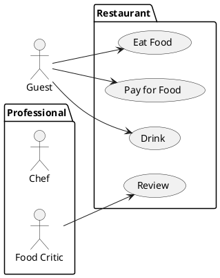
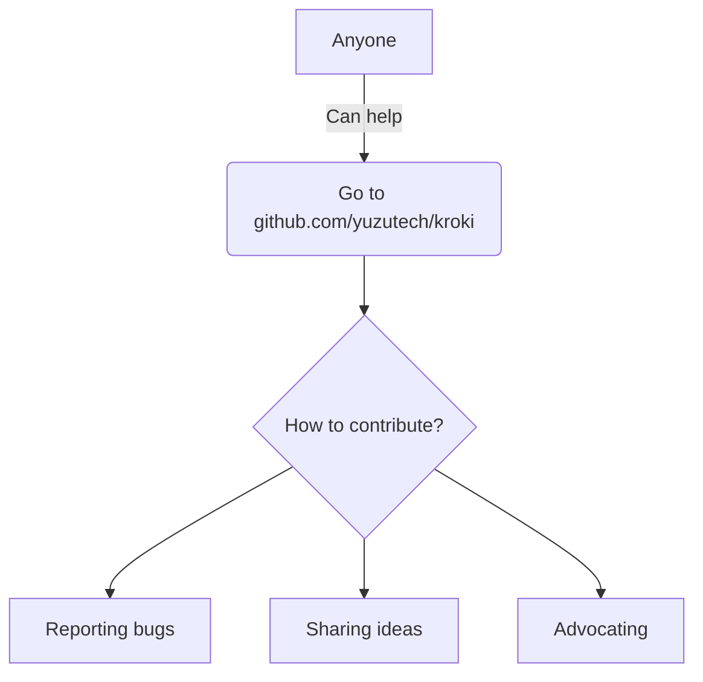

# @kazumatu981/markdown-it-kroki

## Marp Sample

---

## plantuml



---

## plantuml with hyperlink

```plantuml
@startuml
left to right direction

object  "[[https://github.com/markdown-it/markdown-it{markdown-it} markdown-it]]" as MarkdownIt

object  "[[https://github.com/kazumatu981/markdown-it-kroki{markdown-it-krokii} markdown-it-krokii]]" as MarkdownItKrokii

MarkdownIt --> MarkdownItKrokii
@enduml
```



---

## dbml

```dbml
Table users {
    id integer
    username varchar
    role varchar
    created_at timestamp
}

Table posts {
    id integer [primary key]
    title varchar
    body text [note: 'Content of the post']
    user_id integer
    created_at timestamp
}

Ref: posts.user_id > users.id
```


---

## mermaid



---

## normal code

```JavaScript
function testFunc(test) {
  let sum = 0;
  for(let x = 1; x<=test; x++) {
    sum += x;
  }
  return sum;
}
```