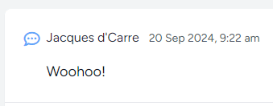

# Laravel Bootcamp: Part 2

## Software as a Service - Front-End Development

Developed by Adrian Gould

---

```table-of-contents
title: # Contents
style: nestedList
minLevel: 0
maxLevel: 3
includeLinks: true
```

---

# Laravel Bootcamp Part 2

The following notes are based on the official Laravel v12 Bootcamp
([Build Chirper with Blade](https://bootcamp.laravel.com)) with Adrian's shortened explanations.

## Before you start...

Have you gone over the [Laravel v12 Bootcamp - Introducing Laravel](S11-Laravel-v12-Bootcamp-Part-00-Introducing-Laravel.md)
and then [Laravel v12 BootcampPart 1](S11-Laravel-v12-BootCamp-Part-01.md)?
No? Well... go do it...

We will wait here until you are ready.


> **Important:** You should understand that whilst you are completing this tutorial, you will only see parts of the
> application working when a stage is complete.
>
> So if you get an error in the browser, it may be because there is something missing.

# Adding a New Menu Item

The default Laravel Blade template for the navigation has both a desktop and responsive menu, so our editing will need
to update (add) both options.

Let's get started...

Use the by now familiar, Double SHIFT to open the file find `dialog`, and enter navigation.

This should highlight the `navigation.blade.php` file

Open this up and search for the following:

```php
<x-nav-link :href="route('dashboard')" :active="request()->routeIs('dashboard')">  
    <i class="fa-solid fa-laptop mr-1"></i>  
    {{ __('Dashboard') }}  
</x-nav-link>
```

This is the desktop navigation link.

We are going to cheat dramatically here and select these lines and use the CTRL+D shortcut in PhpStorm to duplicate the
lines.

Now we need to edit this to have "Chirps" and to route to the chirps' index page.

```php
<x-nav-link :href="route('chirps.index')" 
		    :active="request()->routeIs('chirps.*index*')">
	{{ __('Chirps') }}
</x-nav-link>
```

Refreshing your browser page will give the Chirps menu item, and even better it will be highlighted as active!

Now to do the mobile/responsive menu.

In the same file, search for the code that says:

```php
  
<x-responsive-nav-link 
		:href="route('dashboard')"
		:active="request()->routeIs('dashboard')">  
    {{ __('Dashboard') }}  
</x-responsive-nav-link>
```

Duplicate these lines, and do the same edits...

```php
<x-responsive-nav-link 
		:href="route('chirps.index')" 
		:active="request()->routeIs('chirps.index')">  
    {{ __('Chirps') }}  
</x-responsive-nav-link>
```

If you refresh your browser and also shrink it down, you will see the mobile navigation appear, and then using the
hamburger, it will expand to show the Chirps entry, again highlighted as active.


# Display our Chirps

OK, so we can chirp, and we can navigate to the chirps when we log in... but what about
seeing them?

Well, it's that time.

Locate the Chirp Controller and edit the index method as we need to do two things in here:

- Collect all the chirps in reverse order
- Send the chirps to the Chirps index page

## Getting all the Chirps

To collect all the chirps, we use the following:

```php
$chirps = Chirp::with('user')->latest()->get();
```

This tells Laravel to retrieve the Chirps with each Chirp's User details, sorting them in reverse order.

We then send these to the Chirps index page:

```php
return view('chirps.index', compact(['chirps',]));
```

Update the index method to use these lines instead of the single line:

```php
return view('chirps.index');
```

## Bonus: Awesome Icons in the App

One of the parts of our Starter Kit is that we have access to some rather cool icons. These are from Font Awesome, a
wonderful Free and Paid icon set that provides over *33,000 icons* in total, and of that **over 2,000 icons are free to
use**.


> **Note:**
>
> To see the range of icons (both Free and Paid), head to https://fontawesome.com, and more
> particularly the following link:
> - https://fontawesome.com/search?o=r&m=free


Because these have been added (in the form of web fonts), we do not need to do any
additional installation.

OK, now we may continue to work on our Chirps in the Chirp Index Page.

## Updating the Chirps Index page

Open the `resources/views/chirps/index.blade.php` file, and navigate to immediately after the `</form>` tag, and press
ENTER twice.

In this new space, add:

```php
<div class="mt-6 bg-white shadow-sm 
			rounded-lg divide-y">  
			
    @foreach ($chirps as $chirp)  
    
      <div class="p-6 flex space-x-2">  
      
        <i 
            class="-ml-2 fa-regular fa-comment-dots 
	              fa-shake 
	              text-xl text-blue-400"  
            style="--fa-animation-duration: 2s;
                   --fa-animation-iteration-count: 2;  
                  --fa-animation-timing: ease-in-out;"  
            aria-hidden="true"></i>  
            
        <div class="flex-1">  
        
            <div class="flex justify-between items-center">  
                <div>
                <span class="text-gray-800">
                {{ $chirp->user->name }}
                </span>  
                <small class="ml-2 
			                 text-sm text-gray-600">
			    {{ $chirp->created_at->format('j M Y, g:i a') }}
			    </small>  
                </div>                
            </div>
            
            <p class="mt-4 text-lg text-gray-900">
            {{ $chirp->message }}
            </p>  
        </div>
        
      </div>    
    @endforeach  
</div>
```

The important bits are:

```php
    @foreach ($chirps as $chirp)  
    
	@endforeach
```

This iterates through each of the chirps that have been retrieved... placing them in a `$chirp` variable...

```php
{{ $chirp->user->name }}
```

This tells the blade file to output the result of an expression, in this case, look at the current chirp, and find out
the user's name for the user who wrote that chirp.

```php
{{ $chirp->created_at->format('j M Y, g:i a')
```

This line tells the blade engine to output the created date of the chirp in a "medium length" format that looks like
this:

```text
29 Apr 2025, 5:53 am
```

The next line...

```php
{{ $chirp->message }}
```

Outputs the chirp's message text.

And then there is the Font Awesome icon...

```html
<i
        class="fa-regular fa-comment-dots 
	       fa-shake 
	       text-xl text-blue-400"
        style="--fa-animation-duration: 2s;
           --fa-animation-iteration-count: 2;  
          --fa-animation-timing: ease-in-out;"
        aria-hidden="true"></i>  
```

This displays an animated (shake) comment bubble, in blue, that shakes twice and takes two seconds to do the shake.



# Coming Up

In the next part of the bootcamp, we will add "Edit" and "Delete" chirp capability.

- [Laravel v12 Bootcamp - Part 3](S11-Laravel-v12-BootCamp-Part-03.md)
- [Session 11 ReadMe](../session-11/ReadMe.md)
- [Session 11 Reflection Exercises & Study](S11-Reflection-Exercises-and-Study.md)

# END
