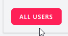
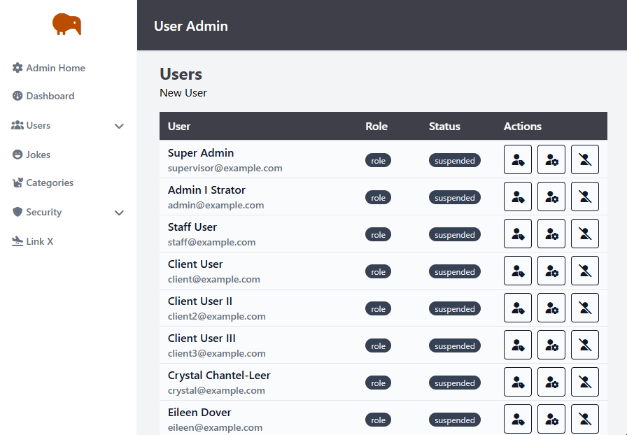

# Laravel Bootcamp: Part 6

## Software as a Service - Front-End Development

Developed by Adrian Gould

---

```table-of-contents
title: # Contents
style: nestedList
minLevel: 0
maxLevel: 3
includeLinks: true
```

---

# Laravel Bootcamp: Part 6

## Chirper Administration Front End

In this section we will start to add an administration/management front-end that allows users with particular rights to perform management actions on data in the Chirp system.

We will:
- Build User Management Interface
- Determine Roles to use in Application
- Determine Permissions each Role will have
- Apply Roles & Permissions to Application (User Management)

## Important Thoughts

Before we launch into the main content of this set of notes we would like to remind you of a very important factor in software development...

*Working Code is more important than Optimised Code...*

This may sound strange, but when creating a solution to an opportunity, it is more important to get something working first.

Delaying production of the product will lead to delays or even not achieving "profit" for a business, or even individual. 

> **Profit** may be measured in many ways including social benefit and financial benefit. It is up to you to determine the more important of these.

Optimisation may occur after release when you see an uptake in the solution that leads to people asking for new features, and even feedback about responsiveness...

## Minimal Viable Product

When developing software, it is important to start by identifying the MVP, or Minimum Viable Product.

The MVP is:

- The simplest version of a product that you need to build to sell it to a market.
- Eric Ries said in his book "The Lean Startup": 
	- “*The version of a new product which allows a team to collect the maximum amount of validated learning about customers with the least effort.*”

### Further reading on MVP

- lssdefinition. (2020, April 2). _Lean Startup_. Lean Manufacturing and Six Sigma Definitions - Glossary Terms, History, People and Definitions about Lean and Six Sigma. https://www.leansixsigmadefinition.com/glossary/lean-startup).
- _Minimum Viable Product (MVP)_. (2024, November 22). ProductPlan. https://www.productplan.com/glossary/minimum-viable-product/
- Atlassian. (2023). _Minimum Viable Product (MVP): What is it & Why it Matters_. Atlassian. https://www.atlassian.com/agile/product-management/minimum-viable-product
- Tan, P. (2020, September 18). _11 Minimum Viable Product Examples (With Actionable Tips)_. Appsumo.com; AppSumo. https://appsumo.com/blog/minimum-viable-product-examples


## Chirper MVP

For us, the Chirper App has a set of key needs:
- To Register as a Chirper User
- To Create, Edit and Delete Chirps
- To Follow and Unfollow other Chirpers
- To Like and Dislike Chirps

But this then also leads us into what is needed for administration of this application? 

The administration user's needs stretch beyond the general user's needs above.

For this example application we need Super Admin, Admin, Staff and Client roles who will have varying levels of permission to "abilities" or features:
- Browse, read, edit, add and delete Chirpers (Users)
- Browse, read, edit, add and delete chirps
- Browse, read, edit, add and delete likes/dislikes
- Browse, read, edit, add and delete followers

This is just a start, but this provides a good way to begin the MVP and Admin front end of the MVP.

This set of notes looks at *Administration of users*.

In subsequent notes we look at Roles and Permissions, Likes and Dislikes.

Other notes will be added over time to illustrate various features of the Laravel framework using Chirper as the base.


## Before you start…

Have you completed (not just read):

- [Laravel v12 Bootcamp - Introducing Laravel](S11-Laravel-v12-Bootcamp-Part-00-Introducing-Laravel.md),
- [Laravel v12 Bootcamp - Part 1](S11-Laravel-v12-BootCamp-Part-01.md),
- [Laravel v12 Bootcamp - Part 2](S11-Laravel-v12-BootCamp-Part-02.md)
- [Laravel v12 Bootcamp - Part 3](S11-Laravel-v12-BootCamp-Part-03.md)
- [Laravel v12 Bootcamp - Part 4](S11-Laravel-v12-BootCamp-Part-04.md)
- [Laravel v12 Bootcamp - Part 5](S11-Laravel-v12-BootCamp-Part-05.md)

No? Well… go do it…

You will need these to be able to continue…

> **Important:** You should understand that whilst you are completing this tutorial, you will
> only see parts of the application working when a stage is complete.
>
> So if you get an error in the browser, it may be because there is something missing.

## User Management Interface

So, so we have chirps, we have notifications being sent to users, but we do not have any way to manage these users. 

So let's start to build an interface to do this.

We are going to create each part of the Management interface in turn, so that CRUD (or BREAD) actions are completed.

To make it obvious that this is an "administration" area we will be using the "admin" blade template.

### Create User Resourceful Routes

Open the `routes/web.php` file.

As you used Adrian Gould's Base Blade template kit, you will find the following route definition:

```php
Route::middleware(['auth', 'verified'])  
    ->prefix('admin')  
    ->name('admin.')  
    ->group(function () {  
        Route::get('/', [AdminController::class, 'index'])  
            ->name('index');  

    });
```

You may remove the `verified` from the middleware list for the time being, but it will be added back into the code at a later point.

We need to add a new Route to this "admin" routing for the users:

```php
        
Route::resource('users',
			UserManagementController::class)
	->middleware(['auth',]);
```

At the top of the file add to the list of use lines the following:

```php
use App\Http\Controllers\Admin\UserManagementController;
```


If you try visiting `http://localhost:8000/admin/users` it should give an error.


### Create views/users` folder

Use the command line to quickly create the required folder:

```shell
mkdir -p resources/views/admin/users
```


### Create User Management Controller

Next we will create our management controller.

In the case of the Users, we will name this `UserManager` just in case we may want to have a different "User" controller for another purpose. It also makes it obvious the purpose of said controller.

```shell
php artisan make:Controller Admin/UserManagementController --model=User --requests --pest
```

What do the `--` switches do?

- `--resource` will automatically add the index, store, edit and other method stubs for us to fill out.
- `--pest` adds Pest testing stubs (more on that another time)
- `--requests` adds the Store and Update User requests.

## Browse Users

We start by building the "browse users" sub-feature. This is usually known as the "index" view.

### Add index method to user management controller

Use the <kbd>SHIFT</kbd>-<kbd>SHIFT</kbd> method to open the `UserManagementController`.

The index method will initially retrieve all users and display them on a page. 

Later we will add 2 more capabilities to the method:
- search users
- pagination

Edit the `public function index()` method and add:

```php
$users = User::all();

return view('admin.users.index')
           ->with('users',$users);

```

Remember to import the User class in the "use" area:

```php
use App\Models\User;
```

Refreshing will give a different error - no users index view found.


### Create `admin/users/index.blade.php`

Use the touch command to create the index blade file for the users:

```shell
touch resources/views/admin/users/index.blade.php
```

The browser, when refreshed will now show a blank page.

Let's code the view.

Start by adding the `x-admin-layout`, with the header slot and a wrapper for the main page content:

```php
<x-admin-layout>  
    <x-slot name="header">  
        <h2 class="font-semibold text-xl text-white leading-tight">  
            {{ __('User Admin') }}  
        </h2>  
    </x-slot>  
    
    <section class="py-4 mx-8 space-y-4 ">  
        <header>          
          <h3 class="text-2xl font-bold text-zinc-700">  
                Users  
            </h3>  
            <p>            
                <a href="{{ route('admin.users.create') }}">  
                    New User  
                </a>  
            </p>  
        </header>
  
	<!-- main page content here -->

</div>
</section>
</x-admin-layout>

```

Refreshing will show:


Next replace the `<!-- main page content here -->` comment with the space for a 'table' of users, plus the header for the data:

```php

 <div class="flex flex-1 w-full max-h-min overflow-x-auto">  
    <table class="min-w-full divide-y-2 divide-gray-200 bg-gray-50">  
        <thead class="sticky top-0 bg-zinc-700 ltr:text-left rtl:text-right">  
        <tr class="*:font-medium *:text-white">  
            <th class="px-3 py-2 whitespace-nowrap">User</th>  
            <th class="px-3 py-2 whitespace-nowrap">Role</th>  
            <th class="px-3 py-2 whitespace-nowrap">Status</th>  
            <th class="px-3 py-2 whitespace-nowrap">Actions</th>  
        </tr>       
         </thead>

  <!-- loop for users here -->

 <tfoot>  
	<tr>               
		<td colspan="4" class="p-3">  
		</td>  
	</tr>                
</tfoot>            

</table> 

```

Refreshing we see:


Now we add the loop for the users, that will show a row number, the user name, date they were added/joined, a role, and actions for each user.

The code will look like this, replacing the `<!-- loop for users here -->`:

```php
<tbody class="divide-y divide-gray-200">  
@foreach($users as $user)  
  
    <tr class="*:text-gray-900 *:first:font-medium hover:bg-white">  
        <td class="px-3 py-1 whitespace-nowrap flex flex-col min-w-1/3">  
            <span class="">{{ $user->name }}</span>  
            <span class="text-sm text-gray-500">{{ $user->email }}</span>  
        </td>        
        <td class="px-3 py-1 whitespace-nowrap w-auto">  
            <span class="text-xs rounded-full bg-gray-700 p-0.5 px-2 text-gray-200">  
                role  
            </span>  
        </td>       
         <td class="px-3 py-1 whitespace-nowrap w-1/6">  
            <span class="text-xs rounded-full bg-gray-700 p-0.5 px-2 text-gray-200">  
                suspended  
            </span>  
        </td>       
         <td class="px-3 py-1 whitespace-nowrap w-1/4">
           
           <!-- Only Admin and Staff access these options -->  
                            
  
 </td>  
    </tr>@endforeach  
  
</tbody>


```

We now should see:


Now we need the form to go where we have the `<!-- Only Admin and Staff access these options -->`:

```php
<form action="{{ route('admin.users.index', $user) }}"  
      method="post"  
      class="grid grid-cols-3 gap-2 w-full">  
    @csrf  
    @method('delete')  
  
    <a href="{{ route('admin.users.index', $user) }}"  
       class="hover:text-green-500 transition border p-2 text-center rounded">  
        <i class="fa-solid fa-user-tag"></i>  
    </a>  
    <a href="{{ route('admin.users.index', $user) }}"  
       class="hover:text-blue-500 transition border p-2 text-center rounded">  
        <i class="fa-solid fa-user-cog"></i>  
    </a>    <button type="submit"  
            class="hover:text-red-500 transition border p-2 text-center rounded">  
        <i class="fa-solid fa-user-slash"></i>  
    </button></form> 
```

This gives:


After the `@endforeach` and `</tbody>` and before the `</table>` we need to add the footer for the "table". It is a placeholder for the time being:

```php
<tfoot>  
	<tr>
		<td colspan="4" class="p-3">  
			Pagination here...  
		</td>  
	</tr>
</tfoot>
```

The final result (showing end of page):


Note that the role, status and pagination are not showing any real details as we have to yet implemented them.

### Test Browse/Index Action

Check the page works as expected.

The "New User" button will be placed on the right side of the header area. 

We leave that as an exercise.

## Read a User (Show)

Our next item in the CRUD / BREAD journey is the "read" sub-feature.

This is where we are shown just ONE user's "full" details.

### Add Show method to user management controller

Our next step is to update the show method to give the user's details that we want to view.

The button on the Index page calls the `admin.users.show` route with the user (make sure you change the `href`):

```php
<a href="{{ route('admin.users.show', $user) }}"  
   class="hover:text-green-500 transition border p-2 text-center rounded">  
    <i class="fa-solid fa-user-tag"></i>  
</a>
```

In the `UserMangementController` find the `show` method.

Add the following code:

```php
        return view('admin.users.show')
            ->with('user', $user);
```

This uses the Route-Model binding that we have seen previously.

### Create a `primary-link-button-blade.php` component

We will add a new component to simplify the creation of link based buttons.

Create a new file using:

```shell
touch resources/views/components/primary-link-button.blade.php
```

Open the file and add:

```php
<a {{ $attributes->merge([  
        'class' => 'inline-flex items-center
			        px-4 py-2
			        bg-gray-800 hover:bg-gray-700 focus:bg-gray-700 active:bg-gray-900 
			        focus:outline-none focus:ring-2 focus:ring-indigo-500 focus:ring-offset-2
					border border-transparent rounded-md
					font-semibold text-xs uppercase tracking-widest
					text-white
					transition ease-in-out duration-150',  
        ])   
    }}>  
    {{ $slot }}  
</a>
```

This will be display buttons like this:


when using the following code:

```html
<x-primary-link-button href="#">  
    All Users  
</x-primary-link-button>
```

If you want to change the hover, or background effects then add them by updating the class in the `<x-primary-button-link`>:

```html
<x-primary-link-button 
	class="bg-rose-500 hover:bg-green-800"  
    href="#">  
    All Users  
</x-primary-link-button>
```

This will show a green background on hover, and a rose background by default:



> **Note:** 
> 
> Sometimes you may find the button will not update after changing the colours, this may be due to the browser's cache and also the cached views from Laravel.
> 
> Clear the Laravel cached views using:
> 
> ```shell
> php artisan view:clear
> ```
> Another way is to force the colour to take precedence by adding a `!` to the class. For example: `bg-blue-800!` forces the background to be blue shade 800.


### Create `admin/users/show.blade.php`

The Show page will be a good start as we then duplicate and update it to become the Create page, and from that the Edit page.

This is the final layout:


In PhpStorm, click on the `admin/users/index.blade.php` file and then use CTRL+C followed by CTRL+V

Rename the file to `show.blade.php`.

*OR...*

```shell
cp resources/views/admin/users/index.blade.php resources/views/admin/users/show.blade.php
```

Open the new file and start the editing.

Delete everything from ` <table>` to `</table>` inclusive (approximately lines `21` to `84`).

This leaves a smaller base file to use:

```php
<x-admin-layout>  
    <x-slot name="header">  
        <h2 class="font-semibold text-xl text-white leading-tight">  
            {{ __('User Admin') }}  
        </h2>  
    </x-slot>  
    
    <section class="py-4 mx-8 space-y-4 ">  
        <header>            
        <h3 class="text-2xl font-bold text-zinc-700">  
                Users  
            </h3>  
            <p>              
              <a href="{{ route('admin.users.create') }}">  
                    New User  
                </a>  
            </p>  
        </header>  
    
    </section>  
  
</x-admin-layout>
```


Now we add code into the space we just created (between the `</header>` and `</section>` tags).

We will show each new section as a separate block of code. 

Inside the section we first add the header:

```php
<article class="flex flex-col text-neutral-800 block border border-neutral-300 shadow-sm">  
    <header class="bg-neutral-800 text-neutral-50 text-lg px-4 py-2">  
        <h5>
            {{ __('Details for') }}  
            <em>{{ $user->name }}</em>  
        </h5>    
        </header>

</article>
```

Add a section immediately after the header:

```php
<section class="px-4">  
  
</section>    
```

Inside the section we now add a block for each part of the information we will display.

##### User Photo

We will use Unsplash to create an image for the user as we are not focussing on file uploads etc.:

```php
<div class="sm:flex sm:justify-between sm:gap-4 lg:gap-6">  
  
    <div class="sm:order-last sm:shrink-0">  
          
    </div>
```

After the `</div>` we next add a definition list for the other user details:

```php
<dl class="mt-4 sm:mt-0 grid grid-cols-4 gap-2 text-neutral-700">  


</dl>
```

Between the `<dl>` and `</dl>` you will now add name, email and other details:
##### Name:

```php

    <dt class="col-span-1">  
        {{__("Name")}}:  
    </dt>  
    <dd class="col-span-3 font-medium text-pretty text-neutral-900">  
        {{ $user->name ?? __("No Name provided") }}  
    </dd>
```


This basic layout will now be reproduced for each of the items of detail we will display...

#### Email part:

```php
<dt class="col-span-1">  
    {{__("Email")}}  
    <i class="fa-solid fa-email"></i>  
</dt>  
<dd class="col-span-3 font-medium text-pretty text-neutral-900">  
    {{ $user->email ?? __("No Email provided") }}  
</dd>
```

#### Role part:

```php
<dt class="col-span-1">  
    {{__("Role")}}:  
    <i class="fa-solid fa-user-friends"></i>  
</dt>  
<dd class="col-span-3">  
    {{ $user->role ?? __("No Role") }}  
</dd>
```

#### Status:

```php
<dt class="col-span-1">  
    {{__("Status")}}:  
    <i class="fa-solid fa-user-lock"></i>  
</dt>  
<dd class="col-span-3">  
    {{ $user->status ?? __("No Status") }}  
</dd>
```

##### Added (Created at) and Updated (Updated at) Dates:

```php
<dt class="col-span-1">  
    {{ __("Added") }}  
    <i class="fa-solid fa-calendar"></i>  
</dt>  
<dd class="col-span-3">  
    {{ $user->created_at->format('j M Y') ?? __("-")}}  
</dd>
```

Duplicate the above and change the `created_at` for `updated_at`.

Action buttons are contained in the footer of the section.

After the `</dd>` and `</div>` we add the footer:

```php
<!-- Only Admin and Staff access these options -->  
  
<footer class="mt-4 gap-4 flex bg-neutral-200 -m-4 p-2 px-4">  

    <form action="{{ route('admin.users.delete', $user) }}"  
        method="post"  
        class="flex flex-row gap-4 w-full">  
    @csrf
    
    <x-primary-link-button        
	    class="hover:bg-blue-800!"  
		href="{{ route('admin.users.index', $user) }}">
        All Users  
    </x-primary-link-button>  
    <x-primary-link-button 
	    class="bg-neutral-700 hover:bg-yellow-700"  
		href="{{ route('admin.users.edit', $user) }}">
        Edit  
    </x-primary-link-button>  
    <x-secondary-button 
	    class="hover:bg-red-800 hover:text-white!"  

        Delete  
    </x-secondary-button>  
    
    </form>
    
</footer>
<!-- /Only Admin and Staff access these options -->
```


And we are done!

Make sure that everything is correctly entered, and you have your HTML balanced (start & end tags) as needed.


### Test Show Action

If all works as expected you should be able to click on a user in the index page and it will jump to the users details.



> The final code does have some small tweaks to the original layout.

## Add User

So that is **Browse** and **Read** complete... next is **Add**.

OK, so we are skipping **Edit** for now... there are reasons...

### Add Create method to user management controller

Ok, so we now have the show page, we next need to add the "Create and Store" to be able to add a new user to the system.

Locate the `create` method in the User Management Controller.

Add the following code:

```php
// TODO: Update when we add Roles & Permissions  
$roles = Collection::empty();   
return view('users.create', compact(['roles',]));
```

> ##### Note
>  The comment indicates that we will update this when we add Roles & Permissions to the application.
>
> Also, you will need to add a `use` line: `use Illuminate\Database\Eloquent\Collection;`


#### Create a Secondary Link Button Component

Copy the *primary link button* component:

```shell
cp resources/views/components/primary-link-button.blade.php resources/views/components/secondary-link-button.blade.php
```

Now edit the new `components/secondary-link-button.blade.php` to ensure the code is the same as the following:

```php
<a {{ $attributes->merge([  
        'class' => 'inline-flex items-center  
                    px-4 py-2                    
                    bg-white hover:bg-gray-50                    
                    border border-gray-300 rounded-md                    
	                    font-semibold text-xs text-gray-700 uppercase tracking-widest                    
                    shadow-sm                    
                    focus:outline-none focus:ring-2 focus:ring-indigo-500 focus:ring-offset-2                    
                    disabled:opacity-25                    
                    transition ease-in-out duration-150',  
        ])  
    }}>  
    {{ $slot }}  
</a>
```

### Create `admin/users/create.blade.php`

We are going to be a little lazy, and duplicate the show view we added previously.

So, CTRL+C and CTRL+V the `admin/users/show.blade.php` file and rename it to `create.blade.php`.

The reason we are doing this is because we have the basic same layout as show.

Each block of the create page will have:

- a label
- the form control to be used
- the error display code

Update the page header:

```php
<header class="bg-neutral-800 text-neutral-50 text-lg px-4 py-2">  
    <h5> 
       {{ __('Create New User') }}  
    </h5>  
</header>
```

We now need to add the required code to create the form.

Remove the code between the `<section class="p-4">` and `</section>` tags.

Then update the section to become:

```php
<section class="p-4">  
    <form method="POST"  
          class="sm:gap-4 lg:gap-6 w-full"  
          action="{{ route('admin.users.store') }}">  
  
        @csrf  
  
  
        <div class="w-full mt-4 sm:mt-0 flex flex-col space-y-2  text-neutral-700">  
  
            <x-input-label for="Name">  
                {{__("Name")}}  
            </x-input-label>  
            <x-text-input 
	            type="text" 
	            id="Name" 
	            name="name"/>  
            <x-input-error 
	            :messages="$errors->get('name')" 
	            class="mt-2"/>  
  
  
            <x-input-label for="Email">  
                {{__("Email")}}  
            </x-input-label>  
            <x-text-input 
	            type="text" 
	            id="Email" 
	            name="email"/>  
            <x-input-error 
	            :messages="$errors->get('email')" 
	            class="mt-2"/>  
  
  
            <x-input-label for="Role">  
                {{__("Role")}}  
            </x-input-label>  
            <select id="Role" name="role">  
                <option>No Roles Provided</option>  
            </select>            
            <x-input-error 
	            :messages="$errors->get('role')" 
	            class="mt-2"/>  
  
  
            <x-input-label for="Status">  
                {{__("Status")}}  
            </x-input-label>  
            <select 
	            id="Status" 
		        name="status">  
                <option>No Status Provided</option>  
            </select>            
            <x-input-error 
	            :messages="$errors->get('status')" 
	            class="mt-2"/>  
      
      
			<x-input-label for="Password">  
			    {{__("Password")}}  
			</x-input-label>  
			<x-text-input 
				type="password" 
				id="Password" 
				name="password"/>  
			<x-input-error 
				:messages="$errors->get('password')" 
				class="mt-2"/>  
			  
			  
			<x-input-label for="PasswordConfirmation">
			    {{__("Password Confirmation")}}  
			</x-input-label>  
			<x-text-input 
				type="password" 
				id="PasswordConfirmation" 
				name="password_confirmation"/>  
			<x-input-error 
				:messages="$errors->get('password_confirmation')" 
				class="mt-2"/>

        </div>  
        
        <footer class="mt-4 gap-4 flex bg-neutral-200 -m-4 p-2 px-4">  
            <x-primary-button
                class="bg-green-900! hover:bg-green-700! hover:text-white!">  
                Save  
            </x-primary-button>  
  
            <x-secondary-link-button                
	            class="bg-neutral-700 hover:bg-yellow-700"  
                href="{{ route('admin.users.index') }}">  
                Cancel  
            </x-secondary-link-button>  
  
        </footer>    
    </form>  
</section>
```

Make sure that the HTML is well formatted before continuing.


### Add Store method to user management controller

The store method will:
- validate the data
- create a new user
- return to the users index page

```php
public function store(StoreUserRequest $request)  
{  
    $validated = $request->validate([  
        'name'=>['required','min:2', 'max:192',],  
        'email' => ['required', 'string', 'email', 'max:255', 'unique:'.User::class],  
        'password' => ['required', 'confirmed', Password::defaults()],  
        'role'=>['nullable',],  
    ]);  
  
    $user = User::create([  
        'name' => $request->name,  
        'email' => mb_strtolower($request->email),  
        'password' => Hash::make($request->password),  
    ]);  
  
    return redirect(route('admin.users.index'));    
}
```


The `Password::class` and `Hash::class` are imported using the following `use` lines:

```php
use Illuminate\Validation\Rules\Password;
use Illuminate\Support\Facades\Hash;
```

Before being able to test we need to allow the action to be performed.

Edit the `StoreUserRequest.php` file.

Update the `authorize` method to be:

```php
public function authorize(): bool  
{  
    return auth()->check();  
}
```

### Test Add Action

Test the action to see it works.

Here is a demonstration.


## Edit the User

We just completed the **Add**, so we are ready for **Edit**.

The reason we did it this way around was so you could understand the basic process of validating data and ensuring you were redirected accordingly.

### Code Duplication... sometimes a good thing

One of the nice parts of the process we are following is that once we have a set of working code, it provides us with a template for other features.

As we stated earlier, it is more important to get code working and then at a later date optimise.

Even in developing this user management feature we can see that code can be repurposed.

We definitely see this in the Edit User "sub-feature".

### Add Edit method to user management controller

Open the User Management Controller and locate the edit and update methods.

Change the edit method to read:

```php
    /**
     * Show the form for editing the specified resource.
     */
    public function edit(User $user)
    {
        // TODO: Update when we add Roles & Permissions
        $roles = Collection::empty();

		return view('admin.users.edit')  
		    ->with('roles', $roles)  
		    ->with('user', $user);
    }
```

This looks almost identical to the **Add**, except:
- The method expects the user details to be given to it... the user that will be edited
- The view call puts the roles and the user data into the packet that is sent to the view.

### Create the Edit Blade File

To create the edit view, we will duplicate the create view and rename it to `edit.blade.php`.

Once duplicated we need to edit the code.

There is a lot of basically repeated edits, so we will show just one or two here.

Start by editing the article header, to show it is editing a user...

```php
<header class="bg-gray-500 text-gray-50 text-lg px-4 py-2">
    <h5>
    {{ __('Edit User Details') }}
    </h5>
</header>
```

Now edit the form by changing the route that will be called:

```php
<form method="POST"
	class="sm:gap-4 lg:gap-6 w-full"
    action="{{ route('admin.users.update', $user) }}">
```

After the above form lines, make sure you have:

```php
@csrf  
@method("PATCH")
```

The `@method()` is Laravel's way of "faking" the HTTP (Patch) Request Verb that most web servers do not 'comprehend' and pass onto the application server (in our case PHP).

Now, for the name, and other text-input fields we need to add a key aspect of the edit... the original information from the User's model must be shown when we open the file...

Locate the `x-text-input` for the name, and update the value to read:

```php
<x-text-input id="name" class="block mt-1 w-full"
              type="text"
              name="name"
              :value="old('name')??$user->name"
              required autofocus autocomplete="name"/>

```

The key change is adding a null coalesce (`??`) that says "if the old name is empty, then use the user model's name". 

This change will need to be completed for each of:
- name
- email
- role

The passwords do not take the old value, so we make sure there is no `:value` entry. If you want you may force the password to empty by having a `:value=""` entry.

Once the changes are done, save and we can next look at the update method in the user management controller.

### Add Update method to user management controller

The definition of the method should not change from the default that was created by the artisan command.

```php
public function update(Request $request, User $user)  
{  
    // TODO: Update when we add Roles & Permissions  
  

```

Next we need to add the validation to make sure the user is following our rules for data in the application.

The validation looks dramatically similar to the store method's... with one or two small changes...

```php
$validated = $request->validate([  
    'name' => ['required', 'min:2', 'max:192',],  
    'email' => [  
        'required',  
        'string',  
        'email',  
        'max:255',  
```

This section is the same, but the email validation rule gets altered when it comes to being unique...

```php     
        Rule::unique(User::class)->ignore($user),  
```

This change in the rule tells Laravel to check that the email is not used elsewhere in the applications user data, *except for the user you are editing*!

This means you can leave the user's email address alone unless it is being changed.

The rest of the validation rules code is again, untouched.

```php
    ],  
    'password' => [  
        'sometimes',  
        'nullable',  
        'confirmed',  
        Password::defaults()  
    ],  
    'role' => ['nullable',],  
]);  
```

Now we need to work with two things... the passwords and the emails.

Let's start with the passwords.

If the user's data does not include a password change we need to remove it from the data being updated by a "patch".

To do this we check to see if the validated password is null, and if so remove the array key so it does not violate the "required" and "not null" data requirements in the model.

```php
    // Remove password if null  
    if (is_null($validated['password'])) {  
        unset($validated['password']);  
    }  
```

Next we tell Laravel to fill the changed fields with the validated data...

```php
    $user->fill($validated);  
```

The next step checks to see if the email has changed... that is "is the data dirty". If it is then we force the user to verify the new email address...

```php
    if ($user->isDirty('email')) {  
        $user->email_verified_at = null;  
    }  

```

Once this is set we save the updated user data.

```php
    $user->save();  

```

Finally the redirect back to the user index view.

```php
    return redirect(route('admin.users.index'));  
}
```

And we are done.

#### Test! 

Test the edit to make sure it works.

### Notify User to Verify New Email

If we are editing the user's email address, we want them to be notified, so we need to add the follow code just before redirecting...

```php
if (is_null($user->email_verified_at)) {  
    $user->sendEmailVerificationNotification();  
}
```

This code checks to see if the email has had its verified at value reset to null, and if so tells the system to send an email.

👍 Nice!

##### Any Testing Errors

Did you get an error when testing, and was it the "action is unauthorised"?

What do we need to do? 

Remember that we need to update the `UpdateUserRequest`...

```php
public function authorize(): bool  
{  
    return auth()->check();  
}
```

## Delete User

Ok, so we like "Dr Who". If we were a fan of the doctor, we would expect the delete method to be called "Exterminate"... 

### Add Delete method to user management controller


The delete functionality of the user management is not the same as the delete a chirp. We are going to provide a safety net and have the user confirm they want to delete the user from the system.

To do so we need to add a "delete" method and a new "delete" route to the controller and route respectively.

### Create `resources/views/users/delete.blade.php`

Duplicate the `show.blade.php` file:

```shell
cp resources/views/admin/users/show.blade.php resources/views/admin/users/delete.blade.php
```

This will form the basis of our verification that we really want to remove the user.

First update the 'article' header:

```php
<header class="bg-red-800 text-neutral-50 text-lg px-4 py-2">  
    <h5>  
        {{ __('Confirm Delete User') }}  
        <em>{{ $user->name }}</em>  
    </h5>  
</header>
```

Now we need to change the button and form functionality.

- The form will now call the destroy method
- The Cancel button will use a primary link button.
- The Confirm Delete button will use a secondary button.

The `form` element update:

```php
<form action="{{ route('admin.users.destroy', $user) }}"  
      method="post"  
      class="flex flex-row gap-4 w-full">  
    @csrf  
    @method('delete')
```

The button updates:

```php
<x-primary-link-button  
    class="hover:bg-blue-800! flex-row gap-2"  
    href="{{ route('admin.users.index') }}">  
    <i class="fa-solid fa-users"></i>  
    All Users  
</x-primary-link-button>  
  
<x-primary-link-button  
    class="bg-neutral-700 hover:bg-green-800! flex-row gap-2"  
    href="{{ route('admin.users.show', $user) }}">  
    <i class="fa-solid fa-user"></i>  
    Show User  
</x-primary-link-button>  
  
<x-secondary-button  
    type="submit"  
    class="hover:bg-red-800 hover:text-white flex-row gap-2">  
    <i class="fa-solid fa-times-circle text-lg"></i>  
    Delete  
</x-secondary-button>
```


### Add Delete Method to the User Management Controller

Add a new `delete` method before the current `destroy` method:

```php
/**  
 * Confirmn removal of the User resource from storage.  */
public function delete(User $user)  
{  
    return view('admin.users.delete')  
        ->with('user', $user);  
}
```
### Update Destroy method to user management controller

The destroy method is now quite basic...

```php
public function destroy(User $user)  
{  
	$removed_user = $user;
    $user->delete();  
    return redirect(route('admin.users.index'));  
}
```
### Add Delete Route to the Web Routes

Edit the `web.php` routes file and just before the lines that read: 
```php
Route::resource('users',
	UserManagementController::class);
```

add the following:

```php
Route::post('users/{user}/delete',
	[UserManagementController::class, 'delete'])  
    ->name('users.delete');  
```

It **must** be before the resource route otherwise the 'show' route will intercept the request.


### Fix the Index and Show Delete buttons

The Index and Show blade files will need a small change to ensure that the delete method is called and not the destroy method...
#### Update the `admin/users/index.blade.php`

Locate the lines that read:

```php
<form action="{{ route('admin.users.destroy', $user) }}"  
      method="post"  
      class="grid grid-cols-3 gap-2 w-full">  
    @csrf  
    @method('delete')
```

Modify them so they are now:

```php
<form action="{{ route('admin.users.delete', $user) }}"  
      method="post"  
      class="grid grid-cols-3 gap-2 w-full">  
    @csrf
```

The `@method` line has been removed, and the `admin.users.destroy` has been replaced with `admin.users.delete`.

#### Update the `admin/users/show.blade.php`

The show user view will have the footer with the buttons updated.

Here are each of the changes...

```php
<footer 
    class="mt-4 bg-neutral-200 -m-4 p-2 px-4">  
  
    <form 
        action="{{ route('admin.users.delete', $user) }}"  
        method="post"  
        class="flex flex-row gap-4 w-full">  
        @csrf  
```

We change the form action to be the delete action, as per the index view, and remove the `@method('delete')` line.

The buttons are extended a little by adding icons...

```php
<x-primary-link-button  
    class="hover:bg-blue-800! flex gap-2"  
    href="{{ route('admin.users.index', $user) }}">  
    <i class="fa-solid fa-users"></i>  
    All Users  
</x-primary-link-button>
```

A "users" icon is added to the "All Users" link button.

```php  
<x-primary-link-button  
    class="bg-neutral-700 hover:bg-yellow-700 flex gap-2"  
    href="{{ route('admin.users.edit', $user) }}">  
    <i class="fa-solid fa-user-cog"></i>  
    Edit  
</x-primary-link-button>
```

An "edit user" icon is added to the "Edit" link button.

```php        
<x-secondary-button  
    type="submit"  
    class="hover:bg-red-800 hover:text-white! flex gap-2">  
    <i class="fa-solid fa-user-slash"></i>  
    Delete  
</x-secondary-button> 
```

Finally we add a "delete user" icon to the "Delete" secondary button.

We then have the form closed and the footer ends...

```php  
    </form>  
  
</footer>
```

### Test Delete Action

To test the action, create two new dummy users, then try deleting them by using:

- the delete button on the "all users" (index), and
- the delete button on the show user details page.

They both should show the confirm page and this will allow you to confirm the deletion and return you back to the list of users.

## Adding Search box to Users Index Page

Open the `admin/users/index.blade.php` file and locate the section header:

```php
<section class="py-4 mx-8 space-y-4 ">  
    <header class="flex justify-between">  
        <h3 class="text-2xl font-bold text-zinc-700">  
            Users  
        </h3>  
  
        <x-primary-link-button  
            href="{{ route('admin.users.create') }}"  
            class="bg-blue-900 hover:bg-blue-500">  
            New User  
        </x-primary-link-button>  
    </header>
```

We are going to insert a search box in this area.

Update the section (immediately after the `x-admin-layout`) to have the classes: `flex justify-between gap-8`

Update the  `h3` to have the classes: `text-2xl font-bold text-zinc-700 grow`

Next  we add the form after the `</h3>` closing tag, and immediately before the primary link button to add a user:

```php
<form 
	action="{{ route('admin.users.index') }}"
	method="GET" 
	class="flex flex-row gap-1">  
  
    <x-text-input 
	    id="search"  
        type="text"  
        name="search"  
        class="border border-neutral-500/50"  
        :value="$search??''"  
    />  
  
    <x-primary-button type="submit"  
            class="px-4 py-1">  
        <i class="fa-solid fa-search text-md"></i>  
        <span class="sr-only">Search</span>  
    </x-primary-button>  
  
</form>
```

Here is an example of the interface once we have done the above updates. Yours may vary depending on browser, icon selection and more.


## Exercises

1. Make sure that you tidy up any glitches in the interface.
2. Add icons to buttons as needed.


# References

- Laravel Bootcamp - Learn the PHP Framework for Web Artisans - 07 Notifications & Events. (
  2025).
  Archive.org. https://web.archive.org/web/20240927152838/https://bootcamp.laravel.com/blade/notifications-and-events

# Up Next

- [Laravel v12 Bootcamp - Part 7](S11-Laravel-v12-BootCamp-Part-07.md)
- [Session 11 ReadMe](../session-10/ReadMe.md)
- [Session 11 Reflection Exercises & Study](S11-Reflection-Exercises-and-Study.md)

# END
