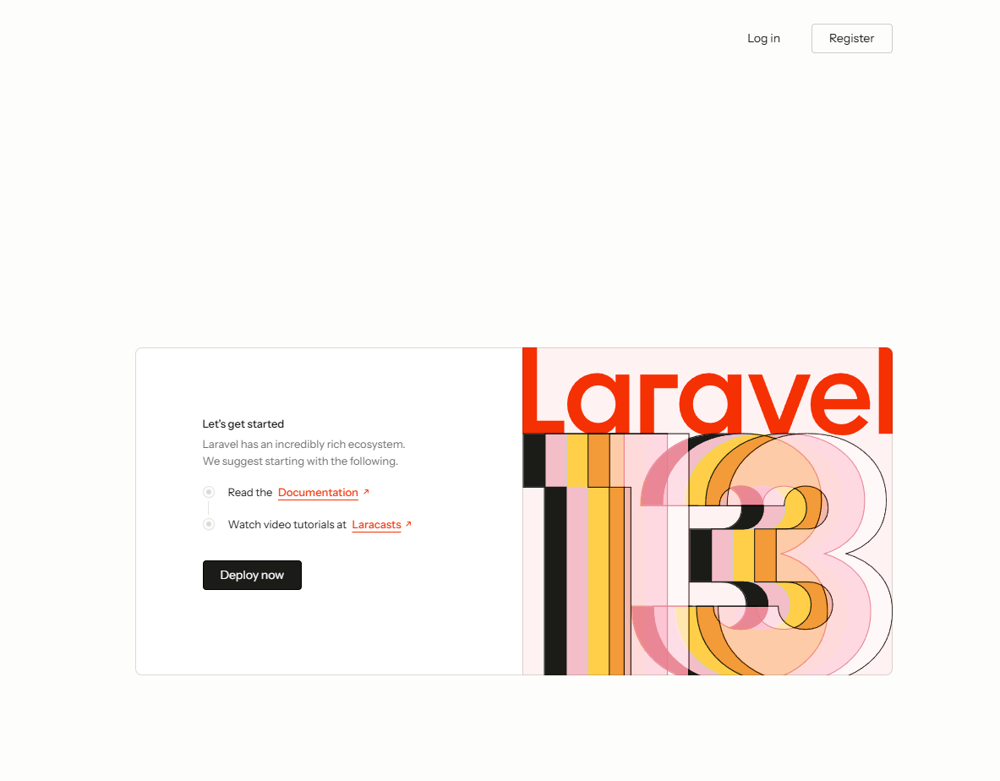
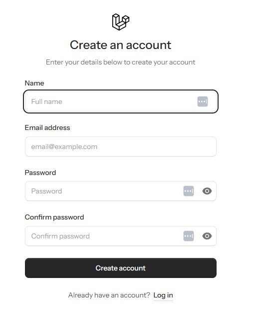
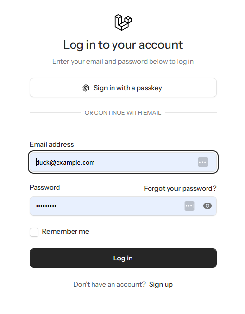
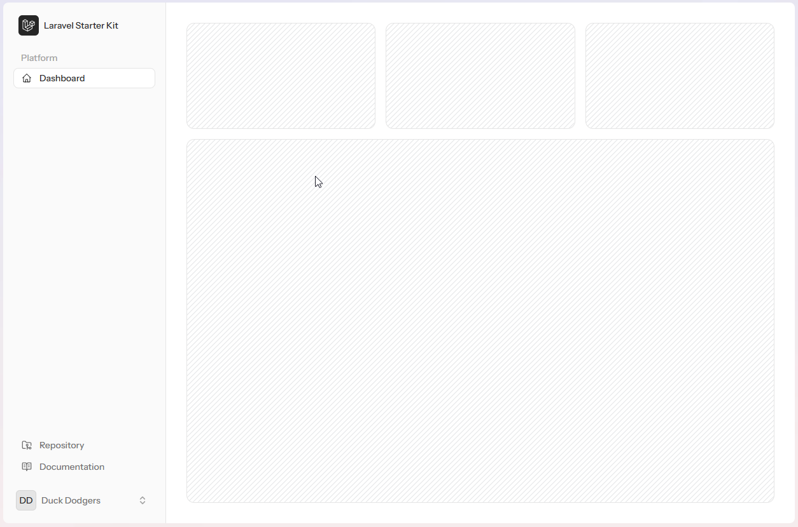
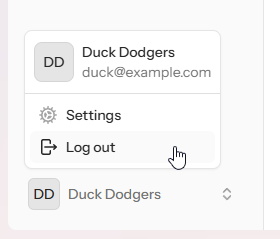
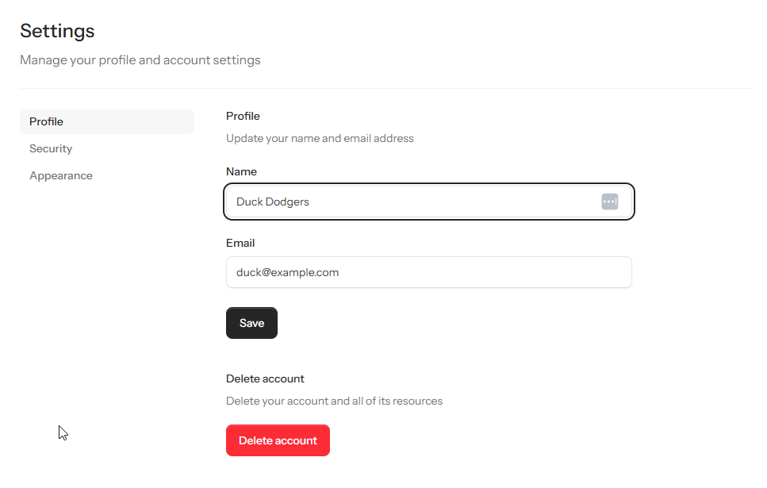

## install installer globally

```shell
composer global require laravel/installer
```

update using

```shell
composer update laravel/installer
```

## Create Application

```shell
laravel new SaaS-Contact-List-App --pnpm --livewire --database=sqlite --pest --git --no-boost
```

Explanation:

### Authentication Features

When asked:

```text
  Which authentication features would you like to enable? [email-verification,registration,2fa,passkeys,password-confirmation]
  None ..................................................................................................................
  Email verification ................................................................................. email-verification
  Registration ............................................................................................. registration
  Two-factor authentication ......................................................................................... 2fa
  Passkeys ..................................................................................................... passkeys
  Password confirmation ........................................................................... password-confirmation
❯
```

Respond with:

```text
 email-verification,registration,2fa,passkeys,password-confirmation
```

You may respond with less, but we are providing all the options for illustration and possible exploration

```shell
cd SaaS-Contact-List-App
```

Execute

```shell
composer run dev
```

This will execute and dosplay:

```text
> Composer\Config::disableProcessTimeout
> pnpm dlx concurrently -c "#93c5fd,#c4b5fd,#fdba74" "php artisan serve" "php artisan queue:listen --tries=1" "pnpm run dev" --names='server,queue,vite'
[queue]
[queue]    INFO  Processing jobs from the [default] queue.
[queue]
[vite] $ vite
[server]
[server]    INFO  Server running on [http://127.0.0.1:8000].
[server]
[server]   Press Ctrl+C to stop the server
[server]
[vite]
[vite]   VITE v8.1.3  ready in 299 ms
[vite]
[vite]   ➜  Local:   http://localhost:5173/
[vite]   ➜  Network: use --host to expose
[vite]
[vite]   LARAVEL v13.19.0  plugin v3.1.0
[vite]
[vite]   ➜  APP_URL: http://localhost:8000
```

Note that if we add extra options then this will alter, but it gives you a good guide to the expected output.

Open browser and head to: http://localhost:8000 to view the site (default page shown below)



Whilst we have used the Livewire "template" to create the application, we will be concentrating on using simpler layouts
via "Blade".

The principles are similar, except Livewire allows the construction of "SPA" or Single Page Applications by writing
PHP/Laravel code, and a touch of JS (JavaScript).

### Some of the views

Using the options we have we are already able to register, validate the email address, and login / logout.











### Simple tweaks

Open the .env file and update each of hte following

| item          | description                  | old value | new value      |
|---------------|------------------------------|-----------|----------------|
| APP_NAME      | Application Name             | Laravel   | "Contact List" |
| APP_LOCALE    | Application default language | en        | en_AU          |
| DB_CONNECTION | Databse type being used      | sqlite    | sqlite         |
| MAIL_MAILER   | The email relay system       | log       | smtp           |

## Important:

The items below should be changed for a Staging / Deployed application
| item | description | old value | new value|
|---|------------------|---|---|
| LOG_LEVEL | The amount of logging for the application | debug | See table below |

#### Log Level

Logging is, by default, sent to a log file in the `storage/logs` folder.
This file can, and does, get exceptionally large if you leave the `LOG_LEVEL` as `debug`.

- Never deploy the application with a log level of debug.
- Do not version control the log files, either!

| Level     | Meaning                                     |
|-----------|---------------------------------------------|
| emergency | System is unusable                          | 
| alert     | Immediate action required                   | 
| critical  | Critical conditions                         |
| error     | Runtime errors that should be investigated  |                                                                                                   
| warning   | Exceptional occurrences that are not errors |
| notice    | Normal but noteworthy events                |
| info      | Informational messages                      |
| debug     | Detailed debugging information              | 

You can specify a minimum level:

```ini
LOG_LEVEL=warning
```

With this setting, only: `warning`, `error`, `critical`, `alert`, and `emergency`  
messages will be recorded. Lower-severity messages such as `debug`, `info`, and `notice` will be ignored.

### Additional Packages we will use

- LaraDumps
    - Provides a way to show variable content **without** stopping application flow
    -
-

### Version Control

At this point it is common to version control the application with the base code.

---

## Applicaiton Folder Structure

