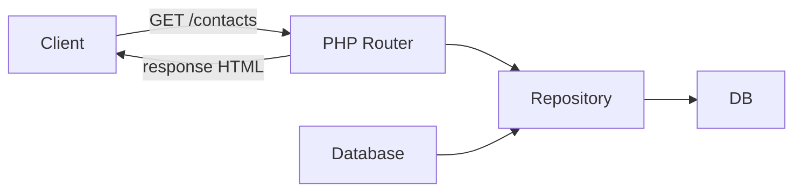
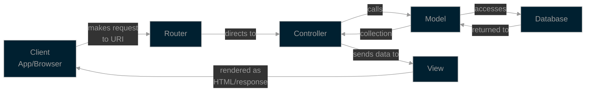
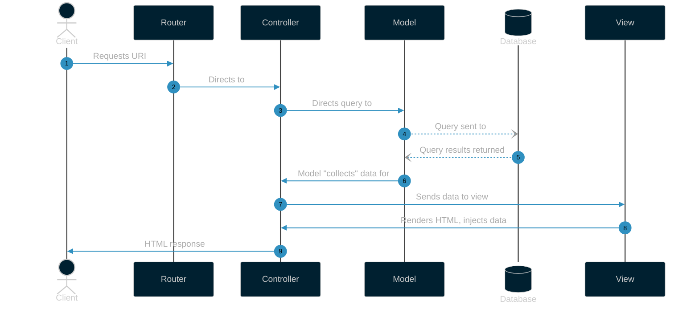

# PHP & MVC Intro

## SaaS – Cloud Application Development (Front-End Dev)

### Session 01

<div @click="$slidev.nav.next" class="mt-12 -mx-4 p-4" hover:bg="white op-10">
<p>Press <kbd>Space</kbd> or <kbd>RIGHT</kbd> for next slide/step <fa7-solid-arrow-right /></p>
</div>

<div class="abs-br m-6 text-xl">
  <a href="https://github.com/adygcode/SaaS-FED-Notes" target="_blank" class="slidev-icon-btn">
    <fa7-brands-github class="text-zinc-300 text-3xl -mr-2"/>
  </a>
</div>


<!--
The last comment block of each slide will be treated as slide notes. It will be visible and editable in Presenter Mode along with the slide. [Read more in the docs](https://sli.dev/guide/syntax.html#notes)
-->

---
level: 2
---

# Session 01 Objectives

## Objectives

By the end of this session, you will be able to:

- Recall key PHP syntax elements
- Process a simple HTML form using PHP
- Use PDO to connect to a database and run queries
  - Use PDO safely with prepared statements
- Understand the MVC request/response flow at a high level


---

# Contents

<Toc minDepth="1" maxDepth="1" />


---
layout: about-me

helloMsg: Your Presenter
name: Adrian Gould
position: left
company: "North Metropolitan TAFE"
jobRole: "ASL | HelpDesk Admin | ScreenCraft Admin"
subjects: "SaaS, API Dev, IoT"
msTeams: "Teams: adrian.gould@nmtafe.wa.edu.au"
website: "https://northmetrotafe.wa.edu.au"
github: "https://github.com/adygcode"
imageSrc: /ajg-designer.png

level: 2
---


---
layout: default
level: 2
---


# Navigating Slides

Hover over the bottom-left corner to see the navigation's controls panel.

## Keyboard Shortcuts

|                                                     |                             |
| --------------------------------------------------- | --------------------------- |
| <kbd>right</kbd> / <kbd>space</kbd>                 | next animation or slide     |
| <kbd>left</kbd>  / <kbd>shift</kbd><kbd>space</kbd> | previous animation or slide |
| <kbd>up</kbd>                                       | previous slide              |
| <kbd>down</kbd>                                     | next slide                  |


---
layout: section
---

# Background

---
level: 2
---

# What Does a Server-Side Language Do?

- Generates dynamic content
- Responds to HTTP requests
- Interacts with databases
- Validates/filters input
- Sends structured output (HTML / JSON / XML)


---
layout: section
---

# PHP Overview

---
level: 2
---

# PHP Refresher (Syntax)

- `declare(strict_types=1);`
- Scalar types: `int`, `float`, `string`, `bool`
- Arrays: indexed & associative
- Control flow: `if`, `foreach`, `match`
- Functions: typed params & return types
- Superglobals: `$_GET`, `$_POST`, `$_SERVER`

<!--
Emphasize:
- output escaping with `htmlspecialchars()`, and
- input validation via filtering or custom rules.
-->

---
level: 2
---

# PHP 8+ Niceties We’ll Use

- Null-safe operator: `$user?->name`
- Constructor property promotion
- Union types & `mixed` (use sparingly)
- `match` expression for branching
- Strict types for predictable behaviour

<!--
We target PHP 8.4+
- Majority of hosting services will support 8.4 and above
-->

---
layout: section
---

# Request - Response Flow


---
level: 2
---

# HTTP Request → Response



<!--
Map:
- GET for listing, 
- POST for creating. 

Keep a “mental model” for request lifecycles.
-->


---
layout: section
level: 1
---

# MVC Flow

Flowchart and sequence diagrams for the MVC architecture flow

---
level: 2
---


# MVC (High Level - Flowchart)




<!--
In this example:
- “controller” is a lightweight router script
- “model” is a repository class
- “view” is a template. 

Full MVC frameworks (e.g., Laravel) formalize this.
-->

---
level: 2
---


# MVC (Sequence Diagram)



---
layout: section
---

# PHP, Databases & Security Essentials


---
level: 2
---

# Data Access with PDO

- DSN (Data Source Name)
- Exceptions on (`errmode`)
- Prepared statements & bound params
- Transactions (for multistep writes)

<!--
DSN
- 
Security win:
- prepared statements prevent injection. 

Prefer exceptions
- `errmode` is set
- no silent fails.
-->


---
level: 2
---

# PDO Prepared Statements

Less readable:

```php [PHP]
$query = 'INSERT INTO contacts(name,email) VALUES(:name,:email)';
$stmt  = $pdo->prepare($query);
$stmt->execute([':name' => $name, ':email' => $email]);
```

Much more readable is to show the "binding":

```php [PHP]
$query = 'INSERT INTO contacts(name,email) VALUES(:name,:email)';
$stmt  = $pdo->prepare($query);
TODO: ** ADD teh Binding code here
$stmt->execute([':name' => $name, ':email' => $email]);
```


---
level: 2
---

# Security & Validation Essentials

- Validate & sanitize input
- Escape output (`htmlspecialchars`)
- CSRF token for forms
- Principle of least privilege DB user

<!--
Even in a demo, model good habits.
-->


---
layout: section
---

# Practical: A small contacts app

---
layout: two-cols
level: 2
---

# Demo App: “Contacts”

- List contacts
- Create new contact via form
- Server-side validation
- Persist with PDO

::right::

# Steps

1. Create DB and `contacts` table (SQLite)
2. Wire PDO & repository
3. Build GET `/contacts` to list records
4. Build POST `/contacts` to insert record with validation
5. Show request → response path and where “MVC-ish” pieces live

<!--
Show end-to-end quickly before students start

Use SQLite to reduce setup friction.
-->

---
level: 2
---

# TODO: Contacts Application Pages

## Home Page


## Create Page


---
layout: two-cols
level: 2
---

# Guided Practice (Pair)

### Duration: 30 mins
<br>


- Pair Programming
- Commit every 'dev' change
  - if complete "feat(feature): Added feature title"
  - e.g. `git commmit -m "feat(contact): Add contact form"` 
- **Dev**: 
  - **AT Keyboard** / Writes the code
- **Lead**: 
  - **NO Keyboard** / Bug hunting, verify code 

::right::

## We will:

- Build `contacts` list and create form
- Implement PDO repository
- Validate required fields
- Display errors inline on forms

<!--
- Paring:
  - Get students to stand
  - Odd IDs to left, Even to right
  - If uneven, move some to other side
  - 1:1 left:right
- Circulate 
- Nudge toward incremental commits
-->

---
level: 2
---

# Independent Extension

## Duration: 40 mins

- Working in same pairs
- Add two extra fields
  - Each member of pair completes ONE extra field
  - Add server-side validation for new fields
- Add “created_at” timestamp
- Write a README explaining the flow

<!--
Encourage peer review using a checklist
- Checklist
-->


---
layout: two-cols
level: 2
---

# Checklist for Code

- [ ] **Code**
  - [ ] Strict types are used 
  - [ ] Output is escaped
  - [ ] All queries use prepared statements
  - [ ] Clear validation errors shown to user
  - [ ] Code is clearly commented

- [ ] **Version control**
  - [ ] Commits are completed regularly

::right:: 

<br>
<br>

- [ ] **README.md File**
  - [ ] Explains flow (request → repo → view)
  - [ ] Developers are clearly indentified
 
- [ ] **Finishing**
  - [ ] Code compressed to Zip/7-Zip
  - [ ] Copy taken by BOTH developers


---
layout: section
---

# Reflection

- What did we build?
- Where does MVC fit?
- Identify one thing to improve


<!--
Invite 2–3 student shares.
-->

---
layout: end
transition: fade-out
level: 2
---

# Laisser les bon temps rouler <fa7-solid-brain />

<br>
<br>

> “Where does MVC fit into what we built today,<br> 
> and which part is weakest/strongest in our mini‑stack?”

<br>
<br>

The end... for now

<small>(Acknowledements on following page)</small>

---

# References

- Fu, A. (2020). Slidev. Sli.dev. https://sli.dev/
- Font Awesome. (2026). Font Awesome. Fontawesome.com; Font Awesome. https://fontawesome.com/
- Mermaid Chart. (2026). Mermaid.ai. https://mermaid.ai/

<br>

# Sample Code

Sample code is available from:

- [Session 01 Sample Code](https://...)
- [https://...](https://...)

---
level: 2
---


# Acknowledgements

- Slide template by Adrian Gould

<br>

> - Mermaid syntax used for some diagrams

<br>

> - Some content was generated with the assistance of Microsoft CoPilot

