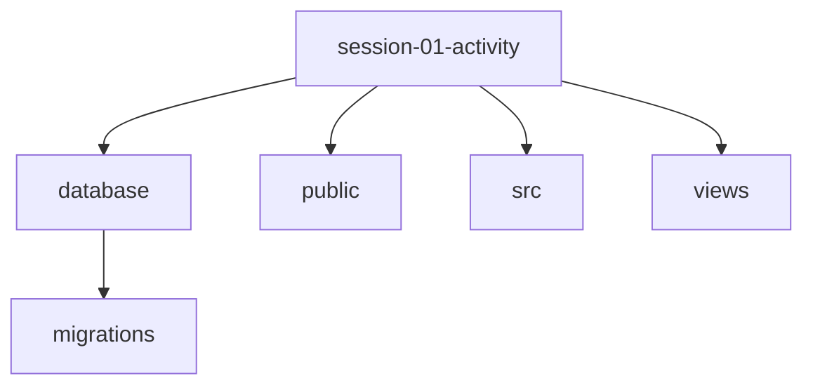

# PHP & MVC Intro

## SaaS – Cloud Application Development (Front-End Dev)

### Session 01: Live Demo

<div @click="$slidev.nav.next" class="mt-12 -mx-4 p-4" hover:bg="white op-10">
<p>Press <kbd>Space</kbd> or <kbd>RIGHT</kbd> for next slide/step <fa7-solid-arrow-right /></p>
</div>

<div class="abs-br m-6 text-xl">
  <a href="https://github.com/adygcode/SaaS-FED-Notes" target="_blank" class="slidev-icon-btn">
    <fa7-brands-github class="text-zinc-300 text-3xl -mr-2"/>
  </a>
</div>


<!--
The last comment block of each slide will be treated as slide notes. It will be visible and editable in Presenter Mode along with the slide. [Read more in the docs](https://sli.dev/guide/syntax.html#notes)
-->


---
layout: default
level: 2
---


# Navigating Slides

Hover over the bottom-left corner to see the navigation's controls panel.

## Keyboard Shortcuts

|                                                     |                             |
| --------------------------------------------------- | --------------------------- |
| <kbd>right</kbd> / <kbd>space</kbd>                 | next animation or slide     |
| <kbd>left</kbd>  / <kbd>shift</kbd><kbd>space</kbd> | previous animation or slide |
| <kbd>up</kbd>                                       | previous slide              |
| <kbd>down</kbd>                                     | next slide                  |


---
layout: two-cols
level: 1
class: text-left
---

# Session 01 Live Demo Objectives

::left:: 

### A1. List Contacts
- **Goal:** Render all contacts in a table
- **Steps:**
  1. Set up project
  2. Ensure DB exists and schema applied
  3. Implement `ContactRepository::all()`
  4. Route `GET /?action=list` to load and render `views/contacts.list.php`

- **Acceptance:** 
  - Table shows at least the columns:<br> 
    ID, Name, Email, Phone, Created.

::right::

### A2. Create Contact (Form)
- **Goal:** Insert a record via POST with validation
- **Steps:**
  1. Build `views/contacts.form.php` with fields: `name`, `email`, `phone`
  2. Add CSRF hidden input; check token on submit
  3. Validate: `name` required; `email` valid
  4. On error: show messages and keep old input; on success: redirect to list

- **Acceptance:** 
  - Valid submissions appear in list
  - Invalid ones show clear errors


---
level: 2
---

# Contents 

<Toc minDepth="1" maxDepth="1" />

---
class: text-left
---

# Important: College Requirements

- Organise your storage
- ALL CODE should be:
  - Stored in Source Repos folder
  - Version Controlled
    - Assessments in PRIVATE repos
  - This is to allow code to execute
- Suggest a folder PER cluster
  - Innovation-Project-1
  - Intermediate-PRIoT
  - SaaS-1-CAD-FED
  - etc

---
layout: two-cols
class: text-left
---

# Create Project & Structure

::left::

## Steps

- Open MS Terminal "Bash"
- Create `Source/Repos` Folder
- Create `session-01-activity` Project Folder
- Run PHPStorm
- Navigate UI
- Open the `session-01-activity` folder


::right::

## Create Source/Repos Folder

```shell {none|1|2-3|4-5|all}
cd /Users/USERNAME
mkdir -P Source/Repos
cd Source/Repos
mkdir SaaS-1-CAD-FED
cd  SaaS-1-CAD-FED
```


## Create Project Folder

```shell {none|1|2|all}
mkdir -P session-01-activity
cd session-01-activity
```


---
layout: two-cols
class: text-left
level: 2
---

# Create Project Folder Structure

::left::

## Steps

- MS Terminal
- Bash CLI
- Move into `session-01-activity` folder
- Create database, database/migrations, public, src and views folders
- Create empty .gitignore files in each folder
- Create empty ReadMe.md

::right::

## Verify correct folder

```shell {none|1}
pwd
```

## Create folders & files

```shell {none|1|2|3|all}
mkdir -P database/migrations public src views
touch {database,database/migrations}/.gitignore
touch {public,src,views,.}/.gitignore,ReadMe.md
```



---

# Create Database (SQLite)

```shell {none|1|2|all}
touch database/contact_list_db.sqlite
touch database/migrations/001_create_contacts_table.sql
```

## Edit `001_create_contacts_table.sql`

Add the following SQL:

```sql {1|2,8|3|4|5|6|7|all}
-- SQLite schema (default)
CREATE TABLE IF NOT EXISTS contacts (
    id         INTEGER PRIMARY KEY AUTOINCREMENT,
    name       TEXT NOT NULL,
    email      TEXT NOT NULL,
    phone      TEXT,
    created_at TEXT NOT NULL DEFAULT (datetime('now'))
);
```

---
level: 2
---

## Add "Seed Data"

```sql {none|1-2|4-5|7-8|all|}
INSERT INTO CONTACTS(name, email, phone)
    VALUES ("Jacques d'Carre", "jacques@example.com", "+61-8-0000-0000");

INSERT INTO CONTACTS(name, email, phone)
    VALUES ("Crystal Chantel-Leer", "crystal@example.com", "+61-4-0000-0001");

INSERT INTO CONTACTS(name, email, phone)
    VALUES ("Robyn Banks", "robyn@example.com", "+61-2-0000-0002");
```


---

# Public Folder

- Effective "ROOT" of site
- `index.php`, `index.html` are default files
- Add common resources (e.g. `styles.css`)

## Create index & styles files

```shell
touch public/{index.php,styles.css}
```

---
level: 2
---

## Edit `public/index.php`

Open `public/index.php` in PhpStorm

```php
<?php
declare(strict_types=1);

spl_autoload_register(function ($class) {
    $prefix = 'App\\';
    $baseDir = dirname(__DIR__).'/src/';
    if (str_starts_with($class, $prefix)) {
        $rel = substr($class, strlen($prefix));
        $file = $baseDir.str_replace('\\', '/', $rel).'.php';
        if (is_file($file)) {
            require $file;
        }
    }
});

```


---
level: 2
---

## `public/index.php` Contrinues

```php
session_start();

// Configure PDO (SQLite for class)
$dbFile = dirname(__DIR__).'/database/contact_list_db.sqlite';
if (!is_file($dbFile)) {
    touch($dbFile);
    $pdo = Database::sqlite($dbFile);
    $schema = file_get_contents(dirname(__DIR__).'/database/migrations/001_create_contacts.sql');
    $pdo->exec($schema);
} else {
    $pdo = Database::sqlite($dbFile);
}
// For MariaDB instead, comment out above and use:
// $pdo = Database::mysql('127.0.0.1', 'cad', 'cad_user', 'secret');

$repo = new ContactRepository($pdo);

```


---
level: 2
---

## `public/index.php` Contrinues

```php
// CSRF: generate token if missing
if (empty($_SESSION['_csrf'])) {
    $_SESSION['_csrf'] = bin2hex(random_bytes(16));
}
$csrf = $_SESSION['_csrf'];

// Routing
$action = $_GET['action'] ?? 'list';
$title = 'Contacts';
$body = '';

```


---
level: 2
---

## `public/index.php` Contrinues

```php
if ($action === 'list' && $_SERVER['REQUEST_METHOD'] === 'GET') {
    $contacts = $repo->all();
    ob_start();
    require dirname(__DIR__).'/views/contacts.list.php';
    $body = ob_get_clean();
} elseif ($action === 'create' && $_SERVER['REQUEST_METHOD'] === 'GET') {
    $errors = [];
    $old = [];
    ob_start();
    require dirname(__DIR__).'/views/contacts.form.php';
    $body = ob_get_clean();
    
```


---
level: 2
---

## `public/index.php` Contrinues

```php
} elseif ($action === 'store' && $_SERVER['REQUEST_METHOD'] === 'POST') {
    // Basic CSRF check
    if (!hash_equals($csrf, $_POST['_csrf'] ?? '')) {
        http_response_code(419);
        exit('CSRF token mismatch');
    }

    // Validation (simple)
    $name = trim((string) ($_POST['name'] ?? ''));
    $email = trim((string) ($_POST['email'] ?? ''));
    $phone = trim((string) ($_POST['phone'] ?? ''));

```


---
level: 2
---

## `public/index.php` Contrinues

```php
    $errors = [];
    if ($name === '') {
        $errors['name'] = 'Name is required';
    }
    if ($email === '' || !filter_var($email, FILTER_VALIDATE_EMAIL)) {
        $errors['email'] = 'Valid email required';
    }

    if ($errors) {
        $old = compact('name', 'email', 'phone');
        ob_start();
        require dirname(__DIR__).'/views/contacts.form.php';
        $body = ob_get_clean();
    } else {
        $repo->insert($name, $email, $phone !== '' ? $phone : None);
        header('Location: /?action=list');
        exit;
    }
    
```


---
level: 2
---

## `public/index.php` Contrinues

```php
} else {
    http_response_code(404);
    $body = '<p>Not found</p>';
}

// Render
ob_start();
require dirname(__DIR__).'/views/layout.php';
echo ob_get_clean();
```

---
level: 2
---

## Edit the `site.css` file


```css
body {
    max-width: 860px;
    margin: 2rem auto;
    font-family: Lexend, system-ui, sans-serif;
}

main {
    padding: 1rem;
    background: #f9f9f9;
    border-left: 1px solid #999;
    border-right: 1px solid #999;
}
```

---
level: 2
---

## `site.css` continues

```css
header, footer {
    padding: 1rem;
    color: #444;
    background: #eee;
}

header {
    border-radius: 0.5rem 0.5rem 0 0;
    border: 1px solid #999;
}
```

---
level: 2
---

## `site.css` continues

```css

footer {
    border-radius: 0 0 0.5rem 0.5rem;
    border: 1px solid #999;
}

h1, h2 {
    margin: 0.5rem 0 1rem;
}

h3, h4 {
    margin: 1rem 0;
}
```

---
level: 2
---

## `site.css` continues

```css

.error {
    color: #b00020;
}

li > span {
    padding-right: 1rem;
    font-weight: 700;
    display: inline-block;
}

form > div {
    display: block;
    margin: 0.5rem 2rem 0.5rem 1rem;
    padding: 0.5rem 0;
}

```

---
level: 2
---

## `site.css` continues

```css

table {
    border-collapse: collapse;
    width: 100%;
}

td, th {
    border-bottom: 1px solid #ddd;
    padding: .5rem;
    text-align: left;
}
```

---
level: 2
---

## `site.css` continues

```css

tr > th {
    background: #000;
    color: #fff;
}

label {
    width: 100%;
}
```

---
level: 2
---

## `site.css` continues

```css

input[type=text], input[type=email] {
    margin: 0.25rem 0;
    width: 100%;
    padding: .5rem;
    border-radius: 0.5rem;
    border: 1px #999 solid;
}

button {
    padding: 0.5rem 2rem;
    background: #3399ff;
    color: #fff;
    border-radius: 0.5rem;
    border: #003399 1px solid;
}
```

---
level: 2
---

## `site.css` continues

```css

code {
    background: #f6f8fa;
    padding: .15rem .4rem;
    border-radius: 3px;
}

```

---
level: 2
---

## `site.css` continues

```css

```

---
level: 2
---

## `site.css` continues

```css

```

---
level: 2
---

# Practice Checklist

- [ ] Demo uses strict types & output escaping
- [ ] Prepared statements for all queries
- [ ] Clear validation errors shown to user
- [ ] README explains flow (request→repo→view)
- [ ] Students commit work to VCS

---
level: 2
---

# Exit Ticket

> “Where does MVC fit into what we built today, and which part is weakest/strongest in our mini‑stack?”


---

# Acknowledgements

- Fu, A. (2020). Slidev. Sli.dev. https://sli.dev/
- Font Awesome. (2026). Font Awesome. Fontawesome.com; Font Awesome. https://fontawesome.com/
- Mermaid Chart. (2026). Mermaid.ai. https://mermaid.ai/

- Slide template
  - Adrian Gould

<br>

> - Mermaid syntax used for some diagrams
> - Some content was generated with the assistance of Microsoft CoPilot
