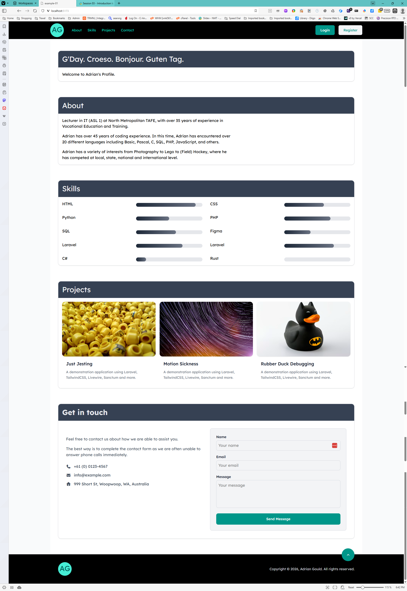
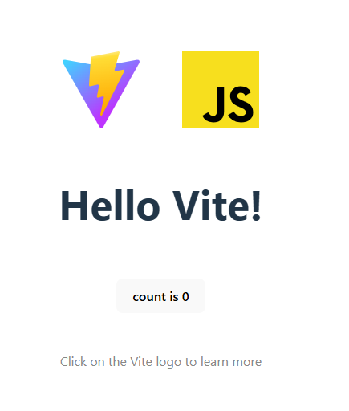

# Session 01: Introduction to TailwindCSS

## SaaS 1 – Cloud Application Development (Front-End Dev)

### A Quick Introduction to Utility First Style Systems

<div @click="$slidev.nav.next" class="mt-12 -mx-4 p-4" hover:bg="white op-10">
<p>Press <kbd>Space</kbd> or <kbd>RIGHT</kbd> for next slide/step <fa7-solid-arrow-right /></p>
</div>

<div class="abs-br m-6 text-xl">
  <a href="https://github.com/adygcode/SaaS-FED-Notes" target="_blank" class="slidev-icon-btn">
    <fa7-brands-github class="text-zinc-300 text-3xl -mr-2"/>
  </a>
</div>


<!--
The last comment block of each slide will be treated as slide notes. It will be visible and editable in Presenter Mode along with the slide. [Read more in the docs](https://sli.dev/guide/syntax.html#notes)
-->


---
layout: default
level: 2
---

# Navigating Slides

Hover over the bottom-left corner to see the navigation's controls panel.

## Keyboard Shortcuts

|                                                     |                             |
|-----------------------------------------------------|-----------------------------|
| <kbd>right</kbd> / <kbd>space</kbd>                 | next animation or slide     |
| <kbd>left</kbd>  / <kbd>shift</kbd><kbd>space</kbd> | previous animation or slide |
| <kbd>up</kbd>                                       | previous slide              |
| <kbd>down</kbd>                                     | next slide                  |

---
layout: section
---

# Objectives

---
layout: two-cols
level: 2
---

# Objectives

::left::

## Setting Up

- Creating the project
    - add folders
    - add files
    - required packages
    - `style.css`
    - `index.html`

::right::

## Styling a page

- Add base HTML
- Style Header
- Style Footer
- Style Main content

---
level: 2
---

# Contents

<Toc minDepth="1" maxDepth="1" />

---

# Before you Begin

<Announcement type="important" title="PNPM" class="max-w-[60ch]">
<p>
When developing, Adrian had some issues with not being able to
execute commands to create a new `pnpm` based project.
</p>
<p>
This was due to security restrictions on his laptop.
</p>
<p>
It is possible to work around this by using a
combination of <code>npm</code> and <code>pnpm</code> to install and
execute the development environment for TailwindCSS.
</p>
</Announcement>

<Announcement type="info" title="Terminal" class="max-w-[60ch]">
<p>
Remember that we also work with a split terminal, with one
terminal for the development server and the other for executing
commands such as <code>npm create vite@latest profile-page</code> 
 <br> and <code>pnpm install tailwindcss @tailwindcss/vite</code>.
</p>
</Announcement>

---

# Example of Page



---

# Demo of Page

<SlidevVideo v-click autoplay controls class="max-h-96">
  <!-- Anything that can go in an HTML video element. -->
  <source 
    src="./public/screen-capture-profile-page-demo-video.mp4" 
    type="video/mp4" 
    />
  <p>
    Your browser does not support videos. You may download it
    <a href="./public/screen-capture-profile-page-demo-video.mp4">here</a>.
  </p>
</SlidevVideo>

Press Space to watch video

---


# Creating the Project

## Setting Up

- Open MS Terminal
- Change into your `Source/Repos` folder
- Execute the command: `npm create vite@latest profile-page`

**Use the options:**

- Framework: `Vanilla`
- Variant: `JavaScript`
- Use Vite beta: `No`
- Install with npm...: `No`

---
level: 2
---

# Creating the Project (2)

Continue the setting up by executing:

- `cd profile-page`
- Execute: `pnpm install tailwindcss @tailwindcss/vite `
- Execute: `pnpm install @tailwindcss/forms @fortawesome/fontawesome-free `

At this point the result of an `ls -la` should be **similar** to:

```text
-rw-r--r-- 1 UserName 1073742337   253 Feb 16 12:45 .gitignore
-rw-r--r-- 1 UserName 1073742337   359 Feb 16 17:07 index.html
drwxr-xr-x 1 UserName 1073742337     0 Feb 16 17:12 node_modules/
-rw-r--r-- 1 UserName 1073742337   325 Feb 16 17:12 package.json
-rw-r--r-- 1 UserName 1073742337 32794 Feb 16 17:12 pnpm-lock.yaml
drwxr-xr-x 1 UserName 1073742337     0 Feb 16 17:07 public/
drwxr-xr-x 1 UserName 1073742337     0 Feb 16 17:07 src/
```

---
level: 2
---

# Creating the Project (2)


## Add folders and empty files

- Execute: `touch vite.config.ts {src,public}/.gitignore`

## Configure Vite

- Open the new `vite.config.ts` file
- Add the code to configure vite and then import the required plugins:

````md magic-move

```ts
import { defineConfig } from 'vite'
export default defineConfig({
  plugins: [  ],
})
```

```ts [typescript] {2,5}
import { defineConfig } from 'vite'
import tailwindcss from '@tailwindcss/vite'
export default defineConfig({
  plugins: [
    tailwindcss(),
  ],
})
```

````


---
level: 2
layout: two-cols
---

# Creating the Project (3)

::left::

## Execute the Dev server

```shell [Shell]
pnpm run dev
```

Open the page shown next to "Local" in the terminal in your browser.

This page is Vite's welcome page.

::right::



--- 
level: 1
---

# Setting Up the HTML & CSS

## Style File

Open the existing `src/style.css` file.

Remove ALL the existing CSS and replace with:

```css
@import "tailwindcss";
@import "@fortawesome/fontawesome-free/css/all.css";

@theme {
    --font-sans: Roboto, Trebuchet, sans-serif;
}
```

---
level: 2
---

# Setting Up the HTML & CSS (2)

## Index file

<Announcement type="info">
In this slide, we will show code in steps, highlighting key items.
</Announcement>

- Open the existing `index.html` file
- Remove all the content in the `<body> ... </body>` element
- Update the content to:

````md magic-move

```html [html] {none|1-6,11|7-10|all}
<!doctype html>
<html lang="en">
<head>
    <meta charset="UTF-8"/>
    <meta name="viewport" content="width=device-width, initial-scale=1.0"/>
    <title>Profile Page</title>
    <link rel="preconnect" href="https://api.fonts.coollabs.io" crossorigin/>
    <link href="https://api.fonts.coollabs.io/css2?family=Roboto:wght@100..900&display=swap" rel="stylesheet"/>

    <link rel="stylesheet" href="src/style.css">
</head>
```

```html [HTML] {3-30}
    <link rel="stylesheet" href="src/style.css">
</head>
<body>
<header>Header & Navigation</header>

<main>Main Content of Page</main>

<footer>Site/Page Footer</footer>
</body>
</html>
```

````

---
level: 2
---

# Setting Up the HTML & CSS (3)

Let's add some TailwindCSS classes.

Header and Navigation based upon:
- Icon and links on the left, call to actions on the right
- Free Tailwind CSS Header Components | HyperUI | HyperUI. (2026). HyperUI. https://www.hyperui.dev/components/marketing/headers

````md magic-move

```html
<body class="bg-gray-50">
```

```html
<header class="bg-black px-8 py-2 mb-0 sticky top-0">
    <div class="mx-auto max-w-7xl flex items-center gap-8">
        <a class=" text-teal-800 text-center items-center flex h-14 w-14" href="#MainContent">
            <p class="text-3xl bg-teal-300 rounded-full h-14 w-14  items-center p-1 py-2">
                YOUR INITIALS HERE
                <span class="sr-only">Home</span>
            </p>
        </a>
        <nav></nav>
    </div>
</header>
```

```html
<div class="flex flex-1 items-center justify-end md:justify-between">
    <nav aria-label="Global" class="hidden md:block">
        <ul class="flex items-center gap-6 text-sm">
            <li>
                <a class="text-teal-400 transition hover:text-teal-300" 
                   href="#About">About</a>
            </li>
<!-- 
    Add Nav items for Skills, Projects and Contact here 
    Follow the List Item and Anchor pattern above
-->
    </nav>
</div>
```


```html
    </nav>
</body>

<main class="max-w-7xl space-y-16 bg-white min-h-screen 
             mx-auto px-4 sm:px-6 lg:px-8 pt-12 pb-16">
    <article class="border border-gray-200 rounded-xl shadow overflow-hidden">
        <header class="bg-pink-700 text-amber-100 w-full">
            <h1 class="text-3xl p-4">
                Hello!
            </h1>
        </header>
        <section class="space-y-4 p-4">
```


```html
        <section class="space-y-4 p-4">
            <p>
                Welcome to YOUR NAME HERE's Profile.
            </p>
        </section>
        <span id="About"></span>
    </article>
```


````

---
level: 2
---

# Setting up the HTML & CSS (4)

We continue with setting up the profile page... adding projects.

Project "cards" based on:
- Free Tailwind CSS Blog Card Components | HyperUI | HyperUI. (2026). HyperUI. https://www.hyperui.dev/components/marketing/blog-cards

Specifically: "Floating image with title and excerpt".

````md magic-move

```html
<article class="border border-gray-200 rounded-xl shadow overflow-hidden">
    <header class="bg-gray-700 text-gray-100 w-full">
        <h1 class="text-3xl text-gray-100 p-4">
            Projects
        </h1>
    </header>
    <div class="gap-4 p-4 grid grid-cols-3">
        <!-- We add the project cards here -->
    </div>
    <span id="Contact"></span>
</article>
```


```html
<div class="gap-4 p-4 grid grid-cols-3">
    <!-- We add the projects here -->
    <section class="group">
        <!-- Screenshot/Illustration here -->
                <div class="p-4">
                    <!-- title and one sentence description -->
                </div>
            </section>
           
        </div>
    <span id="Contact"></span>
</article>
```

```html
<!-- Screenshot/Illustration here -->

        
```

```html
<div class="p-4">
    <!-- title and one sentence description -->
    <a href="#">
        <h3 class="text-lg font-medium text-gray-900">Rubber Duck Debugging</h3>
    </a>

    <p class="mt-2 line-clamp-3 text-sm/relaxed text-gray-500">
        A demonstration application using Laravel, TailwindCSS, Livewire, Sanctum and more.
    </p>
</div>
```


````

---

# Practice!

For practice, we want you to:

- Follow the steps to create the profile-page project
- Update the layout to be how you would like to present yourself professionally
- Update colour, typeface and other aspects of the page
- Ensure you have the following sections:
  - About
  - Skills
  - Education 
  - Projects
  - (External) Interests
  - Contact form

You may add extra sections as you believe are useful.

---

# Recap Checklist

- [ ] Create a new TailwindCSS Project
- [ ] Set up the Base HTML for the project
- [ ] Use different fonts for serif, sans and mono
- [ ] Use the responsive layout capabilities
- [ ] Ensure page is accessible
- [ ] Contains the required sections

---
level: 2
---

# Exit Ticket

> How has TailwindCSS altered your perception of CSS?

<br>

> What drawbacks do you see in TailwindCSS? 


---

# Acknowledgements

- Fu, A. (2020). Slidev. Sli.dev. https://sli.dev/
- Font Awesome. (2026). Font Awesome. Fontawesome.com; Font
  Awesome. https://fontawesome.com/
- Mermaid Chart. (2026). Mermaid.ai. https://mermaid.ai/

- Slide template
    - Adrian Gould

<br>

> - Mermaid syntax used for some diagrams
> - Some content was generated with the assistance of Microsoft CoPilot
