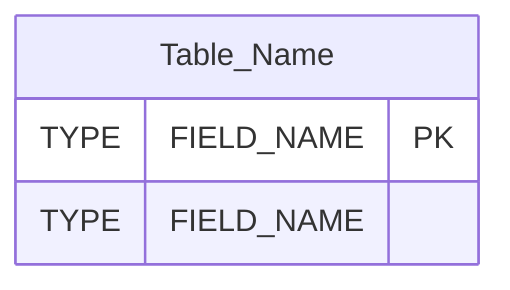
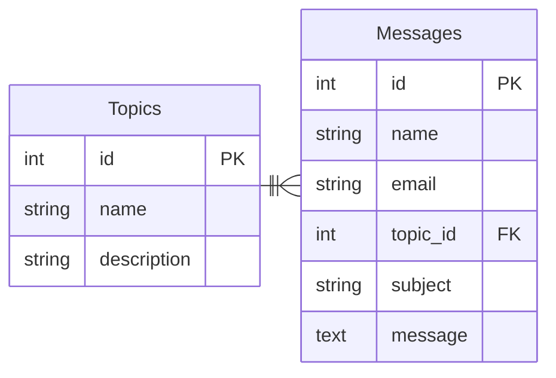
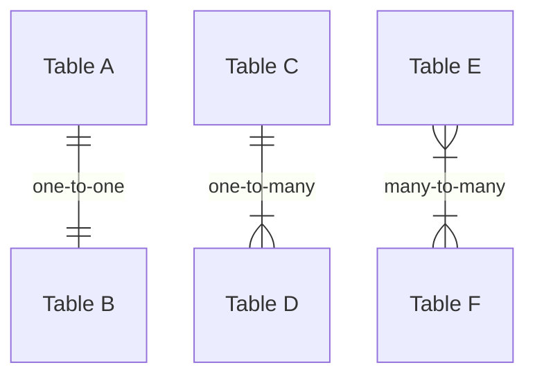
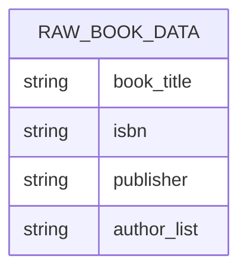
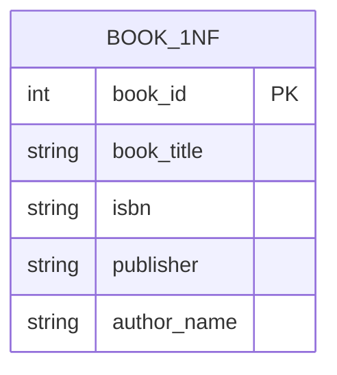
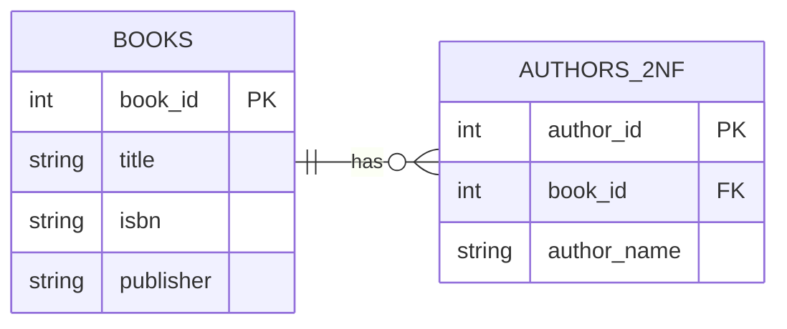
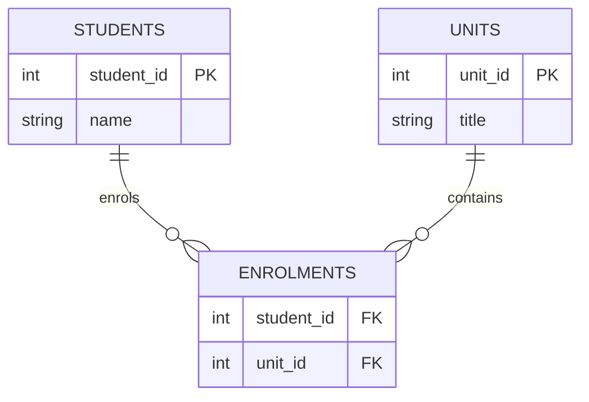

# Session 05: Database Design & Normalisation

## SaaS 1 – Cloud Application Development (Front-End Dev)

## SaaS 2 – APIs & NoSQL (Back-End Dev)

<div @click="$slidev.nav.next" class="mt-12 -mx-4 p-4" hover:bg="white op-10">
<p>Press <kbd>Space</kbd> or <kbd>RIGHT</kbd> for next slide/step <fa7-solid-arrow-right /></p>
</div>

<div class="abs-br m-6 text-xl">
  <a href="https://github.com/adygcode/SaaS-FED-Notes" target="_blank" class="slidev-icon-btn">
    <fa7-brands-github class="text-zinc-300 text-3xl -mr-2"/>
  </a>
</div>


<!--
The last comment block of each slide will be treated as slide notes. It will be visible and editable in Presenter Mode along with the slide. [Read more in the docs](https://sli.dev/guide/syntax.html#notes)
-->


---
layout: default
level: 2
---

# Navigating Slides

Hover over the bottom-left corner to see the navigation's controls panel.

## Keyboard Shortcuts

|                                                     |                             |
|-----------------------------------------------------|-----------------------------|
| <kbd>right</kbd> / <kbd>space</kbd>                 | next animation or slide     |
| <kbd>left</kbd>  / <kbd>shift</kbd><kbd>space</kbd> | previous animation or slide |
| <kbd>up</kbd>                                       | previous slide              |
| <kbd>down</kbd>                                     | next slide                  |

---
layout: section
---

# Objectives

Turning messy data into robust database designs

---
level: 2
---

# Objectives


- Explain the purpose of database normalisation beyond Third Normal Form (3NF)
- Interpret and create ERDs for progressively normalised designs
- Apply Fourth Normal Form (4NF) and Fifth Normal Form (5NF) correctly
- Justify the use of junction tables to resolve many‑to‑many relationships
- Convert normalised ERDs into SQL DDL statements
- Explain when controlled denormalisation is appropriate
- Compare normalisation strategies in OLTP vs analytic (OLAP) systems


---
level: 2
---

# Contents

<Toc minDepth="1" maxDepth="1" columns="2"/>

---
layout: section
---

# What is Normalisation?

---
level: 2
---

# What Is Normalisation?

**Database normalisation** is the process of:

- Organising data to **reduce duplication**
- Improving **data integrity**
- Making databases **easier to maintain**
- Preventing update, insert, and delete anomalies

Normalisation is applied **step‑by‑step** using *normal forms*.


---
layout: section
---

# Normalisation - Step by Step

---
level: 2
---

## The Normalisation Process

We typically work through:

1. **0NF/UNF (Unnormalised Form)**
2. **1NF – First Normal Form**
3. **2NF – Second Normal Form**
4. **3NF – Third Normal Form**

<br>
<br>

<Announcement type="warning" style="width: 100%; padding: 1rem;" title="Important">
<ul>
<li>Each step builds on the previous one</li>
<li>You do <strong>not skip steps</strong></li>
</ul> 
</Announcement>


---
layout: section
---

# Entity Relationship Diagrams (ERDs)

---
level: 2
layout: two-cols
---

# ERDs – Purpose

::left::

### ERDs - Visual Tool

An **Entity Relationship Diagram (ERD)** is a visual model that shows:

- Tables (entities)
- Relationships between tables
- Cardinality:
  - One‑to‑One (1:1)
  - One‑to‑Many (1:M)
  - Many‑to‑Many (M:N)

::right::

### ERDs help identify:

- Missing tables
- Invalid relationships
- Normalisation problems

---
level: 2
layout: two-cols
---

# ERD Basics

::left::

## Entities

Also Known As: Tables



::right::

## Example Diagram



---
level: 2
layout: two-cols
---

# ERD and Common Relationship Types

::left::

## The "Crows Feet" Notation



::right::

## Note on ERDs:

ERDs allow:
- representation of tables & relationships
- identification of design issues

<br>

## Diagram Note:

Common relationships:

<div style="font-size: 0.95rem">

- 1:1 one-to-one → rare: merge / used as lookup tables
- 1:M one-to-many → common: use foreign keys 
- M:N many-to-many → issue: must be resolved

</div>

---
layout: section
---

# 0NF (or UNF) 
# Zero -or- Un-normalised Form

---
level: 2
---

## 0NF (UNF) – Zero or  Un-normalised Data

0NF/UNF describes **raw, collected data**:

- Repeating groups
- Multi‑valued fields
- No primary key
- Often copied directly from forms or spreadsheets

This data **cannot** safely support a relational database.

---
level: 2
---

## UNF Example (Books)

| Book Title          | ISBN       | Publisher      | Author 1   | Author 2   | Author 3      |
|---------------------|------------|----------------|------------|------------|---------------|
| The CSS Anthology   | 0957921888 | SitePoint      | Andrew, R. | —          | —             |
| Quality Web Systems | 0201719363 | Addison‑Wesley | Dustin, E. | Rashka, J. | McDiarmid, D. |

### Problems:

- Variable number of authors
- Repeating columns
- Difficult to query and extend


---
level: 2
layout: two-cols
---

## 0NF/UNF – Conceptual ERD

::left::



::right::

For dbdiagram.io the DBML is:

```text
Table RAW_BOOK_DATA {
  book_title varchar
  isbn varchar
  publisher varchar
  author_list varchar
}
```

<!--
Presenter Notes:
- 0NF/UNF represents raw, collected data.
- Highlight the multi-valued author_list field as the main design flaw.
- No keys, no relationships, no integrity guarantees.
-->


---
layout: section
---

# 1NF – First Normal Form

---
level: 2
---

# 1NF – Rules

<br>

## A table is in **First Normal Form (1NF)** if:

<div style="font-size: 1.5rem">

1. All fields contain **atomic (indivisible) values**
2. There are **no repeating groups or columns**
3. Each record can be **uniquely identified** (primary key)

</div>

---
level: 2
---

## 1NF Transformation

We remove repeating author columns by creating **multiple rows**.

| book_id | book_title          | ISBN       | publisher      | author_name        |
|--------:|---------------------|------------|----------------|--------------------|
|       1 | The CSS Anthology   | 0957921888 | SitePoint      | Andrew, Rachel     |
|       2 | Quality Web Systems | 0201719363 | Addison‑Wesley | Dustin, Elfriede   |
|       2 | Quality Web Systems | 0201719363 | Addison‑Wesley | Rashka, Jeff       |
|       2 | Quality Web Systems | 0201719363 | Addison‑Wesley | McDiarmid, Douglas |

<Announcement type="info" style="width:100%;">

✅ Repeating groups removed  
❌ Duplication still exists

</Announcement>

---
level: 2
layout: two-cols
---

## 1NF – Atomic Values

::left::



::right::

For dbdiagram.io the DBML is:

```text
Table BOOK_1NF {
  book_id int [pk]
  book_title varchar
  isbn varchar
  publisher varchar
  author_name varchar
}
```

<!-- Presenter Notes:
1NF removes repeating groups by making all values atomic.
Point out that redundancy still exists (publisher repeated per row).
This is progress, but not a finished design.
-->


---
layout: section
---

# 2NF – Second Normal Form

---
level: 2
---

# 2NF – Rules

<br>

## A table is in **Second Normal Form (2NF)** if:


<div style="font-size: 1.5rem">

1. It is already in **1NF**
2. All non‑key fields depend on the **whole primary key**
3. No **partial dependencies** exist

</div>

This usually means splitting data into **new tables**


---
level: 2
---

## 2NF Transformation

We separate **Books** and **Authors**.

### Books

| book_id | book_title          | ISBN       | publisher      |
|--------:|---------------------|------------|----------------|
|       1 | The CSS Anthology   | 0957921888 | SitePoint      |
|       2 | Quality Web Systems | 0201719363 | Addison‑Wesley |


<br>

> Authors on the next page

---
level: 2
---

## 2NF Transformation

### Authors

| author_id | book_id | author_name        |
|----------:|--------:|--------------------|
|         1 |       1 | Andrew, Rachel     |
|         2 |       2 | Dustin, Elfriede   |
|         3 |       2 | Rashka, Jeff       |
|         4 |       2 | McDiarmid, Douglas |

<Announcement type="info" style="width:100%;">

✅ Duplicate book data removed  
✅ Structure easier to maintain

</Announcement>

---
level: 2
layout: two-cols
---


## 2NF – Remove Partial Dependencies

::left::



::right::

For dbdiagram.io the DBML is:

```text
Table Books {
  book_id int [pk]
  title varchar
  isbn varchar
  publisher varchar
}

Table Authors_2NF {
  author_id int [pk]
  book_id int [ref: > Books.book_id]
  author_name varchar
}
```

<!-- Presenter Notes:
Explain partial dependency using plain language: book data should not depend on author rows.
This slide is where students usually "get" why multiple tables are necessary.
-->


---
layout: section
---

# 3NF – Third Normal Form

---
level: 2
---

# 3NF – Rules

<br>

## A table is in **Third Normal Form (3NF)** if:

<div style="font-size: 1.5rem">

1. It is already in **2NF**
2. No non‑key attribute depends on another non‑key attribute
3. All fields depend **only on the primary key**

</div>

This removes **transitive dependencies**.


---
level: 2
---

## 3NF Transformation

<p style="margin:0">Publisher data does not depend directly on the book.</p>

### Books

| book_id | book_title          | ISBN       | publisher_id |
|--------:|---------------------|------------|--------------|
|       1 | The CSS Anthology   | 0957921888 | 1            |
|       2 | Quality Web Systems | 0201719363 | 2            |

---
level: 2
---

## 3NF Transformation

### Publishers

| publisher_id | publisher      |
|-------------:|----------------|
|            1 | SitePoint      |
|            2 | Addison‑Wesley |

---
level: 2
---

## 3NF Transformation


### Authors

| author_id | book_id | author_name        |
|----------:|--------:|--------------------|
|         1 |       1 | Andrew, Rachel     |
|         2 |       2 | Dustin, Elfriede   |
|         3 |       2 | Rashka, Jeff       |
|         4 |       2 | McDiarmid, Douglas |


<Announcement type="info" style="width:100%;">

✅ No transitive dependencies  
✅ Data integrity improved  
✅ Ready for relational implementation

</Announcement>


---
level: 2
layout: two-cols
---

## 3NF – Remove Transitive Dependencies

::left::

```mermaid
erDiagram
    BOOKS {
        int book_id PK
        string title
        string isbn
        int publisher_id FK
    }
    PUBLISHERS {
        int publisher_id PK
        string name
    }
    AUTHORS_BOOKS {
        int author_id FK
        int book_id FK
        
    }
    AUTHORS {
        int author_id PK
        int book_id FK
        string name
    }
    
    BOOKS ||--|| PUBLISHERS : "published by"
    BOOKS ||--|{ AUTHORS_BOOKS : "have many"
    AUTHOR_BOOKS |}--|| AUTHORS : "write many"
```

<Announcement type="info" style="font-size: 0.9rem; margin-top: 1rem;">
Note a Problem: Authors <strong>write many</strong> Books, and Books <strong>have many</strong> Authors... 
</Announcement>

::right::

For dbdiagram.io the DBML is:

```text
Table Publishers {
  publisher_id int [pk]
  name varchar
}   

Table Books {
  book_id int [pk]
  title varchar
  isbn varchar
  publisher_id int [ref: > Publishers.publisher_id]
}

Table Authors {
  author_id int [pk]
  name varchar
  book_id int [ref: > Books.book_id]
}
```

<!-- Presenter Notes:
Reinforce the key idea: non-key fields must not depend on other non-key fields.
Publisher details depend on publisher, not directly on book.
Most production systems aim for 3NF.
-->


---
level: 2
---

# Summarising steps so far


## Key Takeaways

- Normalisation is **incremental**
- Each normal form solves specific problems
    - 1NF → structure
    - 2NF → duplication
    - 3NF → dependency correctness

- Most real‑world systems aim for **3NF** or higher for robust design

---
level: 2
---

# Summarising steps so far


## Minimal Normalisation ... Complete 🌱

- Less duplication
- Clear relationships
- Reliable data

---
layout: section
---

# Advanced Normalisation

## Fourth and Fifth Normal Forms (4NF & 5NF)

Resolving complex relationships and validating designs


---
level: 2
layout: two-cols
---

# Why Go Beyond 3NF?

::left::

### Most real‑world database designs:

- Aim for **Third Normal Form**
- May fail because **many‑to‑many** relationships have not been resolved
- May hide duplication across tables

::right::

### Advanced normal forms help when:

- Relationships are complex
- Data independence matters
- Analytical correctness is critical

---
layout: section
---

# 4NF – Fourth Normal Form

---
level: 2
---

# 4NF – The Problem

## TODO: Update 4NF

4NF addresses a specific issue:

<Announcement type="important" style="width: 100%; padding: 1rem;" title="4NF Addresses Problem">
<p><strong>Independent multi‑valued relationships</strong> stored in the same table.</p>
</Announcement>

### Classic example:

- A book <strong style="background: rgba(255,255,255,0.2);padding: 0.1rem 0.25em; border-radius: 0.25rem;">has many</strong> authors
- An author <strong style="background: rgba(255,255,255,0.2);padding: 0.1rem 0.25em; border-radius: 0.25rem;">writes many</strong> books
 
This is a **many‑to‑many** relationship.

---
level: 2
---

# 4NF – The Rule

<br>

## A table is in **Fourth Normal Form (4NF)** if:

<div style="font-size: 1.5rem">

1. It is already in **3NF**
2. It contains **no multi‑valued dependencies**
3. Each independent relationship is represented separately

</div>

## Solution:

If you have not done so in the 3NF stage:

- Use an **intersection** (junction/pivot/intermediatory) table

---
level: 2
---

# 4NF Solution – Junction Table

Books and Publishers tables stay the same as before:

### Books

<div style="line-height: 1rem;">

| book_id | book_title          | ISBN       | publisher_id |
|--------:|---------------------|------------|--------------|
|       1 | The CSS Anthology   | 0957921888 | 1            |
|       2 | Quality Web Systems | 0201719363 | 2            |

</div>

### Publishers

<div style="line-height: 1rem;">

| publisher_id | publisher      |
|-------------:|----------------|
|            1 | SitePoint      |
|            2 | Addison‑Wesley |

</div>

---
level: 2
---

# 4NF Solution – Junction Table

Authors no longer has the Book ID, it is moved into an Authors-Books table. 

### Authors

| author_id | author_name        |
|----------:|--------------------|
|         1 | Andrew, Rachel     |
|         2 | Dustin, Elfriede   |
|         3 | Rashka, Jeff       |
|         4 | McDiarmid, Douglas |


Authors-Books on next slide


---
level: 2
layout: two-cols
---

# 4NF Solution – Junction Table

::left::

#### Authors - Books (Junction) &dagger;

| author_id | book_id |
|----------:|--------:|
|         1 |       1 |
|         2 |       2 |
|         3 |       2 |
|         4 |       2 |


<Announcement type="important">
&dagger; Laravel calls this a <strong>pivot table</strong>. <br>Alphabetical order is 
common for naming: <code>authors_books</code>.
</Announcement>

::right::

### Details of Junction Table

- Composite primary key
    - `author_id, book_id`

- Both columns are foreign keys
    - `author_id` → Authors
    - `book_id` → Books

- Resolves M:N relationship cleanly with **no** duplication, and **no**
  anomalies

✅ Database now satisfies **4NF**

---
layout: section
---

# 5NF – Fifth Normal Form
---
level: 2
---

# 5NF – What It Solves

## 5NF ensures:

<Announcement type="important" style="width: 100%; padding: 1rem;" title="5NF Addresses Problem">
<p>The original data can be **reconstructed** by joining the decomposed tables</p>
</Announcement>

## It focuses on:

- Logical correctness
- Lossless decomposition
- Eliminating join anomalies

5NF is **rare**, but important for theory and validation.


---
level: 2
---

# 5NF – Rule

## A database is in **Fifth Normal Form (5NF)** if:


<div style="font-size: 1.5rem">

1. It is already in **4NF**
2. Every join dependency is implied by candidate keys
3. No information is lost when tables are decomposed

</div>

## If you can reconstruct the original data:

- ✅ You have met 5NF

---
level: 2
---

# Reconstruction Example

<br>

```sql [SQL]
SELECT b.title,
       p.publisher_name,
       a.author_name
FROM Books b
         JOIN Authors_Books ba ON b.book_id = ba.book_id
         JOIN Authors a ON ba.author_id = a.author_id
         JOIN Publishers p ON b.publisher_id = p.publisher_id;
```

If this query reproduces the original dataset:

- ✅ Normalisation is valid
- ✅ No data loss occurred

---
layout: section
---

# Practical Considerations

---
level: 2
---

# When to Stop Normalising

## In practice:

- ✅ Most systems stop at **3NF**
- ✅ 4NF used when M:N relationships exist
- ⚠️ 5NF mainly used for:
    - Validation
    - Highly sensitive systems
    - Academic and analytical correctness

<br>

<Announcement type="important" style="width: 100%; padding: 1rem;" title="Normalisation & Simplicity">
<p>Normalisation trades simplicity for correctness</p>
</Announcement>

---
level: 2
layout: two-cols
---

# Normalisation vs Performance

::left::

## Highly normalised designs:

- ✅ Reduce duplication
- ✅ Improve integrity
- ❌ Increase number of joins
- ❌ May increase query execution time

::right::

## Real systems may:

- Start fully normalised
- Add **controlled denormalisation**
- Balance integrity and performance

<br>
<br>

#### Tool, Not Rulebook

Normalisation is a **design tool**, not a rulebook.

---
level: 2
---

# Summarising the advanced steps

## Key Takeaways

- ERDs expose structural problems
- 4NF resolves many‑to‑many relationships
- 5NF validates correctness through reconstruction
- Not all systems need advanced normal forms
- Understanding them improves **design judgement**

---
level: 2
---

# Summarising the advanced steps

## Advanced Normalisation ... Complete 🌿

- Structure refined
- Relationships clarified
- Designs made trustworthy


---
layout: section
---

# Normalisation Revision Exercises (0NF/UNF → 5NF)

<!-- Presenter Notes:
These exercises shift students from recognition to transformation.
Encourage drawing rough tables or ERDs before answering.
-->

---
level: 2
---

## Exercise 1 – Identify Normal Form

Given a table with repeating author columns, identify the current normal form
and justify.

<!-- Presenter Notes:
Expected answer: UNF (or 0NF), because of repeating groups and non-atomic fields.
-->

---
level: 2
---

## Exercise 2 – Convert UNF to 1NF

Rewrite the raw book data so all fields are atomic.

> HINT: think about authors...

<!-- Presenter Notes:
Look for removal of multi-valued fields and creation of multiple rows.
Primary key should be introduced.
-->

---
level: 2
---

## Exercise 3 – Convert 1NF to 2NF

Split the data to remove partial dependencies.

<!-- Presenter Notes:
Students should identify duplicated book data and separate tables accordingly.
-->

---
level: 2
---

## Exercise 4 – Convert 2NF to 3NF

Identify and remove transitive dependencies.

<!-- Presenter Notes:
Publisher is the classic transitive dependency example.
-->

---
level: 2
---

## Exercise 5 – Resolve M:N for 4NF

Create a junction table for Books ↔ Authors.

<!-- Presenter Notes:
Expect a composite key made from both foreign keys.
-->

---
level: 2
---

## Exercise 6 – Validate 5NF

Demonstrate how the original data can be reconstructed using JOINs.

<!-- Presenter Notes:
Any correct JOIN that reconstructs the original dataset demonstrates 5NF.
-->

---
layout: section
---

# ERD Drawing Exercises

<!-- Presenter Notes:
This is a practical modelling skill check.
Students often struggle initially; that is expected.
-->

---
level: 2
---

## Exercise – Create an ERD Using Mermaid

Design an ERD for a **student enrolment system** using Mermaid.

Entities:

- Students
- Units
- Enrolments

<!-- Presenter Notes:
Watch for correct handling of the many-to-many relationship.
-->

---
level: 2
---

## Solution – Mermaid



<!-- Presenter Notes:
Explain that ENROLMENTS resolves the many-to-many relationship.
-->

---
level: 2
---

## Solution – dbdiagram


For dbdiagram.io the DBML is:

```text
Table Students {
  student_id int [pk]
  name varchar
}

Table Units {
  unit_id int [pk]
  title varchar
}

Table Enrolments {
  student_id int [ref: > Students.student_id]
  unit_id int [ref: > Units.unit_id]
}
```

<!-- Presenter Notes:
Point out portability between modelling tools.
-->

---
layout: section
---

# Mapping ERD to SQL DDL

<!-- Presenter Notes:
This closes the loop from theory to implementation.
-->

---
level: 2
---

```sql
CREATE TABLE Students
(
    student_id INT PRIMARY KEY,
    name       VARCHAR(100)
);

CREATE TABLE Units
(
    unit_id INT PRIMARY KEY,
    title   VARCHAR(100)
);

CREATE TABLE Enrolments
(
    student_id INT,
    unit_id    INT,
    PRIMARY KEY (student_id, unit_id),
    FOREIGN KEY (student_id) REFERENCES Students (student_id),
    FOREIGN KEY (unit_id) REFERENCES Units (unit_id)
);
```

<!-- Presenter Notes:
Highlight composite primary keys and enforcement of referential integrity.
-->

---
layout: section
---

# Controlled Denormalisation

<!-- Presenter Notes:
Shift students from "rules" to "trade-offs" thinking.
-->

---
level: 2
---

## When Denormalisation Is Appropriate

Scenario: Reporting dashboard showing **total enrolments per unit** every
second.

- OLTP writes are normalised
- Reporting queries are too slow due to JOINs

Solution:

- Add a cached `enrolment_count` column to Units

<!-- Presenter Notes:
Stress this is controlled and justified, not random duplication.
-->

---
level: 2
---

## Exercise – Apply Controlled Denormalisation

Modify the Units table to store `enrolment_count`.

<!-- Presenter Notes:
Discuss how this value would be maintained (triggers, application logic).
-->

---
level: 2
---

## Example SQL

```sql
ALTER TABLE Units
    ADD enrolment_count INT DEFAULT 0;
```

<!-- Presenter Notes:
Explain the importance of keeping derived data consistent.
-->

---
layout: section
---

# OLTP vs Analytics Normalisation

<!-- Presenter Notes:
This prepares students for real-world system design discussions.
-->

---
level: 2
---

| Aspect        | OLTP Systems            | Analytics / OLAP   |
|---------------|-------------------------|--------------------|
| Normalisation | Highly normalised (3NF) | Often denormalised |
| Goal          | Data integrity          | Query speed        |
| Queries       | Short, frequent         | Long, aggregations |
| Design        | Update-focused          | Read-focused       |

<!-- Presenter Notes:
Reinforce that different workloads require different design strategies.
-->

---
level: 2
layout: end
---

# End of Advanced Normalisation

- Sound structure first.
- Optimise second.

<!-- Presenter Notes:
Encourage reflection: design is about balance, not dogma.
-->


---
layout: section
---

# Session Checklist!

<!-- 
Speaker notes:
Wrap-up: provide a quick checklist of what was covered and then exit tickets as
last slide for reflection/self-assessment.
-->

---
level: 2
---

## Session Checklist

By the end of this session, students should be able to:

- [ ] Describe UNF, 1NF, 2NF, 3NF, 4NF, and 5NF
- [ ] Identify multi‑valued and transitive dependencies
- [ ] Resolve many‑to‑many relationships using junction tables
- [ ] Draw ERDs using Mermaid or dbdiagram notation
- [ ] Map ERDs to CREATE TABLE SQL statements
- [ ] Explain the role of 5NF in validating lossless decomposition
- [ ] Explain why and when denormalisation is intentionally used
- [ ] Distinguish between OLTP and analytics database design goals

---
layout: section
---

# Exit Tickets 🎫

---
level: 2
layout: two-cols
---

## Exit Tickets - Reflection & Self-Assessment

::left::

## Exit Ticket 1

<Announcement type="brainstorm"  style="width: 100%; padding: 1rem;" title="SQL & Data Safety">
<p>
A student claims that Third Normal Form is always sufficient and that higher normal forms are “academic only”.
</p>
<p>
Do you agree or disagree?
</p>
<p>
Justify your answer with one real‑world example.
</p>
</Announcement>


::right::

### Exit Ticket 2

<Announcement type="brainstorm"   style="width: 100%; padding: 1rem;" title="DQL vs DML">
<p>
Explain why a junction table is required to satisfy 4NF in a many‑to‑many relationship.
</p>
<p>
What problems would occur if the junction table were not used?
</p>
</Announcement>


<!-- Speaker notes:
...

-->


---
layout: section
---

# Additional Learning <br>& Further Study

<Announcement type="info"   style="line-height: 1rem; margin-top: 2rem; padding: 1.5rem;          margin-left: 24ch;"   title="Further Study">
<p style="line-height: 1.5rem;">The following resources provide more 
in‑depth information on databases, SQL, and related concepts.</p> 
<p style="line-height: 1.5rem;">They are provided for out of class study 
purposes.</p>
</Announcement>

---
level: 2
---

# Additional Learning & Further Study

## Text / Interactive Resource

GeeksforGeeks. (n.d.). Fourth, Fifth Normal Forms and BCNF.
Clear worked examples and decompositions useful for revision.
https://www.geeksforgeeks.org/fourth-normal-form-4nf/

## Video Resource

Neso Academy. (n.d.). Boyce‑Codd Normal Form (BCNF), 4NF & 5NF (Video series).
Excellent conceptual explanations with diagrams and step‑by‑step logic.
https://www.youtube.com/@NesoAcademy

---
level: 2
---

# Additional Learning & Further Study

## Database Design (General)

- Allen, J. (n.d.). *SQLBolt: Learn SQL with interactive
  exercises*.    https://sqlbolt.com

- Mode Analytics. (n.d.). *SQL tutorial*.    https://mode.com/sql-tutorial/

## Normalisation

- MariaDB Foundation. (n.d.). *MariaDB knowledge
  base*.  https://mariadb.com/kb/en/

- MySQL Tutorial Team. (n.d.). *MySQL
  tutorial*.    https://www.mysqltutorial.org/

---
layout: section
---

# Acknowledgements & References

<!-- Speaker notes:
Section: References. Provide reputable sources for further study in APA 7 style.
-->

---
level: 2
---

# References & Acknowledgements

- Laravel. (2026). *The PHP framework for web artisans. Laravel.com*; *
  *Laravel**.    https://laravel.com/

- Date, C. J. (2019). An introduction to database systems (8th ed.). Addison‑Wesley.

- Elmasri, R., & Navathe, S. B. (2016). Fundamentals of database systems (7th ed.). Pearson Education.

- ISO/IEC. (2016). ISO/IEC 9075‑1:2016 — Information technology — Database languages — SQL — Framework. International Organization for Standardization.

- Connolly, T., & Begg, C. (2015). Database systems: A practical approach to design, implementation, and management (6th ed.). Pearson.


<Announcement type="info" style="width: 100%; padding: 1rem;" title="Disclosures">
<p><b>AI Use:</b> Some content was generated with the assistance of Microsoft CoPilot</p>
</Announcement>


---
level: 2
layout: end
---


# Spring indexes bud — <br>Design trims the data loss<br>Queries fly away
