# Session 05: Database Design & Normalisation

## SaaS 1 – Cloud Application Development (Front-End Dev)

## SaaS 2 – APIs & NoSQL (Back-End Dev)

<div @click="$slidev.nav.next" class="mt-12 -mx-4 p-4" hover:bg="white op-10">
<p>Press <kbd>Space</kbd> or <kbd>RIGHT</kbd> for next slide/step <fa7-solid-arrow-right /></p>
</div>

<div class="abs-br m-6 text-xl">
  <a href="https://github.com/adygcode/SaaS-FED-Notes" target="_blank" class="slidev-icon-btn">
    <fa7-brands-github class="text-zinc-300 text-3xl -mr-2"/>
  </a>
</div>


<!--
The last comment block of each slide will be treated as slide notes. It will be visible and editable in Presenter Mode along with the slide. [Read more in the docs](https://sli.dev/guide/syntax.html#notes)
-->


---
layout: default
level: 2
---

# Navigating Slides

Hover over the bottom-left corner to see the navigation's controls panel.

## Keyboard Shortcuts

|                                                     |                             |
|-----------------------------------------------------|-----------------------------|
| <kbd>right</kbd> / <kbd>space</kbd>                 | next animation or slide     |
| <kbd>left</kbd>  / <kbd>shift</kbd><kbd>space</kbd> | previous animation or slide |
| <kbd>up</kbd>                                       | previous slide              |
| <kbd>down</kbd>                                     | next slide                  |

---
layout: section
---

# Objectives

Turning messy data into robust database designs

---
level: 2
---

# Objectives

- Explain the purpose of database normalisation beyond Third Normal Form (3NF)
- Interpret and create ERDs for progressively normalised designs
- Apply Fourth Normal Form (4NF) and Fifth Normal Form (5NF) correctly
- Justify the use of junction tables to resolve many‑to‑many relationships
- Convert normalised ERDs into SQL DDL statements
- Explain when controlled denormalisation is appropriate
- Compare normalisation strategies in OLTP vs analytic (OLAP) systems

---
level: 2
---

# Contents

<Toc minDepth="1" maxDepth="1" columns="2"/>

---
layout: section
---

# What is Normalisation?

---
level: 2
---

# What Is Normalisation?

**Database normalisation** is the process of:

- Organising data to **reduce duplication**
- Improving **data integrity**
- Making databases **easier to maintain**
- Preventing update, insert, and delete anomalies

Normalisation is applied **step‑by‑step** using *normal forms*.


---
layout: section
---

# Normalisation - Step by Step

---
level: 2
---

## The Normalisation Process

<div style="font-size: 0.9rem; line-height: 0.4rem; margin-bottom: 2rem;">

| Normal Form | Purpose                                  | Notes      |
|-------------|------------------------------------------|------------|
| 0NF         | Unnormalised data, "no" structure        | ---        |
| 1NF         | Atomic values                            | Simple DBs |
| 2NF         | Remove partial dependencies              | Simple DBs |
| 3NF         | Remove transitive dependencies           | Simple DBs |
| BCNF        | All determinants are candidate keys      | Common DBs |
| 4NF         | Resolve multi‑valued / M:N relationships | Common DBs |
| 5NF         | Lossless reconstruction                  | Common DBs |

</div>

<Announcement type="warning" style="width: 100%; padding: 1rem;" title="Important">
<ul>
<li>Each step builds on the previous one</li>
<li>You do <strong>not skip steps</strong></li>
<li>3NF still leaves some issues, you will often progress to BCNF and 4NF.</li>
</ul> 
</Announcement>


---
layout: section
---

# Entity Relationship Diagrams (ERDs)

---
level: 2
layout: two-cols
---

# ERDs – Purpose

::left::

### ERDs - Visual Tool

An **Entity Relationship Diagram (ERD)** is a visual model that shows:

- Tables (entities)
- Relationships between tables
- Cardinality:
    - One‑to‑One (1:1)
    - One‑to‑Many (1:M)
    - Many‑to‑Many (M:N)

::right::

### ERDs help identify:

- Missing tables
- Invalid relationships
- Normalisation problems

---
level: 2
layout: two-cols
---

# ERD Basics

::left::

## Entities

Also Known As: Tables

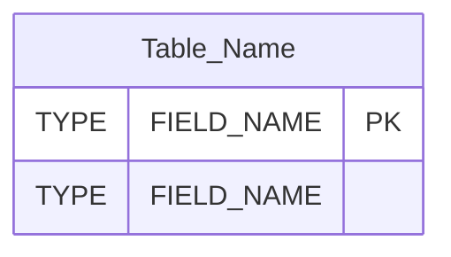

::right::

## Example Diagram

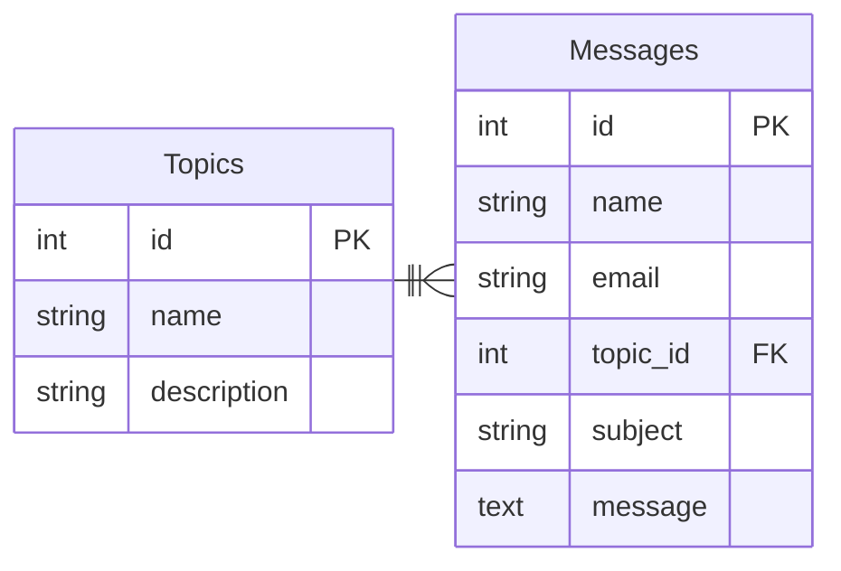

---
level: 2
layout: two-cols
---

# ERD and Common Relationship Types

::left::

## The "Crows Feet" Notation

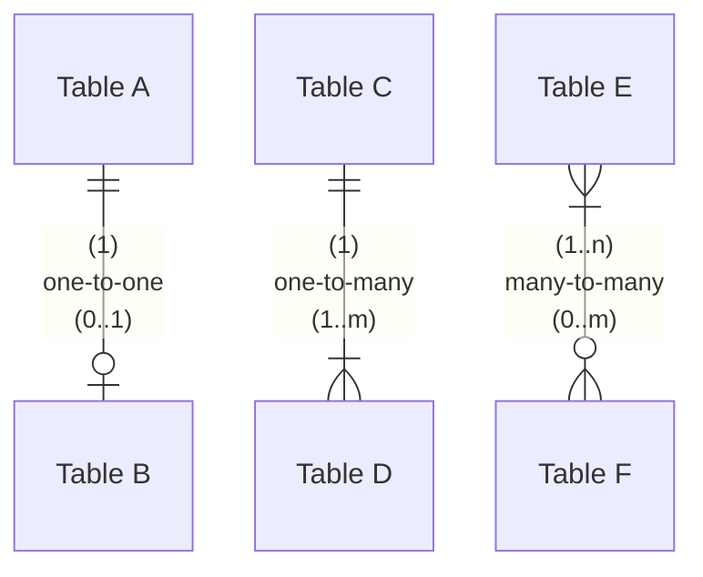


::right::

## Note on ERDs:

ERDs allow:

- representation of tables & relationships
- identification of design issues

<br>

## Diagram Note:

Common relationships:

<div style="font-size: 0.95rem">

- 1:1 one-to-one → rare: merge / used as lookup tables
- 1:M one-to-many → common: use foreign keys
- M:N many-to-many → issue: must be resolved

</div>

<!-- Presenter Notes:

Crows Feet:

- || represents 1..1 (aka one)
- |o represents 0..1 (aka zero or one)
- |{ represents 1..m (aka one or more)
- o{ represents 0..m (aka zero or more)
-->


---
layout: section
---

# 0NF (or UNF)

# Zero -or- Un-normalised Form

---
level: 2
---

## 0NF (UNF) – Zero or  Un-normalised Data

0NF/UNF describes **raw, collected data**:

- Repeating groups
- Multi‑valued fields
- No primary key
- Often copied directly from forms or spreadsheets

This data **cannot** safely support a relational database.

---
level: 2
---

## UNF Example (Books)

| Book Title          | ISBN       | Publisher      | Author 1   | Author 2   | Author 3      |
|---------------------|------------|----------------|------------|------------|---------------|
| The CSS Anthology   | 0957921888 | SitePoint      | Andrew, R. | —          | —             |
| Quality Web Systems | 0201719363 | Addison‑Wesley | Dustin, E. | Rashka, J. | McDiarmid, D. |

### Problems:

- Variable number of authors
- Repeating columns
- Difficult to query and extend

---
level: 2
layout: two-cols
---

## 0NF/UNF – Conceptual ERD

::left::

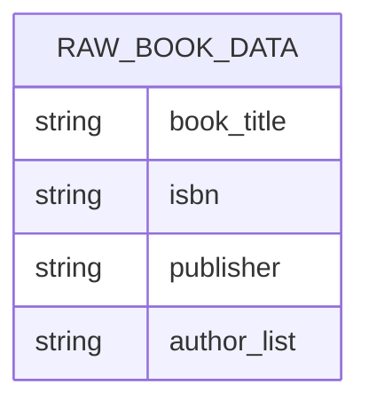

::right::

For dbdiagram.io the DBML is:

```text
Table RAW_BOOK_DATA {
  book_title varchar
  isbn varchar
  publisher varchar
  author_list varchar
}
```

<!--
Presenter Notes:
- 0NF/UNF represents raw, collected data.
- Highlight the multi-valued author_list field as the main design flaw.
- No keys, no relationships, no integrity guarantees.
-->


---
layout: section
---

# 1NF – First Normal Form

---
level: 2
---

# 1NF – Rules

<br>

## A table is in **First Normal Form (1NF)** if:

<div style="font-size: 1.5rem">

1. All fields contain **atomic (indivisible) values**
2. There are **no repeating groups or columns**
3. Each record can be **uniquely identified** (primary key)

</div>

---
level: 2
---

## 1NF Transformation

We remove repeating author columns by creating **multiple rows**.

| book_id | book_title          | ISBN       | publisher      | author_name        |
|--------:|---------------------|------------|----------------|--------------------|
|       1 | The CSS Anthology   | 0957921888 | SitePoint      | Andrew, Rachel     |
|       2 | Quality Web Systems | 0201719363 | Addison‑Wesley | Dustin, Elfriede   |
|       2 | Quality Web Systems | 0201719363 | Addison‑Wesley | Rashka, Jeff       |
|       2 | Quality Web Systems | 0201719363 | Addison‑Wesley | McDiarmid, Douglas |

<Announcement type="info" style="width:100%;">

✅ Repeating groups removed  
❌ Duplication still exists

</Announcement>

---
level: 2
layout: two-cols
---

## 1NF – Atomic Values

::left::

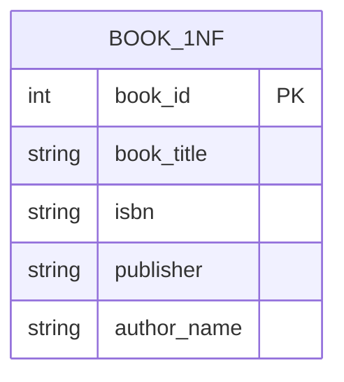

::right::

For dbdiagram.io the DBML is:

```text
Table BOOK_1NF {
  book_id int [pk]
  book_title varchar
  isbn varchar
  publisher varchar
  author_name varchar
}
```

<!-- Presenter Notes:
1NF removes repeating groups by making all values atomic.
Point out that redundancy still exists (publisher repeated per row).
This is progress, but not a finished design.
-->


---
layout: section
---

# 2NF – Second Normal Form

---
level: 2
---

# 2NF – Rules

<br>

## A table is in **Second Normal Form (2NF)** if:

<div style="font-size: 1.5rem">

1. It is already in **1NF**
2. All non‑key fields depend on the **whole primary key**
3. No **partial dependencies** exist

</div>

This usually means splitting data into **new tables**


---
level: 2
---

## 2NF Transformation

We separate **Books** and **Authors**.

### Books

| book_id | book_title          | ISBN       | publisher      |
|--------:|---------------------|------------|----------------|
|       1 | The CSS Anthology   | 0957921888 | SitePoint      |
|       2 | Quality Web Systems | 0201719363 | Addison‑Wesley |

<br>

> Authors on the next page

---
level: 2
---

## 2NF Transformation

### Authors

| author_id | book_id | author_name        |
|----------:|--------:|--------------------|
|         1 |       1 | Andrew, Rachel     |
|         2 |       2 | Dustin, Elfriede   |
|         3 |       2 | Rashka, Jeff       |
|         4 |       2 | McDiarmid, Douglas |

<Announcement type="info" style="width:100%;">

✅ Duplicate book data removed  
✅ Structure easier to maintain

</Announcement>

---
level: 2
layout: two-cols
---

## 2NF – Remove Partial Dependencies

::left::

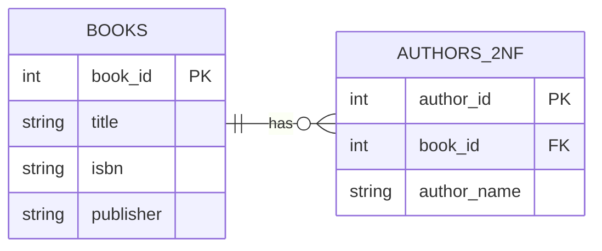

::right::

For dbdiagram.io the DBML is:

```text
Table Books {
  book_id int [pk]
  title varchar
  isbn varchar
  publisher varchar
}

Table Authors_2NF {
  author_id int [pk]
  book_id int [ref: > Books.book_id]
  author_name varchar
}
```

<!-- Presenter Notes:
Explain partial dependency using plain language: book data should not depend on author rows.
This slide is where students usually "get" why multiple tables are necessary.
-->


---
layout: section
---

# 3NF – Third Normal Form

---
level: 2
---

# 3NF – Rules

<br>

## A table is in **Third Normal Form (3NF)** if:

<div style="font-size: 1.5rem">

1. It is already in **2NF**
2. No non‑key attribute depends on another non‑key attribute
3. All fields depend **only on the primary key**

</div>

This removes **transitive dependencies**.

## 3NF – Third Normal Form ✅ (Corrected)

### Purpose

Third Normal Form (3NF) ensures **dependency correctness within a table**.
It focuses on eliminating *transitive dependencies* — **not** relationship cardinality.

### Formal Definition

A table is in **Third Normal Form (3NF)** if:

1. It is already in **Second Normal Form (2NF)**
2. Every non‑key attribute depends on the **primary key**
3. No non‑key attribute depends on another non‑key attribute

> *The key, the whole key, and nothing but the key.*

### What 3NF Fixes

- Removes transitive (non‑key → non‑key) dependencies
- Separates lookup / descriptive data

3NF **does not**:

- Resolve many‑to‑many (M:N) relationships
- Require junction tables

---
level: 2
---

## 3NF Transformation

<p style="margin:0">Publisher data does not depend directly on the book.</p>

### Books

| book_id | book_title          | ISBN       | publisher_id |
|--------:|---------------------|------------|--------------|
|       1 | The CSS Anthology   | 0957921888 | 1            |
|       2 | Quality Web Systems | 0201719363 | 2            |

---
level: 2
---

## 3NF Transformation

### Publishers

| publisher_id | publisher      |
|-------------:|----------------|
|            1 | SitePoint      |
|            2 | Addison‑Wesley |

---
level: 2
---

## 3NF Transformation

### Authors

| author_id | book_id | author_name        |
|----------:|--------:|--------------------|
|         1 |       1 | Andrew, Rachel     |
|         2 |       2 | Dustin, Elfriede   |
|         3 |       2 | Rashka, Jeff       |
|         4 |       2 | McDiarmid, Douglas |

<Announcement type="info" style="width:100%;">

✅ No transitive dependencies  
✅ Data integrity improved  
✅ Ready for relational implementation

</Announcement>


---
level: 2
layout: two-cols
---

## 3NF – Remove Transitive Dependencies

::left::

<div style="width:67%">

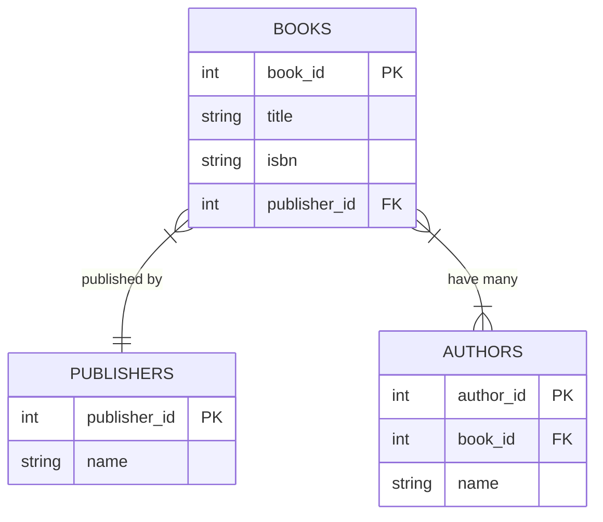

</div>

<Announcement type="info" style="font-size: 0.9rem; margin-top: 1rem;">
Problem? Authors <strong>write many</strong> Books, and Books <strong>have 
many</strong> Authors... 
</Announcement>

::right::

For dbdiagram.io the DBML is:

```text
Table Publishers {
  publisher_id int [pk]
  name varchar
}   

Table Books {
  book_id int [pk]
  title varchar
  isbn varchar
  publisher_id int [ref: > Publishers.publisher_id]
}

Table Authors {
  author_id int [pk]
  name varchar
  book_id int [ref: > Books.book_id]
}
```

<!-- Presenter Notes:
Reinforce the key idea: non-key fields must not depend on other non-key fields.
Publisher details depend on publisher, not directly on book.
Most production systems aim for 3NF.
-->


---
level: 2
layout: two-cols
---

# Summarising steps so far

::left::

### Key Takeaways

- Normalisation is **incremental**
- Each normal form solves specific problems
    - 1NF → structure
    - 2NF → duplication
    - 3NF → dependency correctness

- Most real‑world systems aim for **3NF** or higher for robust design

::right::

### Minimal Normalisation ... Complete

- Less duplication
- Clear relationships
- Reliable data

---
layout: section
---

# Advanced Normalisation

## Boyce-Codd, Fourth and Fifth Normal Forms <br>(BCNF, 4NF & 5NF)

Resolving complex relationships and validating designs


---
level: 2
layout: two-cols
---

# Why Go Beyond 3NF?

::left::

### Most real‑world database designs:

- Aim for **Third Normal Form**
- May fail because **many‑to‑many** relationships have not been resolved
- May hide duplication across tables

::right::

### Advanced normal forms help when:

- Relationships are complex
- Data independence matters
- Analytical correctness is critical


---
level: 2
layout: two-cols
---

# Why 3NF Is Not Always Enough

::left::

### Core Idea

A schema can satisfy **Third Normal Form (3NF)** and still:

- Allow update anomalies
- Contain subtle redundancy
- Break dependency rules in edge cases

::right::

### 3NF guarantees:

- No **transitive dependencies**

<br>

### Does **not** guarantee:

- That *every determinant is a candidate key*

---
level: 2
layout: two-cols
---

# Why 3NF Is Not Always Enough

::left::

### Visual Intuition


::right::

### Functional dependencies

- course → room
- instructor → course

These have:
- No transitive dependency 
  - → <span class="bg-green-500/75 py-1 px-2 rounded"> 3NF satisfied  </span>
- instructor is not a candidate key
  - → <span class="bg-red-500/75 py-1 px-2 rounded"> anomalies still possible </span>

<!-- Presenter Notes:
- Students often believe 3NF is the end of normalisation.
- This slide introduces cognitive dissonance: the table is 'correct' by 3NF rules but still 
flawed.
- Use this moment to motivate BCNF.
-->

---
level: 2
---

# Why 3NF Is Not Always Enough

## Concept Slide – 3NF vs BCNF

### The Key Difference

| Aspect                          | 3NF                            | BCNF                            |
|---------------------------------|--------------------------------|---------------------------------|
| Focus                           | Remove transitive dependencies | Restrict who can determine data |
| Determinant must be key?        | Not always                     | Always                          |
| Handles multiple candidate keys | Sometimes poorly               | Correctly                       |
| Typical use                     | Most production schemas        | Edge cases / validation         |

---
level: 2
layout: two-cols
---

# Why 3NF Is Not Always Enough

::left::

## Rule Comparison

**3NF Rule (Simplified):**

- Non‑key attributes must depend on the key, <br>not on other non‑keys

**BCNF Rule:**

- For every functional dependency X → Y, <br>X must be a candidate key

::right::

## Memory Shortcut

**3NF asks:**
- “Is this value dependent on the primary key?”

**BCNF asks:** 
- “Who is *allowed* to determine this value?”

<!-- Presenter Notes:
- This framing helps students move from mechanical rule checking to reasoning about authority 
and control in data.
- BCNF is about power: who determines what.
-->

---
layout: section
---

# BCNF – Boyce–Codd Normal Form

---
level: 2
---

# BCNF – Boyce–Codd Normal Form 

### Why BCNF Exists

BCNF is a **stronger version of 3NF** used when:

- Multiple candidate keys exist
- Determinants are not superkeys

Some schemas satisfy 3NF but still allow anomalies — BCNF closes that gap.

---
level: 2
---

# BCNF – Boyce–Codd Normal Form

## BCNF Rule

A table is in **Boyce–Codd Normal Form (BCNF)** if:

- For every functional dependency **X → Y**, <br> **X is a candidate key**.

---
level: 2
layout: two-cols
---

# BCNF – Boyce–Codd Normal Form

<br>

## BCNF Edge Case – Before (Violates BCNF)

::left::

### Scenario

A course is taught in **one room**, but an instructor may teach only **one course**.

Functional dependencies:

- course → room
- instructor → course

This satisfies **3NF**, but violates **BCNF**.

::right::


<!-- Presenter Notes:
This table satisfies 3NF because there are no transitive dependencies.
However, instructor determines course, and instructor is not a candidate key.
This allows update anomalies (e.g., changing a room for a course).
-->


---
level: 2
layout: two-cols
---

# BCNF – Boyce–Codd Normal Form

<br>
## BCNF Edge Case – After (BCNF Decomposition)

::left::

### Step 1: Instructor → Course

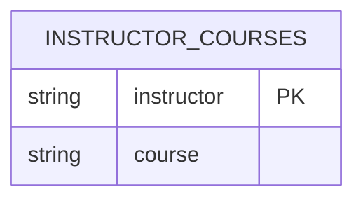

::right::

### Step 2: Course → Room

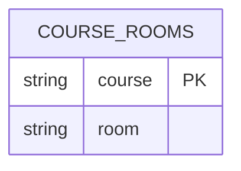

<!-- Presenter Notes:
Each determinant is now a candidate key.
All functional dependencies are enforced without anomalies.
This schema satisfies BCNF.
-->

---
level: 2
---

# BCNF – Boyce–Codd Normal Form

<br>

### BCNF vs 3NF – Visual Summary

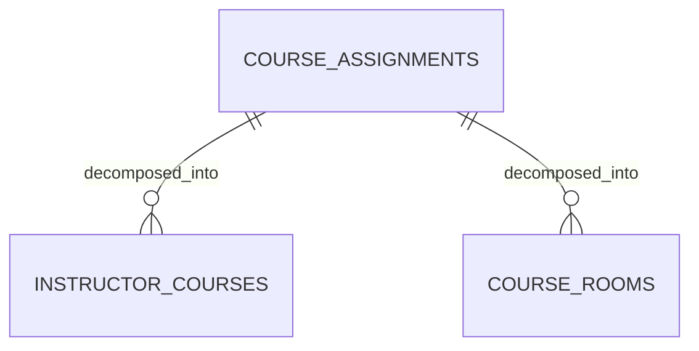

<!-- Presenter Notes:
Use this diagram to emphasise that BCNF often splits tables further than 3NF.
BCNF is applied selectively, not automatically.
-->


---
layout: section
---

# 4NF – Fourth Normal Form

---
level: 2
layout: two-cols
---

# 4NF – Fourth Normal Form

::left::

### Purpose

Fourth Normal Form (4NF) eliminates **multi‑valued dependencies**.

This is where **many‑to‑many relationships** are resolved correctly.

::right::

### Formal Definition

A table is in **Fourth Normal Form (4NF)** if:

1. It is already in **BCNF** <br>(or 3NF in simplified approach)
2. It contains **no multi‑valued dependencies**

---
level: 2
---
# 4NF – Fourth Normal Form
<br>

## 4NF Violation – Before (M:N Stored Together)

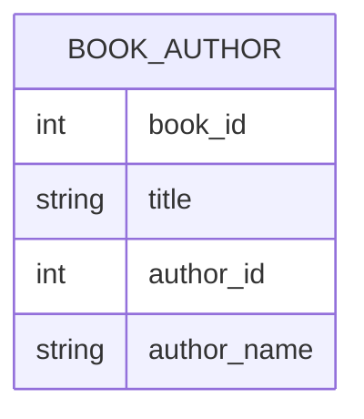

<!-- Presenter Notes:
A book can have many authors and an author can write many books.
Storing both relationships together creates duplication and anomalies.
This violates 4NF.
-->

---

## ✅ 4NF – After (Junction Table Introduced)

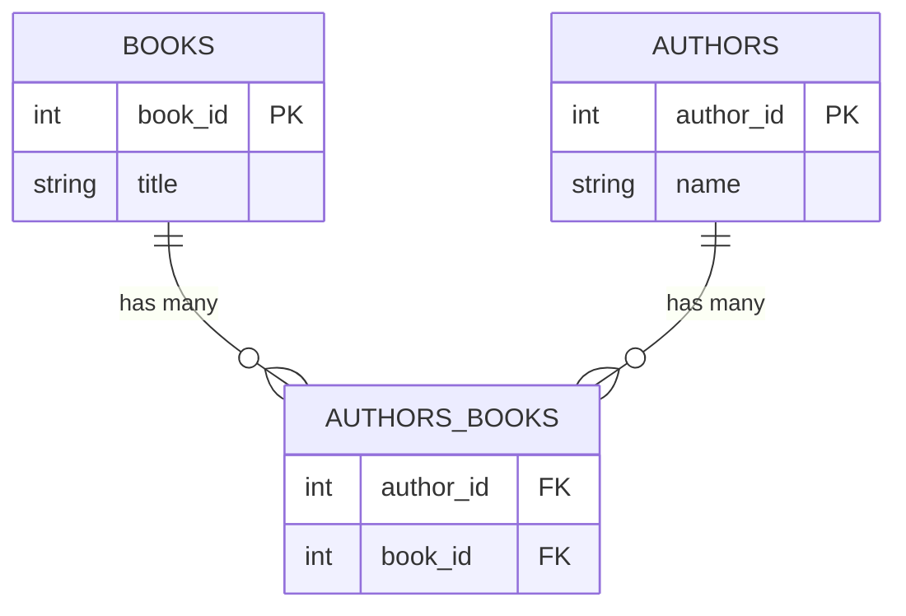

<!-- Presenter Notes:
This junction table resolves the many‑to‑many relationship.
Each independent fact is now stored separately.
The schema satisfies 4NF.
-->

---
level: 2
---

# 4NF Solution – Junction Table

Books and Publishers tables stay the same as before:

### Books

<div style="line-height: 1rem;">

| book_id | book_title          | ISBN       | publisher_id |
|--------:|---------------------|------------|--------------|
|       1 | The CSS Anthology   | 0957921888 | 1            |
|       2 | Quality Web Systems | 0201719363 | 2            |

</div>

### Publishers

<div style="line-height: 1rem;">

| publisher_id | publisher      |
|-------------:|----------------|
|            1 | SitePoint      |
|            2 | Addison‑Wesley |

</div>

---
level: 2
---

# 4NF Solution – Junction Table

Authors no longer has the Book ID, it is moved into an Authors-Books table.

### Authors

| author_id | author_name        |
|----------:|--------------------|
|         1 | Andrew, Rachel     |
|         2 | Dustin, Elfriede   |
|         3 | Rashka, Jeff       |
|         4 | McDiarmid, Douglas |

Authors-Books on next slide


---
level: 2
layout: two-cols
---

# 4NF Solution – Junction Table

::left::

#### Authors - Books (Junction) &dagger;

| author_id | book_id |
|----------:|--------:|
|         1 |       1 |
|         2 |       2 |
|         3 |       2 |
|         4 |       2 |

<br>

<Announcement type="important">
&dagger; Laravel calls this a <strong>pivot table</strong>. <br>Alphabetical order, and 
singular naming convention: <code>author_book</code>.
</Announcement>

::right::

### Details of Junction Table

- Composite primary key
    - `author_id, book_id`

- Both columns are foreign keys
    - `author_id` → Authors
    - `book_id` → Books

- Resolves M:N relationship cleanly with **no** duplication, and **no**
  anomalies

✅ Database now satisfies **4NF**

---
layout: section
---

# 5NF – Fifth Normal Form

---
level: 2
layout: two-cols
---

# 5NF – What It Solves

::left::

## 5NF ensures

<Announcement type="important" style="width: 100%; padding: 1rem;" title="5NF Addresses Problem">
<p>The original data can be <strong class="underline">reconstructed</strong> by joining the 
decomposed tables</p>
</Announcement>

::right::

## It focuses on

- Logical correctness
- Lossless decomposition
- Eliminating join anomalies

5NF is **rare**, but important for theory and validation.


---
level: 2
---

# 5NF – Rule

## A database is in **Fifth Normal Form (5NF)** if:

<div style="font-size: 1.25rem">

1. It is already in **4NF**
2. Every join dependency is implied by candidate keys
3. No information is lost when tables are decomposed

</div>

<br>
<br>

### If you can reconstruct the original data:

- ###  You have met 5NF

---
level: 2
---

# Reconstruction Example

<br>

```sql [SQL]
SELECT b.title,
       p.publisher_name,
       a.author_name
FROM Books b
         JOIN Authors_Books ba ON b.book_id = ba.book_id
         JOIN Authors a ON ba.author_id = a.author_id
         JOIN Publishers p ON b.publisher_id = p.publisher_id;
```

If this query reproduces the original dataset:

- Normalisation is valid
- No data loss occurred

---
layout: section
---

# Practical Considerations

---
level: 2
---

# When to Stop Normalising

## In practice:

- Most systems stop at **3NF**
- 4NF used when M:N relationships exist
- 5NF mainly used for:
    - Validation
    - Highly sensitive systems
    - Academic and analytical correctness

<br>

<Announcement type="important" style="width: 100%; padding: 1rem;" title="Normalisation & Simplicity">
<p>Normalisation trades simplicity for correctness</p>
</Announcement>

---
level: 2
layout: two-cols
---

# Normalisation vs Performance

::left::

## Highly normalised designs:

- Reduce duplication
- Improve integrity
- Increase number of joins
- May increase query execution time

::right::

## Real systems may:

- Start fully normalised
- Add **controlled denormalisation**
- Balance integrity and performance

<br>
<br>

#### Tool, Not Rulebook

Normalisation is a **design tool**, not a rulebook.

---
level: 2
---

# Summarising the advanced steps

## Key Takeaways

- ERDs expose structural problems
- 4NF resolves many‑to‑many relationships
- 5NF validates correctness through reconstruction
- Not all systems need advanced normal forms
- Understanding them improves **design judgement**

---
level: 2
---

# Summarising the advanced steps

## Advanced Normalisation ... Complete

- Structure refined
- Relationships clarified
- Designs made trustworthy

---
layout: section
---

# Normalisation Revision Exercises (0NF/UNF → 5NF)

<!-- Presenter Notes:
These exercises shift students from recognition to transformation.
Encourage drawing rough tables or ERDs before answering.
-->

---
level: 2
---

## Exercise 1 – Identify Normal Form

Given a table with repeating author columns, identify the current normal form
and justify.

<!-- Presenter Notes:
- Expected answer: UNF (or 0NF), because of repeating groups and non-atomic fields.
-->

---
level: 2
---

## Exercise 2 – Convert UNF to 1NF

Rewrite the raw book data so all fields are atomic.

> HINT: think about authors...

<!-- Presenter Notes:
- Look for removal of multi-valued fields and creation of multiple rows.
- Primary key should be introduced.
-->

---
level: 2
---

## Exercise 3 – Convert 1NF to 2NF

Split the data to remove partial dependencies.

<!-- Presenter Notes:
- Students should identify duplicated book data and separate tables accordingly.
-->

---
level: 2
---

## Exercise 4 – Convert 2NF to 3NF

Identify and remove transitive dependencies.

<!-- Presenter Notes:
- Publisher is the classic transitive dependency example.
-->

---
level: 2
---

## Exercise 5 – Resolve M:N for 4NF

Create a junction table for Books ↔ Authors.

<!-- Presenter Notes:
- Expect a composite key made from both foreign keys.
-->

---
level: 2
---

## Exercise 6 – Validate 5NF

Demonstrate how the original data can be reconstructed using JOINs.

<!-- Presenter Notes:
- Any correct JOIN that reconstructs the original dataset demonstrates 5NF.
-->

---
layout: section
---

# ERD Drawing Exercises

<!-- Presenter Notes:
- This is a practical modelling skill check.
- Students often struggle initially; that is expected.
-->

---
level: 2
---

## Exercise – Create an ERD Using Mermaid

Design an ERD for a **student enrolment system** using Mermaid.

Entities:

- Students
- Units
- Enrolments

<!-- Presenter Notes:
- Watch for correct handling of the many-to-many relationship.
-->

---
level: 2
---

## Solution – Mermaid

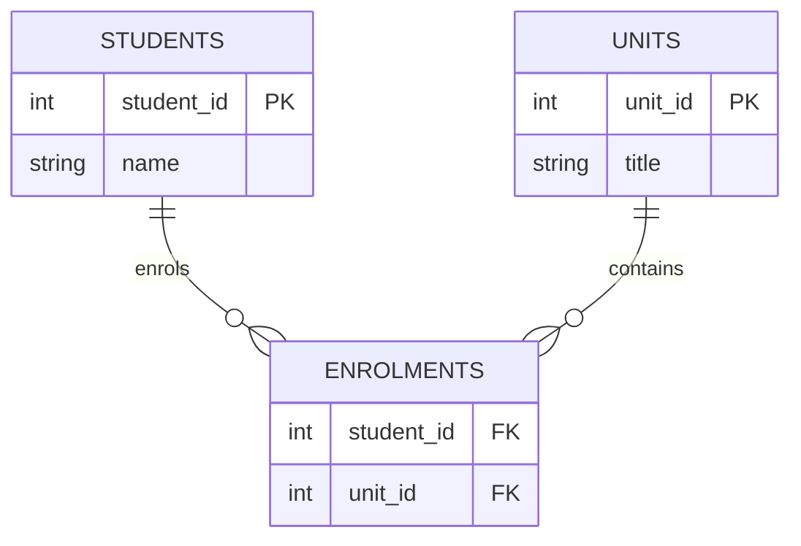

You could use the Laravel alternative for `ENROLMENTS`, which would be `STUDENT_UNIT`.

This would reduce Laravel workload, but make it harder to visualise directly.

<!-- Presenter Notes:
- Explain that ENROLMENTS resolves the many-to-many relationship.
-->

---
level: 2
---

## Solution – dbdiagram

For dbdiagram.io the DBML is:

```text
Table Students {
  student_id int [pk]
  name varchar
}

Table Units {
  unit_id int [pk]
  title varchar
}

Table Enrolments {
  student_id int [ref: > Students.student_id]
  unit_id int [ref: > Units.unit_id]
}
```

<!-- Presenter Notes:
- Point out portability between modelling tools.
-->

---
layout: section
---

# Mapping ERD to SQL DDL

<!-- Presenter Notes:
- This closes the loop from theory to implementation.
-->

---
level: 2
---

```sql
CREATE TABLE Students
(
    student_id INT PRIMARY KEY,
    name       VARCHAR(100)
);

CREATE TABLE Units
(
    unit_id INT PRIMARY KEY,
    title   VARCHAR(100)
);

CREATE TABLE Enrolments
(
    student_id INT,
    unit_id    INT,
    PRIMARY KEY (student_id, unit_id),
    FOREIGN KEY (student_id) REFERENCES Students (student_id),
    FOREIGN KEY (unit_id) REFERENCES Units (unit_id)
);
```

<!-- Presenter Notes:
- Highlight composite primary keys and enforcement of referential integrity.
-->

---
layout: section
---

# Controlled Denormalisation

<!-- Presenter Notes:
- Shift students from "rules" to "trade-offs" thinking.
-->

---
level: 2
---

## When Denormalisation Is Appropriate

Scenario: Reporting dashboard showing **total enrolments per unit** every
second.

- OLTP writes are normalised
- Reporting queries are too slow due to JOINs

Solution:

- Add a cached `enrolment_count` column to Units

<!-- Presenter Notes:
- Stress this is controlled and justified, not random duplication.
-->

---
level: 2
---

## Exercise – Apply Controlled Denormalisation

Modify the Units table to store `enrolment_count`.

<!-- Presenter Notes:
- Discuss how this value would be maintained (triggers, application logic).
-->

---
level: 2
---

## Example SQL

```sql
ALTER TABLE Units
    ADD enrolment_count INT DEFAULT 0;
```

<!-- Presenter Notes:
- Explain the importance of keeping derived data consistent.
-->

---
layout: section
---

# OLTP vs Analytics Normalisation

<!-- Presenter Notes:
- This prepares students for real-world system design discussions.
-->

---
level: 2
---

| Aspect        | OLTP Systems            | Analytics / OLAP   |
|---------------|-------------------------|--------------------|
| Normalisation | Highly normalised (3NF) | Often denormalised |
| Goal          | Data integrity          | Query speed        |
| Queries       | Short, frequent         | Long, aggregations |
| Design        | Update-focused          | Read-focused       |

<!-- Presenter Notes:
- Reinforce that different workloads require different design strategies.
-->

---
level: 2
---

# End of Advanced Normalisation

- Sound structure first.
- Optimise second.

<!-- Presenter Notes:
- Encourage reflection: design is about balance, not dogma.
-->

---
layout: section
---

# Session Checklist!

<!-- Presenter notes:

- Wrap-up: provide a quick checklist of what was covered and then exit tickets as
last slide for reflection/self-assessment.
-->

---
level: 2
---

## Session Checklist

By the end of this session, students should be able to:

- [ ] Describe UNF, 1NF, 2NF, 3NF, 4NF, and 5NF
- [ ] Identify multi‑valued and transitive dependencies
- [ ] Resolve many‑to‑many relationships using junction tables
- [ ] Draw ERDs using Mermaid or dbDiagram notation
- [ ] Map ERDs to CREATE TABLE SQL statements
- [ ] Explain the role of 5NF in validating lossless decomposition
- [ ] Explain why and when denormalisation is intentionally used
- [ ] Distinguish between OLTP and analytics database design goals

---
layout: section
---

# Exit Tickets 🎫

---
level: 2
layout: two-cols
---

## Exit Tickets - Reflection & Self-Assessment

::left::

## Exit Ticket 1

<Announcement type="brainstorm"  style="width: 100%; padding: 1rem;" title="SQL & Data Safety">
<p>
A student claims that Third Normal Form is always sufficient and that higher normal forms are “academic only”.
</p>
<p>
Do you agree or disagree?
</p>
<p>
Justify your answer with one real‑world example.
</p>
</Announcement>


::right::

## Exit Ticket 2

<Announcement type="brainstorm"   style="width: 100%; padding: 1rem;" title="DQL vs DML">
<p>
Explain why a junction table is required to satisfy 4NF in a many‑to‑many relationship.
</p>
<p>
What problems would occur if the junction table were not used?
</p>
</Announcement>


<!-- Presenter notes:
...

-->


---
layout: section
---

# Additional Learning <br>& Further Study

<Announcement type="info"   style="line-height: 1rem; margin-top: 2rem; padding: 1.5rem;          margin-left: 24ch;"   title="Further Study">
<p style="line-height: 1.5rem;">The following resources provide more 
in‑depth information on databases, SQL, and related concepts.</p> 
<p style="line-height: 1.5rem;">They are provided for out of class study 
purposes.</p>
</Announcement>

---
level: 2
---

# Additional Learning & Further Study

## Text / Interactive Resource

GeeksforGeeks. (n.d.). Fourth, Fifth Normal Forms and BCNF.

Clear worked examples and decompositions useful for revision.

- https://www.geeksforgeeks.org/fourth-normal-form-4nf/

## Video Resource

Neso Academy. (n.d.). Boyce‑Codd Normal Form (BCNF), 4NF & 5NF (Video series).

Excellent conceptual explanations with diagrams and step‑by‑step logic.

- https://www.youtube.com/@NesoAcademy

---
level: 2
---

# Additional Learning & Further Study

## Database Design (General)

- Allen, J. (n.d.). *SQLBolt: Learn SQL with interactive
  exercises*.    https://sqlbolt.com

- Mode Analytics. (n.d.). *SQL tutorial*.    https://mode.com/sql-tutorial/

## Normalisation

- MariaDB Foundation. (n.d.). *MariaDB knowledge
  base*.  https://mariadb.com/kb/en/

- MySQL Tutorial Team. (n.d.). *MySQL
  tutorial*.    https://www.mysqltutorial.org/

---
layout: section
---

# Acknowledgements & References

<!-- Presenter notes:
Section: References. Provide reputable sources for further study in APA 7 style.
-->

---
level: 2
---

# References & Acknowledgements

- Laravel. (2026). *The PHP framework for web artisans. Laravel.com*; *
  *Laravel**.    https://laravel.com/

- AlmaBetter. (n.d.). *Normalization in
  DBMS*. https://www.almabetter.com/bytes/articles/normalization-in-dbms

- Connolly, T., & Begg, C. (2015). Database systems: A practical approach to design,
  implementation, and management (6th ed.). Pearson.

- DataCamp. (n.d.). *Normalization in SQL: 1NF to 5NF
  explained*. https://www.datacamp.com/tutorial/normalization-in-sql

---
level: 2
---

# References & Acknowledgements

- Datanamic. (n.d.). *Database normalization
  explained*. https://www.datanamic.com/support/learn/articles/database-normalization.html

- Date, C. J. (2019). An introduction to database systems (8th ed.). Addison‑Wesley.

- DigitalOcean. (n.d.). *Database normalization
  explained*. https://www.digitalocean.com/community/tutorials/database-normalization

- Elmasri, R., & Navathe, S. B. (2016). Fundamentals of database systems (7th ed.). Pearson
  Education.

---
level: 2
---

# References & Acknowledgements

- ISO/IEC. (2016). ISO/IEC 9075‑1:2016 — Information technology — Database languages — SQL —
  Framework. International Organization for Standardization.

- Kinda Technical. (n.d.). *Normalization: 1NF through 5NF with real
  examples*. https://kindatechnical.com/postgresql/normalization-1nf-through-5nf-with-real-examples.html

- Nejati, H. (n.d.). *Understanding database normalization from 1NF to
  5NF*. https://hosseinnejati.medium.com/understanding-database-normalization-from-1nf-to-5nf-

<br>

<Announcement type="info" style="padding: 1rem; margin: 0 2rem;" title="Disclosure - AI Use">
<p>Some content was:</p>
<ul>
<li>collated and generated using references provided to Microsoft CoPilot,</li>
<li>generated with the assistance of Microsoft CoPilot</li>
</ul>
</Announcement>


---
level: 2
layout: end
---

# Fin!

<br><br>

# Spring indexes bud — <br>Design trims the data loss<br>Queries fly away
