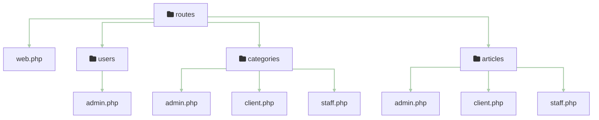
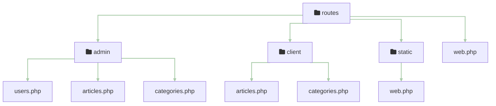
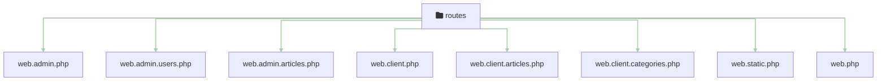

# 2 - Roles & Permissions - Demo

## SaaS 1 – Cloud Application Development (Front-End Dev)

<div @click="$slidev.nav.next" class="mt-12 -mx-4 p-4" hover:bg="white op-10">
<p>Press <kbd>Space</kbd> or <kbd>RIGHT</kbd> for next slide/step <fa-solid-arrow-right /></p>
</div>

<div class="abs-br m-6 text-xl">
  <a href="https://github.com/adygcode/SaaS-FED-Notes" target="_blank" class="slidev-icon-btn">
    <fa-brands-github class="text-zinc-300 text-3xl -mr-2"/>
  </a>
</div>


<!--
The last comment block of each slide will be treated as slide notes. It will be visible and editable in Presenter Mode along with the slide. [Read more in the docs](https://sli.dev/guide/syntax.html#notes)
-->


---
layout: default
level: 2
---

# Navigating Slides

Hover over the bottom-left corner to see the navigation's controls panel.

## Keyboard Shortcuts

|                                                     |                             |
|-----------------------------------------------------|-----------------------------|
| <kbd>right</kbd> / <kbd>space</kbd>                 | next animation or slide     |
| <kbd>left</kbd>  / <kbd>shift</kbd><kbd>space</kbd> | previous animation or slide |
| <kbd>up</kbd>                                       | previous slide              |
| <kbd>down</kbd>                                     | next slide                  |

---
layout: section
---

# Objectives

---
level: 2
layout: two-cols
---

# Objectives

::left::

...

::right::

...


---
level: 2
layout: figure-side
figureUrl: public/orly-book-cover-dashboards.png
---

# Contents

<Toc minDepth="1" maxDepth="1" columns="2" />

---
layout: section
---

# Adding Roles & Permissions

## A demonstration application

---
level: 2
---

# Adding Roles & Permissions

## A demonstration application

This application will:

- Contain "Static" Home page
- Basic Authentication (Login, Register, Logout)
- Basic Admin & Client Dashboards
- An Articles feature with:
    - CRUD operations
    - RBAC/PBAC permissions for each operation
    - A simple UI for managing articles

---
layout: section
---

# Setting up the Application

---
level: 2
---

# Setting up the Application

Use the standard methods to set up the application:

- run the Laravel "new" command
- configure the application (database, environment, etc)
- install & configure Spatie Laravel Permission package
- create Article model, migration, factory, seeder, controller, views, and routes
- create tests for the Article feature

---
level: 2
---

# Setting up the Application

### Create Base Laravel Application

This setup uses the Livewire starter kit to create the application with
Pest, Fortify Authentication, Livewire (with Authentication UI), and Git...

### Commands:

```shell
cd ~/Source/Repos
laravel new l13-roles-permissions --pnpm --pest --git --livewire --no-boost --database=sqlite
cd l13-roles-permissions-demo
composer run dev
```

### Required Responses:

You will be asked a few questions. Responses should be as follows:

- Question: Which Authentication features:
    - Answer: email-verification, registration, password-confirmation

---
level: 2
---

# Setting up the Application

## Adding Font Awesome

For this application wer are using the FontAwesome Free icons.

### Update the `app.css`

Open the `resources\css\app.css` file and add **IMMEDIATELY** after the
Tailwind import and before any other lines, the following line to import
FontAwesome icons:

```css
@import "@fortawesome/fontawesome-free/css/all.css";

```

Install FontAwesome NPM Package using:

```shell
pnpm add @fortawesome/fontawesome-free
pnpm install
php artisan view:clear
```

Example Icons:

<p class="flex gap-4">

<fa-solid-home class="text-zinc-300"/>
<fa-solid-cat class="text-zinc-300"/>
<fa-solid-user class="text-zinc-300"/>
<fa-solid-folder class="text-zinc-300"/>
<fa-solid-dog class="text-zinc-300"/>
<fa-solid-info class="text-zinc-300"/>

</p>


---
level: 2
---

# Setting up the Application

## Roles & Permissions Package Options

- Implement your own
- Use a package such as
    - Spatie Laravel Permission (https://spatie.be/docs/laravel-permission/v5/introduction)
    - Bouncer (https://github.com/JosephSilber/bouncer)
    - Laratrust (https://laratrust.santigarcor.me/)
    - Sentinel (https://cartalyst.com/manual/sentinel/2.x)
    - Jeremy Kenedy's Laravel Roles (https://github.com/jeremykenedy/laravel-roles)
    - and many more


---
level: 2
layout: two-cols
---

# Setting up the Application

## Adding Roles & Permissions - Quick Comparison

::left::

#### Implement your own

Pros

- Full control flexibility
- Tailored business logic
- Minimal external dependencies
- Deep system understanding

Cons

- Longer development time
- Higher maintenance burden
- Increased bug risk
- Scalability challenges arise

::right::

#### Use a package

Pros

- Faster implementation speed
- Community tested reliability
- Built-in feature richness
- Regular security updates

Cons

- Limited customization flexibility
- Package dependency risk
- Possible performance overhead
- Learning curve required

---
level: 2
layout: grid
---

# Setting up the Application

## Adding Roles & Permissions - Quick Comparison

Whilst we will use Spatie's Laravel Permission package for this course, here are a few key differences between some of the packages available.

::tl::

##### Spatie Laravel Permission

<div class="text-xs">

- Widely used package
- Roles permissions via models
- Built-in caching support
- Extensive documentation
- 📦 ~95M downloads / 🔄 Update Apr 29, 2026 

</div>

::bl::

##### Laratrust

<div class="text-xs">

- Roles permissions teams
- Blade directives included
- Seeder helpers available
- Team based access
- 📦 ~5.5M downloads / 🔄 Update May 2026

</div>

::tr::


##### Sentinel

<div class="text-xs">

- Full authentication system
- Role based permissions
- Built-in security features
- Framework agnostic design
- 📦 ~2.6M downloads / 🔄 Update May 2026

</div>

::br::

##### Jeremy Kenedy Laravel Roles

<div class="text-xs">

- Simple roles permissions 
- Middleware protection support 
- Blade helpers included 
- Optional GUI interface 
- ⭐ ~1k stars 

</div>


---
level: 2
---

# Setting up the Application

### Adding Spatie Laravel Permission

- Use composer to add the package
- Use artisan to publish migration, and other files.
- Perform the migration

Execute the following:

```shell
composer require spatie/laravel-permission
php artisan vendor:publish --provider="Spatie\Permission\PermissionServiceProvider"
php artisan migrate
```


---
level: 2
---

# Setting up the Application

### Create Required Folders

```shell
mkdir -p resources/views/{admin,client,static}
mkdir -p app/Http/Controllers/{Admin,Client,Static}

```


---
level: 2
---

# Setting up the Application

## User Model Update

Permission package requires updates to the User model.

Open the `app/Models/User.php` file and add the following:

```php
use Spatie\Permission\Traits\HasRoles;
use Spatie\Permission\Traits\HasPermissions;
```

In the User class modify the class definition to include the `HasRoles` and
`HadPermissions` traits:

```php
class User extends Authenticatable
{
    use HasFactory, Notifiable, HasRoles, HasPermissions;

    // Remainder of model code
}
```

---
level: 2
layout: two-cols
---

# Setting up the Application

## Roles and Permissions Seeder

Execute the following to create a Roles & Permissions plus a User
Seeder.

```shell
php artisan make:seeder RolesAndPermissionsSeeder
php artisan make:seeder UserSeeder
```

Edit the new `database\seeder\RolesAndPermissionsSeeder.php` file, and add the following **Roles** and **Permissions** to the system:

::left::

#### Roles

The Basic Roles:

- super-admin, admin, staff, client

Plus Roles relating to Articles:

- editor, writer, viewer

::right::

#### Permissions

- User Admin: `user-*`
    - add, edit, browse, read, delete
- Article Admin: `article-*`
    - view, add, edit, publish, delete
- Other:
    - client-only, staff-only, admin-only

---
level: 2
---

# Setting up the Application

## Roles and Permissions Seeder

<small>Comments removed for brevity. See the full code in the `database\seeders\RolePermissionSeeder.php` file.</small>

````md magic-move

```php
namespace Database\Seeders;

use Illuminate\Database\Seeder;
use Spatie\Permission\Models\Permission;
use Spatie\Permission\Models\Role;

class RolePermissionSeeder extends Seeder
{
    public function run(): void
    {
```

```php
    // last line of previous block {
    
        $seedRoles = [
            // Roles depend on the application's requirements
            ['name' => 'super-admin'],
            ['name' => 'admin'],
            ['name' => 'staff'],
            ['name' => 'client'],

            ['name' => 'editor'],
            ['name' => 'writer'],
            ['name' => 'viewer'],
        ];
```

```php
        // last line of previous block  ];
         
        $seedPermissions = [
            // Structure of Seeder Lines:
            //    [ 'permission'=>'', 'roles'=> ['',]],
            ['permission' => 'user-add', 'roles' => ['admin', 'staff']],
            ['permission' => 'user-edit', 'roles' => ['admin', 'staff']],
            ['permission' => 'user-browse', 'roles' => ['admin', 'staff']],
            ['permission' => 'user-read', 'roles' => ['admin']],
            ['permission' => 'user-delete', 'roles' => ['admin']],
```

```php
            // last line of previous block  ['permission' => 'user-delete', 'roles' => ['admin']],
            
            ['permission' => 'client-only', 'roles' => ['client']],
            ['permission' => 'staff-only', 'roles' => ['staff']],
            ['permission' => 'admin-only', 'roles' => ['admin']],
```

```php
            // last line of previous block  ['permission' => 'admin-only', 'roles' => ['admin']],
            
            [ 'permission' => 'article-view', 'roles' => ['admin', 'staff', 'editor', 'writer', 'client', 'viewer'], ],
            [ 'permission' => 'article-add', 'roles' => ['admin', 'staff', 'writer'], ],
            [ 'permission' => 'article-edit', 'roles' => ['admin', 'writer', 'editor'], ],
            [ 'permission' => 'article-publish', 'roles' => ['admin', 'staff', 'editor'], ],
            [ 'permission' => 'article-delete', 'roles' => ['admin', 'staff'], ],

        ];
```

```php
        // last line of previous block  ];
        
        // Create the Roles
        foreach ($seedRoles as $newRole) {
            $role = Role::findOrCreate($newRole['name']);
        }
        
        // Create the Permissions and assign to roles
        foreach ($seedPermissions as $seedPermission) {
            $permission = Permission::findOrCreate($seedPermission['permission']);
            $permission->syncRoles($seedPermission['roles']);
        }
    }
}
```

````

---
level: 2
---

# Setting up the Application

## User Seeder

Likewise, we need to add Users to the UserSeeder for demonstration and
testing.

This will create some demo users and add their basic roles and permissions.

````md magic-move

```php
namespace Database\Seeders;

use App\Models\User;
use Illuminate\Database\Seeder;

class UserSeeder extends Seeder
{
    public function run(): void
    {
```

```php
        $seedUsers = [
            [
                'id' => 100,
                'name' => 'Ad Ministrator',
                'email' => 'admin@example.com',
                'password' => bcrypt('Password1'),
                'permissions' => [],
                'roles' => ['admin'],
            ],
            [
                'id' => 200,
                'name' => 'Staff Member',
                'email' => 'staff@example.com',
                'password' => bcrypt('Password1'),
                'permissions' => [],
                'roles' => ['staff'],
            ],
```

```php
            [
                'id' => 1000,
                'name' => 'Client User',
                'email' => 'client@example.com',
                'password' => bcrypt('Password1'),
                'permissions' => [],
                'roles' => ['client'],
            ],
            [
                'id' => 1001,
                'name' => 'Writer User',
                'email' => 'writer@example.com',
                'password' => bcrypt('Password1'),
                'permissions' => [],
                'roles' => ['client', 'writer'],
            ],
```

```php
            [
                'id' => 1002,
                'name' => 'Editor User',
                'email' => 'editor@example.com',
                'password' => bcrypt('Password1'),
                'permissions' => [],
                'roles' => ['staff', 'editor'],
            ],
        ];
```

```php
        foreach ($seedUsers as $seedUser) {
            $permissions = $seedUser['permissions'];
            $roles = $seedUser['roles'];
            unset($seedUser['permissions']);
            unset($seedUser['roles']);

            $user = User::updateOrCreate(['email' => $seedUser['email']], $seedUser);
            $user->permissions()->sync($permissions);
            $user->syncRoles($roles);
        }
    }
}
```

````

---
level: 2
---

# Setting up the Application

## User, Roles and Permissions Seeders

Add the seeder to the Database seeder (`database\seeders\DatabaseSeeder.php`) file:

```php
public function run(): void
{
    $this->call([
        RolePermissionSeeder::class,
        UserSeeder::class,
        // ArticleSeeder::class,
    ]);
}
```

Then run the seeder: `php artisan db:seed`


<Announcement type="info" title="Migrate & Seed the Database">

<p class="bg-black text-red-500 p-1 rounded text-center"><strong>DO NOT DO THIS IN PRODUCTION!</strong></p>

Remember that you may Reset the database, then Migrate and Seed in one go.

```shell
php artisan migrate:fresh --seed
```

</Announcement>


---
layout: section
---

# Client & Admin Dashboards

Built Using:

- HyperUI.dev TailwindCSS components
- Laravel v13+
- TailwindCSS
- PHP 8.4 or later

---
layout: two-cols
level: 2
---

# Client & Admin Dashboards

::left::

### Client Dashboard

- Client Dashboard:
    - Authenticated Users
    - Roles: Admin, Staff, Clients, Writers, Editors
    - Layout similar to main application
    - User's Statistics & Other information

<br>

##### Requires:

- Client Dashboard View (Index)
- Client Dashboard Controller
- Client Dashboard Routes

::right::

### Admin Dashboard

- Admin Dashboard:
    - Authenticated Users
    - Roles: Administrators, Staff
    - Layout Often different from main application
    - System Statistics & Other information

<br>

##### Requires:

- Admin Dashboard View (Index)
- Admin Dashboard Controller
- Admin Dashboard Routes

---
layout: section
---

# Dashboard Controllers

---
level: 2
---

# Dashboard Controllers

We will create the studs for the two dashboards, plus a static page
controller:

```shell
php artisan make:controller Admin/AdminController --resource
php artisan make:controller Client/ClientController --resource
php artisan make:controller Static/StaticController --resource
```

You will edit each of these in turn to add the required methods and logic for each dashboard and static page.

You may open each file and remove the methods for:

- show
- create
- store
- edit
- update
- destroy

Leave the `index` method as this is the method we will use to display the dashboard and static page.

---
level: 2
---

# Dashboard Controllers

## Admin Dashboard Controller

Open the `/app/Http/Controllers/Admin/AdminController.php` file

## Index method

The index method will:

- collect data for display on admin dashboard
- send data to view and request it to be rendered

---
level: 2
---

# Dashboard Controllers

## Admin Dashboard Controller

Start of the `AdminController.php` file:

Include:

- required models,
- other required classes

```php [PHP] {none|1|3|4-5|6-7|all}
namespace App\Http\Controllers\Admin;

use App\Http\Controllers\Controller;
// use App\Models\Article;
use App\Models\User;
use Illuminate\Http\Request;
use Illuminate\View\View;
```

---
level: 2
---

# Dashboard Controllers

## Admin Dashboard Controller

````md magic-move

```php
class AdminController extends Controller
{
    /**
     * Administration Dashboard Controller
     *
     * @return View
     */
    public function index()
    {
        // Data collection
        // Render view
    }
}
```

```php {1-2|1-2,3-6|1-2,8-9|1-2,11-14|all}
    public function index()
    {
        // Data Collection
        //$article_count = Article::count();
        $article_count = 1;
        $contact_count = 1;
        $message_count = 1;
        
        $visitor_count = 1;
        $user_logged_in_count = 1;
        
        $user_count = User::count();
        $user_suspended_count = 0;
        $user_banned_count = 0;
        $user_unverified_count = 0;

        // Render View Code
```

```php {1|1-2|1-2,3-5|1-2,7-8|1-2,10-13|all}
        // Render View Code
        return view('admin.index')
            ->with('article_count', $article_count)
            ->with('contact_count', $contact_count)
            ->with('message_count', $message_count)
            
            ->with('visitor_count', $visitor_count)
            ->with('user_logged_in_count', $user_logged_in_count)
            
            ->with('user_count', $user_count)
            ->with('user_suspended_count', $user_suspended_count)
            ->with('user_banned_count', $user_banned_count)
            ->with('user_unverified_count', $user_unverified_count);
    }
```


````

<Announcement type="info">
Each item you wish to display on the admin dashboard will need to be<br> 'calculated' and passed to the view.
</Announcement>


---
level: 2
---

# Dashboard Controllers

## Client Dashboard Controller

````md magic-move

```php
class ClientController extends Controller
{
    /**
     * Client Dashboard Controller
     *
     * @return View
     */
    public function index()
    {
        // Data collection
        // Render view
    }
}
```

```php {1-2|1-2,3-6|1-2,8-9|1-2,11-14|all}
    public function index()
    {
        // Data Collection

        // Render View Code
        return view('client.dashboard');
    }
```


````

---
level: 2
layout: two-cols
---

# Static Page Controller

::left::

### StaticController

The static page controller will handle the rendering of:

- home
- about
- contact
- and other static pages

::right::

### Sample Code

````md magic-move

```php {none|1-2,14|1-7,14|8-13|all}
class StaticController extends Controller
{
    /**
     * Home Page Method
     *
     * @return View
     */
    public function home()
    {
        return view('static.home');
    }
    
    // About Page Method
}
```

```php {none|1-2,14|1-9,14|10-13|all}
class StaticController extends Controller
{
    // Home Page Method...
    
    /**
     * About Us Page Method
     *
     * @return View
     */
    public function about()
    {
        return view('static.about');
    }
}
```
````

---
level: 2
---

# Routes

You will need to add routes for the admin and client dashboards, and the static pages.

Open the `routes/web.php` file, and replace the current `home` route with the
following routes:

```php {1-2|4-5|7-9|all}
// Admin Dashboard Route
Route::get('/admin', [AdminController::class, 'index'])->name('admin.dashboard');

// Client Dashboard Route
Route::get('/client', [ClientController::class, 'index'])->name('client.dashboard');

// Static Pages Routes
Route::get('/', [StaticController::class, 'home'])->name('static.home');
Route::get('/about', [StaticController::class, 'about'])->name('static.about');

```

<br>

<Announcement type=note>
To bring consistency with route naming, we will add <code>static.</code> in front of the static page route names.
</Announcement>


---
level: 2
---

# Routes

## Route Organisation

Applications can become quite difficult to manage and maintain when the route files become large.

You may wish to consider options such as:

- Place individual route files for each feature in a `routes\FEATURE_NAME` folder 
- Place individual route files for each "role" in separate `routes\ROLE_NAME` folders
- Place individual route files in the `routes` folder but named `web.FEATURE_NAME.php`

These are suggestions only.


---
level: 2
---

# Routes

## Route Organisation Examples

<br>

### Using `routes\FEATURE_NAME` folder



---
level: 2
---

# Routes

## Route Organisation Examples

### Using `routes\ROLE_NAME` folders




---
level: 2
---

# Routes

## Route Organisation Examples

### Using `routes\ROLE_NAME` folders

### Using `web.FEATURE_NAME.php` files




---
layout: section
---

# View Components

---
level: 2
---


# View Components

## Statistics Card Component

You will require the `stats-card` component.

The code for this is found in the `resources\views\components\stats-card.blade.php` file.

Instructions on adding the component to your project and how it is built
are found in the 5-admin-dashboard presentation.

Take a 10-minute break to add the component to your project and understand
how it works.

---
layout: section
---

# Dashboard Views

- Admin Dashboard
- Client Dashboard

---
level: 2
---

# Admin Dashboard: View

## Process (From Scratch)

- start with a blank `resources/views/admin/index.blade.php` file
- use the admin-layout 'control' to indicate the layout
- add the page header slot details
- add the main page body and section headers
- add the statistics card for each item

## Process from sample `index.blade.php`

- Update / Remove items as needed

---
level: 2
---

# Admin Dashboard: View

## Layout & Page Header

```php
<x-admin-layout>
    <x-slot name="header">
        <h2 class="font-semibold text-xl text-white leading-tight">
            {{ __('Administration') }} {{ __("Dashboard") }}
        </h2>
    </x-slot>

    <!-- statistics section -->
    ...
    <!-- users section -->
    ...
    <!-- system section -->
    ...
    
</x-admin-layout>
```


<br>

<Announcement type="info">
The <code>...</code> (ellipsis) is used to show where more code will be added. 
</Announcement>


---
level: 2
---

# Admin Dashboard: View

## Statistic Section

This replaces, or is added after the `<!-- statistics section -->` comment.

````md magic-move

```php
<section class="my-6 mx-12 space-y-4">

        <header>
            <h3 class="text-sm lg:text-2xl font-bold text-zinc-700">
                {{__('Statistics')}}
            </h3>
        </header>

        <div class="grid grid-cols-1 md:grid-cols-2 lg:grid-cols-3 2xl:grid-cols-4 gap-4 ">

            <x-stats-card title="{{ __('Contacts') }}"
                          value="{{ $contact_count }}"
                          bg="bg-rose-700"
                          icon="fa-solid fa-contact-card"
                          icon-color="text-white"/>

            <x-stats-card title="{{ __('Topics') }}"
                          value="{{ $topic_count }}"
                          bg="bg-pink-700"
                          icon="fa-solid fa-tag"
                          icon-color="text-white"/>
            ...
```

```php

            <x-stats-card title="{{ __('Messages') }}"
                          value="{{ $message_count }}"
                          bg="bg-fuchsia-700"
                          icon="fa-solid fa-message"
                          icon-color="text-white"/>


            <div class="col-span-1 md:col-span-3 2xl:col-span-4"></div>

            <x-stats-card title="{{ __('Unique Visitors') }}"
                          value="{{ $visitor_count }}"
                          bg="bg-zinc-700"
                          icon="fa-solid fa-arrow-trend-up"
                          icon-color="text-white"/>

        </div>
    </section>
```
````


---
level: 2
---

# Admin Dashboard: View

## Users Section

This replaces, or is added after the `<!-- users section -->` comment.


````md magic-move


```php
    <section class="my-6 mx-12 space-y-4">

        <header>
            <h3 class="text-sm lg:text-2xl font-bold text-zinc-700">
                {{__('Users')}}
            </h3>
        </header>

        <div class="grid grid-cols-1 md:grid-cols-2 lg:grid-cols-3 2xl:grid-cols-4 gap-4 ">

            <x-stats-card icon="fa-solid fa-person"
                          title="{{ __('Users') }}"
                          value="{{ $user_count }}"
                          bg="bg-purple-700"
                          icon-color="text-white"/>
            ...
```

```php
   
            <x-stats-card icon="fa-solid fa-person-walking"
                          title="{{ __('Signed In') }}"
                          value="{{ $user_logged_in_count }}"
                          bg="bg-green-700"
                          icon-color="text-white"/>

            <div class="col-span-1 2xl:col-span-2"></div>

            <x-stats-card title="{{ __('Suspended') }}"
                          value="{{ $user_suspended_count }}"
                          bg="bg-amber-700"
                          icon="fa-solid fa-person-circle-exclamation"
                          icon-color="text-white"/>
            
            <x-stats-card title="{{ __('Unverified') }}"
                          value="{{ $user_unverified_count }}"
                          bg="bg-orange-700"
                          icon="fa-solid fa-person-circle-question"
                          icon-color="text-white"/>

            ...
```

```php
    
            <x-stats-card title="{{ __('Banned') }}"
                          value="{{ $user_banned_count }}"
                          bg="bg-red-700"
                          icon="fa-solid fa-person-circle-xmark"
                          icon-color="text-white"/>

        </div>

    </section>
```

````

---
level: 2
---

# Admin Dashboard: View

## System Section

This replaces, or is added after the `<!-- system section -->` comment.

````md magic-move

```php
    <section class="my-6 mx-12 space-y-4">

        <header>
            <h3 class="text-sm lg:text-2xl font-bold text-zinc-700">
                {{__('System')}}
            </h3>
        </header>

        <div class="grid grid-cols-1 md:grid-cols-2 lg:grid-cols-3 2xl:grid-cols-4 gap-4 ">

            <x-stats-card icon="fa-solid fa-info-circle"
                          title="{{ __('Version') }}"
                          value="{{ config('app.version', 'development') }}  {{ config('app.codename', '') }}"
                          value-class="text-xl text-zinc-900"
                          bg="bg-slate-700"
                          icon-color="text-white"/>
                          
             ...
```

```php

            <x-stats-card icon="fa-solid fa-square-binary"
                          title="{{ __('Environment') }}"
                          value="{{ config('app.env', 'Unknown') }} {{ config('app.debug',0)?'debug':'' }}"
                          bg="bg-slate-700"
                          icon-color="text-white"/>

            <div class="col-span-1 2xl:col-span-2"></div>

            <x-stats-card icon="fa-brands fa-laravel"
                          title="{{ __('Laravel') }}"
                          value="{{ app()->version() }}"
                          bg="bg-laravel-500"
                          icon-color="text-white"/>

            ...
```

```php
        
            <x-stats-card icon="fa-brands fa-php"
                          title="{{ __('PHP') }}"
                          value="{{ phpversion() }}"
                          bg="bg-php-500"
                          icon-color="text-white"/>

        </div>

    </section>

```

````


---
level: 2
---

# Client Dashboard: View

We will leave the client dashboard as it is.

Simply move the current `dashboard.blade.php` file from the `/resources/views` directory to the
`/resources/views/client` directory.

You may need to update any references to this, e.g. in the `routes/web.php` file, to ensure it is correct.

````md magic-move

```php {all|2}
Route::middleware(['auth', 'verified'])->group(function () {
    Route::view('dashboard', 'client.dashboard')->name('dashboard');
});
```

```php {2|all}
Route::middleware(['auth', 'verified'])->group(function () {
    Route::get('/dashboard', [ClientController::class, 'index'])->name('dashboard');
});
```

````

---
Layout: section
---

# Adding & Using Spatie Permission Package

---
level: 2
---

# Adding & Using Spatie Permission Package

## Quick Overview

- Open Source package for handling roles and permissions in Laravel
  applications
- Provides a simple and flexible way to manage user roles and permissions
- Supports both role-based and permission-based access control
- Integrates well with Laravel's built-in authentication system
- Provides Artisan commands for managing roles and permissions
- Provides middleware for checking permissions in routes and controllers
- Provides blade directives for checking permissions in views

and much more...

---
level: 2
---

# Adding & Using Spatie Permission Package

## Installation

If you have not added it already, then use:

```shell
composer require spatie/laravel-permission
``` 

Once the package is installed, you can publish the migration and config files
using the following command:

```shell
php artisan vendor:publish --provider="Spatie\Permission\PermissionServiceProvider"
``` 

Then run the migrations to create the necessary tables in the database:

```shell
php artisan migrate
```

<Announcement class="mt-6" type="info">
You may publish the required files using an integrated menu:

<code>php artisan vendor:publish</code>

Then select the relevant items from the list.
</Announcement>

---
level: 2
---

# Adding Roles & Permissions

## Installation

Before we can use Spatie's Permissions, we will also need to:

- add middleware to the `bootstrap/app.php` file
- add the `HasRoles` (and `HasPermissions`) traits to the `User` model
- add the required relationships to the `User` model


---
level: 2
---

# Adding Roles & Permissions

## Installation

### Add middleware to `bootstrap/app.php`

Open the bootstrap/app.php file and update it to read:


### Add `HasRoles` (and `HasPermissions`) traits


### Create required relationships


---
level: 2
---

# Adding Roles & Permissions

We already have the 
Once installed we need to:

- Create a seeder which will contain the default roles and permissions for
  the system.
- Create a middleware to check for permissions in the routes and controllers.
- Update the User model to use the HasRoles trait provided by the package.
- Update the routes and controllers to check for permissions using the middleware.
- Update the views to show/hide content based on permissions using the blade directives provided by the package.

---
level: 2
---

# Adding Roles & Permissions

## Creating a Seeder

To create a seeder for the default roles and permissions, run the following command:

```shell
php artisan make:seeder RolesAndPermissionsSeeder
``` 

This will create a new seeder file in the `database/seeders` directory. Open the file and add the following code to
create some default roles and permissions:

```php
use Illuminate\Database\Seeder;
use Spatie\Permission\Models\Permission;
use Spatie\Permission\Models\Role;  

class RolesAndPermissionsSeeder extends Seeder
{
    public function run()
    {
        // Reset cached roles and permissions
        app()[\Spatie\Permission\PermissionRegistrar::class]->forgetCachedPermissions();

        // Create permissions
        $seedRoles = [
            // Roles depend on the application's requirements
            ['name' => 'super-admin'],
            ['name' => 'admin'],
            ['name' => 'staff'],
            ['name' => 'client'],
        ];

        $seedPermissions = [
            //     [ 'permission'=>'', 'roles'=>['']],
            ['permission' => 'user-add', 'roles' => ['admin', 'staff']],
            ['permission' => 'user-edit', 'roles' => ['admin', 'staff']],
            ['permission' => 'user-browse', 'roles' => ['admin', 'staff']],
            ['permission' => 'user-read', 'roles' => ['admin']],
            ['permission' => 'user-delete', 'roles' => ['admin']],

            ['permission' => 'users-count', 'roles' => ['admin', 'staff']],
            ['permission' => 'client-only', 'roles' => ['client']],
            ['permission' => 'staff-only', 'roles' => ['staff']],
            ['permission' => 'admin-only', 'roles' => ['admin']],
        ];

        foreach ($seedRoles as $role) {
            $role = Role::create($role);
        }

        foreach ($seedPermissions as $seedPermission) {
            $newPermission = ['name' => $seedPermission['permission']];
            $permission = Permission::create($newPermission);
            $permission->syncRoles($seedPermission['roles']);
        }
}
```

---
level: 2
---

After creating the seeder, you can run it using the following command:

```shell  
php artisan db:seed --class=RolesAndPermissionsSeeder
```

This seeds teh Roles and Permissions

Next we need to work on the User model and the seeder we have.

The seeder will be updated to apply the roles and permissions we allocate to the users we create.

```php

<?php

namespace Database\Seeders;

use App\Models\User;
use Illuminate\Database\Console\Seeds\WithoutModelEvents;
use Illuminate\Database\Seeder;

class UserSeeder extends Seeder
{
    /**
     * Run the database seeds.
     */
    public function run(): void
    {
        $seedUsers = [
            [
                'id' => 100,
                'name' => 'Ad Ministrator',
                'email' => 'admin@example.com',
                'password' => bcrypt('Password1'),
                'permissions' => [],
                'roles' => ['admin']
            ],
            [
                'id' => 200,
                'name' => 'Staff Member',
                'email' => 'staff@example.com',
                'password' => bcrypt('Password1'),
                'permissions' => [],
                'roles' => ['staff']
            ],
            [
                'id' => 1000,
                'name' => 'Client User',
                'email' => 'client@example.com',
                'password' => bcrypt('Password1'),
                'permissions' => [],
                'roles' => ['client']
            ],
        ];

        foreach ($seedUsers as $seedUser) {
            $permissions = $seedUser['permissions'];
            $roles = $seedUser['roles'];
            unset($seedUser['permissions']);
            unset($seedUser['roles']);

            $user = User::create($seedUser);
            $user->permissions()->sync($permissions);
            $user->syncRoles($roles);
        }
    }
}

```

---
layout: section
---

# Applying Roles & Permissions

---
level: 2
---

# Applying Roles & Permissions

We have a number of methods to apply the roles and permissions.

- Apply to Routes
- Apply to Controllers
- Apply to Views
- Apply to Middleware
- and more...

We will look at:

- Routes
- Controllers
- Views & Blade Templates
- Middleware

---
level: 2
---

## Routes

To apply the middleware to routes, you can add it to the route definition like this:

```php
Route::get('/admin', [AdminController::class, 'index'])
    ->middleware('permission:admin-only');
```

---
level: 2
---

## Middleware

To create a middleware for checking permissions, run the following command:

```shell
php artisan make:middleware PermissionMiddleware
``` 

This will create a new middleware file in the `app/Http/Middleware` directory. Open the file and add the following code
to check for permissions:

```php
namespace App\Http\Middleware;

use Closure;
use Illuminate\Http\Request;
use Illuminate\Support\Facades\Auth;
use Spatie\Permission\Exceptions\UnauthorizedException;

class PermissionMiddleware
{
    public function handle(Request $request, Closure $next, $permission)
    {
        if (!Auth::check()) {
            throw UnauthorizedException::notLoggedIn();
        }

        if (!Auth::user()->can($permission)) {
            throw UnauthorizedException::forPermissions([$permission]);
        }

        return $next($request);
    }
}
```

This middleware checks if the user is authenticated and has the required permission. If not, it throws an
UnauthorizedException.

## Applying the middleware

To apply the middleware to routes, you can add it to the route definition like this:

```php
Route::get('/admin', [AdminController::class, 'index'])
    ->middleware('permission:admin-only');
``` 

This route will only be accessible to users who have the 'admin-only' permission.


---
level: 2
---

# Exit Ticket Questions

TODO: Add exit ticket questions

<Announcement type="brainstorm">
...
</Announcement>

<Announcement type="idea">
...
</Announcement>

---

# Acknowledgements & References

- TODO: Add references etc

> Some content may have been generated with the assistance of Microsoft
> Copilot

---
layout: end
---

# Remember: 🦆

### With Laravel and Pest:

- your code can be clean,
- your tests can be sharp, and...
- according to the rubber duck:
- your sanity can remain… mostly intact.
