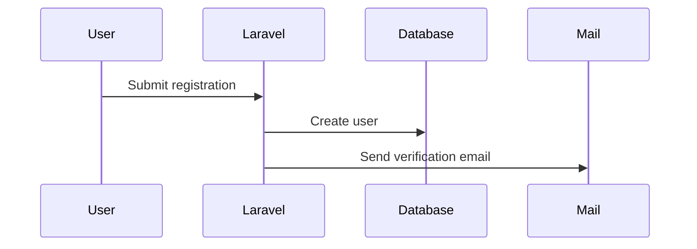
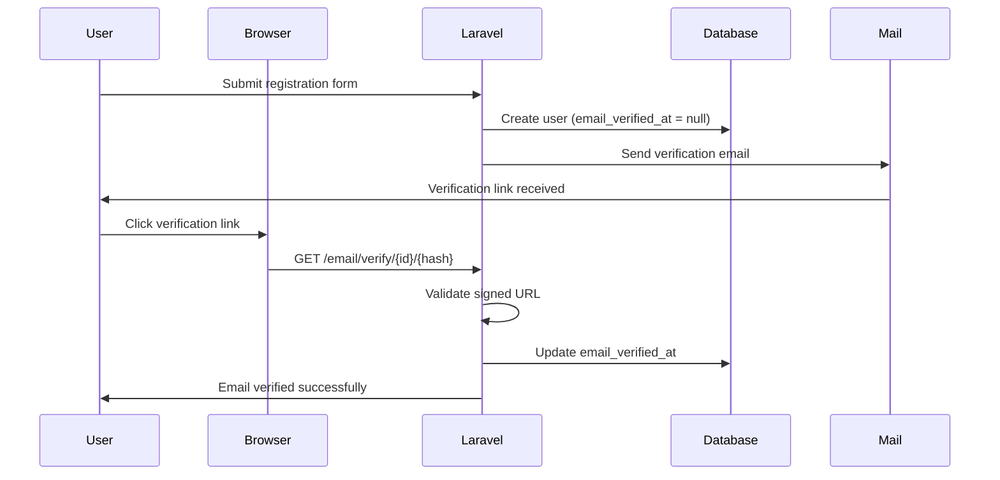
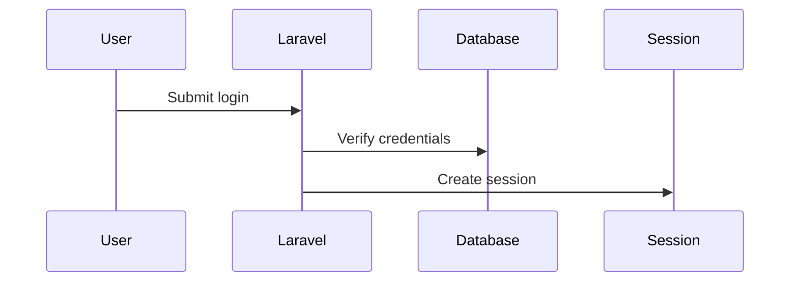
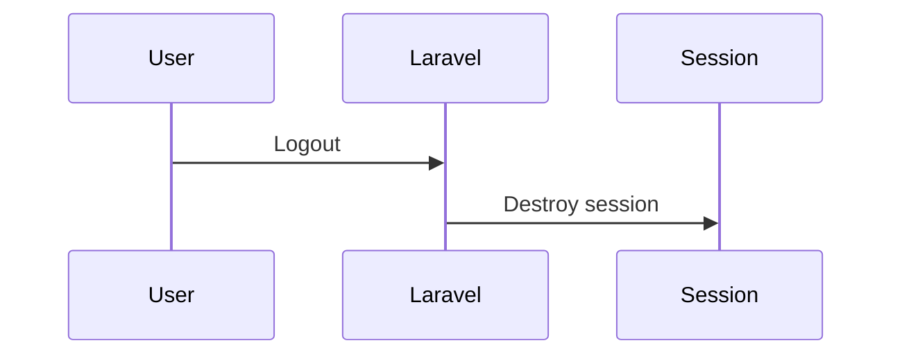

# Authentication & Authorisation Basics

## Session 12

## SaaS 1 – Cloud Application Development (Front-End Dev)

<div @click="$slidev.nav.next" class="mt-12 -mx-4 p-4" hover:bg="white op-10">
<p>Press <kbd>Space</kbd> or <kbd>RIGHT</kbd> for next slide/step <fa-solid-arrow-right /></p>
</div>

<div class="abs-br m-6 text-xl">
  <a href="https://github.com/adygcode/SaaS-FED-Notes" target="_blank" class="slidev-icon-btn">
    <fa-brands-github class="text-zinc-300 text-2xl mr-2"/>
  </a>
</div>


<!-- Presenter Notes:
Introduce scope.

This session is authentication only; authorisation comes next.
-->


---
layout: section
---

# Objectives

---
level: 2
layout: two-cols
---

# Objectives

::left::

## Knowledge

- Understand **Authentication vs Authorisation**
- Understand **Laravel Fortify** and **Laravel Sanctum**
- Understand how Authentication flows work
- Understand Email Verification and Password Confirmation

::right::

## Skills

- Install and configure Laravel Fortify
- Protect routes with authentication
- Enforce authentication in Form Requests
- Test authentication flows using **Pest**

<!-- Presenter Notes:

-->

---
level: 2
---

# Contents

<Toc minDepth="1" maxDepth="1" columns="2"></Toc>

---
layout: figure
figureUrl: orly-book-cover-hoping-nobody-hacks-you.png
---


---
layout: default
level: 2
---

# Navigating Slides

Hover over the bottom-left corner to see the navigation's controls panel.

## Keyboard Shortcuts

|                                                     |                             |
|-----------------------------------------------------|-----------------------------|
| <kbd>right</kbd> / <kbd>space</kbd>                 | next animation or slide     |
| <kbd>left</kbd>  / <kbd>shift</kbd><kbd>space</kbd> | previous animation or slide |
| <kbd>up</kbd>                                       | previous slide              |
| <kbd>down</kbd>                                     | next slide                  |

---
layout: section
---

# 🌟 Ice Breaker

## Where have you logged in today?

- Apps?
- Websites?
- Devices?

<!-- Presenter Notes:

-->

---
layout: section
---

# Authentication and Authorisation

---
level: 2
layout: two-cols
---

# Authentication & Authorisation

## What are they, and a comparison

::left::

## Authentication

- <strong class="text-amber-500">Who are you?</strong>
    - Proves identity
    - Usually involves:
        - Email / username
        - Password
        - Token or session

::right::

## Authorisation

- <strong class="text-amber-500">What are you allowed to do?</strong>
    - Checks permissions
    - Happens after authentication

<!-- Presenter Notes:

-->

---
layout: section
---

# Fortify & Sanctum

- Two of Laravel's Authentication Systems
- Fortify is for web authentication
- Sanctum is for APIs and SPAs

<!-- Presenter Notes:

-->

---
level: 2
---

# What is Laravel Fortify

Laravel Fortify is a backend authentication implementation for Laravel.

It provides:

- Registration
- Login / Logout
- Password reset
- Email verification
- Two‑factor authentication (optional)

Note:

- No UI provided
- Fully configurable

<!-- Presenter Notes:

-->

---
level: 2
---

# What is Laravel Sanctum

Laravel Sanctum provides API authentication using:

- API tokens
- SPA session authentication

Used for:

- Single Page Applications (React, Vue)
- Mobile apps
- External APIs

<br>

In previous Laravel versions (up to v10 inclusive), Sanctum was also
responsible for the Web based authentication.

<!-- Presenter Notes:

-->

---
level: 2
---

# Fortify & Sanctum Quick Side by Side

| Fortify            | Sanctum               |
|--------------------|-----------------------|
| Web authentication | API authentication    |
| Sessions & cookies | Tokens / SPA sessions |
| Login forms        | API calls             |

- Most Laravel web apps use both

---
layout: section
---

# Adding Laravel Fortify

- How to install
- How to configure
- How to publish settings/components/views

<!-- Presenter Notes:

-->

---
level: 2
---

# Adding Laravel Fortify

Laravel Fortify provides backend authentication features for Laravel
applications.

It handles all core authentication actions without forcing a UI, making it
ideal for custom Blade, Tailwind, or frontend-driven designs.

---
level: 2
---

# How to Install, Configure & Implement Laravel Fortify

## Installation

From your Laravel project root, install Fortify using Composer:

```shell
composer require laravel\/fortify
```

Once installed, run the Fortify installer:

```shell
php artisan fortify:install
```

This command performs several important tasks:

- Publishes Fortify configuration
- Registers Fortify service provider
- Creates action classes for authentication logic
- Prepares the application for authentication flows

---
level: 2
---

# How to Install, Configure & Implement Laravel Fortify

## Installation

Finally, run your migrations (if not already done):

```shell
php artisan migrate
```

At this point, Laravel Fortify is installed, but not yet configured.

## Configuring Fortify

Fortify is configured in the file: `config/fortify.php`

This file controls which authentication features are enabled.

---
level: 2
---

# How to Install, Configure & Implement Laravel Fortify

## Configuring Fortify

### Enable Core Features

Open `config/fortify.php` and ensure the following features are enabled:

```php
'features' => [
  Features::registration(),
  Features::resetPasswords(),
  Features::emailVerification(),
],
```

These features provide:

- User registration
- Password reset workflow
- Email verification enforcement

---
level: 2
---

# How to Install, Configure & Implement Laravel Fortify

## Update the User Model

To enable email verification, update the User model.

- Add the `MustVerifyEmail` contract,
- Ensure the User model implements the `MustVerifyEmail` contract

```php {none|1|3|all}
use Illuminate\Contracts\Auth\MustVerifyEmail;

class User extends Authenticatable implements MustVerifyEmail
{
    // ...
}
```

This ensures Laravel automatically requires verified email addresses where
appropriate.


---
level: 2
---

# How to Install, Configure & Implement Laravel Fortify

## Ensure Fortify Is Registered

Fortify should already be registered automatically.

Inside AppServiceProvider (or bootstrap/app.php in Laravel 11+), ensure
providers are loaded correctly, verifying that the Fortify Service
Provider exists:

```php
/FortifyServiceProvider.php
```

---
level: 2
---

# How to Install, Configure & Implement Laravel Fortify

## How to Publish Settings, Components, and Views

Fortify is UI-agnostic by default, meaning it does not publish Blade views
automatically.

The following steps allow you to customise authentication pages.

- Publish Configuration
    - No further action required here unless updating features
- Publish Fortify Views (Optional but Recommended)
    - To customise login, register, and verification views

---
level: 2
---

# How to Install, Configure & Implement Laravel Fortify

## How to Publish Settings, Components, and Views

To publish the Fortify views use:

```shell
artisan vendor:publish --tag=fortify-views
```

This creates `resources/views/auth/`, including templates for:

- Login
- Registration
- Password reset
- Email verification
- Confirm password

<Announcement type="idea">
You are now free to modify these views using Blade + Tailwind CSS.
</Announcement>


---
level: 2
---

# How to Install, Configure & Implement Laravel Fortify

## Enable Custom Views in Fortify

Open `app/Providers/FortifyServiceProvider.php` and ensure view rendering is
enabled:

```php
use Laravel\Fortify\Fortify;

public function boot(): void
{
    Fortify::loginView(fn () => view('auth.login'));
    Fortify::registerView(fn () => view('auth.register'));
}
```

You may also define views for:

- Password reset
- Email verification
- Confirm password

---
level: 2
---

# How to Install, Configure & Implement Laravel Fortify

## Quick Verification Checklist

- Composer package installed
- `fortify:install` executed
- Config enabled (`config/fortify.php`)
- User model implements MustVerifyEmail
- Views published and editable
- Fortify service provider configured

---
level: 2
layout: two-cols
---

# What Fortify Does Not Do

::left::

It is important to understand Fortify’s boundaries:

- Does NOT provide frontend styling
- Does NOT define roles or permissions
- Does NOT replace policies or gates

::right::

Those responsibilities belong to:

- Blade / Tailwind / Frontend framework
- Laravel Authorisation (Policies & Gates)
- Sanctum (API authentication)

---
layout: section
---

# How Fortify Works

<!-- Presenter Notes:

-->

---
level: 2
layout: two-cols-2-1
---

# How Fortify Works

::right::

## Registration Flow

1. User submits registration form
2. Data validated
3. User record created
4. Email verification sent <br> (if enabled)

::left::



---
level: 2
---

# How Fortify Works

## The Process of Email Validation

Email validation (email verification) ensures that a registered user actually
owns the email address they supplied.

Laravel Fortify integrates this process directly into the authentication
lifecycle.

| Step                       | Actions Taken                                                                                                        |
|----------------------------|----------------------------------------------------------------------------------------------------------------------|
| User registers an account  | The user submits the registration form (name, email, password).<br>Laravel validates the input data.                 |
| User record is created     | A new user record is saved to the database.<br>The user is marked as unverified (email_verified_at = null).          |
| Verification email is sent | Laravel automatically sends an email containing:<br>- A signed verification URL<br>- A unique token tied to the user |

---
level: 2
---

# How Fortify Works

## The Process of Email Validation

continued...

| Step                          | Actions Taken                                                                                                  |
|-------------------------------|----------------------------------------------------------------------------------------------------------------|
| User clicks verification link | The link directs the user back to the application.<br>The request includes a signed hash to prevent tampering. |
| Laravel validates the request | The signature and user ID are verified.<br>If valid, Laravel updates the user record.                          |
| Email marked as verified      | The email_verified_at timestamp is set.<br>The user is now considered verified.                                |
| Access to protected features  | Routes or features requiring verified middleware are now accessible.                                           |

<!--
Key Laravel Concepts Involved

- MustVerifyEmail interface on the User model
- auth middleware (authentication)
- verified middleware (email verification)
- Signed URLs for security
- Notification system (email delivery)
-->


---
level: 2
---

# How Fortify Works

## The Process of Email Validation



---
level: 2
---

# How Fortify Works

## Why Email Verification Matters

- Prevents fake or disposable email accounts
- Reduces spam and abuse
- Protects password reset workflows
- Improves application security

---
level: 2
---

# How Fortify Works

## Common Middleware Usage

```php {none|1|all}
Route::middleware(['auth', 'verified'])->group(function () {
    Route::get('/dashboard', fn () => view('dashboard'));
});
```

<Announcement type=info title="auth/verified" class="mt-8">

In the list/array `['auth', 'verified']` ...

- auth &rarr; user must be logged in
- verified &rarr; user must have a verified email address

</Announcement>

---
level: 2
---

# How Fortify Works

## Failure Scenarios to Consider

- User never clicks verification email
- Verification link expires
- Verification link is modified or tampered with
- User attempts access without verification

These scenarios are ideal for Pest test cases and will be covered in testing
sections.


---
level: 2
---

# How Fortify Works

## Summary

- Email verification is automatic once Fortify is configured
- Verification status is stored in the database
- Access can be enforced using middleware
- Security relies on signed URLs and timestamps

---
level: 2
layout: two-cols-2-1
---

# How Fortify Works

## Login Flow

::right::

### Process...

- User submits credentials
- Credentials validated
- Session created
- User authenticated

::left::



---
level: 2
layout: two-cols-2-1
---

# How Fortify Works

## Logout Flow

::right::

### Process...

- User logs out
- Session destroyed
- User unauthenticated

::left::



<!-- Presenter Notes:

-->

---
layout: section
---

# Using Fortify in Laravel Application

<!-- Presenter Notes:

-->

---
level: 2
---

# Using Fortify in Laravel Application

- Installation and Configuration provided earlier

<!-- Presenter Notes:

-->

---
level: 2
---

# Using authentication in routes

```php
Route::middleware('auth')->group(function () {
    Route::get('/dashboard', fn () => view('dashboard'));
});
```

- Only authenticated users can access

<!-- Presenter Notes:

-->

---
level: 2
---

# Authentication in Store, Update Requests

```php
public function authorize(): bool
{
    return auth()->check();
}
```

- Protects business logic
- Works even if routes are misconfigured

<!-- Presenter Notes:

-->

---
level: 2
---

# Enabling & Configuring Email Verification

- Ensures user owns the email address
- Prevents fake account abuse
- Enabled in Laravel by implementing MustVerifyEmail

<!-- Presenter Notes:

-->

---
layout: section
level: 2
---

# Testing Email Verification using Mailpit

<!-- Presenter Notes:
# Testing Email Verification using Mailpit

This section demonstrates how to safely and visually test email verification
**without sending real emails**.

Mailpit acts as a local email inbox for development and testing.

-->

---
level: 2
layout: two-cols
---

# Testing Email Verification using Mailpit

::left::

## Why Use Mailpit?

- Local email testing tool
- Captures outgoing emails
- No real emails are sent
- Perfect for development and automated testing

::right::

## Benefits...

✅ Safe
✅ Fast
✅ Visual

---
level: 2
---

# Testing Email Verification using Mailpit

## Installing Mailpit

| Option             | Notes                                             |
|--------------------|---------------------------------------------------|
| Local Installation | Does not rely on WSL/Docker/et al                 |
| Docker             | Self contained                                    |
| Laragon            | Windows Only, Laragon v8 has Mailpit as an option |

<Announcement type=info title="Installation instructions">

Please refer to the Axllent Mailpit Docs: https://mailpit.axllent.
org/docs/install/

</Announcement>


---
level: 2
layout: two-cols
---

# Testing Email Verification using Mailpit

## Using Mailpit

| Exposed Service | Address:Port          |
|-----------------|-----------------------|
| SMTP Server     | localhost:1025        |
| Web UI          | http://localhost:8025 |

::left::

### Configure Laravel to Use Mailpit

Update your `.env` file.

When testing only change:

- `MAIL_MAILER`, `MAIL_HOST`, `MAIL_PORT`, `MAIL_FROM_ADDRESS`

External mail providers - check their details.

::right::

### Example settings

```ini {none|1|2|3|7|all}
MAIL_MAILER = smtp
MAIL_HOST = 127.0.0.1
MAIL_PORT = 1025
MAIL_USERNAME = null
MAIL_PASSWORD = null
MAIL_ENCRYPTION = null
MAIL_FROM_ADDRESS = "noreply@example.com"
MAIL_FROM_NAME = "${APP_NAME}"
```

---
level: 2
---

# Testing Email Verification using Mailpit

## Triggering the Verification Email

- Register a new user
- Laravel automatically sends a verification email
- Mailpit captures the email instantly

✅ No extra code required


---
level: 2
layout: two-cols
---

# Testing Email Verification using Mailpit

::left::

## Viewing the Verification Email

Open Mailpit in your browser: http://localhost:8025

Select the latest email

Inspect:

- Recipient
- Subject
- Verification link

::right::

## Verifying the Email Address

Click the verification link in Mailpit

Laravel validates:

- Signed URL
- User ID

When successful:

- email_verified_at is updated
- User is redirected to the intended page

✅ Email successfully verified

---
level: 2
layout: grid
---

# Testing Email Verification using Mailpit

## Common Issues & Troubleshooting

::tl::

### No email received?

- Check Mailpit is running
- Confirm .env MAIL settings

::tr::

### Verification link expired?

- Request new verification email

::bl::

### Access denied?

- Ensure verified middleware is applied correctly

---
level: 2
layout: two-cols
---

# Testing Email Verification using Mailpit

<br>

## Useful Routes for Testing

Use the dashboard to test authentication:

- e.g. http://localhost:8000/dashboard

```php
Route::middleware(['auth', 'verified'])
    ->get('/dashboard', function () {
        return view('dashboard');
    });
```

::left::

### When testing the routes...

Try accessing "client dashboard":

- before email verification
- after email verification

::right::

### Why This Matters for Testing

- Prevents fake accounts
- Verifies email-based workflows
- Enables full end-to-end authentication testing
- Required for reliable Pest feature tests

Mailpit ensures this can all be done locally and safely.


---
level: 2
layout: two-cols
---

# Confirm Password: Adding extra protection

Accomplish this by password re-confirmation.

::left::

### Protect:

- sensitive areas of site
- sensitive actions/features

::right::

### For example:

- Changing email
- Deleting account
- Protecting the Admin Dashboard and other Admin routes.

---
level: 2
layout: two-cols
---

# Confirm Password: Adding extra protection

<br>

## Example:

- protecting the admin dashboard
- require re-enter current user password

::left::

### Protect Admin dashboard

|             |               |
|-------------|---------------|
| Endpoint:   | `/admin`      |
| Route Name: | `admin.index` |

::right::

### Example Code

```php
Route::get('/admin', fn () => view('admin'))
    ->middleware([ 'auth', 'password.confirm' ])
    ->name('admin.index');
```

<!-- Presenter Notes:

-->


---
layout: section
---

# Authentication Pest Testing

Testing register, login, logout, and other actions.

<!-- Presenter Notes:

This section introduces automated testing for authentication.

Emphasize authentication is critical infrastructure and MUST be tested.

These are feature tests that simulate real user behaviour.

-->

---
level: 2
layout: two-cols
---

# Authentication Pest Testing

::left::

### We test:

- Register success & failure
- Login success & failure
- Logout behaviour
- Email verification

::right::

### Why:

- Confidence
- Prevent regressions
- Catch security flaws early
- Prove expected behaviour

<!-- Presenter Notes:

Reinforce: authentication bugs are security bugs.
Testing ensures our assumptions about access control are correct.

-->


---
level: 2
---

# Authentication Pest Testing

## Register success

```php
it('allows a user to register successfully', function () {

    $response = $this->post('/register', [
        'name' => 'Test User',
        'email' => 'pest.test@example.com',
        'password' => 'password',
        'password_confirmation' => 'password',
    ]);

    $response->assertRedirect('/email/verify');

    $this->assertDatabaseHas('users', [
        'email' => 'pest.test@example.com',
    ]);

});
```

---
level: 2
---

# Authentication Pest Testing

## Register failure

```php
it('fails registration when email is missing', function ()
{
    $response = $this->post('/register', [
        'name' => 'Test User',
        'password' => 'password',
        'password_confirmation' => 'password',
    ]);

    $response->assertSessionHasErrors('email');
});

```

---
level: 2
---

# Authentication Pest Testing

## Verify email success

```php
it('verifies a users email address', function () {
    $user = User::factory()->unverified()->create();

    $verifyUrl = URL::temporarySignedRoute(
        'verification.verify',
        now()->addMinutes(60),
        [
            'id' => $user->id,
            'hash' => sha1($user->email)
        ]
    );

    $this->actingAs($user)->get($verifyUrl);

    expect($user->fresh()->hasVerifiedEmail())->toBeTrue();
});
```

---
level: 2
---

# Authentication Pest Testing

## Verify email failure

```php
it('rejects an invalid verification link', function () {

    $user = User::factory()
                ->unverified()
                ->create();

    $invalidUrl = route('verification.verify', [
                            'id' => $user->id,
                            'hash' => 'invalid-hash',
                  ]);
               
    $this->actingAs($user)
        ->get($invalidUrl)
        ->assertStatus(403);
});
```

---
level: 2
---

# Authentication Pest Testing

## Login success

```php
it('allows a verified user to login', function () {

    $user = User::factory()->create([
        'password' => bcrypt('password'),
        'email_verified_at' => now(),
    ]);

    $response = $this->post('/login', [
        'email' => $user->email,
        'password' => 'password',
    ]);

    $response->assertRedirect('/dashboard');

    $this->assertAuthenticatedAs($user);
});
```

---
level: 2
---

# Authentication Pest Testing

## Login failure (wrong email address)

```php
it('fails login with incorrect email', function () {

    $user = User::factory()->create([
        'password' => bcrypt('password'),
    ]);

    $response = $this->post('/login', [
        'email' => 'wrong@example.com',
        'password' => 'password',
    ]);

    $response->assertSessionHasErrors();

    $this->assertGuest();
});
```

---
level: 2
---

# Authentication Pest Testing

## Login failure (password)

```php
it('fails login with incorrect password', function () {

    $user = User::factory()->create([
        'password' => bcrypt('password'),
    ]);

    $response = $this->post('/login', [
        'email' => $user->email,
        'password' => 'wrong-password',
    ]);

    $response->assertSessionHasErrors();
    $this->assertGuest();
});
```

---
level: 2
---

# Authentication Pest Testing

## Logout success (authenticated)

```php
it('logs out an authenticated user', function () {   
 
    $user = User::factory()->create();    
    
    $this->actingAs($user)        
         ->post('/logout')        
         ->assertRedirect('/');
             
    $this->assertGuest();
});
```

---
level: 2
---

# Authentication Pest Testing

## Logout failure (not authenticated)

```php
it('prevents logout when not authenticated', function () {    

    $this->post('/logout')        
         ->assertRedirect('/login');
         
});
```

---
layout: section
---

# Demo

Adding a "Topics" CRUD with Authentication

<!-- Presenter Notes:

-->

---
level: 2
layout: two-cols
---

# Adding a "Topics" CRUD with Authentication

<br>

## General Overview

With the Contacts Application, we are providing a "Contact Us" page.

::left::

### Contact Us Page:

- Details how to contact the company
- A contact us form to send messages

<br>

### Contact Us Form:

- Name, Topic, Subject, and Message fields

::right::

### Topics:

- A topic is a general subject for the form
- We are providing CRUD/BREAD to manage the topics
- Topic CRUD will be part of the Admin area

---
level: 2
---

# Topic Overview

<br>

### Topic Model Detail

| Property    | Specifications                       |    |
|-------------|--------------------------------------|----|
| id          | unsigned, big integer, autoincrement | PK |
| name        | string, unique, min: 6, max: 32      |    |
| description | string, nullable                     |    |
| available   | boolean, default true                |    |
| created_at  | timestamp                            |    |
| updated_at  | timestamp                            |    |

---
level: 2
---

# Adding a "Topics" CRUD with Authentication

## Create Stub Files

```shell
php artisan make:model Topic --controller --migration --policy --seed --resource --factory --pest --request
```

<Announcement type="warning">Lots of typing. Easy to make
mistakes.</Announcement>

or shorthand:

```shell
php artisan make:model Topic --all --pest
```

<Announcement type="joke">Much Neater!</Announcement>

<br>

## Create Subfolders

```shell
mkdir -p app/Http/{Controllers,Requests}/{Admin,Web,Client}
```

<br>

## Create `.gitignore` files

```shell
touch app/Http/{Controllers,Requests}/{Admin,Client,Web}/.gitignore
```

---
level: 2
---

# Adding a "Topics" CRUD with Authentication

## Organise Newly Added  Files

Move the Topic Controller and Requests into the sub-folders.

```shell
mv app/Http/Controllers/TopicController.php app/Http/Controllers/Admin/TopicController.php

mv app/Http/Requests/{StoreTopicRequest.php,UpdateTopicRequest.php} app/Http/Requests/Admin
```

<br>
<br>

<Announcement type=info title="Bash Shortcuts">
<p>Note the use of the `{ }` in the commands.</p>
<p>This provides a list of items that will be iterated.</p>
<p>Helps reduce number of commands entered.</p>
</Announcement>

---
level: 2
---

# Adding a "Topics" CRUD with Authentication

## Add Model code

We will employ the use of PHP Attributes for defining our properties:

- `#[Fillable([...])]` for visible/serialisable properties
- `#[Hidden([...])]` for hidden/non-serialisable properties

<br>

<Announcement type=info title="Eloquent PHP Attributes">

We need to import the following for Eloquent to pick these up correctly:

<pre><code>
use Illuminate\Database\Eloquent\Attributes\Fillable;
use Illuminate\Database\Eloquent\Attributes\Hidden;
</code></pre>

</Announcement>

---
level: 2
---

# Adding a "Topics" CRUD with Authentication

## Add Model code

```php {none|1|2-3,22|4-5|6-14|15-21|all}
#[Fillable(['name', 'description', 'available'])]
class Topic extends Model
{
    /** @use HasFactory<\Database\Factories\TopicFactory> */
     use HasFactory;
     
    /**
     * Attribute (type) casting
     */
    protected function casts(): array{
        return [];
    }

    /**
     * Relationships
     */

    /**
     * Model helper methods
     */
}
```

---
level: 2
---

# Adding a "Topics" CRUD with Authentication

## Add Migration code

Open `database/migrations/YYYY_MM_DD_HHMMSS_create_topics_table.php`

Update the 'up' method:

```php {none|1-2,10|3,9|4|5|6|7|8|all}
public function up(): void
{
    Schema::create('topics', function (Blueprint $table) {
        $table->id();
        $table->string('name',16)->unique()->default("general");
        $table->string('description')->nullable();
        $table->boolean('available')->default(true);
        $table->timestamps();
    });
}
```

---
level: 2
---

# Adding a "Topics" CRUD with Authentication

## Seed Data

We are going to add seed data.

Topic #1 is a default "Unknown / General Query" topic

| ID | Name    | Description                    | Available                             |
|----|---------|--------------------------------|---------------------------------------|
| 1  | General | Genweral query / Unknown topic | <span class="text-green-500">Y</span> |

Open the `database/seeders/TopicSeeder.php` file...

---
level: 2
---

# Adding a "Topics" CRUD with Authentication

## Add Seeder code

We will show each block of the seeder code.

````md magic-move

```php {1-2,14|4-6|8-12|all}
public function run(): void
{

    $seedTopics = [
        // Seed topics added here
    ];

    foreach($seedTopics as $seedTopic){
        if (! Topic::find($seedTopic['name'])) {
            Topic::create($seedTopic);
        }
    }

}
```

```php {4,11-12|5-10|all}
public function run(): void
{

    $seedTopics = [
        [
            'id'=>1,
            'name' => 'general',
            'description' => 'General Query / Unknown Topic',
            'available' => true,
        ],
        // Three more seed topics
    ];

    foreach($seedTopics as $seedTopic){
        if (! Topic::find($seedTopic['name'])) {
            Topic::create($seedTopic);
        }
    }

}
```

```php {4,12-13|5-11|all}
public function run(): void
{

    $seedTopics = [
        // Topic 1 [ 'id'=>1, ...],
        [
            'id'=>100,
            'name' => 'website errors',
            'description' => 'Website errors',
            'available' => true,
        ],
        // Two more seed topics
    ];

    foreach($seedTopics as $seedTopic){
        if (! Topic::find($seedTopic['name'])) {
            Topic::create($seedTopic);
        }
    }

}
```

```php {4,12-13|4-6,12-13|7-11|all}
public function run(): void
{

    $seedTopics = [
        // Topic 1 [ 'id'=>1, ...],
        // Topic 100 [ 'id'=>100, ...],
        [
            'name' => 'website oopsie',
            'description' => 'Website errors',
            'available' => false,
        ],
        // One more seed topic
    ];

    foreach($seedTopics as $seedTopic){
        if (! Topic::find($seedTopic['name'])) {
            Topic::create($seedTopic);
        }
    }

}
```

```php {4-7,13|8-12|all}
public function run(): void
{

    $seedTopics = [
        // Topic 1 [ 'id'=>1, ...],
        // Topic 100 [ 'id'=>100, ...],
        // Topic 101 [ 'name'=>'feedback', ...],
        [
            'name' => 'feedback',
            'description' => 'Client feedback (positive and negative)',
            'available' => true,
        ],
    ];

    foreach($seedTopics as $seedTopic){
        if (! Topic::find($seedTopic['name'])) {
            Topic::create($seedTopic);
        }
    }

}
```


````

---
level: 2
---

# Exercise: add more seed topics

Add the following seed topics to the seeder:

| ID  | Name        | Description                      | Available                             |
|-----|-------------|----------------------------------|---------------------------------------|
| 300 | Books       | Fiction & Non Fiction            | <span class="text-green-500">Y</span> |
| 199 | Dummy Topic |                                  | <span class="text-red-500">N</span>   |
| 200 | Technology  | Information & Other Technologies | <span class="text-green-500">Y</span> |
| 900 | Dummy Topic |                                  | <span class="text-red-500">N</span>   |

Make sure you keep the above order in the seed data.

---
level: 2
---

# Adding a "Topics" CRUD with Authentication

## Add Factory code

Open the `database/factories/TopicFactory.php` file...

Edit the file - the code is show in stages.

````md magic-move

```php {none|1-4|5-11|all}
namespace Database\Factories;

use App\Models\Topic;
use Illuminate\Database\Eloquent\Factories\Factory;

/**
 * @extends Factory<Topic>
 */
class TopicFactory extends Factory
{
    public function definition(): array
    {
        // Code to add here
    }
}

```

```php {1-2,8|3,7|4|5|6|all}
    public function definition(): array
    {
        return [
                'name' => fake()->word(),
                'description' => fake()->sentence(),
                'available' => fake()->boolean(0.5),
            ];
    }
```

````

---
level: 2
---

# Adding a "Topics" CRUD with Authentication

## Add Routing for Topics

Open the `routes\web.admin.php` (or `routes\web\admin.php`) file.

The top of the file indicates the controllers being used.

Add:

- Admin and Topic Controllers:
- Route middleware, name and prefixing
- Define the topics as a resourceful route

#### Code:

````md magic-move
```php
use App\Http\Controllers\Admin\AdminController;
use App\Http\Controllers\Admin\TopicController;
use Illuminate\Support\Facades\Route;
```

```php
Route::middleware(['auth', 'verified'])
    ->prefix('admin')
    ->name('admin.')
    ->group(function () {

    // Add Routes

    });

```

```php
    ->group(function () {

        // URL base: http://HOSTNAME/admin/topics
        // Route Names: admin.topics.*
        Route::resource('topics', TopicController::class);

        Route::get('/', [AdminController::class, 'index'])
            ->name('index');
    });
```

````

---
level: 2
---

# Adding a "Topics" CRUD with Authentication

## Add Resourceful controller code

We will now create the TopicController code for each method:

- index
- show
- create
- store
- edit
- update
- destroy

---
level: 2
---

# Adding a "Topics" CRUD with Authentication

## Resourceful Controller Code: `index`

- Obtain the topics sorted by name
- Add any messages that may be sent to the UI
- paginate (3 topics at a time for testing)

<br>

```php
public function index()
{
    $topics = Topic::orderBy('name')
        ->with('messages')
        ->paginate(3);

    return view('admin.topics.index')
        ->with('topics', $topics);
}
```

---
level: 2
---

# Adding a "Topics" CRUD with Authentication

## Resourceful Controller Code: `show`

```php
    public function show(Topic $topic)
    {
        return view('admin.topics.show')
            ->with('topic', $topic)
            ->with('messages');
    }
```

---
level: 2
---

# Adding a "Topics" CRUD with Authentication

## Resourceful Controller Code: `create`

```php
    public function create()
    {
        return view('admin.topics.create');
    }
```

---
level: 2
layout: two-cols
---

# Adding a "Topics" CRUD with Authentication

## Resourceful Controller Code: `store`

<br>

```php
    public function store(StoreTopicRequest $request)
    {
        $validated = $request->validated();

        Topic::create($validated);

        return redirect(route('admin.topics.index'))
            ->with('status', 'Topic Created');
    }
```

::left::

### The `store` method

- accepts the request sent from the form (via the appropriate route)
- directs the request to the `StoreTopicRequest` class

::right::

### When the `StoreTopicRequest` returns

- validated data is obtained
- new topic is added
- user is redirected to the index for topics

But what is the `StoreTopicRequest`?


---
level: 2
layout: grid
---

# Adding a "Topics" CRUD with Authentication

### Add Validation for Store Request

A Store/Update MODEL_NAME Request may perform:

::tl::

#### authorisation checks

```php
public function authorize(): bool
{ /* ... */ }
```

::tr::

#### validation & custom messages

```php
public function rules(): array
{ /* ... */ }

public function messages(): array
{ /* ... */ }
```

::bl::

#### data processing before validation

```php
protected function prepareForValidation(): void
{ /* ... */ }
```

::br::

#### data processing after validation

```php
protected function passedValidation(): void
{ /* ... */ }
```

---
level: 2
layout: two-cols
---

# Adding a "Topics" CRUD with Authentication

### Add Validation for Store Request

::left::

For the topics we will:

- validate the user is logged in
- preprocess the data before validation
- validate the data passed by the request

::right::

**Later**, when we look at Roles & Permissions, we will:

- validate the user is an admin

We will **not** implement:

- post-process the data after validation

---
level: 2
layout: two-cols
---

# Adding a "Topics" CRUD with Authentication

## Add Requests code for Store and Update

By default, the `authorize()` method returns false, thus blocking the request.

To allow a "store" (or "update), the `authorize()` method requires updating.

::left::

#### Brute Force: All users allowed

To allow anyone to perform the action:

- Simply `return true`.

::right::

#### Ensure Logged In (and Authorised)

When you need the user to:

1. Be authenticated
2. Have permission to perform the action

We will need to:

- check if logged in (Authenticated)
- additionally check permissions (Authorised) (later)

---
level: 2
---

# Adding a "Topics" CRUD with Authentication

## Add Validation for Store Request

### Verify Authorised to Perform Action

By default, the `authorize()` method returns false.

- blocking the request

We need to verify the user is logged in:

````md magic-move
```php {none|1-2,4|3|all}
public function authorize(): bool
{
    return false; // No-one may perform action
}
```

```php {none|1-2,4|3|all}
public function authorize(): bool
{
    return true; // Allow anyone to perform action
}
```

```php {none|1-2,5|3-4|all}
public function authorize(): bool
{
    return auth()->check(); // Authenticated users allowed to perform action
    // TODO: Check user CAN perform action
}
```

````

<!-- Presenter Notes:
- Emphasise the difference between three versions
- Also make sure we will revisit when roles-and-permissions implemented
-->

---
level: 2
---

# Adding a "Topics" CRUD with Authentication

## Add Validation for Store Request

### Perform Request Data Validation

- Data validation may be performed in the controller.
- More robust to perform as part of the Request.

```php {none|1-3,18-19|4-9|10-13|14-17|all}
public function rules(): array
{
    return [
        'name' => [
            'required',
            'string',
            'max:16',
            'unique:topics'
        ],
        'description' => [
            'nullable',
            'string'
        ],
        'available' => [
            'required',
            'boolean'
        ],
    ];
}
```

---
level: 2
---

# Adding a "Topics" CRUD with Authentication

## Add Validation for Store Request

### Create "custom" validation error message

```php {none|1-3,9-10|4|5|6|7|8|all}
public function messages(): array
{
    return [
        'required' => 'Please give a value for :attribute',
        'nullable' => 'You may leave :attribute empty',
        'string' => ':attribute must contain text',
        'max' => 'Maximum length of :attribute is :max',
        'unique' => 'The :attribute has already been taken.',
    ];
}
```

---
level: 2
---

# Adding a "Topics" CRUD with Authentication

## Add Validation for Store Request

### Pre-Validation Data Processing

We will need to check that "available" (form checkbox) has data before
validation.

<br>

```php {none|1-2,8|3,7|4,6|5|3-7|all}
protected function prepareForValidation(): void
{
    if (!$this->filled('available')) {
        $this->merge([
            'available' => false,
        ]);
    }
}
```

Why?

- because a HTML Form Checkbox does not send data when unchecked

So we add `available` as `false` when missing.

---
level: 2
---

# Adding a "Topics" CRUD with Authentication

## Resourceful Controller Code: `edit`

Edit and Update are similar to Create and Store.

Edit does the following:

- Perform Route-Model binding to retrieve the topic data
- Send the data to the required view (`admin/topics/edit.blade.php`)

<br>

```php {none|1-2,6|3|4|5|all}
public function edit(Topic $topic)
{
    return view('admin.topics.edit')
        ->with('topic', $topic)
        ->with('messages');
}
```

<br>
<Announcement type=info title="404 Not Found">
Route-Model binding automatically will give "404" error when the topic is not found.
</Announcement>

---
level: 2
---

# Adding a "Topics" CRUD with Authentication

## Resourceful Controller Code: `update`

When an HTTP `PUT` or `PATCH` request is sent:

- the `update()` method is called
- authorization is verified & request data is validated
- validated data is obtained
- topic is updated with the validated data
- redirect to topics index page with any required messages

<br>

```php {none|1-2,9|3|5|7-8|all}
public function update(UpdateTopicRequest $request, Topic $topic)
{
    $validated = $request->validated();
    
    $topic->update($validated);
    
    return redirect(route('admin.topics.index'))
        ->with('success`','updated');
}
```

---
level: 2
---

# Adding a "Topics" CRUD with Authentication

### Add Validation for Update Request

Previously, to add a new topics we used `StoreTopicRequest`

In place of this `UpdateTopicRequest` is used.

In this request we allow description only to be updated.

To do this we "ignore" the current topic's name when it is unchanged.


---
level: 2
---

# Adding a "Topics" CRUD with Authentication

### Add Validation for Update Request

For this scenario, the `authorize()`, `messages()`, and
`prepareForValidation()`
methods are the same as the `StoreTopicRequest` code.

````md magic-move
```php {none|all}
public function authorize(): bool
{
    return auth()->check();
}
```

```php {all}
public function messages(): array
{
    return [
        'required' => 'Please give a value for :attribute',
        'nullable' => 'You may leave :attribute empty',
        'string' => ':attribute must contain text',
        'max' => 'Maximum length of :attribute is :max',
        'unique' => 'The :attribute has already been taken.',
    ];
}
```

```php {all}
protected function prepareForValidation(): void
{
    if (!$this->filled('available')) {
        $this->merge([
            'available' => false,
        ]);
    }
}
```

````

---
level: 2
---

# Adding a "Topics" CRUD with Authentication

### Add Validation for Update Request

Let us now investigate the `rules()`.

You may copy the rules from the StoreTopicRequest as a starter.

The change comes in the `name`, which we show below:

```php {none|1,7|2|3|4|5-6|all}
'name' => [
    'sometimes',
    'string',
    'max:16',
    Rule::unique(Topic::class)
        ->ignoreModel($this->route('topic'))
],
```

<br>
<Announcement title="Rules" type=info>

- `sometimes` allows for the name to be updated "sometimes" (i.e when changed)
- `ignoreModel` allows the topic name "unique" requirement to be ignored

</Announcement>

---
level: 2
---

# Adding a "Topics" CRUD with Authentication

## Resourceful Controller Code: `destroy`

Destroy literally "destroys", aka delete permanently, the topic.

We will implement this first, then take a look at how we can "verify" that
destroy must be performed. That is, add a safety check.

How it works:

- user makes a request (POST ACTION) to delete topic
- topic is validated (exists)
- topic is permanently removed from database

<br>

### Destroy Topic Request

Whilst the Destroy method does not have a request by default, we are going
to create one.


---
level: 2
---

# Adding a "Topics" CRUD with Authentication

## Resourceful Controller Code: `destroy`

### Destroy Topic Request

To create the request we use:

```shell
php artisan make:request Admin/DestroyTopicRequest
```

Thios creates the request in the `app/Http/Requests/Admin` folder.

Once created edit the `app/Http/Requests/Admin/DestroyTopicRequest.php` class
file.

In this file we will:

- Check authorisation
- Validate the topic exists

---
level: 2
---

# Adding a "Topics" CRUD with Authentication

## Resourceful Controller Code: `destroy`

Edit the `app/Http/Requests/Admin/DestroyTopicRequest.php` class file.

### Destroy Topic Request: Check authorisation

This should look very familiar!

```php
public function authorize(): bool
{
    return auth()->check();
}
```

---
level: 2
---

# Adding a "Topics" CRUD with Authentication

## Resourceful Controller Code: `destroy`

### Destroy Topic Request: Validate the topic exists

First we create a rule that will be ready for the confirmation page:

```php
    public function rules(): array
    {
        return [
            // future‑proofed: confirmation input
            'confirmation_name' => [
                'nullable',
                'string',
            ],
        ];
    }

```

---
level: 2
---

# Adding a "Topics" CRUD with Authentication

## Resourceful Controller Code: `destroy`

### Destroy Topic Request: Validate the topic exists

Next, we ensure the topic exists.

Route model binding already handles this, but this safeguards
future non‑bound usage (eg. confirmation step POST).

```php {1-5,11|6|8-10|all}
/**
 * Ensure the topic exists.
 */
public function validateResolved()
{
    parent::validateResolved();

    if (! $this->route('topic') instanceof Topic) {
        abort(404, 'Topic not found');
    }
}
```

---
level: 2
---

# Adding a "Topics" CRUD with Authentication

## Resourceful Controller Code: `destroy`

Now we can add the destroy method:

- store the topic details for later use (e.g. messages)
- delete the topic
- redirect to the admin topics index page

<br>

```php {1-2,10|3|4|6|8-9|all}
public function destroy(DestroyTopicRequest $request, Topic $topic)
{
    $oldTopic = $topic;
    $topic->delete();
    
    $message = "Successfully removed {$oldTopic->name}."
    
    return redirect(route('admin.topics.index'))
        ->with('success',$message);
}
```

---
layout: section
---

# Confirming an Action

Adding a "confirm you want to perform this action"


---
level: 2
---

# Confirming an Action

Let's extend "destroy" by:

- adding a delete route that shows a delete confirmation
- updating the destroy request to ensure topic name is confirmed

To do so we need:

- add new delete route to the admin routes
- add a new confirmation view
- update the DestroyTopicRequest class
- update the Topics `destroy` method
- add a Topics `delete` method

---
level: 2
---

# Confirming an Action

## Admin/TopicController: Add a Topics `delete` method

Open the `app/Http/Controllers/Admin/TopicCotnroller.php` cl;ass file

Just before the `destroy` method add:

```php
    /**
     * Confirm topic deletion
     */
    public function delete(Topic $topic)
    {
         return redirect(route('admin.topics.delete'))
            ->with('topic',$topic);
    }
```

This will open the delete confirmation view.

---
level: 2
---

# Confirming an Action

## Admin/TopicController: Add a new confirmation view

In the `resources/views/admin/topics` folder, duplicate the `create.blade.php`
file.

Name the new file `delete.blade.php`.

<hr>

Edit the file making the following changes:

| Item        | original                       | change to                               |
|-------------|--------------------------------|-----------------------------------------|
| header h3   | Add New Topic                  | Confirm Delete Topic                    |
| form action | `route('admin.topics.create')` | `route('admin.topics.destroy', $topic)` |
| button text | Save                           | Confirm Delete                          |

Delete the `div` blocks for Description and Available.


---
level: 2
---

# Confirming an Action

## Admin/TopicController: Add a new confirmation view

Still working on the delete view...

Immediately after the `@csrf` <br>
and before the ` <div class="p-4 w-1/2"> <x-input-label for="name">` add a
paragraph as shown:

```php
@csrf

<p class="my-2">
    Enter <strong class="font-mono text-red-500">{{ $topic->name }}</strong> below to confirm deletion.
</p>

<div class="p-4 w-1/2">
```

We are almost finished with this view...

---
level: 2
---

# Confirming an Action

## Admin/TopicController: Add a new confirmation view

Next we update the name input to read:

```php
<div class="p-4 w-1/2">
    <x-input-label for="confirmation_name">
        Confirm Topic Name:
    </x-input-label>

    <x-text-input id="confirmation_name"
                  name="confirmation_name"
                  type="text"
                  placeholder="Enter name here"
                  autocomplete="name"
                  class="w-full"
    />

    <x-input-error :messages="$errors->first('confirmation_name')"
                   class="my-2"/>
</div>
```

---
level: 2
---

# Confirming an Action

## Admin/TopicController: Add new delete route to the admin routes

We have the:

- delete and updated destroy controller actions
- delete confirmation view

Now we add a new route to `routes/admin.web.php` (or `routes/admin/web.php`).

This **MUST** come immediately before the topics resourceful route.

```php
Route::post('/topics/{topic}/delete', [TopicController::class, 'delete'])
    ->name('topics.delete-confirm');
Route::get('/topics/{topic}/delete', [TopicController::class, 'delete'])
    ->name('topics.delete-confirm');
Route::resource('topics', TopicController::class);
```

This will then accept a POST method to the `/admin/topics/TOPIC_ID/delete`
route.


---
level: 2
---

# Confirming an Action

### Admin/TopicController: Add new delete route to the admin routes

Check routes by using:

```shell
php artisan route:list
```

Make sure you see the following lines:

```text
POST            admin/topics/{topic}/delete ....... admin.topics.delete-confirm › Admin\TopicController@delete
GET|HEAD        admin/topics/{topic}/delete ....... admin.topics.delete-confirm › Admin\TopicController@delete
```

<Announcement type="info" title="A Bit of a Hack" class="mt-4">
<p>The use of get and post routes is not perfect. <br>We are using it as a 
way to "hack" the validation redirect to the confirm page.<br> This happens 
when the topic is omitted.</p>
</Announcement>

<Announcement type="brainstorm" title="Research Question" class="mt-4">
<p>How could you force the rules from the validation to use the post route correctly?</p>
</Announcement>

---
level: 2
---

# Confirming an Action

## Admin/TopicController: Update the DestroyTopicRequest class

Finally, open the `DestroyTopicRequest` class,and update the
`confirmation_name` part to read:

```php

 public function rules(): array
    {
        return [
            'confirmation_name' => [
                'required',
                'string',
            ],
        ];
    }
```

Now you can go test this out!

---
layout: section
---

# Pest Testing Actions with Authentication

<!-- Presenter Notes:


-->

---
level: 2
layout: two-cols-2-1
---

# Pest Testing Actions with Authentication

Before we start, we are going to remove any unwanted tests.

::left::

Locate and remove the following files

- `Tests\Unit\ExampleTest.php`
- `Tests\Feature\Admin\Topic\TopicReadTest.php`
- `Tests\Feature\ExampleTest.php`
- `Tests\Feature\Http\Controllers\Admin\TopicControllerTest.php`

You may also remove the folders from `Test\Feature\Http` to
`Tests\Feature\Http\Controllers\Admin\`.

Add empty `.gitignore` files using:

```shell
touch tests/{Unit,Feature}/.gitignore
```

Feel free to add an empty `.gitignore` to any subfolders you wish to keep
in the project structure when using version control.

::right::


---
level: 2
---

# Pest Testing Actions with Authentication

We will begin by creating separate files for each section of the tests.

```shell
php artisan make:test Admin/Topic/TopicReadTest --pest
php artisan make:test Admin/Topic/TopicCreateTest --pest
php artisan make:test Admin/Topic/TopicUpdateTest --pest
php artisan make:test Admin/Topic/TopicDeleteTest --pest
```

Why?

- Maintainability
- Execute Tests by "CRUD" component

All tests will:

- create a dummy user
- use dummy user for authentication
- perform the action as this user

We are **NOT** testing for permission at this stage.

---
level: 2
---

# Pest Testing Actions with Authentication

## Update All Test Files

Replace the existing code:

```php
test('example', function () {
    $response = $this->get('/');

    $response->assertStatus(200);
});
```

With the following:

```php
use App\Models\User;
use App\Models\Topic;
use Illuminate\Foundation\Testing\RefreshDatabase;

uses(RefreshDatabase::class);
```

This:

- links to the User and Topic models,
- adds "Refresh Database" which is used when testing to ensure the data is
  reset
  between tests.

---
level: 2
---

# Pest Testing Actions with Authentication

## Browse Topics (no authentication)

Open the `tests/Feature/Admin/Topic/TopicReadTest.php` file

Add:

```php
it('denies unauthenticated users from browsing topics', function () {
    $response = $this->get(route('admin.topics.index'));

    $response->assertRedirect(route('login'));
});
```

Note:

- The clear title for the test
- The response is captured
- The response is then checked against assertions

---
level: 2
---

# Pest Testing Actions with Authentication

## Browse Topics (no authentication)

To run all tests use:

```shell
php artisan test
```

Expected results similar to:

```text
$ php artisan test

   PASS  Tests\Feature\Admin\Topic\TopicReadTest
  ✓ it denies unauthenticated users from browsing topics               17.91s

  Tests:    1 passed (2 assertions)
  Duration: 28.04s
```

You should have much faster results.


---
level: 2
layout: two-cols-2-1
---

# Pest Testing Actions with Authentication

## Topics CRUD - no authentication

::right::

### Exercise 

You will repeat the test for each of Show, Add, Edit, Store, Update, 
Delete and Destroy actions, adding to the correct test file.

<div class="text-sm! leading-1!">

| Action  | Route                | Method |
|---------|----------------------|--------|
| Show    | admin.topics.show    | GET    |
| Create  | admin.topics.create  | GET    |
| Store   | admin.topics.store   | POST   |
| Edit    | admin.topics.edit    | GET    |
| Update  | admin.topics.update  | PUT    |
| Update  | admin.topics.update  | PATCH  |
| Delete  | admin.topics.delete  | GET    |
| Delete  | admin.topics.delete  | POST   |
| Destroy | admin.topics.destroy | DELETE |

</div>

::left::

### Tests

Here are some of the tests as examples.

<br>

````md magic-move

```php
/* tests/Feature/Admin/Topic/TopicUpdateTest.php */

it('denies unauthenticated users from updating topic via PUT', function () {
    $response = $this->put(route('admin.topics.update', 1));

    $response->assertRedirect(route('login'));
});
```

```php
/* tests/Feature/Admin/Topic/TopicCreateTest.php */

it('denies unauthenticated users from storing a new topic', function () {
    $response = $this->post(route('admin.topics.store', 1));

    $response->assertRedirect(route('login'));
});
```

```php
/* tests/Feature/Admin/Topic/TopicDeleteTest.php */

it('denies unauthenticated users from destroying given topic', function () {
    $response = $this->delete(route('admin.topics.destroy', 1));

    $response->assertRedirect(route('login'));
});
```

````

---
level: 2
---

# Pest Testing Actions with Authentication

## Browse Topics (authenticated)

When we need to perform tests as an authenticated (and verified 
user), we must:
- create a fake user
- ensure the email is verified
- authenticate the user
- perform the rest of the test

For example, when showing the topics (browse), or when no topics are 
created...

````md magic-move
```php {none|1,3-10|2|all}
it('shows topics when seeded', function () {
    $user = User::factory()->create()->hasVerifiedEmail();
    
    Topic::factory()->count(25)->create();

    $response = $this->actingAs($user)->get(route('admin.topics.index'));

    $response->assertStatus(200);
    $response->assertSee(Topic::first()->name);
});
```


```php {none|2|all}
it('shows no topics message when none exist', function () {
    $user = User::factory()->create()->hasVerifiedEmail();

    $response = $this->actingAs($user)->get(route('admin.topics.index'));

    $response->assertStatus(200);
    $response->assertSee('No topics available');
});
```
````

---
level: 2
---

# Pest Testing Actions with Authentication

## Read a Topic (Authenticated)


---
level: 2
---

## Read a Topic Failure (Authenticated, Topic does not exist)

---
level: 2
---

## Create/Store a New Topic (Authenticated)

```php
it('shows add topic page', function () {
    $user = User::factory()->create();

    $response = $this->actingAs($user)
        ->get(route('admin.topics.create'));

    $response->assertStatus(200);
    $response->assertSee('Add Topic');
});
```
---
level: 2
---

## Create/Store a New Topic Failure (Authenticated, missing topic name)

```php
it('fails when topic name is missing', function () {
    $user = User::factory()->create();

    $response = $this->actingAs($user)
        ->post(route('admin.topics.store'), [
            'name' => '',
            'description' => 'Test description',
            'available' => true,
        ]);

    $response->assertSessionHasErrors('name');
    $response->assertSessionHasInput('description', 'Test description');
    $response->assertSessionHasInput('available', true);
});
```
---
level: 2
---

## Create/Store a New Topic Failure (Authenticated, Topic name too short)

```php
it('creates topic when valid and unique', function () {
    $user = User::factory()->create();

    $response = $this->actingAs($user)
        ->post(route('admin.topics.store'), [
            'name' => 'Laravel',
            'description' => 'Framework',
            'available' => true,
        ]);

    $response->assertRedirect(route('admin.topics.index'));

    $this->assertDatabaseHas('topics', [
        'name' => 'Laravel',
    ]);
});
```
---
level: 2
---

## Create/Store a New Topic Failure (Authenticated, Duplicate Name)

```php
it('fails when topic already exists', function () {
    Topic::factory()->create(['name' => 'Laravel']);

    $user = User::factory()->create();

    $response = $this->actingAs($user)
        ->post(route('admin.topics.store'), [
            'name' => 'Laravel',
            'description' => 'Duplicate',
            'available' => true,
        ]);

    $response->assertSessionHasErrors('name');
});
```
---
level: 2
---

## Edit/Update an existing Topic (Authenticated)

```php
it('shows edit page for existing topic', function () {
    $topic = Topic::factory()->create();
    $user = User::factory()->create();

    $response = $this->actingAs($user)
        ->get(route('admin.topics.edit', $topic));

    $response->assertStatus(200);
    $response->assertSee($topic->name);
});
```
---
level: 2
---

## Edit/Update an existing Topic Failure (Authenticated, missing topic name)

```php
it('redirects when topic is missing', function () {
    $user = User::factory()->create();

    $response = $this->actingAs($user)
        ->get(route('admin.topics.edit', 999));

    $response->assertRedirect(route('admin.topics.index'));
    $response->assertSessionHas('error');
});
```


```php
it('fails update when name is missing', function () {
    $topic = Topic::factory()->create();
    $user = User::factory()->create();

    $response = $this->actingAs($user)
        ->put(route('admin.topics.update', $topic), [
            'name' => '',
            'description' => 'Updated',
            'available' => true,
        ]);

    $response->assertSessionHasErrors('name');
});
```
---
level: 2
---

## Edit/Update an existing Topic Failure (Authenticated, Topic name too short)

```php
it('fails update when topic name already exists', function () {
    Topic::factory()->create(['name' => 'Existing']);

    $topic = Topic::factory()->create(['name' => 'Original']);
    $user = User::factory()->create();

    $response = $this->actingAs($user)
        ->put(route('admin.topics.update', $topic), [
            'name' => 'Existing',
        ]);

    $response->assertSessionHasErrors('name');
});

```
---
level: 2
---

## Edit/Update an existing Topic Failure (Not Authenticated)

```php
it('updates topic when valid', function () {
    $topic = Topic::factory()->create();
    $user = User::factory()->create();

    $response = $this->actingAs($user)
        ->put(route('admin.topics.update', $topic), [
            'name' => 'Updated Name',
            'description' => 'Updated',
            'available' => true,
        ]);

    $this->assertDatabaseHas('topics', [
        'name' => 'Updated Name',
    ]);
});
```

---
level: 2
---

## Destroy an existing Topic (authentication required)

```php
it('shows delete confirmation for existing topic', function () {
    $topic = Topic::factory()->create();
    $user = User::factory()->create();

    $response = $this->actingAs($user)
        ->get(route('admin.topics.delete', $topic));

    $response->assertStatus(200);
    $response->assertSee('Confirm Delete');
});
```


```php
it('redirects when deleting missing topic', function () {
    $user = User::factory()->create();

    $response = $this->actingAs($user)
        ->get(route('admin.topics.delete', 999));

    $response->assertRedirect(route('admin.topics.index'));
    $response->assertSessionHas('error');
});
```
---
level: 2
---

## Destroy an existing Topic Failure (Not authenticated)

```php
it('fails destroy when topic missing', function () {
    $user = User::factory()->create();

    $response = $this->actingAs($user)
        ->delete(route('admin.topics.destroy', 999));

    $response->assertRedirect(route('admin.topics.index'));
    $response->assertSessionHas('error');
});
```

---
level: 2
---

## Destroy an existing Topic Failure (Authenticated, Topic does not exist)

```php
it('requires confirmation before deleting', function () {
    $topic = Topic::factory()->create();
    $user = User::factory()->create();

    $response = $this->actingAs($user)
        ->delete(route('admin.topics.destroy', $topic), [
            'confirm' => false,
        ]);

    $response->assertRedirect(route('admin.topics.delete', $topic));
    $response->assertSessionHas('error');
});
```

```php
it('deletes topic with valid confirmation', function () {
    $topic = Topic::factory()->create();
    $user = User::factory()->create();

    $response = $this->actingAs($user)
        ->delete(route('admin.topics.destroy', $topic), [
            'confirm' => true,
        ]);

    $this->assertDatabaseMissing('topics', [
        'id' => $topic->id,
    ]);
});
```

<!-- Presenter Notes:

Each of the above will be level: 2 slides

-->

---

# In-Class Practice Exercise

- Create a basic CRUD for Categories
    - A category has: title (unique, min: 6, max: 32), description (nullable)
    - Add Model, Migration, Seeder (seed data provided), Factory, Resourceful
      controller, Requests
    - Add routing for Categories

- Add Authentication validation for routes, requests and actions
    - All actions must be logged in before working
    - use Store and Update Requests for ensuring authenticaiton
    - use Store and Update Requests for validation of data

<!-- Presenter Notes:


-->


<!-- Presenter Notes:

-->

---

# Out-of-Class Activities

**Research**

- ...

**Practice**

- ...

**Tutorials**

- ...

<!-- Presenter Notes:

-->

---

# Summary Checklist

- [ ] ...

<!-- Presenter Notes:

-->

---
level: 2
layout: grid
---

# Exit Ticket Questions

::tl::

<Announcement type="brainstorm">
What is authentication?
</Announcement>


::tr::

<Announcement type="brainstorm">
How is it different from authorisation?
</Announcement>


::bl::

<Announcement type="brainstorm">
Why verify email addresses?
</Announcement>

::br::

<Announcement type="brainstorm">
Where should authentication checks exist?
</Announcement>


<!-- Presenter Notes:

-->

---

# Acknowledgements & References (APA v7)

- TODO: Add references etc

> Some content may have been generated with the assistance of Microsoft
> CoPilot


<!-- Presenter Notes:

-->

---
layout: end
---

# Fin!

Haiku here


<!-- Presenter Notes:

-->

---
