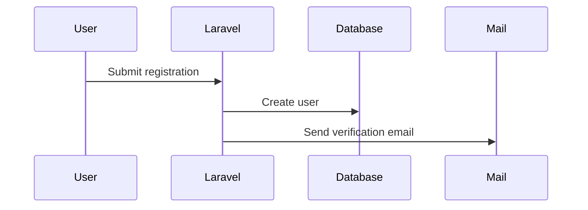
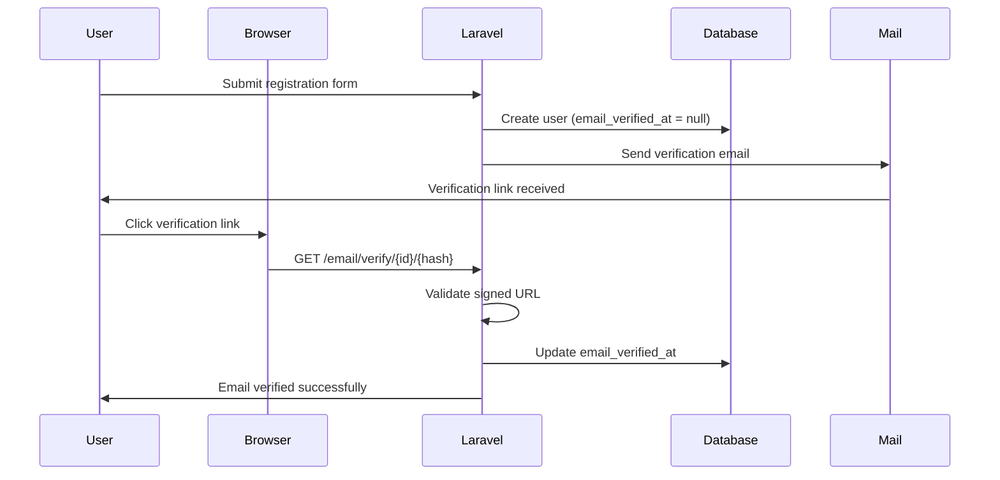
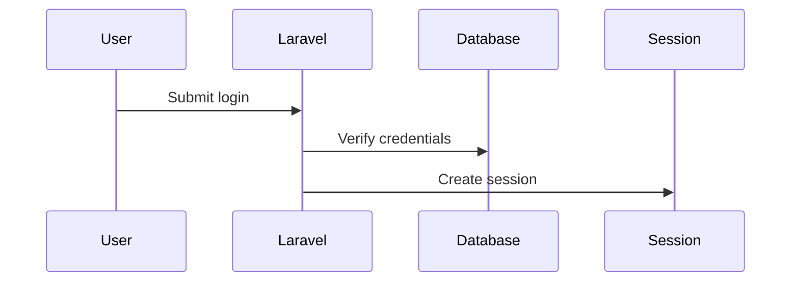
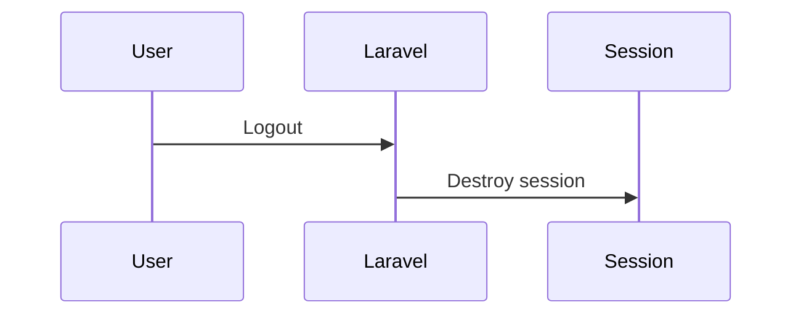

# Session 12: Authentication & Authorisation Basics

## SaaS 1 – Cloud Application Development (Front-End Dev)

<div @click="$slidev.nav.next" class="mt-12 -mx-4 p-4" hover:bg="white op-10">
<p>Press <kbd>Space</kbd> or <kbd>RIGHT</kbd> for next slide/step <fa7-solid-arrow-right /></p>
</div>

<div class="abs-br m-6 text-xl">
  <a href="https://github.com/adygcode/SaaS-FED-Notes" target="_blank" class="slidev-icon-btn">
    <fa7-brands-github class="text-zinc-300 text-3xl -mr-2"/>
  </a>
</div>


<!-- Presenter Notes:
Introduce scope.

This session is authentication only; authorisation comes next.
-->


---
layout: default
level: 2
---

# Navigating Slides

Hover over the bottom-left corner to see the navigation's controls panel.

## Keyboard Shortcuts

|                                                     |                             |
|-----------------------------------------------------|-----------------------------|
| <kbd>right</kbd> / <kbd>space</kbd>                 | next animation or slide     |
| <kbd>left</kbd>  / <kbd>shift</kbd><kbd>space</kbd> | previous animation or slide |
| <kbd>up</kbd>                                       | previous slide              |
| <kbd>down</kbd>                                     | next slide                  |

---
layout: section
---

# Objectives

---
level: 2
layout: two-cols
---

# Objectives

::left::

### Knowledge

- Understand **Authentication vs Authorisation**
- Understand **Laravel Fortify** and **Laravel Sanctum**
- Understand how Authentication flows work
- Understand Email Verification and Password Confirmation

::right::

## Skills

- Install and configure Laravel Fortify
- Protect routes with authentication
- Enforce authentication in Form Requests
- Test authentication flows using **Pest**

<!-- Presenter Notes:

-->

---
level: 2
---

# Contents

<Toc minDepth="1" maxDepth="1" columns="2" />

---
layout: figure
figureUrl: public/orly-book-cover-hoping-nobody-hacks-you.png
---

---
layout: section
---

# 🌟 Ice Breaker

##  Where have you logged in today?

- Apps?
- Websites?
- Devices?

<!-- Presenter Notes:

-->

---
layout: section
---

# Authentication and Authorisation

--- 
level: 2
layout: two-cols
---

# Authentication & Authorisation

## What are they, and a comparison

::left::

## Authentication

- **Who are you?**
- Proves identity
- Usually involves:
    - Email / username
    - Password
    - Token or session

::right::

## Authorisation

- **What are you allowed to do?**
- Checks permissions
- Happens after authentication

<!-- Presenter Notes:

-->

---
layout: section
---

# Fortify & Sanctum

- Two of Laravel's Authentication Systems
- Fortify is for web authentication
- Sanctum is for APIs and SPAs.

<!-- Presenter Notes:

-->

---
level: 2
---

# What is Laravel Fortify

Laravel Fortify is a backend authentication implementation for Laravel.

It provides:

- Registration
- Login / Logout
- Password reset
- Email verification
- Two‑factor authentication (optional)

Note:

- No UI provided
- Fully configurable

<!-- Presenter Notes:

-->

--- 
level: 2
---

# What is Laravel Sanctum

Laravel Sanctum provides API authentication using:

- API tokens
- SPA session authentication

Used for:

- Single Page Applications (React, Vue)
- Mobile apps
- External APIs

<br>

In previous Laravel versions (up to v10 inclusive), Sanctum was also
responsible for the Web based authentication.

<!-- Presenter Notes:

-->

---
level: 2
---

# Fortify & Sanctum Quick Side by Side

| Fortify             | Sanctum                |
|---------------------|------------------------|
| Web authentication  | API authentication     |
| Sessions & cookies  | Tokens / SPA sessions  |
| Login forms         | API calls              |

- Most Laravel web apps use both

---
layout: section
---

# Adding Laravel Fortify

- How to install
- How to configure
- How to publish settins/components/views

<!-- Presenter Notes:

-->

---
level: 2
---

# Adding Laravel Fortify

Laravel Fortify provides backend authentication features for Laravel applications.

It handles all core authentication actions without forcing a UI, making it ideal for custom Blade, Tailwind, or frontend-driven designs.

---
level: 2
---

# How to Install, Configure & Implement Laravel Fortify

## Installation

From your Laravel project root, install Fortify using Composer:

```shell
composer require laravel\/fortify
```

Once installed, run the Fortify installer:

```shell
php artisan fortify:install
```

This command performs several important tasks:

- Publishes Fortify configuration
- Registers Fortify service provider
- Creates action classes for authentication logic
- Prepares the application for authentication flows

Finally, run your migrations (if not already done):

```shell
php artisan migrate
```

At this point, Laravel Fortify is installed, but not yet configured.


---
level: 2
---

# How to Install, Configure & Implement Laravel Fortify

Fortify is configured in the file: `config/fortify.php`

This file controls which authentication features are enabled.

## Enable Core Features
Open `config/fortify.php` and ensure the following features are enabled:

```php
'features' => [    
  Features::registration(),
  Features::resetPasswords(),
  Features::emailVerification(),
],
```

These features provide:

- User registration
- Password reset workflow
- Email verification enforcement


---
level: 2
---

# How to Install, Configure & Implement Laravel Fortify
## Update the User Model

To enable email verification, update the User model.

- Add the `MustVerifyEmail` contract,
- Ensure the User model implements the `MustVerifyEmail` contract

```php
use Illuminate\Contracts\Auth\MustVerifyEmail;

class User extends Authenticatable implements MustVerifyEmail
{
    // ...
}
```

This ensures Laravel automatically requires verified email addresses where appropriate.


---
level: 2
---

# How to Install, Configure & Implement Laravel Fortify
## Ensure Fortify Is Registered

Fortify should already be registered automatically.

Inside AppServiceProvider (or bootstrap/app.php in Laravel 11+), ensure 
providers are loaded correctly, verifying that the Fortify Service 
Provider exists:

```php
/FortifyServiceProvider.php
```


---
level: 2
---

# How to Install, Configure & Implement Laravel Fortify
## How to Publish Settings, Components, and Views

Fortify is UI-agnostic by default, meaning it does not publish Blade views automatically.

The following steps allow you to customise authentication pages.

- Publish Configuration 
  - No further action required here unless updating features
- Publish Fortify Views (Optional but Recommended)
  - To customise login, register, and verification views

To publish the Fortify views use:

```shell
artisan vendor:publish --tag=fortify-views
```

This creates `resources/views/auth/`, including templates for:

- Login
- Registration
- Password reset
- Email verification
- Confirm password

<Announcement type="idea">
You are now free to modify these views using Blade + Tailwind CSS.
</Announcement>


---
level: 2
---

# How to Install, Configure & Implement Laravel Fortify
## Enable Custom Views in Fortify

Open `app/Providers/FortifyServiceProvider.php` and ensure view rendering is enabled:

```php
use Laravel\Fortify\Fortify;

public function boot(): void
{
    Fortify::loginView(fn () => view('auth.login'));
    Fortify::registerView(fn () => view('auth.register'));
}
```

You may also define views for:

- Password reset
- Email verification
- Confirm password

---
level: 2
---

# How to Install, Configure & Implement Laravel Fortify
## Quick Verification Checklist

- Composer package installed
- fortify:install executed
- Config enabled (config/fortify.php)
- User model implements MustVerifyEmail
- Views published and editable
- Fortify service provider configured


---
level: 2
---

# What Fortify Does Not Do

It is important to understand Fortify’s boundaries:
- Does NOT provide frontend styling
- Does NOT define roles or permissions
- Does NOT replace policies or gates

Those responsibilities belong to:

- Blade / Tailwind / Frontend framework
- Laravel Authorisation (Policies & Gates)
- Sanctum (API authentication)

---
layout: section
---

# How Fortify Works

<!-- Presenter Notes:

-->

---
level: 2
---

# How Fortify Works

## Registration Flow

1. User submits registration form
1. Data validated
1. User record created
1. Email verification sent (if enabled)




---
level: 2
---
# How Fortify Works

## The Process of Email Validation

Email validation (email verification) ensures that a registered user actually owns the email address they supplied.

Laravel Fortify integrates this process directly into the authentication lifecycle.

| Step                      | Actions Taken |
|---------------------------|---|
| User registers an account | The user submits the registration form (name, email, password).<br>Laravel validates the input data.|
| User record is created | A new user record is saved to the database.<br>The user is marked as unverified (email_verified_at = null).|
| Verification email is sent | Laravel automatically sends an email containing:<br>- A signed verification URL<br>- A unique token tied to the user|
| User clicks verification link | The link directs the user back to the application.<br>The request includes a signed hash to prevent tampering.|
| Laravel validates the request | The signature and user ID are verified.<br>If valid, Laravel updates the user record.|
| Email marked as verified | The email_verified_at timestamp is set.<br>The user is now considered verified.|
| Access to protected features | Routes or features requiring verified middleware are now accessible.|

<!--
Key Laravel Concepts Involved

MustVerifyEmail interface on the User model
auth middleware (authentication)
verified middleware (email verification)
Signed URLs for security
Notification system (email delivery)
-->


---
level: 2
---
# How Fortify Works

## The Process of Email Validation



---
level: 2
---
# How Fortify Works

## Why Email Verification Matters
- Prevents fake or disposable email accounts
- Reduces spam and abuse
- Protects password reset workflows
- Improves application security


---
level: 2
---
# How Fortify Works

## Common Middleware Usage

```php
Route::middleware(['auth', 'verified'])->group(function () {
    Route::get('/dashboard', fn () => view('dashboard'));
});
```

Notes:
- auth → user must be logged in
- verified → user must have a verified email address


---
level: 2
---
# How Fortify Works

## Failure Scenarios to Consider

- User never clicks verification email
- Verification link expires
- Verification link is modified or tampered with
- User attempts access without verification

These scenarios are ideal for Pest test cases and will be covered in testing sections.


---
level: 2
---
# How Fortify Works

## Summary

- Email verification is automatic once Fortify is configured
- Verification status is stored in the database
- Access can be enforced using middleware
- Security relies on signed URLs and timestamps

---
level: 2
---
# How Fortify Works

## Login Flow

- User submits credentials
- Credentials validated
- Session created
- User authenticated



---
level: 2
---
# How Fortify Works

## Logout Flow

- User logs out
- Session destroyed
- User unauthenticated



<!-- Presenter Notes:

-->

---
layout: section
---

# Using Fortify in Laravel Application

<!-- Presenter Notes:

-->

--- 
level: 2
---

# Using Fortify in Laravel Application

- Installation and Configuration provided earlier

<!-- Presenter Notes:

-->

--- 
level: 2
---

# Using authentication in routes

```php
Route::middleware('auth')->group(function () {
    Route::get('/dashboard', fn () => view('dashboard'));
});
```

- Only authenticated users can access

<!-- Presenter Notes:

-->

--- 
level: 2
---

# Authentication in Store, Update Requests

```php
public function authorize(): bool
{
    return auth()->check();
}
```

- Protects business logic 
- Works even if routes are misconfigured


<!-- Presenter Notes:

-->

--- 
level: 2
---

# Enabling & Configuring Email Verification

- Ensures user owns the email address
- Prevents fake account abuse
- Enabled in Laravel by implementing MustVerifyEmail

<!-- Presenter Notes:

-->

--- 
level: 2
---

# Testing Email Verification using Mailpit

<!-- Presenter Notes:
# Testing Email Verification using Mailpit

This section demonstrates how to safely and visually test email verification
**without sending real emails**.

Mailpit acts as a local email inbox for development and testing.

-->

---
level: 2
---

## Why Use Mailpit?

- Local email testing tool
- Captures outgoing emails
- No real emails are sent
- Perfect for development and automated testing

✅ Safe  
✅ Fast  
✅ Visual  

---

## Starting Mailpit

### Using Docker (recommended)

```bash
docker run -d \
  -p 1025:1025 \
  -p 8025:8025 \
  axllent/mailpit
```

SMTP Server: localhost:1025
Web UI: http://localhost:8025

Configure Laravel to Use Mailpit
Update your .env file:

```ini
MAIL_MAILER=smtp
MAIL_HOST=127.0.0.1
MAIL_PORT=1025
MAIL_USERNAME=null
MAIL_PASSWORD=null
MAIL_ENCRYPTION=null
MAIL_FROM_ADDRESS="noreply@example.com"
MAIL_FROM_NAME="${APP_NAME}"
```

Triggering the Verification Email

Register a new user
Laravel automatically sends a verification email
Mailpit captures the email instantly

✅ No extra code required

Viewing the Verification Email

Open Mailpit in your browser
👉 http://localhost:8025
Select the latest email
Inspect:

Recipient
Subject
Verification link

Verifying the Email Address

Click the verification link in Mailpit
Laravel validates:

Signed URL
User ID


email_verified_at is updated
User is redirected to the intended page

✅ Email successfully verified

Common Issues & Troubleshooting

No email received?

Check Mailpit is running
Confirm .env MAIL settings


Verification link expired?

Request new verification email


Access denied?

Ensure verified middleware is applied correctly


Useful Routes for Testing

```php
Route::middleware(['auth', 'verified'])
  ->get('/dashboard', function () {
      return view('dashboard');
  });
```

- Try accessing before verification ❌
- Try accessing after verification ✅ 


Why This Matters for Testing

- Prevents fake accounts
- Verifies email-based workflows
- Enables full end-to-end authentication testing
- Required for reliable Pest feature tests

Mailpit ensures this can all be done locally and safely.


--- 
level: 2
---

# Use a Confirm Password before accessing the "admin dashboard"


Sensitive actions may require re-confirmation:
- Admin dashboard
- Changing email
- Deleting account

For example, protecting the Admin Dashboard and other Admin routes.

### Protect the Admin dashboard route

Endpoint: `/admin`
Route Name: `admin.index`

```php
Route::get('/admin', fn () => view('admin'))
    ->middleware(['auth', 'password.confirm'])
    ->name('admin.index');
```

<!-- Presenter Notes:

-->


---
layout: section
---

# Pest Testing Authentication

Testing register, login, logout, and other actions.

<!--- Presenter Notes:

This section introduces automated testing for authentication.

Emphasise that authentication is critical infrastructure and MUST be tested.
These are feature tests that simulate real user behaviour.

--->

--- 
level: 2
---

# Pest Testing Authentication

We test:

- Register success & failure
- Login success & failure
- Logout behaviour
- Email verification

Why:
- Confidence
- Prevent regressions
- Catch security flaws early
- Prove expected behaviour


<!--- Presenter Notes:

Reinforce: authentication bugs are security bugs.
Testing ensures our assumptions about access control are correct.

--->


---
level: 2
---

## Register success

```php
it('allows a user to register successfully', function () {
    $response = $this->post('/register', [
        'name' => 'Test User',
        'email' => 'test@example.com',
        'password' => 'password',
        'password_confirmation' => 'password',
    ]);
    $response->assertRedirect('/email/verify');
    $this->assertDatabaseHas('users', [
        'email' => 'test@example.com',
    ]);
});
```


---
level: 2
---

## Register failure

```php
it('fails registration when email is missing', function () 
{    
    $response = $this->post('/register', [        
        'name' => 'Test User',        
        'password' => 'password',        
        'password_confirmation' => 'password',    
    ]);    
    $response->assertSessionHasErrors('email');
});

```


---
level: 2
---

## Verify email success

```php
it('verifies a users email address', function () {    
    $user = User::factory()->unverified()->create();    
    $verifyUrl = URL::temporarySignedRoute(        
        'verification.verify',        
        now()->addMinutes(60),        
        [
            'id' => $user->id, 
            'hash' => sha1($user->email)
        ]
    );    
    $this->actingAs($user)->get($verifyUrl);    
    expect($user->fresh()->hasVerifiedEmail())->toBeTrue();
});
```


---
level: 2
---

## Verify email failure

```php
it('rejects an invalid verification link', function () {    $user = User::factory()->unverified()->create();    $invalidUrl = route('verification.verify', [        'id' => $user->id,        'hash' => 'invalid-hash',    ]);    $this->actingAs($user)->get($invalidUrl)        ->assertStatus(403);});
```


---
level: 2
---

## Login success

```php
it('allows a verified user to login', function () {    $user = User::factory()->create([        'password' => bcrypt('password'),        'email_verified_at' => now(),    ]);    $response = $this->post('/login', [        'email' => $user->email,        'password' => 'password',    ]);    $response->assertRedirect('/dashboard');    $this->assertAuthenticatedAs($user);});
```


---
level: 2
---

## Login failure (wrong email address)

```php
it('fails login with incorrect email', function () {    $user = User::factory()->create([        'password' => bcrypt('password'),    ]);    $response = $this->post('/login', [        'email' => 'wrong@example.com',        'password' => 'password',    ]);    $response->assertSessionHasErrors();    $this->assertGuest();});
```


---
level: 2
---

## Login failure (password)

```php
it('fails login with incorrect password', function () {    $user = User::factory()->create([        'password' => bcrypt('password'),    ]);    $response = $this->post('/login', [        'email' => $user->email,        'password' => 'wrong-password',    ]);    $response->assertSessionHasErrors();    $this->assertGuest();});
```


---
level: 2
---

## Logout success (authenticated)

```php
it('logs out an authenticated user', function () {    $user = User::factory()->create();    $this->actingAs($user)        ->post('/logout')        ->assertRedirect('/');    $this->assertGuest();});
```


---
level: 2
---

## Logout failure (not authenticated)

```php
it('prevents logout when not authenticated', function () {    $this->post('/logout')        ->assertRedirect('/login');});
```


---


---
layout: section
---

# Demo: Adding a "Topics" CRUD with Authentication

<!-- Presenter Notes:

-->

--- 
level: 2
---

# Adding a "Topics" CRUD with Authentication

## General Overview

- Topics are used for the Contact Us form
- A topic ius a general subject for the form
- Users will add their own, more defined, subject when feature implemented
- This is just the CRUD for the Topics
- Both Code and Views are to be created
- TailwindCSS formatting employed
- Components provided are:
    - x-application-logo, x-auth-session-status, x-danger-button, x-dropdown,
    - x-dropdown-link, x-input-error, x-input-label, x-modal, x-nav-link,
    - x-primary-button, x-primary-link-button, x-responsive-nav-link,
    - x-secondary-button, x-secondary-link-button, x-side-nav-link,
    - x-stats-card, x-text-input, x-textarea
- Topic CRUD will be part of the Admin area
    - Layout will be `x-admin-layout`
    - Routes will prefix with `admin/topics` and named `admin.topics.*`
    - Controller will be stored in app/Http/Controllers/Admin
    - Requests stored in app/Http/Requests/Admin
    - Views stored in `resources/views/admin/topics`

## Topic Overview:

A topic has:

- name (unique, min: 6, max: 32),
- description (nullable),
- available (boolean, default true)

Plus the default "id", "created_at" and "updated_at" fields that come with
Laravel migrations.


--- 
level: 2
---

# Adding a "Topics" CRUD with Authentication

## Create Stub Files

```shell
php artisan make:model Topic --controller --migration --policy --seed \
    --resource --factory --pest
```

or shorthand:

```shell
php artisan make:model Topic --all --pest
```

- Create required subfolders and add empty .gitignore files:

```shell
mkdir -p app/Http/{Controllers,Requests}/{Admin,Web,Client}
touch app/Http/{Controllers,Requests}/{Admin,Client,Web}/.gitignore
```

- Move the Topic Controller and Requests into the sub-folders.

```shell
mv app/Http/Controllers/TopicController.php \ 
      app/Http/Controllers/Admin/TopicController.php 
mv app/Http/Requests/StoreTopicRequest.php \ 
      app/Http/Requests/Admin/StoreTopicRequest.php 
mv app/Http/Requests/UpdateTopicRequest.php \ 
      app/Http/Requests/Admin/UpdateTopicRequest.php 
```

--- 
level: 2
---

# Adding a "Topics" CRUD with Authentication

## Add Model code

--- 
level: 2
---

# Adding a "Topics" CRUD with Authentication

## Add Migration code

--- 
level: 2
---

# Adding a "Topics" CRUD with Authentication

## Add Seeder code

Seed data:

| ID  | Name        | Description                      | Available |
|-----|-------------|----------------------------------|-----------|
| 1   | Unknown     | Unknown topic                    | Y         |
| 100 | Books       | Fiction & Non Fiction            | Y         |
| 199 | Dummy Topic |                                  | N         |
| 200 | Technology  | Information & Other Technologies | Y         |
| 900 | Dummy Topic |                                  | N         |

```php
$seedTopics = [
    [ 'id'=>1,   'name'=>'Unknown' ,'description'=>'Unknown topic', 'available'=>true, ],
    [ 'id'=>100, 'name'=>'Books' ,'description'=>'Fiction & Non Fiction', 'available'=>true, ],
    [ 'id'=>199, 'name'=>'Dummy Topic' ,'description'=>null, 'available'=>false, ],
    [ 'id'=>200, 'name'=>'Technology' ,'description'=>'Information & Other Technologies', 'available'=>true, ],
    [ 'id'=>900, 'name'=>'Dummy Topic' ,'description'=>null, 'available'=>false, ],
];
```

--- 
level: 2
---

# Adding a "Topics" CRUD with Authentication

## Add Factory code

--- 
level: 2
---

# Adding a "Topics" CRUD with Authentication

## Add Routing for Topics

--- 
level: 2
---

# Adding a "Topics" CRUD with Authentication

## Add Resourceful controller code

--- 
level: 2
---

# Adding a "Topics" CRUD with Authentication

## Add Requests code for Store and Update

### Replace return false with return true

This applies to BOTH Store and Update requests.

```php
    public function authorize(): bool
    {
        return true;
    }
```

- Allows anyone to perform the action.
- Will be changed later to check if logged in.

### Add Validation for Store Request

### Add Validation for Update Request

--- 
level: 2
---

# Adding a "Topics" CRUD with Authentication

## Add Authentication validation for routes, requests and actions

--- 
level: 2
---

# Adding a "Topics" CRUD with Authentication

## Authentication: All actions must be logged in before working

--- 
level: 2
---

# Adding a "Topics" CRUD with Authentication

## Authentication verification within Store & Update Requests

Modify the previous authorize method to now read:

```php
    public function authorize(): bool
    {
        return auth()->check();
    }
```

- Checks is CURRENT USER is logged in.
- Returns:
    - true (logged in/authenticated) or
    - false (not authenticated)

<!-- Presenter Notes:

-->

---
layout: section
---

# Pest Testing Actions with Authentication

<!--- Presenter Notes:


-->

--- 
level: 2
---

# Pest Testing Actions with Authentication

--- 
level: 2
---

## Browse topics (no authentication)

--- 
level: 2
---

## Read a Topic (authentication required)

--- 
level: 2
---

## Read a Topic Failure (Not Authenticated)

--- 
level: 2
---

## Read a Topic Failure (Authenticated, Topic does not exist)

--- 
level: 2
---

## Create/Store a New Topic (Authenticated)

--- 
level: 2
---

## Create/Store a New Topic Failure (Authenticated, missing topic name)

--- 
level: 2
---

## Create/Store a New Topic Failure (Authenticated, Topic name too short)

--- 
level: 2
---

## Create/Store a New Topic Failure (Not Authenticated)

--- 
level: 2
---

## Edit/Update an existing Topic (Authenticated)

--- 
level: 2
---

## Edit/Update an existing Topic Failure (Authenticated, missing topic name)

--- 
level: 2
---

## Edit/Update an existing Topic Failure (Authenticated, Topic name too short)

--- 
level: 2
---

## Edit/Update an existing Topic Failure (Not Authenticated)

--- 
level: 2
---

## Destroy an existing Topic (authentication required)

--- 
level: 2
---

## Destroy an existing Topic Failure (Not authenticated)

--- 
level: 2
---

## Destroy an existing Topic Failure (Authenticated, Topic does not exist)

<!-- Presenter Notes:

Each of the above will be level: 2 slides

-->

---

# In-Class Practice Exercise

- Create a basic CRUD for Categories
    - A category has: title (unique, min: 6, max: 32), description (nullable)
    - Add Model, Migration, Seeder (seed data provided), Factory, Resourceful
      controller, Requests
    - Add routing for Categories

- Add Authentication validation for routes, requests and actions
    - All actions must be logged in before working
    - use Store and Update Requests for ensuring authenticaiton
    - use Store and Update Requests for validation of data

<!-- Presenter Notes:


--->


<!-- Presenter Notes:

-->

---

# Out-of-Class Activities

**Research**

- ...

**Practice**

- ...

**Tutorials**

- ...

<!-- Presenter Notes:

-->

---

# Summary Checklist

- [ ] ...

<!-- Presenter Notes:

-->

---
level: 2
layout: grid
---

# Exit Ticket Questions

:tl:

<Announcement type="brainstorm">
What is authentication?
</Announcement>


:tr:

<Announcement type="brainstorm">
How is it different from authorisation?
</Announcement>


:bl:

<Announcement type="brainstorm">
Why verify email addresses?
</Announcement>

:br:

<Announcement type="brainstorm">
Where should authentication checks exist?
</Announcement>


<!-- Presenter Notes:

-->

---

# Acknowledgements & References (APA v7)

- TODO: Add references etc

> Some content may have been generated with the assistance of Microsoft
> CoPilot


<!-- Presenter Notes:

-->

---
layout: end
---

# Fin!

Haiku here


<!-- Presenter Notes:

-->

---
