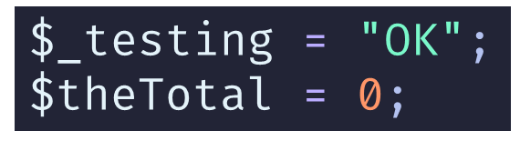

# PHP Basics I (Continued)

Continuing on with PHP Basics.

# PHP Variables

Variables must:
- Start with a `$`
- Have a letter or underscore after the `$`
- Use only `A`-`Z`, `a`-`z`, `0`-`9` and `_`
- Be camel case (`camelCase`)

More details:
- https://www.phptutorial.net/php-tutorial/php-variables/

---

## Examples:

> **Note:** Images are reproduced as code 

### Valid
 

```php
$_testing = "OK";  
$theTotal = 0;
``` 

### Invalid

![[PHP-Basics-I-20240723162130870.png]]                                          

 ```php
 $another-variable = "OOPS!";  
 $test this = 0;  
 test = 1;
``` 

---

# Data Types in PHP

| Type                                            | Description                              |
| ----------------------------------------------- | ---------------------------------------- |
| `bool`<br>`int`<br>`float`<br>`string`          | Single value held in variable            |
| `array`<br>`object`<br>`callable`<br>`iterable` | Variables may contain one or more values |
| `resource`<br>`null`                            |                                          |

More details:
- https://www.phptutorial.net/php-tutorial/php-data-types/
- https://www.phptutorial.net/php-tutorial/php-boolean/
- https://www.phptutorial.net/php-tutorial/php-int/
- https://www.phptutorial.net/php-tutorial/php-float/
- https://www.phptutorial.net/php-tutorial/php-string/
- https://www.phptutorial.net/php-tutorial/php-null/

---

## PHP Types Continued

Traditionally...
- PHP was “weakly typed”

PHP 5 introduced...
- Type Hinting

PHP 7 added...
- Default to Weak Typing
- Could enable strict types

For example:

```php
function sum(int $a, int $b) 
{
    return $a + $b;
}
```

You may expect PHP to give a Type Error if you called the function using `sum(3.5, 6)`. Instead PHP would type-coerce to the required type.

### Strict Typing

It is possible to have PHP employ strict typing on a **PER FILE** basis.

For example:

```php
declare(strict_types=1);

function sum(int $a, int $b) 
{
    return $a + $b;
}

try {
    var_dump(sum(1, 2));
    var_dump(sum("1.5", 3)); 
} catch (TypeError $e) {
    echo 'Error: '.$e->getMessage();
} 

```

Executing this would give:

```text

int(3)
Error: Argument 1 passed to sum() must be of the type int, string given, called in [...][...] on line 11
```

There are caveats to this, such as passing an integer when a float is required.

##### Reference

Merchant, A. (2020, June). _Strict typing vs. Weak typing in PHP_. Amit Merchant. https://www.amitmerchant.com/strict-weak-typing-php/


---

## Type Casting and Juggling

- [Type Casting](https://www.phptutorial.net/php-tutorial/php-type-casting/) – learn how to cast a value of one type to another.
- [Type Juggling](https://www.phptutorial.net/php-tutorial/php-type-juggling/) – explain to you how the type juggling works in PHP.

---

## PHP Syntax - Assignment & Operators

### Assignment

Uses the equals sign `=`

```php
$name = "Adrian";
```

More details:
- https://www.phptutorial.net/php-tutorial/php-assignment-operators/
- https://www.phptutorial.net/php-tutorial/php-operators/

### Arithmetic

All traditional arithmetic operators supported.

Table shows example with integers and floats:

| Operation       | Symbol | Other name | Example  |
| --------------- | ------ | ---------- | -------- |
| Plus            | +      | Add        | 5 + 4    |
| Minus           | -      | Subtract   | 23.5 – 5 |
| Times           | *      | Multiply   | 2.1 * 3  |
| Divide          | /      |            | 5 / 2.5  |
| Remainder       | %      | Modulo     | 5 % 3    |
| To the power of | **     | Exponent   | 2 ** 3   |

### Priority

Normal Maths priorities apply:

- Brackets, 
- Power/Roots, 
- Multiple/Divide, 
- Add/Subtract

Brackets...

- Round brackets
- Aka Parentheses
- Used to prioritised the calculations


---

## Inc/Dec Shortcuts

**Inc**rement
- To increase, enlarge, make bigger

**Dec**rement
- To decrease, reduce, make smaller

Two or Three ways to do both, depending on if the increment/decrement is by 1 or a larger value.

When incrementing or decrementing by 1, we get three options, when larger values, just two ways.
### Increment (by 1) Shortcuts

```php
$inc = $inc + 1;
$inc += 1;
$inc++;
```

### Increment (by more than one) Shortcuts

```php
$inc = $inc + 1234;
$inc += 1234;
```

### Decrement (by 1) Shortcuts

```php
$dec = $dec - 1;
$dec -= 1;
$dec--;
```

### Decrement (by more than 1) Shortcuts

```php
$dec = $dec - 1234;
$dec -= 1234;
```

## String Concatenation

Concatenation (joining) uses the full stop (`.`) which is different from many other "C-style" languages.

You can “add” or join strings: 

```php
“first string ” . “second string”
```

## Strings and Variables

```php
$name = "Fred"
$anotherName = 'Janelle';
$greeting = "Hello, " . $name . ".";
```

### Examples

```php
<body>
<?php
$name = "Fred";
?>
<!-- Output using PHP Echo -->
<p>Buonjourno, <?php echo $name; ?></p>
<!-- Outputting a PHP variable inside HTML -->
<p>Welcome, <?= $name ?></p>
</body>
```

### Echo Shortcuts

You note that the above code showed the expected `echo` which is a long-hand way of displaying data:

```php
<p>Buonjourno, <?php echo $name; ?></p>  
```

This my be shortened to the short-hand version:

```php
<p>Welcome, <?= $name ?></p>
```

---

# PHP Arrays

- Use square brackets `[ ]`
- May be weakly typed typing
	- i.e. may contain a mix of types/values
- May be “associative”
	- This is when a key and value are paired
- Items separated by commas (`,`)
- May include a comma `,` before the closing bracket
	- we recommend doing this as less errors appear by forgetting to add a comma

### Array of integers
```php
$rainfall = [1, 5, 0, 7, 4, 6, 10];
```
### Array of strings
```php
$names = ['Amy', 'Brian', 'Charlie', 'Dave', 'Eva',
          'Frida', 'Geoff', ‘Marriette‘, 'Zara'];
```

> **Note:** Do you see a problem with the above code?

### Array of floats
```php
$expenses = [25.69, 34.77, 12.4, 68.92,];
```
 
### Mixed Content
```php
$mixed = [1, "Hello", 3.5, true];
```


### Associative
- Use `“key” => ”value”` pairs
- Keys may be strings or integers
- Values may be of any type
- The `fat arrow` (an `=` and a `>` combined) indicates the relationship between key and value.

```php
$associative = [
    'given' => 'Adrian',
    'family' => 'Gould',
];
```

### Further Reading on Arrays and Array Sorting

PHP Tutorial references.

- [Arrays](https://www.phptutorial.net/php-tutorial/php-array/) – show you how to handle a list of items effectively with Array data type.
- [Associative Arrays](https://www.phptutorial.net/php-tutorial/php-associative-arrays/) – learn how to use the associative arrays to reference elements by names rather than numbers.
- [Multidimensional Array](https://www.phptutorial.net/php-tutorial/php-multidimensional-array/) – guide you on how to define a multidimensional array and manipulate its elements effectively.
- [array_unshift()](https://www.phptutorial.net/php-tutorial/php-array_unshift/) – add one or more elements to the beginning of an array.
- [array_push()](https://www.phptutorial.net/php-tutorial/php-array_push/) – add one or more elements to the end of an array.
- [array_pop()](https://www.phptutorial.net/php-tutorial/php-array_pop/) – remove an element from the end of an array and return it.
- [array_shift()](https://www.phptutorial.net/php-tutorial/php-array_shift/) – remove an element from the beginning of an array and return it.
- [array_keys()](https://www.phptutorial.net/php-tutorial/php-array_keys/) – get the keys of an array.
- [array_key_exists()](https://www.phptutorial.net/php-tutorial/php-array_key_exists/) – check if a key exists in an array.
- [in_array()](https://www.phptutorial.net/php-tutorial/php-in_array/) – check if a value exists in an array.
- [array_reverse()](https://www.phptutorial.net/php-tutorial/php-array_reverse/) – reverse the order of elements in an array.
- [array_merge()](https://www.phptutorial.net/php-tutorial/php-array_merge/) – merge multiple arrays into one.
- [Spread operator](https://www.phptutorial.net/php-tutorial/php-spread-operator/) – show you how to use the spread operator with an array expression.
- [list](https://www.phptutorial.net/php-tutorial/php-list/) – learn how to use the list construct to assign the array elements to multiple variables in a single operation.
- [Array destructuring](https://www.phptutorial.net/php-tutorial/php-array-destructuring/) – show you how to unpack array elements to multiple variables.
- [sort](https://www.phptutorial.net/php-tutorial/php-array/) – sort values of an array in the ascending order (or use the `rsort()` function to sort the values of an array in the descending order).
- [ksort()](https://www.phptutorial.net/php-tutorial/php-ksort/) – sort array keys of an associative array.
- [usort()](https://www.phptutorial.net/php-tutorial/php-usort/) – sort an array with a user-defined function.
- [asort()](https://www.phptutorial.net/php-tutorial/php-asort/) – sort an associative array and maintain the index association.
- [uasort()](https://www.phptutorial.net/php-tutorial/php-uasort/) – sort an associative array with a user-defined comparison function and maintains the index association.
- [uksort()](https://www.phptutorial.net/php-tutorial/php-uksort/) – sort the keys of an array with a user-defined comparison function.

---

# PHP Strings

You have seen strings in use...

- Strings are enclosed in either
	- Quotation marks `" "` or
	- Apostrophes `' '`

Strings with quotation marks (quotes)
- May be ‘interpolated’ (see later)

If you need to include quotes in a quotes string:
- Escape the quotes using `\"`

Same for apostrophes

In a quoted (`" "`) string:
- Wrap PHP code/variables in braces (curly brackets) `{ }`
- Content in curly brackets is interpreted as PHP

Apostrophes (`' '`):
- Give the literal string (no evaluation)

Example:
```php
echo "<p>length: {$length}</p>";
```

Will display the value of the `$length` variable


---

# PHP Conditionals

The conditional operators are like most C-style languages...

| Name                     | Symbol |     Example     | Note                                                     |
| ------------------------ | :----: | :-------------: | -------------------------------------------------------- |
| Greater Than             |  `>`   |     `7 > 6`     |                                                          |
| Less Than                |  `<`   |   `'a' < 'b'`   |                                                          |
| Equal To                 |  `==`  |  `'45' == 45`   | This works as PHP does not check type by default         |
| Greater than or equal to |  `>=`  |   `76 >= 45`    |                                                          |
| Less than or equal to    |  `<=`  |   `56 <= 67`    |                                                          |
| Equivalent to            | `===`  | `'45' === '45'` | Forces PHP to check types are identical, then the values |

Conditionals are used in:
- Decisions
- Loops
- Ternary operators

More details:
- https://www.phptutorial.net/php-tutorial/php-comparison-operators/
- https://www.phptutorial.net/php-tutorial/php-and-operator/
- https://www.phptutorial.net/php-tutorial/php-not-operator/
- https://www.phptutorial.net/php-tutorial/php-or-operator/

# PHP Decisions

The most well known basic structure is:

```php
if ( condition(s) ) {
    // do something
} else {
    // do something else
}
```

If nothing needed for ‘`else`’ then omit it:

```php
if ( condition(s) ) {
    // do something
}
```

Successive conditions may use `elseif (condition)`

```php
if ( condition(s) ) {
    // do something
} elseif ( condition(s) ) {
    // do something else
} else {
    // do something else
}
```


### DRY Code/Comments/Models and more

[What is DRY code? (youtube.com)](https://www.youtube.com/watch?v=HwTcjWtDAfc)

<iframe width="560" height="315" src="https://www.youtube.com/embed/HwTcjWtDAfc?si=FwBdyLAKKrHfWlxF" title="YouTube video player" frameborder="0" allow="accelerometer; autoplay; clipboard-write; encrypted-media; gyroscope; picture-in-picture; web-share" referrerpolicy="strict-origin-when-cross-origin" allowfullscreen></iframe>

### DRY-ing out Decisions

Using a decision to assign one of two values?

```php
if ($given > "") {
    $greeting = "Hello, {$given}.";
} else {
    $greeting = "Is anyone there?";
}
```

Dry the code by:
- Assigning the default value
- Then use the decision to update as needed
```php
$greeting = "Is anyone there?";
if ($given > "") {
    $greeting = "Hello, {$given}.";
}
```

Also, could use a ternary operator:

```php
$greeting = $given > "" ? "Hello, {$given}." : "Is anyone there?";
```

Be careful as ternary operators can become unreadable very quickly.

### DRY a True or False result?

If you are going to assign a "true" or "false" value only, then do not use a decision. For example:

```php
// Bad code
if ( $total > 100) {
  $result = true;
} else {
  $result = false;
}
```

This is much simpler to read and also shorter:

```php
// Good code
$result = $total > 100;
```

## Nesting Decisions

- When possible "flatten" out to make more readable
- example?


### Making Nested If...Then...Else Easier to Understand

<iframe width="560" height="315" src="https://www.youtube.com/embed/0vJ_SkuBgbo?si=cXxSRnHmC0PDvqUG" title="YouTube video player" frameborder="0" allow="accelerometer; autoplay; clipboard-write; encrypted-media; gyroscope; picture-in-picture; web-share" referrerpolicy="strict-origin-when-cross-origin" allowfullscreen></iframe>

Laravel Daily. (2020, May 6). _PHP: Make If-Else More Readable and Shorter_. YouTube. https://www.youtube.com/watch?v=0vJ_SkuBgbo


Other videos on this (not PHP):
- [Why You Shouldn't Nest Your Code (youtube.com)](https://www.youtube.com/watch?v=CFRhGnuXG-4&t=145s)
- [Nesting "If Statements" Is Bad. Do This Instead. (youtube.com)](https://www.youtube.com/watch?v=Zmx0Ou5TNJs)
- [Stop Doing This in PHP... | Avoid Nesting If Statements | Better Coding Habits in PHP (youtube.com)](https://www.youtube.com/watch?v=6CsryA-nSEA)

### Switch vs If...Then...Else

<iframe width="560" height="315" src="https://www.youtube.com/embed/egDgLO8kvtI?si=snMi2P_gBvdacL5Y" title="YouTube video player" frameborder="0" allow="accelerometer; autoplay; clipboard-write; encrypted-media; gyroscope; picture-in-picture; web-share" referrerpolicy="strict-origin-when-cross-origin" allowfullscreen></iframe>

Program With Gio. (2021, January 2). _PHP Switch Statement - Switch vs if/else statement - Full PHP 8 Tutorial_. YouTube. https://www.youtube.com/watch?v=egDgLO8kvtI


--- 

## Decisions further reading

More details:
- https://www.phptutorial.net/php-tutorial/php-if/
- https://www.phptutorial.net/php-tutorial/php-if-else/
- https://www.phptutorial.net/php-tutorial/php-if-elseif/
- https://www.phptutorial.net/php-tutorial/php-ternary-operator/
- https://www.phptutorial.net/php-tutorial/php-switch/


---

# Repetition

- For
- Foreach
- While
- Do while

## For 

```php
for ($count = 0; $count < 10; $count++){
    $product = 10 * $count;
    echo "<p>The product of 10 * $count is $product </p>";
}
```

## Foreach

```php
$people = ["Amy", "Brad", "Charmaine", "Dave"];

foreach($people as $person){
    echo "<p>{$person}</p>";
}
```

Using associative array...

```php
$people = [
    "Mary" => "Female", 
    "John" => "Male", 
    "Alex" => "Female",
    "Irna" => "Non-binary",
];

foreach($people as $key => $value){
   echo "<p>{$key} identifies as {$value}</p>";
}
```

## While

```php
$total = 0; 
$number = 1; 
while ($number <= 10) {
    $total += $number; 
    $number++; 
} 
echo "<p>The total is... $total</p>";
```


## Do while

```php
$count = 10; 
do { 
	echo "<p>$count...</p>";
	$count--; 
} while ($count > 0);
```

### Further reading

More details here:
- https://www.phptutorial.net/php-tutorial/php-for-loop/
- https://www.phptutorial.net/php-tutorial/php-while/
- https://www.phptutorial.net/php-tutorial/php-do-while/
- https://www.phptutorial.net/php-tutorial/php-foreach/

# References

_PHP Tutorial_. (n.d.). PHP Tutorial. https://www.phptutorial.net/

_An Essential Guide to PHP do-while Statement By Examples_. (2022, September 7). PHP Tutorial. https://www.phptutorial.net/php-tutorial/php-do-while

Laravel Daily. (2020, May 6). _PHP: Make If-Else More Readable and Shorter_. YouTube. https://www.youtube.com/watch?v=0vJ_SkuBgbo

Program With Gio. (2021, January 2). _PHP Switch Statement - Switch vs if/else statement - Full PHP 8 Tutorial_. YouTube. https://www.youtube.com/watch?v=egDgLO8kvtI

