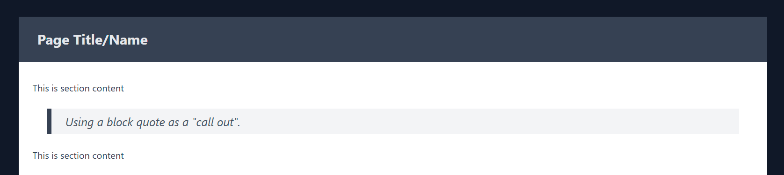

# Building a Layout With TailwindCSS v4

So in the previous sety of notes you instlaled Tailwind into a plain HTML website.

We are now going to explore creatinga layoutusing htis installation.

> ### Additional Learning:
>  
> Please refer to the following two video tutorials for more information 
> and teaching about TailwindCSS:
> 
> - JavaScript Mastery. (2025, February 21). Tailwind CSS v4 Full Course 2025 | Master Tailwind 
>   in One Hour. Youtube.com. https://www.youtube.com/watch?v=6biMWgD6_JY&t=159s
> 
> - PedroTech. (2025, August 5). Tailwind CSS V4 Crash Course 2025 | Become a Tailwind Pro 
>   in 1.5 Hours. Youtube.com. https://www.youtube.com/watch?v=H_kSd4kn0E8

### 1. Update Demo Code

We are now going to add some basic content to see how TailwindCSS is used.

#### 1.1 Add Header & Navigation

Edit the code and replace the current `<h1>...</h1>` element with:

```html

<div class="bg-gray-900 m-0 p-0 text-gray-200 ">
    <header class="text-gray-600 body-font container mx-auto flex flex-row p-5 mb-6 justify-between items-center">

        <h1>
            <a class="flex title-font font-medium items-center text-gray-400 mb-4 md:mb-0">
                <span class="ml-3 text-xl inline-block">Company Name</span>
            </a>
        </h1>

        <!-- TODO: Navigation -->

    </header>

    <!-- TODO: Main Content -->

    <!-- TODO: Footer -->
</div>
```

Visit the web page and see the changes take effect.

##### 1.1.1 Navigation part 1

Let's now add the first part of the navigation.

Replace the `<!-- TODO: Navigation -->` with:

```html

<nav class="md:mr-auto md:ml-4 md:py-1 md:pl-4
            text-gray-500
            flex flex-wrap items-center text-base justify-left grow">
    <a class="mr-5 py-2
              hover:text-gray-100
              border-0 border-b-2 border-b-gray-500 hover:border-gray-200">
        First Link
    </a>
    <a class="mr-5 py-2
              hover:text-gray-100
              border-0 border-b-2 border-b-gray-500 hover:border-gray-200">
        Second Link
    </a>
    <a class="mr-5 py-2
              hover:text-gray-100
              border-0 border-b-2 border-b-gray-500 hover:border-gray-200">
        Third Link
    </a>
    <a class="mr-5 py-2
              hover:text-gray-100
              border-0 border-b-2 border-b-gray-500 hover:border-b-gray-200">
        Fourth Link
    </a>
</nav>

<!-- TODO: Navigation Part 2 -->

```

Save the updated code and check the web page preview.

##### 1.1.2 Navigation part 2

Let's now add the second part of the navigation.

Replace the `<!-- TODO: Navigation Part 2 -->` with:

```html

<nav class="md:mr-auto md:ml-4 md:py-1 md:pl-4
            text-gray-500
            flex flex-wrap items-center text-base justify-right">
    <a class="mr-5 py-2
              hover:text-gray-100
              border-0 border-b-2 border-b-gray-500 hover:border-gray-200">
        Login
    </a>
    <a class="mr-5 py-2
              hover:text-gray-100
              border-0 border-b-2 border-b-gray-500 hover:border-gray-200">
        Register
    </a>
</nav>
```

Save the updated code and check the web page preview.


#### 1.2 Add Footer & Quick Links

Edit the code, and replace the `<!-- TODO: Footer -->` with:

```html

<footer class="p-8 pb-12 mt-8 mx-auto
            container grow w-full overflow-hidden
            gap-12 flex flex-wrap justify-between">

    <!-- TODO: Footer Left Side -->

    <!-- TODO: Footer Middle -->

    <!-- TODO: Footer Right Side -->

</footer>
```

Visit the web page and see the changes take effect.

##### 1.2.1 Footer Left Side

Edit the code, and replace the `<!-- TODO: Footer Left Side -->` with:

```html

<nav>
    <h5 class="text-left font-medium tracking-widest text-gray-500 uppercase title-font text-xs">
        Terms & Conditions
    </h5>

    <a class="my-1 block" href="/#">
        Privacy Policy
        <span class="text-sky-600 text-xs p-1">TBA</span>
    </a>

    <a class="my-1 block" href="/#">
        Terms & Conditions
        <span class="text-sky-600 text-xs p-1">TBA</span>
    </a>

    <p class="mt-4 text-sm capitalize text-gray-400">
        © Copyright 2025 NAME/COMPANY. All rights reserved
    </p>
</nav>

<!-- TODO: Footer Middle -->

<!-- TODO: Footer Right Side -->

</footer>
```

##### 1.2.1 Footer Middle

Edit the code, and replace the `<!-- TODO: Footer Middle -->` with:

```html

<nav>
    <h5 class="text-left font-medium tracking-widest text-gray-500 uppercase title-font text-xs">
        Support
    </h5>

    <a class="my-1 block" href="https://help.screencraft.net.au">
        Help Center
        <span class="text-sky-600 text-xs p-1">New</span>
    </a>
    <a class="my-1 block" href="https://help.screencraft.net.au/hc/2680392001">
        FAQs
        <span class="text-sky-600 text-xs p-1">New</span>
    </a>

</nav>

<!-- TODO: Footer Right Side -->

```

Refresh the browser after saving...

##### 1.2.1 Footer Right Side

Edit the code, and replace the `<!-- TODO: Footer Right Side -->` with:

```html

<nav>
    <h5 class="text-left font-medium tracking-widest text-gray-500 uppercase title-font text-xs">
        About
    </h5>

    <a class="my-1 block" href="/about">
        Personal and project Information
        <span class="text-sky-600 text-xs p-1"></span>
    </a>

    <a class="my-1 block" href="https://github.com/YOUR_GITHUB_NAME">
        GitHub Profile
        <span class="text-sky-600 text-xs p-1">New</span>
    </a>

    <a class="my-1 block" href="#contact">
        Contact Us
        <span class="text-sky-600 text-xs p-1">New</span>
    </a>

    <a href="#page-top" class="bock mt-6 text-sm text-gray-400">Jump to Top</a>

</nav>
```

You should now see a nicely laid out footer for the page.


#### 1.3 Add Main Content

The final step of creating this sample page is to add the main content.

Edit the code and replace the current `<!-- TODO: Main Content -->` with:

```html

<main class="min-h-screen flex flex-col gap-8
             container grow w-full overflow-hidden
             px-6 mx-auto
             bg-white text-gray-700">

    <!-- Page Heading -->
    <header class="-mx-6
                     bg-gray-700 text-gray-200
                       py-6 px-4 sm:px-6 lg:px-8">
        <h2 class="font-bold text-2xl leading-tight">
            Page Title/Name
        </h2>
    </header>

    <section class="gap-6 flex flex-col">

        <p>This is section content</p>

        <blockquote class="bg-gray-100 border-l-8 border-r-gray-600 mx-6 p-2 pl-6 italic">
            <p class="text-xl text-gray-600">
                Using a block quote as a "call out".
            </p>
        </blockquote>

        <p>This is section content</p>

    </section>

</main>
```

Visit the web page and see the changes take effect.



There we have a base page layout.

## 2. HyperUI Open Source Components for Web Interfaces

One of the most labour intensive parts of creating a web application is the components that make up a page.

TailwindCSS has many "UI Component Libraries" available including the official library, TailwindCSS Plus: https://tailwindcss.com/plus

In most cases these libraries cost money. Sometimes a LOT of money to use.

Occasionally we find a very nicely created and maintained set of UI components, and in this case we have done so with HyperUI:

- Free Open Source Tailwind CSS v4 Components | HyperUI. (2025). HyperUI. https://www.hyperui.dev/

To show how to use this UI Library we are going to add some content to the layout.

### 2.1 Add a Call to Action (CTA)

Go to the HyperUI site and locate the CTA section. Open the page and browse the options.


Once you have selected the CTA you want to use, press the COPY button to copy the HTML with the TailwindCSS classes already in the code.

Go back to the demo page we are creating, and locate the `<main>` element. Inside this there is the 'page header' (in a `<header>` element).

Immediately after the header is closed (approximately line 80 of the demo), paste the new code in.

Save and let the browser refresh.

We selected the first CTA for this demo.


### 2.2 Add a Section

We are going tyo add a section to the layout.

This is so we can demonstrate adding a form to one side of the page and an image on the other.

We selected...


This is found in the Sections area.

Copy the HTML  from the HyperUI page, and paste immediately after your new CTA.

We are goign to slightly tweak the current HTML.

At the start of the HTML we have a `section` followed by a `div` with TailwindCSS classes.

Modify this code to be as shown below (*DO NOT delete the code that we have noted as "content removed for brevity", we will modify this in a moment*).

```html
<section class="mx-auto w-auto">  
        <div class="grid grid-cols-1 gap-4 md:grid-cols-2 md:items-center md:gap-8">
          
            <!-- content removed for brevity -->
            
        </div>  
</section>
```

Next we will update the Left side of the section:

```html
<div>  
	<div class="max-w-lg md:max-w-none">  
		<h2 class="text-2xl font-semibold text-gray-900 sm:text-3xl">  
			Guest Book  
		</h2>  
  
		<p class="mt-4 text-gray-700">  
			Form to go here  
		</p>  
	</div>  
</div>  
```

The right side will stay the same as is given.

```html
<div>
      
</div>  
```


#### 2.2.1 Add Guest book Form


Now we are going to add the Guest book form.

Start by altering the code that reads:

```html
		<p class="mt-4 text-gray-700">  
			Form to go here  
		</p>  
```

Replace the `<p` with `<form`, and `</p>` with `</form>`, leaving the CSS as is.

After the CSS, and before the closing `>` we will add the required attributes of the form element:
- action
- method

So it becomes:

```html
<form class="mt-4 text-gray-700"  
      method="POST"  
      action="#">
```

Now to add the form controls.

#### 2.2.2 Form Controls

You will need to find the following HyperUI components and add between the opening and closing `form` tags, replacing the "form to go here" text.

- The Base Input: 
  
- The Base TextArea
    
- The Base, Solid and Bordered Buttons
  

Copy each of these into the form area before the closing tag (`</form>`).

You will want TWO Base inputs.

The form components will have `name`s and `id`s as shown below:

| Component | label   | name          | id           | Type   |
| --------- | ------- | ------------- | ------------ | ------ |
| Input #1  | Name    | guest_name    | GuestName    | text   |
| Input #2  | Email   | guest_email   | GuestEmail   | email  |
| TextArea  | Comment | guest_comment | GuestComment |        |
| Button    |         | guest_save    | GuestSubmit  | submit |

Modify the code so that you get a form that looks like this:


The button has been changed to `gray` from `indigo`.

The font size has been changed from `text-sm` to `text-md` in all of the components.

The text area, and inputs have had some padding and the `border` class added. Here is one example:

```html
<textarea  
        name="guest_comment"  
        id="GuestComment"  
        class="p-2 mt-0.5 
               w-full resize-none
               rounded border border-gray-300
               shadow-sm 
               sm:text-md"  
        rows="4"  
></textarea>
```

### 2.3 Tidy Up

The final item in this part is to tidy up the code.

Personally I do not like lines longer than about 96 characters, so I will split lists of classes into smaller parts, and usually group them by what they change.

Here is an example:

```html
<input type="text"  
       id="GuestName"  
       class="p-2 mt-0.5   
              w-full   
              rounded border border-gray-300   
              shadow-sm   
              sm:text-md"  
/>
```

Whilst it makes the code longer, it also makes it easier to read and update.

## 3. Exercise - Update to make it yours

There are several items you **must** update on this demo when you use it.

They include:

- The company (or site) name
    - This must reflect the company or individual or client
    - You will usually have an icon/logo in the header
    - You MAY also have the company name in the header with the icon/logo
    - You must have the company name in the footer

- Correct Dates
    - Make sure the date is correct in the footer

- GitHub profile link

- Personal and Project Information (this should be the `About` page)

Depending on the site, you may also need to include any number of the following pages:

- About
- Terms and Conditions
- Privacy Policy
- Help center
- FAQs
- Contact Us

and other links to 'static' pages as needed.

