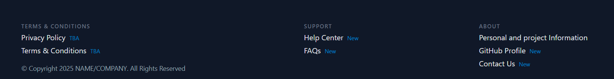
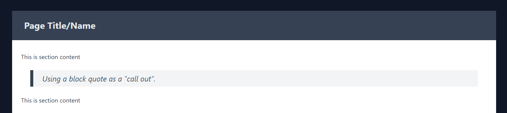

# Installing and Continuously Rebuilding TailwindCSS

The notes that follow are heavily influenced by Paul Magadi's Repo "Tailwind CSS Installation using Vite"

> Paul Magadi. (2025). GitHub - paulmagadi/Tailwind-install-Vite-JS: 
> Tailwind CSS Installation Using Vite. GitHub. https://github.com/paulmagadi/Tailwind-install-Vite-JS

# Install TailwindCSS v4

Open the Windows terminal

Make sure you are in your home folder:

```bash
cd ~
```

Verify you have a `Source/Repos` folder using:

```shell
ls -l Source
```

You should see an entry like:
```text
drwxr-xr-x 1 USER_NAME GROUP_NAME 0 Jul 31 09:38 Repos/
```

If no source folder, then use the following to make one:

```shell
mkdir -p Source/Repos 
```

Now move into that folder:

```shell
cd ~/Source/Repos
```

> **IMPORTANT**
> 
> In Room 3-06 we MUST use a slightly different command to get into the home folder:
>
>  ```bash
>  cd /c/Users/USERNAME
>  ```

Create a new project folder, and change into it:

```shell
mkdir TailwindCSS-Demo-2015-s2
cd TailwindCSS-Demo-2025-s2
```

## 🚀 Tailwind CSS Installation Using Vite

This guide helps you set up Tailwind CSS in a **Vite + Vanilla JavaScript** project.

---

### 1. Create a Vite Project

```bash
npm create vite@latest .
```

When prompted select:
- **Vanilla** and
- **JavaScript**

Install dependencies:

```bash
npm install
```

---

### 2. Install Tailwind CSS with Vite Plugin

```bash
npm install tailwindcss @tailwindcss/vite
```

---

### 3. Configure Vite to Use Tailwind CSS

In the root directory, create a `vite.config.js` file (if not auto-created):

```shell
touch vite.config.js
```

In this file, add (or update):

```js
// vite.config.js
import { defineConfig } from 'vite'
import tailwindcss from '@tailwindcss/vite'

export default defineConfig({
  plugins: [tailwindcss()],
})
```

---

## 4. Create and Configure Tailwind CSS

Create a new set of folders, and add empty `.gitignore` files to them:

```shell
mkdir -p src assets/{js,css,images,media,downloads,webfonts}
touch {src,assets,assets/{css,js,images,media,downloads,webfonts}}/.gitignore
```

#### 4.1 Tidy up the Vite Installation Content

We will create a backup folder that is ignored to hold the vite created files:

```shell
mkdir _backup
```

Now copy/move the files to the new folder:

```shell
cp index.html _backup/
cp -r src/ _backup/
cp -r public/ _backup/

rm public/* src/{*.js,*.svg,*.css}
```

#### 4.2 Create the Styles CSS file

In your `src/` folder, create a `styles.css` file and add:

```shell
touch src/styles.css
```

Now add the following:

```css
/* src/styles.css */
@import "tailwindcss";
```


---

## 5. Add Tailwind to Your HTML

Open the `/index.html` file.

Use <kbd>CTRL</kbd>+<kbd>A</kbd> to select all the content, and press <kbd>DEL</kbd> to delete it.

Now enter <code>!</code> and press <kbd>TAB</kbd> to create the starter code for an HTML 5 document.

Update the lines shown below to match as required:

| Line No. | Old Code | New Code       |
|----------|-------------------|----------------|
| 2        | `lang="en"`                | `lang="en_AU"` |
| 8        | `Document`                  | ` Demo | YOUR_INITIALS`       |

After the `<title> ... </title>` element, and before the `</head>`, press enter twice and add:

```html
    <!-- Web Fonts -->
    
    <!-- CSS Includes -->
    <link href="/src/styles.css" rel="stylesheet">

    <!-- JS includes -->
```

Make sure you have at least one blank line before the `</head>`.

Update the `<body>` tag to read:

```html
<body class="font-sans antialiased text-gray-900 bg-gray-100 flex flex-col">
```

#### 5.1 Add Sample Content

Inside the `<body> ... </body>` section (which is currently a blank line), add the following:

```html
    <h1 class="text-3xl font-bold underline text-amber-500 text-center mt-10">
      Hello world!
    </h1>
```

---

## 6. Run the Development Server

```bash
npm run dev
```

Visit `http://localhost:5173` to see your Tailwind-styled project!


### 7. Update Demo Code

We are now going to add some basic content to see how TailwindCSS is used.

#### 7.1 Add Header & Navigation

Edit the code and replace the current `<h1>...</h1>` element with:

```html
<div class="bg-gray-900 m-0 p-0 text-gray-200 ">
    <header class="text-gray-600 body-font container mx-auto flex flex-row p-5 mb-6 justify-between items-center">

        <h1>
            <a class="flex title-font font-medium items-center text-gray-400 mb-4 md:mb-0">
                <span class="ml-3 text-xl inline-block">Company Name</span>
            </a>
        </h1>
        
        <!-- TODO: Navigation -->
        
    </header>
    
    <!-- TODO: Main Content -->
    
    <!-- TODO: Footer -->
</div>
```

Visit the web page and see the changes take effect.

##### 7.1.1 Navigation part 1

Let's now add the first part of the navigation.

Replace the `<!-- TODO: Navigation -->` with:

```html
<nav class="md:mr-auto md:ml-4 md:py-1 md:pl-4
            text-gray-500
            flex flex-wrap items-center text-base justify-left grow">
    <a class="mr-5 py-2
              hover:text-gray-100
              border-0 border-b-2 border-b-gray-500 hover:border-gray-200">
        First Link
    </a>
    <a class="mr-5 py-2
              hover:text-gray-100
              border-0 border-b-2 border-b-gray-500 hover:border-gray-200">
        Second Link
    </a>
    <a class="mr-5 py-2
              hover:text-gray-100
              border-0 border-b-2 border-b-gray-500 hover:border-gray-200">
        Third Link
    </a>
    <a class="mr-5 py-2
              hover:text-gray-100
              border-0 border-b-2 border-b-gray-500 hover:border-b-gray-200">
        Fourth Link
    </a>
</nav>

<!-- TODO: Navigation Part 2 -->

```

Save the updated code and check the web page preview.


##### 7.1.2 Navigation part 2

Let's now add the second part of the navigation.


Replace the `<!-- TODO: Navigation Part 2 -->` with:

```html
<nav class="md:mr-auto md:ml-4 md:py-1 md:pl-4
            text-gray-500
            flex flex-wrap items-center text-base justify-right">
    <a class="mr-5 py-2
              hover:text-gray-100
              border-0 border-b-2 border-b-gray-500 hover:border-gray-200">
        Login
    </a>
    <a class="mr-5 py-2
              hover:text-gray-100
              border-0 border-b-2 border-b-gray-500 hover:border-gray-200">
        Register
    </a>
</nav>
```

Save the updated code and check the web page preview.


#### 7.2 Add Footer & Quick Links

Edit the code, and replace the `<!-- TODO: Footer -->` with:

```html
<footer class="p-8 pb-12 mt-8 mx-auto
            container grow w-full overflow-hidden
            gap-12 flex flex-wrap justify-between">
        
    <!-- TODO: Footer Left Side -->

    <!-- TODO: Footer Middle -->

    <!-- TODO: Footer Right Side -->

    </footer>
```

Visit the web page and see the changes take effect.

##### 7.2.1 Footer Left Side

Edit the code, and replace the `<!-- TODO: Footer Left Side -->` with:

```html

<nav>
    <h5 class="text-left font-medium tracking-widest text-gray-500 uppercase title-font text-xs">
        Terms & Conditions
    </h5>

    <a class="my-1 block" href="/#">
        Privacy Policy
        <span class="text-sky-600 text-xs p-1">TBA</span>
    </a>

    <a class="my-1 block" href="/#">
        Terms & Conditions
        <span class="text-sky-600 text-xs p-1">TBA</span>
    </a>

    <p class="mt-4 text-sm capitalize text-gray-400">
        © Copyright 2025 NAME/COMPANY. All rights reserved
    </p>
</nav>

<!-- TODO: Footer Middle -->

<!-- TODO: Footer Right Side -->

</footer>
```


##### 7.2.1 Footer Middle

Edit the code, and replace the `<!-- TODO: Footer Middle -->` with:

```html
        <nav>
            <h5 class="text-left font-medium tracking-widest text-gray-500 uppercase title-font text-xs">
                Support
            </h5>

            <a class="my-1 block" href="https://help.screencraft.net.au">
                Help Center
                <span class="text-sky-600 text-xs p-1">New</span>
            </a>
            <a class="my-1 block" href="https://help.screencraft.net.au/hc/2680392001">
                FAQs
                <span class="text-sky-600 text-xs p-1">New</span>
            </a>

        </nav>
        
        <!-- TODO: Footer Right Side -->

```

Refresh the browser after saving...


##### 7.2.1 Footer Right Side

Edit the code, and replace the `<!-- TODO: Footer Right Side -->` with:

```html
        <nav>
            <h5 class="text-left font-medium tracking-widest text-gray-500 uppercase title-font text-xs">
                About
            </h5>

            <a class="my-1 block" href="/about">
                Personal and project Information
                <span class="text-sky-600 text-xs p-1"></span>
            </a>

            <a class="my-1 block" href="https://github.com/YOUR_GITHUB_NAME">
                GitHub Profile
                <span class="text-sky-600 text-xs p-1">New</span>
            </a>

            <a class="my-1 block" href="#contact">
                Contact Us
                <span class="text-sky-600 text-xs p-1">New</span>
            </a>

    <a href="#page-top" class="bock mt-6 text-sm text-gray-400">Jump to Top</a>

</nav>
```

You should now see a nicely laid out footer for the page.




#### 7.3 Add Main Content

The final step of creating this sample page is to add the main content.

Edit the code and replace the current `<!-- TODO: Main Content -->` with:

```html
 <main class="min-h-screen flex flex-col gap-8
             container grow w-full overflow-hidden
             px-6 mx-auto
             bg-white text-gray-700">

    <!-- Page Heading -->
    <header class="-mx-6
                     bg-gray-700 text-gray-200
                       py-6 px-4 sm:px-6 lg:px-8">
        <h2 class="font-bold text-2xl leading-tight">
            Page Title/Name
        </h2>
    </header>

    <section class="gap-6 flex flex-col">

        <p>This is section content</p>

        <blockquote class="bg-gray-100 border-l-8 border-r-gray-600 mx-6 p-2 pl-6 italic">
            <p class="text-xl text-gray-600">
                Using a block quote as a "call out".
            </p>
        </blockquote>

        <p>This is section content</p>

    </section>

</main>
```

Visit the web page and see the changes take effect.



There we have a base page layout.

## 8. Exercise - Update to make it yours

There are several items you **must** update on this demo when you use it.

They include:

- The company (or site) name
  - This must reflect the company or individual or client
  - You will usually have an icon/logo in the header
  - You MAY also have the company name in the header with the icon/logo
  - You must have the company name in the footer
  
- Correct Dates
  - Make sure the date is correct in the footer
  
- GitHub profile link

- Personal and Project Information (this should be the `About` page)

Depending on the site, you may also need to include any number of the following pages:

- About
- Terms and Conditions
- Privacy Policy
- Help center
- FAQs
- Contact Us

and other links to 'static' pages as needed.

