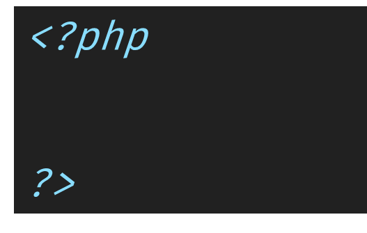
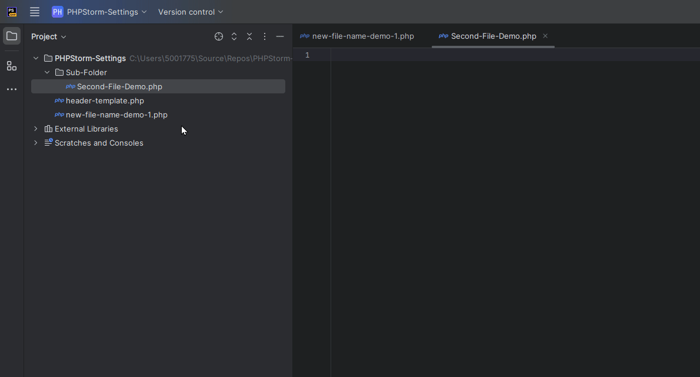

# PHP Basics I

PHP: Hypertext Preprocessor
- a recursive acronym

Executed:
- Using a PHP ‘interpreter’ on
- a web server

Generates output based on executed code, and data sources as required

---

# What is PHP

PHP is…
- A server side language

Runs on many ‘platforms’:
- Linux
- Windows
- Mac OS 
- etc

https://www.phptutorial.net/php-tutorial/what-is-php/

---

PHP Interpreter can be executed on most modern web servers, inlcuding:
- Apache
- NginX
- IIS
- etc

---

It is FREE!

Supports wide range of databases
- MySQL, PostgreSQL, MariaDB, Oracle, MS SQL Server, MongoDB, Redis and many more
- Support is via PHP Extensions


---

# Installing PHP

We recommend using Laragon on Windows machines and Laravel Herd on MacOS.

- https://www.phptutorial.net/php-tutorial/install-php/
- Laravel Herd
- Laragon

Updating PHP on Laragon is really simple. Instructions may be found here:
- 

---

# Basic PHP Page


(from: [Duck - Free animals icons (flaticon.com)](https://www.flaticon.com/free-icon/duck_2307968?term=rubber+duck&page=1&position=36&origin=search&related_id=2307968))

---
## PHP Tags

Open: `<?php`
Close: `?>`


---

## Comments in PHP

There are **three** ways to comment in PHP:

### Single Line

Start the comment with  `//`, all text on the same line after this is part of the comment.

```php
$table->rememberToken(); // Remember user previously logged in
```

### Multi-Line

Start the line with `/*`, each line after has one space at the start and then an `*`. The comment is closed by ` */` (yes , there is a space before the `*`).

```php
/*  
 * Run the migrations. 
 */
```

### Document Blocks (PHP DocBlock)

Start the line with `/**`, each line after has one space at the start and then an `*`. The comment is closed by ` */` (yes , there is a space before the `*`).

```php
/**  
 * Update the user's profile information. 
 * 
 * @param ProfileUpdateRequest $request  
 * @return RedirectResponse  
 */
```


More details:
- https://www.phptutorial.net/php-tutorial/php-comments/

---

## Basic Page continued

Every PHP File must have documentation

- Indicates what it the code does
- Indicates who the code is by
- Indicates when code was started


---

## Basic PHP Continued

Setting up the template

Copy this code into your clipboard:

```php
/**
 * FILE TITLE GOES HERE
 *
 * DESCRIPTION OF THE PURPOSE AND USE OF THE CODE
 * MAY BE MORE THAN ONE LINE LONG
 * KEEP LINE LENGTH TO NO MORE THAN 96 CHARACTERS
 *
 * Filename:        ${FILE_NAME}
 * Location:        FILE_LOCATION
 * Project:         ${PROJECT_NAME}
 * Date Created:    ${DATE}
 *
 * Author:          YOUR_NAME (YOUR GITHUB ACCOUNT LINK)
 *
 */
```

Open PHP Storm settings
<kbd>CTRL</kbd> + <kbd>ALT</kbd> + <kbd>S</kbd> (PC)
<kbd>CTRL</kbd> + <kbd>,</kbd> (MAC)

Locate “Editor” Option
Locate “File and Code Templates”
Click on the “Includes” tab in new dialog


---

Locate and click on “PHP File Header”
Click in the editor (right hand side)
Paste the code into this space (<kbd>CTRL</kbd> + <kbd>V</kbd>)
Edit `YOUR_NAME` and `YOUR_EMAIL_ADDRESS` to show your name ONLY
Click OK
Click OK to close settings


When you create the file, you will need to replace the `FILE_LOCATION` with the folder path the file is in. 

For example: `App/Models/`. 

Also, make sure the placeholder (IN ALL CAPS) text is replaced with a one line title and, if required, a short description of the code and its purpose. If no description is needed, then the long text may be removed.

---

## PHP Hello World

https://www.phptutorial.net/php-tutorial/php-hello-world/

---

## Naming Conventions: Files

Filenames must:
- Start with a letter
- Use only `A`-`Z`, `a`-`z`, `0`-`9`, or the dash `-`

PHP Class Files must be:
- Pascal Case (`PascalCase`), 
- MAY Have dashes `-` (or underscores `_`) between words


---

# Basic Syntax & Sensitivity


- [PHP Syntax (phptutorial.net)](https://www.phptutorial.net/php-tutorial/php-syntax/)


---

## New file in PhpStorm

#### Method One - The Pancake Stack

- Click on the folder the file is to be created in
- Click the "pancake stack" icon, then File (in menu)
- Click New
- Select PHP File from the list
- Type in the name of the file
	- Use only a-z, A-Z, 0-9, full stops (.) and dashes (-)


#### Method Two - The Right Mouse Click

- Right Mouse click on the folder the file is to be created in
- Click New
- Select PHP File from the list
- Type in the name of the file
	- Use only a-z, A-Z, 0-9, full stops (.) and dashes (-)



#### Method Three - The Keyboard Junkie

- Press <kbd>ALT</kbd> + <kbd>1</kbd>
- Use <kbd>UP</kbd>/<kbd>DOWN</kbd> to highlight the relevant folder
- Press <kbd>ALT</kbd> +<kbd>INSERT</kbd>
- Select PHP File
- Type in the name of the file
	- Use only a-z, A-Z, 0-9, full stops (.) and dashes (-)


---

## PHP and HTML (et al)

If the PHP has non-PHP after or surrounding it then:
- Close tag must be present on each PHP block

If the PHP Code does not have non-PHP after it then:
- Close tag may be omitted 

- [PHP Syntax (phptutorial.net)](https://www.phptutorial.net/php-tutorial/php-syntax/)

---

## Basic PHP with HTML Page (Empty)

If you create a new PHP file it contains (with our new template):

```
<?php  
/**  
 * FILE TITLE GOES HERE
 *
 * DESCRIPTION OF THE PURPOSE AND USE OF THE CODE
 * MAY BE MORE THAN ONE LINE LONG
 * KEEP LINE LENGTH TO NO MORE THAN 96 CHARACTERS
 *
 * Filename:        empty.php 
 * Location:        ${FILE_LOCATION} 
 * Project:         SaaS-FED-Notes 
 * Date Created:    9/08/2024
 * 
 * Author:          YOUR_NAME <YOUR_GITHUB_ADDRESS>  
 *  
 */
```

To add the base HTML to this file we do the following:

Close the PHP element using `?>`.

Press <kbd>ENTER</kbd>

Now type in `html:5` and press the TAB key...

The following will be added to the file:
```html
<!doctype html>  
<html lang="en">  
<head>  
    <meta charset="UTF-8">  
    <meta name="viewport"
          content="width=device-width, user-scalable=no, initial-scale=1.0, maximum-scale=1.0, minimum-scale=1.0">  
    <meta http-equiv="X-UA-Compatible" content="ie=edge">  
    <title>Page Title</title>  
</head>  
<body>    
  
</body>  
</html>
```

---

## PHP Within HTML

```php
<!doctype html>  
<html lang="en">  
<head>  
    <meta charset="UTF-8">  
    <meta name="viewport"          content="width=device-width, user-scalable=no, initial-scale=1.0, maximum-scale=1.0, minimum-scale=1.0">  
    <meta http-equiv="X-UA-Compatible" content="ie=edge">  
    <title>PHP with HTML</title>  
</head>  
<body>  
<?php    
// PHP embedded inside PHP    
echo "Hello World.";  
?>  
</body>  
</html>
```

You only need to close the PHP tag if there is HTML after the PHP code.

---

## PHP After HTML

```php
<!doctype html>  
<html lang="en">  
<head>  
    <meta charset="UTF-8">  
    <meta name="viewport"
          content="width=device-width, user-scalable=no, initial-scale=1.0, maximum-scale=1.0, minimum-scale=1.0">  
    <meta http-equiv="X-UA-Compatible" content="ie=edge">  
    <title>PHP with HTML</title>  
</head>  
<body>  

</body>  
</html>

<?php    
// PHP embedded after HTML
// do something here
```


---
## PHP Before HTML

```php
<?php  
    // Add PHP code after the Document Block

?>  
<!doctype html>  
<html lang="en">  
<head>  
    <meta charset="UTF-8">  
    <meta name="viewport"
          content="width=device-width, user-scalable=no, initial-scale=1.0, maximum-scale=1.0, minimum-scale=1.0">  
    <meta http-equiv="X-UA-Compatible" content="ie=edge">  
    <title>PHP with HTML</title>  
</head>  
<body>  

</body>  
</html>
```

Note the close PHP element tag.

---


# References

_PHP Tutorial_. (n.d.). PHP Tutorial. https://www.phptutorial.net/
