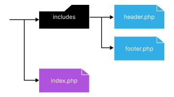
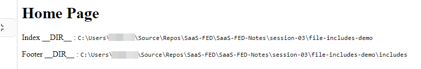
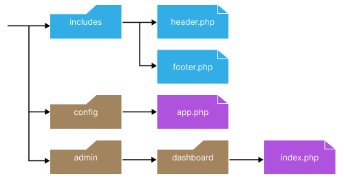
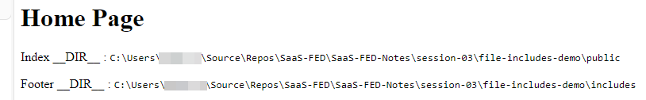

# PHP Basics II

# Arrays

See [S03-PHP-Basics-II](S03-PHP-Basics-II.md)

Further reading:
- https://www.phptutorial.net/ section 11

# Organising Files

We can include or require files to be included in PHP.

### Include - warn if missing

```php
include 'functions.php';  
```

### Only Include ONCE - warn if missing

```php
include_once 'functions.php';
```

### Must Include - Error and halt if missing

```php
require 'functions.php'; 
```

### Must Include ONCE - Error and halt if missing

```php
require_once 'functions.php';
```

## Using `__DIR__` magic constant

`__DIR__` is technically the same as writing `dirname(__FILE__)`.

`__FILE__` gives the full path and filename of the file or [include](https://www.phptutorial.net/php-tutorial/php-include-file/)

This means we may use this to help locate files within the folder structure.

### Example 1:

If you have a `session-03 folder`, make sure you start in this.

```shell
cd session-03
```

Create a new folder and name it `file-include-demo`. Inside this you will also create a folder called `includes`. You will also have three new PHP files, index, header and footer.

```shell
mkdir -p file-include-demo/includes
touch file-includes-demo/includes/{header,footer}.php
touch file-includes-demo/index.php
```

This will result in a structure like this:

```text
file-include-demo
  ├── includes 
  │      ├── footer.php 
  │      └── header.php 
  └── index.php
```



Edit the `header.php` and add:

```php
<?php  
/**  
 * Header Include 
 * 
 * Based on https://www.phptutorial.net/php-tutorial/php-__dir__/ 
 * 
 * Filename:        app.php 
 * Location:        session-03/file-includes-demo/includes 
 * Project:         SaaS-FED-Notes 
 * Date Created:    9/08/2024 
 * 
 * Author:          Adrian Gould <Adrian.Gould@nmtafe.wa.edu.au>  
 *
 */
?>  
<!DOCTYPE html>  
  
<html lang="en">  
<head>  
    <meta charset="UTF-8">  
    <meta name="viewport" 
          content="width=device-width, initial-scale=1.0">  
    <title>        
        <?= APP_NAME ?>  
    </title>  
</head>  
<body>
```

Edit the `footer.php` and add:

```php
<?php  
/**  
 * Footer Include 
 * 
 * Based on https://www.phptutorial.net/php-tutorial/php-__dir__/ 
 * 
 * Filename:        app.php 
 * Location:        session-03/file-includes-demo/includes 
 * Project:         SaaS-FED-Notes 
 * Date Created:    9/08/2024 
 * 
 * Author:          Adrian Gould <Adrian.Gould@nmtafe.wa.edu.au>  
 * 
 */
?>  
  
<p>Footer __DIR__ :  
    <code><?= __DIR__ ?></code>  
</p>  
  
</body>  
</html>
```

Edit the `index.php` and add:

```php
<?php require 'includes/header.php' ?>
<h1>Home Page</h1>
	<p>Index __DIR__ : 
		<code><?= __DIR__ ?></code>
	</p>
<?php require 'includes/footer.php' ?>
```
\
Resulting in something similar to:



### Example 2

Using the previous example as a base, create new folders and files to match the following structure.




```text
file-include-demo
├── admin
│   └── dashboard
│       └── index.php
├── config
│   └── app.php
├── includes
│   ├── footer.php
│   └── header.php
└── public
    └── index.php
```


To make things a little faster, move the current `index.php` file into the public folder, and copy it into the dashboard folder.

```shell
mkdir -p file-includes-demo/{config,public,admin/dashboard}
cp file-includes-demo/index.php file-includes-demo/public
mv file-includes-demo/index.php file-includes-demo/admin/dashboard
```

The `config/app.php` contains the application’s configuration:

```php
define('APP_NAME', '__DIR__ Demo Version 2');
```

Update the `header.php` file to include the `config.php` file:

```php
<?php  
/**  
 * Header Include 
 * 
 * Based on https://www.phptutorial.net/php-tutorial/php-__dir__/ 
 * 
 * Filename:        app.php 
 * Location:        session-03/file-includes-demo/includes 
 * Project:         SaaS-FED-Notes 
 * Date Created:    9/08/2024 
 * 
 * Author:          Adrian Gould <Adrian.Gould@nmtafe.wa.edu.au>  
 *
 */

require "../config.app.php";
?>  
<!DOCTYPE html>  
  
<html lang="en">  
<head>  
    <meta charset="UTF-8">  
    <meta name="viewport" 
          content="width=device-width, initial-scale=1.0">  
    <title>        
        <?= APP_NAME ?>  
    </title>  
</head>  
<body>
```

The header also now uses the `APP_NAME` constant.

The footer has not changed.

Now we can update the dashboard and public `index.php` files.

Open the `public/index.php` file and make sure it matches:

```php
<?php  
/**  
 * Dashboard "Home page" 
 * 
 * Based on https://www.phptutorial.net/php-tutorial/php-__dir__/ 
 * 
 * Filename:        app.php 
 * Location:        session-03/file-includes-demo/admin/dashboard 
 * Project:         SaaS-FED-Notes 
 * Date Created:    9/08/2024 
 * 
 * Author:          Adrian Gould <Adrian.Gould@nmtafe.wa.edu.au>  
 * 
 */  
 
require '../includes/header.php';  
  
?>  
    <h1>Home Page</h1>  
    <p>Index __DIR__ :  
        <code><?php echo __DIR__ ?></code>  
    </p>
<?php  
require '../includes/footer.php';  

```

Open the `admin/dashboard/index.php` file and make sure it matches:

```php
<?php  
/**  
 * Dashboard "Home page" 
 * 
 * Based on https://www.phptutorial.net/php-tutorial/php-__dir__/ 
 * 
 * Filename:        index.php 
 * Location:        session-03/file-includes-demo/admin/dashboard 
 * Project:         SaaS-FED-Notes 
 * Date Created:    9/08/2024 
 * 
 * Author:          Adrian Gould <Adrian.Gould@nmtafe.wa.edu.au>  
 * 
 */  

require '../includes/header.php';  
  
?>  
    <h1>Home Page</h1>  
    <p>Index __DIR__ :  
        <code><?php echo __DIR__ ?></code>  
    </p>
    
<?php require '../includes/footer.php';

```

When you navigate to/open the `public/index.php` file you should get content similar to:



```text
Home Page

Index __DIR__ : `C:\Users\xxxxxx\Source\Repos\SaaS-FED\SaaS-FED-Notes\session-03\file-includes-demo\public`

Footer __DIR__ : `C:\Users\xxxxxx\Source\Repos\SaaS-FED\SaaS-FED-Notes\session-03\file-includes-demo\includes`
```


But when you open the `dashboard/admin/index.php`.


```text
**Warning**: require(../includes/header.php): Failed to open stream: No such file or directory in **C:\Users\xxxxxx\Source\Repos\SaaS-FED\SaaS-FED-Notes\session-03\file-includes-demo\admin\dashboard\index.php** on line **17**  
  
**Fatal error**: Uncaught Error: Failed opening required '../includes/header.php' (include_path='.;C:/ProgramData/Laragon/etc/php/pear') in C:\Users\xxxxxx\Source\Repos\SaaS-FED\SaaS-FED-Notes\session-03\file-includes-demo\admin\dashboard\index.php:17 Stack trace: #0 {main} thrown in **C:\Users\xxxxxx\Source\Repos\SaaS-FED\SaaS-FED-Notes\session-03\file-includes-demo\admin\dashboard\index.php** on line **17**
```

This error is generated because the `require` lines in the `header.php` file do not navigate back up the file system tree enough (change the `../` to `../../`).

If you refresh you will still see an error.

The next issue is because the `headerr.php` file is still unable to locate and load the `app.php` file in the config folder.

To fix this use the `__DIR__` in the header file, by changing the include for the config to:

```php
require __DIR__. '/../config/app.php';
```


Further reading:
- https://www.phptutorial.net/ section 12
- Above notes based on this reading

# Functions

https://www.phptutorial.net/ section 6
https://www.phptutorial.net/ section 9

# Testing variables

https://www.phptutorial.net/ Section 10


# HTML Forms and PHP

https://www.phptutorial.net/ section 14

https://www.phptutorial.net/php-tutorial/php-form/

https://www.phptutorial.net/php-tutorial/php-form-validation/


# Cookies and Sessions

https://www.phptutorial.net/ Section 13


