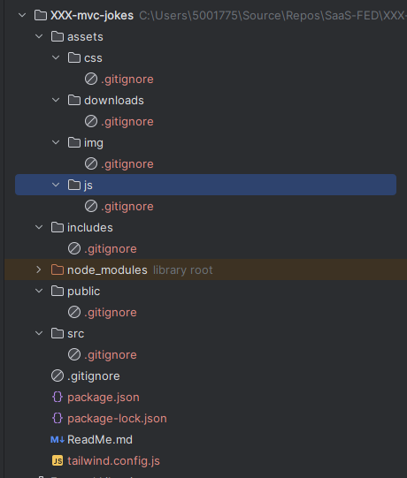

# Session 05 Exercises and Journal Entry

Here are your instructions for this session's Journal and other exercises and practice.

```table-of-contents
title: # Contents
style: nestedList
minLevel: 0
maxLevel: 3
includeLinks: true
```

## Journal

Review the content so far, and note what has been learned.

# External Coursework

PHP From Scratch

- [Database & PDO](https://www.traversymedia.com/products/php-from-scratch-beginner-to-advanced/categories/2154269413)

# Exercises

Remember we use the bash (git-bash) terminal for our command line work.

On Windows devices you will need to install and run the Windows Terminal application, then configure it to use the `git-bash` CLI.

Useful links for this:

- [Windows terminal on Microsoft Store](https://apps.microsoft.com/detail/9n0dx20hk701?hl=en-gb&gl=AU)
- [Setting up Git bash on Windows Terminal](https://help.screencraft.net.au/hc/2680392001/65/add-git-bash-to-microsoft-terminal?category_id=35)
- [Adding Command Line Aliases to make you life easier](https://help.screencraft.net.au/hc/2680392001/66/add-bash-command-line-aliases-for-git?category_id=35)

## Exercises Preparation

Before commencing, open a (bash) terminal and follow these instructions, replacing `XXX` with your (lowercase) initials.

```shell

mkdir XXX-mvc-jokes
cd XXX-mvc-jokes
git init .
mkdir -p assets/{css,js,img,downloads}
mkdir src includes public database templates
touch ReadMe.md .gitignore 
touch {src,includes,public,database,templates}/.gitignore
touch assets/{css,js,img,downloads}/.gitignore
npm install -D tailwindcss
npx tailwindcss init
git add ReadMe.md .gitignore
git commit -m "init: Start of MVS Project
```

Following these commands, open the folder as a PhpStorm project and check the structure is similar to the following image (it is missing the`database` folder):



## Exercise 1

Edit the `tailwind.config.js` file and edit/add:

```js
/** @type {import('tailwindcss').Config} */
module.exports = {
    content: [
        "./**/*.{php,html}",
        "./assets/js/*.js",
    ],
    theme: {
        extend: {},
    },
    plugins: [],
}
```

## Exercise 2

Create a new SQL file (filename: `setup.sql`) and save it in the database folder.

At the top of the file add a suitable comment describing the purpose of the file, the author, date created and the
version.

```text
/*  
 * ONE LINE PURPOSE OF THE FILE 
 * 
 * Author:  YOUR NAME 
 * Created: YYYY-MM-DD
 * Version: 1.0
 * 
 */
```

In the SQL file create the SQL to do the following:

- If the database `xxx_mvc_jokes` exists, drop it.
- If the user `xxx_mvc_jokes` exists, drop it.
- Create the database  `xxx_mvc_jokes`.
- Create the user `xxx_mvc_jokes` allowing them access from `127.0.0.1` with the password of `Password1234`.
- Grant the user full access to the `xxx_mvc_jokes` database.
- Grant the user usage on all databases.

> **Note:** Remember that users and databases can only use lower case letters, numbers and the underscore.
>
> It is convention to only use LOWER CASE and UNDERSCORE.

## Exercise 3

Create a new SQL file called `tables.sql`.

At the top of the file add a suitable comment describing the purpose of the file, the author, date created and the
version.

```text
/*  
 * ONE LINE PURPOSE OF THE FILE 
 * 
 * Author:  YOUR NAME 
 * Created: YYYY-MM-DD
 * Version: 1.0
 * 
 */
```

In this file add the SQL to create the following tables with the provided specifications.

> Remember that field and table names MUST only contain `a`-`z` and underscore (`_`).
>
> It is convention to only use LOWER CASE and UNDERSCORE.

| Table Name | Field Name | Type                 | Length | Default           | Other         |
|------------|------------|----------------------|--------|-------------------|---------------|
| jokes      | id         | unsigned big integer |        |                   | Autoincrement |
|            | question   | text                 |        |                   |               |
|            | answer     | text                 |        |                   | Nullable      |
|            | tags       | varchar              | 192    |                   | Nullable      |
|            | created at | datetime             |        | CURRENT_TIMESTAMP |               |
|            | updated at | datetime             |        | null              | nullable      |
|            | author id  | unsigned big integer |        | 0                 |               |
|            |            |                      |        |                   |               |

This table should have the following indexes added:

```sql
PRIMARY KEY (`id`),  
FULLTEXT `joke_text` (`joke`),  
FULLTEXT `tag_index` (`tags`)
```

The second tables details are:

| Table Name | Field Name    | Type                 | Length | Default                                                    | Other         |
| ---------- | ------------- | -------------------- | ------ | ---------------------------------------------------------- | ------------- |
| users      | id            | unsigned big integer |        |                                                            | Autoincrement |
|            | given name    | varchar              | 64     |                                                            | not null      |
|            | family name   | varchar              | 64     |                                                            | nullable      |
|            | email         | varchar              | 320    |                                                            | not null      |
|            | user password | varchar              | 255    | PASSWORD('Password1') - we will use an MD5 hash in the PHP | not null      |
|            | created at    | datetime             |        | CURRENT_TIMESTAMP                                          |               |
|            | updated at    | datetime             |        | null                                                       | nullable      |
|            |               |                      |        |                                                            |               |

This table should have the following indexes as part of its definition:

```sql
PRIMARY KEY (`id`),  
UNIQUE `email_index` (`email`),  
INDEX  `given_family`(`given_name`,`family_name`),  
INDEX  `family_given`(`family_name`,`given_name`)
```

## Exercise 3

Create a suitable `config.php` file in the root of your project, and add variables as described below:

- dbUser
- dbPass
- dbHost
- dbName

## Exercise 4

Create a new Class file called `Connection.php` file in the includes folder.

This connection class will use a static method `make` to create and return a PDO instance.

## Exercise 5

Create a PHP Class file called `Utilities.php` in the includes folder.\

The Utilities class will provide a number of static methods that include:

- `dump` which will dump the contents of one or more variables in a suitably formatted way.
- `dd` which will dump the contents of one or more variables then terminate the script using the `die()` function

## Exercise 6

Create a new file `db-test.php` in the root of your project.

This file is to:

- connect to your database
- dump the PDO connection information

## Exercise 7

Create a basic HTML5 web page in the templates folder and name it `template.html`.

Edit the template file and update the required parts to include tghe new lines from below 

```html
    <!-- Stylesheets and Fonts -->  
    <link rel="stylesheet" href="/assets/css/site.css">  
          
<!-- Pre-page load and deferred JavaScript -->  

</head>  
<body>  
  
  
<!-- Post Page load JavaScript -->
</body>
```

Use this file to help build the next two files.

Create a `header.php` file in the `templates` folder

- The file will contain the standard HTML5 code up to `<body>`

Create a `footer.php` file in the `templates` folder

- this file will contain the end of the template including the comment added to the template file.


## Exercise 8

Create a new folder called `views`, and inside this folder two more folders, one for `users` and one for `jokes`.

Make sure that all three folders have `.gitignore` files using the `touch` command.


## Exercise 9

In the `views/users` folder create a PHP file (`index.php`) that uses the echo command to show "Users Index".

In the `views/jokes` folder create a PHP file (`index.php`) that uses the echo command to show "Jokes Index".


In the public folder, create an `index.php` file that:

- Provides a link to the users index page.
- Provides a link to the jokes index page.


## Exercise 10

Create a new file `app.css` in the `src` folder.

In this file add:

```css
@tailwind base;
@tailwind components;
@tailwind utilities;
```

## Exercise 11

Start a new git bash terminal, and use the following commands:

```bash
cd xxx-mvc-jokes
npx tailwindcss -i ./src/app.css -o ./assets/css/site.css --watch
```

This should watch for changes in your `html`, `php` and `js` files and automatically rebuild the `site.css` file for you.

## Exercise 12

We are now at the point of creating the basic CRUD/BREAD pages.

Create each of the the following empty PHP files:

- `views/users/create.php`
- `views/users/show.php`
- `views/users/update.php`
- `views/users/delete.php`

In each of these files, include the `header.php` and `footer.php` as required.


## Exercise 13

Open the new `create.php` file, and add the following:

- A heading that says: "User Management: Create"
- A form that uses the POST method to send a request to the same file (`create.php`) to create a new user.

In the form you will add the following controls, plus appropriate labels that are linked using the `for` attribute.

Also wrap each control in a `<section>` ... `</section>` element similar to this:

```html
<section>
	<label for="test">Test:</label>
	<input type="text" id="Test" name="test" />
</section>
```

| control | type     | name             | id/for      | notes                             |
| ------- | -------- | ---------------- | ----------- | --------------------------------- |
| label   |          |                  | GivenName   | The label should be "Given Name:" |
| input   | text     | given_name       | FamilyName  |                                   |
| label   |          |                  | FamilyName  | Family Name                       |
| input   | text     | family_name      | FamilyName  |                                   |
| label   |          |                  | Email       | Email                             |
| input   | email    | email            | Email       |                                   |
| label   |          |                  | UserPass    | Password                          |
| input   | password | user_password    | UserPass    |                                   |
| label   |          |                  | ConfirmPass | Confirm Password                  |
| input   | password | confirm_password | ConfirmPass |                                   |
| button  | submit   | save             | Save        | Save                              |
| button  | clear    | clear            | Clear       | Clear                             |


Make sure there is also a link back to the users index page.

## Exercise 14

Duplicate the `create.php` and rename it `update.php`.

Edit the heading appropriately.

Change the text and name of the clear button to cancel. change its type to button.


## Exercise 15

Edit the `show.php` file and add a layout that shows the following details:
- id
- given name
- family name
- email address
- date updated

The page should have a suitable link to go to the index page, and the edit page.


## Exercise 16

Edit the `delete.php` file and add a layout that shows the following details:
- id
- given name
- family name
- email address

Add a form that has the following controls:

- a submit button that says Delete
- a button that says Cancel

The page should have a suitable link to go to the index page, and the edit page.

## Exercise 17

Update the `index.php` file to show a suitable layout with the following shown in a table:

- user id
- user given name
- user family name
- user email
- show link to show page
- edit link to update page
- delete link to delete page

Make make sure that the table has appropriate headings.

Also add a dummy line with data for demonstration purposes when testing your page layout.

## Exercise 18

If you have not done so already, visit the pages you have created using the Laragon (or Herd) 'test' domain:

- http://xxx-mvc-jokes.test/views/users/index.php
- http://xxx-mvc-jokes.test/views/users/create.php
- http://xxx-mvc-jokes.test/views/users/update.php
- http://xxx-mvc-jokes.test/views/users/show.php
- http://xxx-mvc-jokes.test/views/users/delete.php

Take screenshots of the current pages, for inclusion in your Journal.

## Exercise 19

Write a database seeder `database/user-seeder.php` using the following data:

| Given Name     | Family Name | eMail                           | Password  |
| -------------- | ----------- | ------------------------------- | --------- |
| Joe            | King        | Joe.King@example.com            | Password1 |
| Crystal Shanda | Lear        | Crystal.Shanda.Lear@example.com | Password2 |
| Anita          | Lift        | Anita.Lift@example.com          | Password3 |
| Jim            | Nasium      | Jim.Nasium@example.com          | Password4 |
| Phil           | O'Stein     | Phil.O'Stein@example.com        | Password5 |
| Ann            | Tartica     | Ann.Tartica@example.com         | Password6 |
| Ray            | Zerzedge    | Ray.Zerzedge@example.com        | Password7 |
| Manny          | King        | Manny.King@example.com          | Password8 |

Use the "create many" example from the notes as a base for this.

The password must be encrypted using the `md5()` function before injecting into the placeholder.

## Exercise 20

Now we get to the fun parts.

In the first of this section of exercises we will be updating the index to show our users in the table.

#### Hints:

At the top of the `index.php` page, before including the page header:

- Use the `Connection` class to create a new PDO instance.
- Retrieve all the users from the users table

In the body of the page:

- Wrap the `<tr>...</tr>` used for the dummy user in a `foreach` loop.
- Check that the page shows multiple copies of the dummy data.


## Exercise 21

- Replace the dummy data with the required fields from the retrieved user.
- Check that the page shows the data correctly.


## Exercise 22

In the table, we need to change some links.

- Change the show link to pass the user id to the show page as part of the URL: `?user_id=x` where x is the actual user's id.
- Repeat for the edit link.
- Repeat for the delete link.

> **Note:**  This is NOT best practice, but provides us with a base to work from.

## Exercise 23

Update the links on all the users view pages to follow the principle outlines in Exercise 22.

## Exercise 24

Complete the required PHP code for the show page, but retrieving the user identified in the `user_id` parameter from the URI.


## Exercise 25

Complete the required PHP code for the create page.


## Exercise 26

Complete the required PHP code for the edit page.

You will need to do the following:
- retrieve the user to be edited
- place the current data into the form fields
- 


