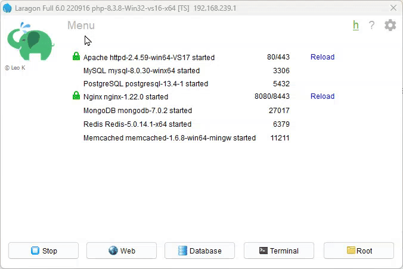

# Creating a Vanilla PHP MVC Application

It is important to note that we are basing this MVC application on the work from the [TailwindCSS Intro](session-05/S05-TailwindCSS-Intro.md) and Brad Traversy's PHP from Scratch course. 

You may also use Brad Traversy's OOP and MVC course that is on the O'Reilly web site. 

If you are a North Metro TAFE student by logging into the O'Reilly site via the NM TAFE library site ([O'Reilly for Higher Education > NMT](https://guides.dtwd.wa.gov.au/az/oreilly-for-higher-education-nmt?ref=az/northmetro)). Instructions on how to do this are found at [O'Reilly for Higher Education > NMT - How to use logon](https://northmetrotafe.libanswers.com/faq/271042).

To understand how he developed this basic framework concept, the process of refactoring from very 'wet' code, and the use of OOP it is important you follow his course through.

Follow the instructions in the [S07-Vanilla-PHP-MVC-Pt-00](session-07/S07-Vanilla-PHP-MVC-Pt-00.md) to create the required folder structure if you have not done so already.

At this point you will have a folder (and file) structure *similar* to this:


## What will we be creating?

We will be creating a demo application that uses MVC. To do this, we will create each part of our vanilla PHP MVC framework, and then create the user interface, and the business logic required.

The project is a simple "product" list, with users.

This product list could easily be modified to be Jokes, Categories, Books or any other collection of items.

## Database Structure

We are going to use MariaDB (or MySQL) for this project.

The SQL below will use the SQL dialect for MariaDB 10+ (and also for MySQL 8+).

Open Laragon, if you have not done so, and make sure that Apache and MySQL are running.

If they are not, click Start All. You should see something similar to this:


For administering the MySQL database, there are a number of options:
- PhpMyAdmin
- HeidiSQL
- ...

Adrian uses a mixture depending on what OS they are using.

For simplicity, we will use PhpMyAdmin.

### Installing PhpMyAdmin

You may not have PhpMyAdmin installed so do the following:

Right Click on the Laragon window.
Hover over Tools
Hover over Quick-Add
Hover over PhpMyAdmin and click

it will then go and download and install PhpMyAdmin for you.



Click on the database button to open PhpMyAdmin in your browser.

Once the page has opened, enter `root` for the username, and leave the password blank.


Click OK to open the administration interface.

## Setting up the Database & Database User

When the interface is open, click on the SQL tab:


In the SQL query area you will now enter:

```sql
-- ---------------------------------------------------------------------------------------------  
--  
-- BEFORE COMMENCING:  
--  
-- - Replace all instances of YYYY with the current year (e.g. 2025)  
-- - Replace all instances of SN with S followed by the semester number (e.g. S1 for semester 1)  
-- - Replace ALL instances of XXX with your initials (e.g. AJG for Adrian Gould)  
--  
-- ---------------------------------------------------------------------------------------------  
  
-- ---------------------------------------------------------------------------------------------  
-- Clean up existing database and user  
  
DROP DATABASE IF EXISTS XXX_SaaS_FED_YYYY_SN;  
DROP USER IF EXISTS 'XXX_SaaS_FED_YYYY_SN'@'localhost';  
DROP USER IF EXISTS 'XXX_SaaS_FED_YYYY_SN'@'127.0.0.1';  
  
  
-- ---------------------------------------------------------------------------------------------  
-- Create Database  
  
CREATE DATABASE IF NOT EXISTS XXX_SaaS_FED_YYYY_SN;  
  
  
-- ---------------------------------------------------------------------------------------------  
-- Create User & Grant Permissions  
-- We create localhost and 127.0.0.1 users just in case IPv6 is detected.  
  
  
CREATE USER 'XXX_SaaS_FED_YYYY_SN'@'localhost'  
    IDENTIFIED WITH mysql_native_password  
    USING PASSWORD('Password1234');  
  
CREATE USER 'XXX_SaaS_FED_YYYY_SN'@'127.0.0.1'  
    IDENTIFIED WITH mysql_native_password  
    USING PASSWORD('Password1234');  
  
GRANT USAGE ON *.*  
    TO 'XXX_SaaS_FED_YYYY_SN'@'localhost';  
  
GRANT USAGE ON *.*  
    TO 'XXX_SaaS_FED_YYYY_SN'@'127.0.0.1';  
  
GRANT ALL PRIVILEGES  
    ON `XXX_SaaS_FED_YYYY_SN`.*  
    TO 'XXX_SaaS_FED_YYYY_SN'@'localhost';  
  
GRANT ALL PRIVILEGES  
    ON `XXX_SaaS_FED_YYYY_SN`.*  
    TO 'XXX_SaaS_FED_YYYY_SN'@'127.0.0.1';  
  
FLUSH PRIVILEGES;
```

> **Important:** Before proceeding:
> -  make sure you change the `XXX` to ***your*** initials.
> - check the syntax carefully.

Clicking the Go button will execute the commands, creating a database called `xxx_saas_vanilla_mvc` and a user with the same name and the password of "`PasswordSecret`".

If you got NO errors then all is well, if you got some then you will need to check your SQL carefully.

## Setting up the Tables

Click on the Show Query Box button, to reveal the previous SQL, we will be adding to the end of this, so that we can make sure that each step works and we are successfully creating the required tables and table structure.

Make sure you have a blank line after the `USE xxx_saas_vanilla_mvc` line. (Remember `xxx` is your initials.)

Now add:

```sql
-- ----------------------------------------------------------------------------------------  
-- Remove any existing Users table  
-- ----------------------------------------------------------------------------------------  
DROP TABLE IF EXISTS `xxx_saas_vanilla_mvc`.`users`;  
  
-- ----------------------------------------------------------------------------------------  
-- Table structure for 'users' table  
-- ----------------------------------------------------------------------------------------  
CREATE TABLE IF NOT EXISTS `xxx_saas_vanilla_mvc`.`users`  
(  
    `id`         int          NOT NULL AUTO_INCREMENT,  
    `name`       varchar(255)      DEFAULT NULL,  
    `email`      varchar(255) NOT NULL,  
    `password`   varchar(255) NOT NULL,  
    `city`       varchar(45)       DEFAULT NULL,  
    `state`      varchar(45)       DEFAULT NULL,  
    `country`    varchar(45)       DEFAULT 'Australia',  
    `created_at` timestamp    NULL DEFAULT CURRENT_TIMESTAMP,  
    PRIMARY KEY (`id`)  
) ENGINE = InnoDB  
  AUTO_INCREMENT = 7  
  DEFAULT CHARSET = utf8mb4  
  COLLATE = utf8mb4_general_ci;
```

This creates the `users` table.

Click Go to run the SQL, checking there are **no** errors.

## Seeding the Users

Again click the Show Query Box.

Now add the following (making sure you have a blank line after the previous SQL):
```sql
-- ----------------------------------------------------------------------------------------  
-- Seed Users Table  
-- The Password is Password1 hashed using the PHP password_hash() method.  
-- ----------------------------------------------------------------------------------------  
INSERT INTO `xxx_saas_vanilla_mvc`.`users`  
VALUES (10, 'Administrator', 'admin@example.com',  
        '$2y$10$4Ae3n2iQ0MwXMNz0UEmNne2PaNyfYsBFYb97nayHWTDCwpnuPi6f.',  
        'Perth', 'WA', 'Australia', '2000-01-01 00:00:01');  
  
INSERT INTO `users`  
VALUES (20, 'Adrian Gould', 'adrian@example.com',  
        '$2y$10$4Ae3n2iQ0MwXMNz0UEmNne2PaNyfYsBFYb97nayHWTDCwpnuPi6f.',  
        'Perth', 'WA', 'Australia', '2024-01-01 10:30:01'),  
       (30, 'YOUR NAME', 'GIVEN_NAME@example.com',  
        '$2y$10$4Ae3n2iQ0MwXMNz0UEmNne2PaNyfYsBFYb97nayHWTDCwpnuPi6f.',  
        'Perth', 'WA', 'Australia', '2024-08-10 16:11:43');  
  
INSERT INTO `users`  
VALUES (100, 'John Doe', 'user1@example.com',  
        '$2y$10$4Ae3n2iQ0MwXMNz0UEmNne2PaNyfYsBFYb97nayHWTDCwpnuPi6f.',  
        'Bunbury', 'WA', 'Australia', '2024-08-15 13:04:21'),  
       (101, 'Jane Doe', 'user2@example.com',  
        '$2y$10$4Ae3n2iQ0MwXMNz0UEmNne2PaNyfYsBFYb97nayHWTDCwpnuPi6f.',  
        'Melbourne', 'VIC', 'Australia', '2024-08-20 13:17:21'),  
       (102, 'Steve Smith', 'user3@example.com',  
        '$2y$10$4Ae3n2iQ0MwXMNz0UEmNne2PaNyfYsBFYb97nayHWTDCwpnuPi6f.',  
        'Adelaide', 'SA', 'Australia', '2024-08-20 17:59:13');
```

## Create and Seed the Products Table

Ok, we are onto the Products table...

Once again click the Show Query Box, and add the following to the end of the query... remember that blank line!

This will create the `products` table...

```sql
-- ----------------------------------------------------------------------------------------  
-- Remove any existing Products table  
-- ----------------------------------------------------------------------------------------  
DROP TABLE IF EXISTS `xxx_saas_vanilla_mvc`.`products`;  
  
-- ----------------------------------------------------------------------------------------  
-- Create the Products table  
-- ----------------------------------------------------------------------------------------  
CREATE TABLE IF NOT EXISTS `xxx_saas_vanilla_mvc`.`products`  
(  
    `id`          bigint unsigned NOT NULL AUTO_INCREMENT,  
    `user_id`     bigint unsigned      DEFAULT 10,  
    `name`        varchar(255)    NOT NULL,  
    `description` text,  
    `price`       int                  DEFAULT NULL,  
    `created_at`  timestamp       NULL DEFAULT CURRENT_TIMESTAMP,  
    PRIMARY KEY (`id`)  
) ENGINE = InnoDB  
  AUTO_INCREMENT = 21  
  DEFAULT CHARSET = utf8mb4  
  COLLATE = utf8mb4_general_ci;
```

Execute and check no errors...

We are almost done...

Now add the following, and then we will execute for the final time, this time seeding the products table...

```mysql
-- ----------------------------------------------------------------------------------------  
-- Seed Products Table  
-- ----------------------------------------------------------------------------------------  
INSERT INTO `xxx_saas_vanilla_mvc`.`products`(`id`, `user_id`, `name`, `description`, `price`, `created_at`)  
VALUES (40380, 20, 'Sheep BrickHeadz',  
        'BrickHeadz theme: This set features an adorable sheep with a cute, blocky design, perfect for collectors and fans of the BrickHeadz series.',  
        1999, '2020-01-01'),  
       (75224, 20, 'Sith Infiltrator Microfighter',  
        'Star Wars theme: A mini version of Darth Maul\'s Sith Infiltrator, part of the LEGO Star Wars Microfighters series, great for Star Wars enthusiasts.',  
        1599, '2019-01-01'),  
       (75223, 20, 'Naboo Starfighter Microfighter',  
        'Star Wars theme: A compact, easy-to-build model of the Naboo Starfighter, perfect for young Star Wars fans.',  
        1599, '2019-01-01'),  
       (75228, 20, 'Escape Pod vs. Dewback Microfighters',  
        'Star Wars theme: This set features a Dewback and an Escape Pod, each with a mini-figure from the Star Wars saga, perfect for imaginative play.',  
        2999, '2019-01-01'),  
       (75317, 20, 'The Mandalorian & The Child BrickHeadz',  
        'Star Wars theme: A BrickHeadz double pack featuring The Mandalorian and The Child (Baby Yoda), perfect for fans of the popular Star Wars series.',  
        2999, '2020-08-01'),  
       (40379, 20, 'Valentine\'s Bear',  
        'BrickHeadz theme: A seasonal BrickHeadz set featuring a charming Valentine\'s Bear holding a heart, ideal for Valentine\'s Day.',  
        1999, '2020-01-01'),  
       (40354, 10, 'Dragon Dance',  
        'Seasonal theme: This Chinese New Year-themed set features a vibrant and detailed dragon dance scene, complete with minifigures and traditional decorations.',  
        8999, '2019-01-01'),  
       (40440, 10, 'German Shepherd',  
        'BrickHeadz theme: A BrickHeadz pet set featuring a cute German Shepherd and puppy, great for dog lovers.',  
        1999, '2021-01-01'),  
       (21108, 30, 'Ghostbusters Ecto-1',  
        'Ideas theme: A LEGO Ideas set featuring the iconic Ecto-1 car from the Ghostbusters movies, complete with minifigures of the Ghostbusters team.',  
        7999, '2014-06-01'),  
       (10226, 30, 'Sopwith Camel',  
        'Creator Expert theme: A detailed model of the Sopwith Camel biplane, part of the LEGO Creator Expert series, perfect for aviation enthusiasts.',  
        13999, '2012-06-01'),  
       (6907, 10, 'Cosmic Cruiser',  
        'Space theme: A classic LEGO Space set featuring a detailed cosmic cruiser spacecraft, part of the Futuron sub-theme.',  
        2999, '1987-01-01'),  
       (6086, 100, 'Black Knight\'s Castle',  
        'Castle theme: A large, fortified castle set from the LEGO Castle theme, complete with knights, horses, and secret passages.',  
        10999, '1992-01-01'),  
       (6990, 100, 'Monorail Transport System',  
        'Space theme: A futuristic monorail system set, part of the LEGO Space theme, featuring a full track, stations, and space-themed vehicles.',  
        14999, '1987-01-01'),  
       (6875, 101, 'Spy Trak 1',  
        'Space theme: A classic set from the LEGO Space theme, featuring a high-tech, mobile spying unit with various play features.',  
        1999, '1988-01-01'),  
       (885, 101, 'Space Scooter',  
        'Space theme: A small, classic LEGO Space set featuring a simple yet iconic space scooter vehicle.', 999,  
        '1979-01-01');
```


OK, we now have a database with users and products tables.

Note that the file `database-xxxxxx.sql` that you may download from here contains all the above in a single file for the database system indicated by the `xxxxx` section of the name (e.g. MariaDB, MySQL, PostgreSQL, SQLite, etc). 

You may download the file, copy it into the config folder of the application skeleton, and then open it. Next simply copy and paste the commands into the SQL page on PhpMyAdmin (for MySQL/MaraiDB) and use GO to execute them in one step.

For MariaDB:


For MySQL:


We are ready to start our PHP... [S07-Vanilla-PHP-MVC-Pt-02](session-07/S07-Vanilla-PHP-MVC-Pt-02.md)
