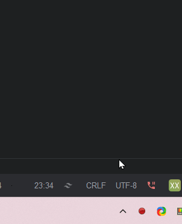
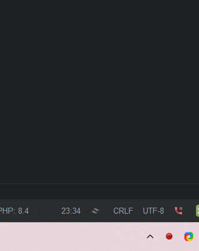
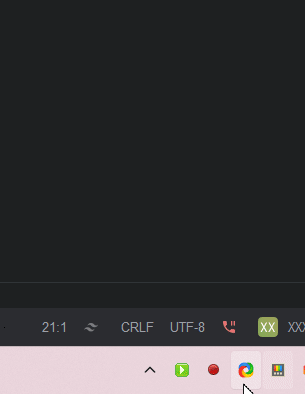
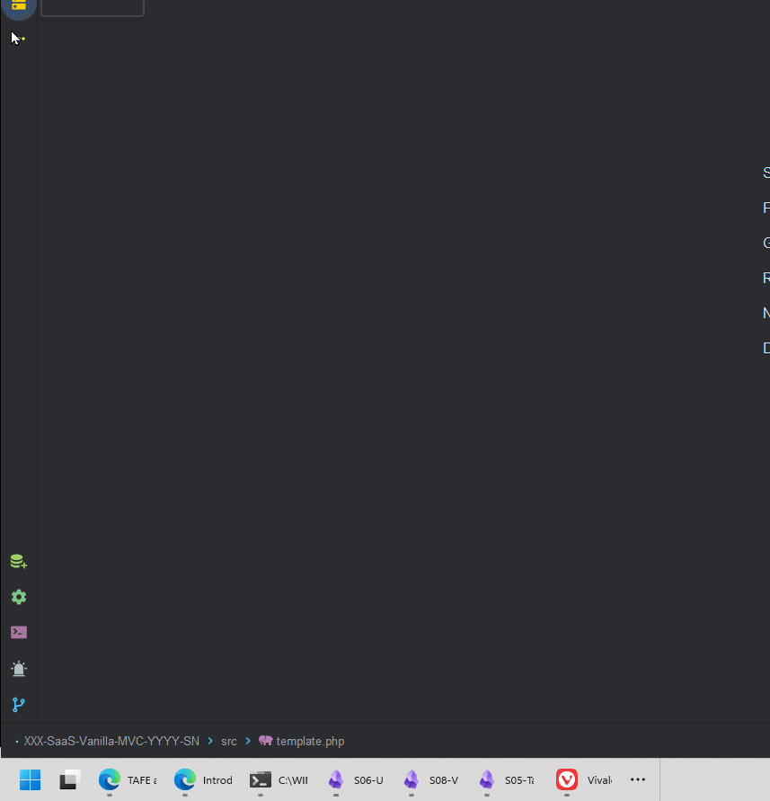
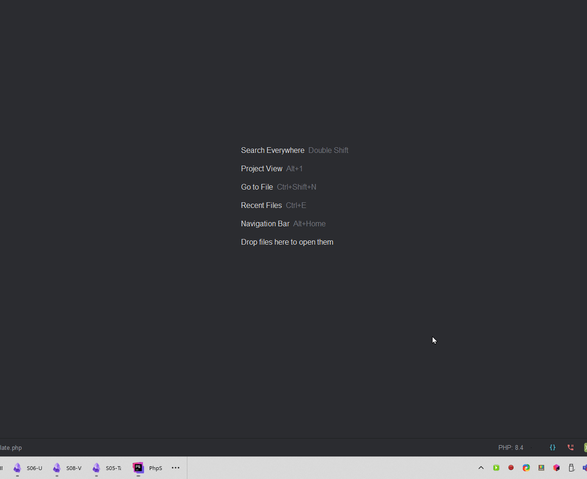
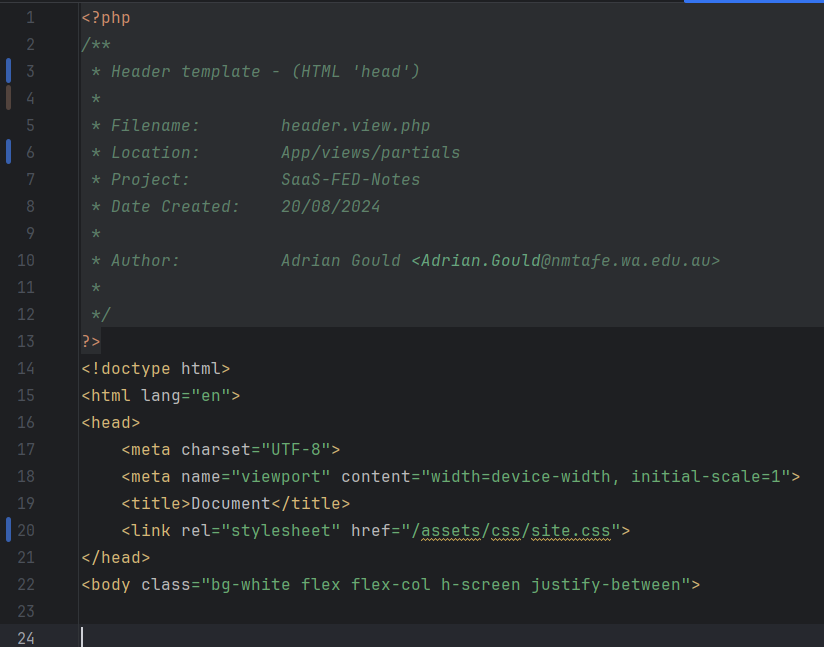
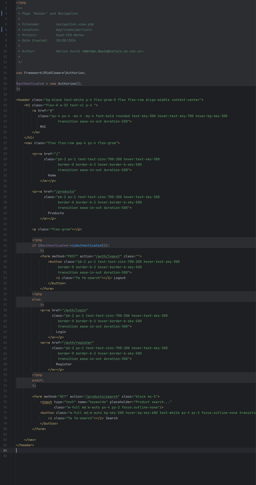
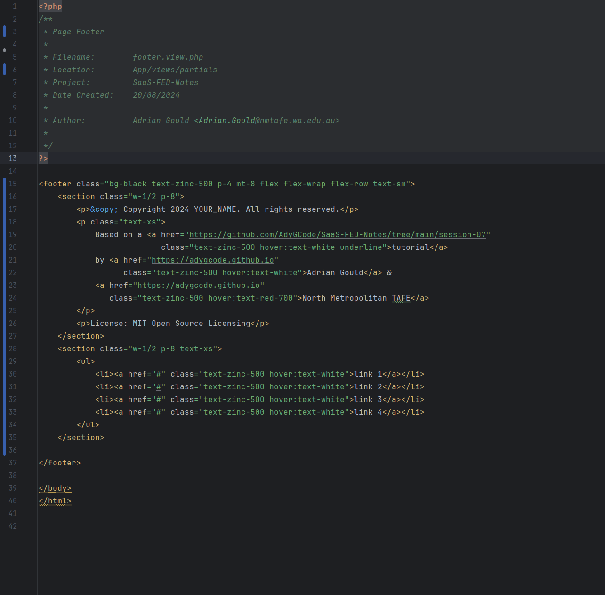
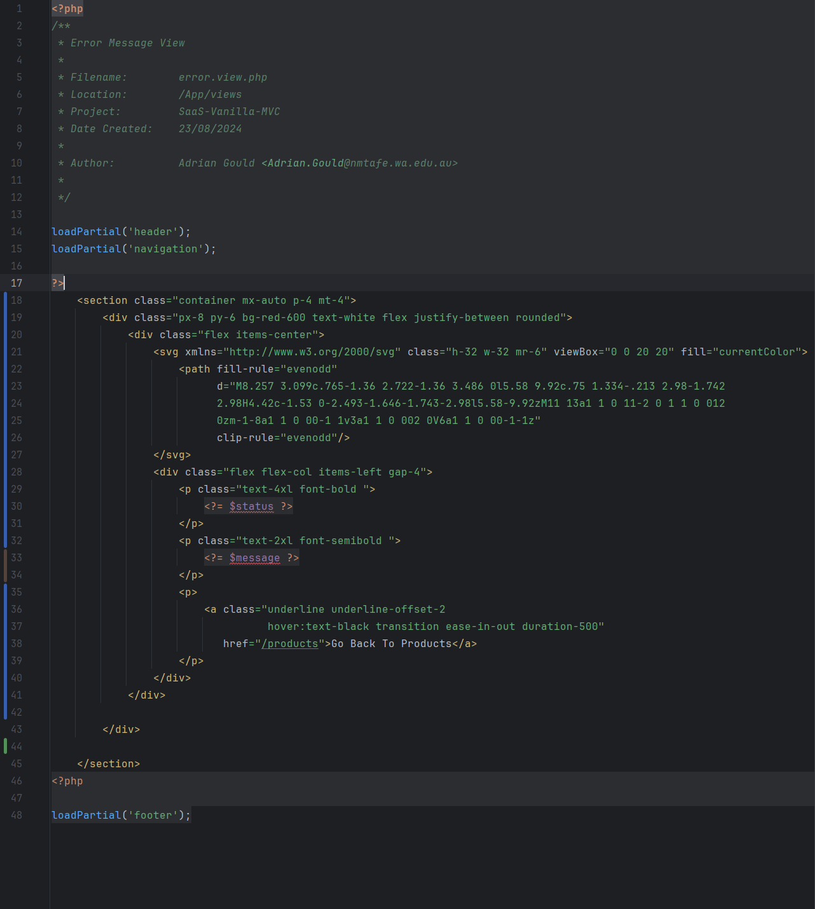
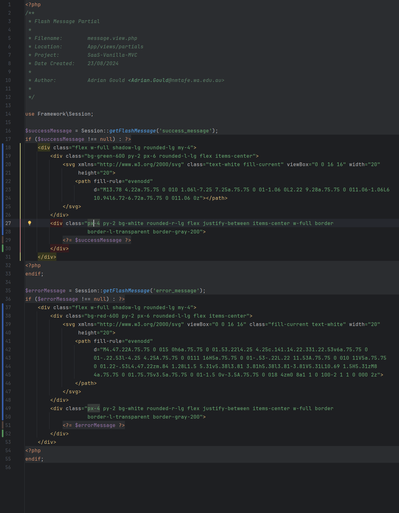

# Continuing to build the Framework

So far we have created the helpers, the routes and the database configuration.

In this section we will look at the `index.php` file, and convert it from the current template file into a set of partials that will be stored in the `App/views/partials` folder...

## Before you continue...

One item to note is that when you restart a project after leaving it for the day, you will need to restart the likes of the Tailwind CSS compiler.

It is also a good idea to run the `npm` and `composer` installs/updates.

Our `vite.config.js` file should not need any updates, but if you wish you could amend it by adding `js` to the `usePHP` and `liveReload` sections:

```js
plugins: [  
    tailwindcss(),  
    usePHP({  
        entry: [  
            'index.php',  
            'public/index.{html,php,js}',  
            'App/views/**/*.{html,php,js}'  
        ],  
    }),  
    liveReload([  
            'index.php',  
            'public/index.{html,php,js}',  
            'App/views/**/*.{html,php,js}'  
        ],  
        {  
            alwaysReload: true  
        }  
    ),  
],
```

If you have the `npm run dev` command running, stop it (<kbd>CTRL</kbd>+<kbd>C</kbd>) update the composer and other files:

```shell
composer install && composer update

npm install && npm update

```

** TO DO ** Fix up how to get vite to watch the PHP and autoreload the 

## Important: Over to a Web Server

We are now at a point where we will need to change our build process.

We will be modifying the `index.php` file to be a lot more lightweight, and it will use files from within the framework.

So it is time to swap to Laragon and run the web and database servers.

### Running Laragon

Check the system tray to see if it is running already, if so you can right click and select Start All. The animated image shows this for you.



If it is hidden in the system tray, drag it to the right of the down chevron, so you can quickly verify if it is running. The animated GIF shows this.



If showing in the system tray, then simply right mouse click on the icon and select Start All.



If it is not running then run it using <kbd>WIN</kbd> and then typing Laragon to show it in the search and press <kbd>ENTER</kbd>.



Once Running we need to make sure that we are using the `~/Source/Repos` folder as the Laragon root:



### Running the TailwindCSS watch and build

The next step requires you to have a terminal open that can execute `npm`.

In a terminal execute the following:

```shell
npx @tailwindcss/cli -i src/source.css -o public/assets/css/site.css -m --watch
```

This will:
- watch for changes to your source code
- rebuild or update the `site.css` file in the `/public/assets/css` folder
- continue to run as you continue to develop code.

## The Routes File Revisited

At the end of the previous stage, we added a one line `routes.php` file in the root of the project:

```php
$router->get('/', 'HomeController@index');  
```

As stated previously, this router call adds a GET method route to the router that looks for the `/` endpoint for the URL.

We will add additional routes to this file as needed as we progress through the next parts of the tutorial.

## Public `index.php`

One of the most important files in our micro-framework is the front-facing 'index' file.

This file performs the actions of:

- loading the framework
- starting the session for the current site visitor
- getting the requested location from the server
- calling the router to direct the application flow

The file is hidden behind the use of our `.htaccess` file, so as far as the end user is concerned they have no idea it exists.

A request to `http://saas-vanilla-mvc.test/` actually is directed to
`http://saas-vanilla-mvc.test/index.php` by the
`.htaccess` file, and then this PHP file takes over.

> **Note:**
>
> We have not provided the header DocBlock, that is for you to complete.

The code uses autoloading to first add the Router and Session files from the micro-framework.

It then starts the visitor's session.

It grabs the helper functions, and created a router object.

It then loads the routes, as defined in the `routes.php` file.

Next the request's URI is retrieved, before the routers is called to handle the requested URI path.

Create a new PHP file, `public/index.php` and add:

```php
require __DIR__ . '/../vendor/autoload.php';

use Framework\Router;
use Framework\Session;

Session::start();

require __DIR__.'/../helpers.php';

// Instantiate the router
$router = new Router();

// Get routes
$routes = require basePath('routes.php');

// Get current URI and HTTP method
$uri = parse_url($_SERVER['REQUEST_URI'], PHP_URL_PATH);

//echo password_hash("Password1",PASSWORD_DEFAULT);
//die;
// Route the request
$router->route($uri);

```

## `.htaccess` File

So how about this `.htaccess` file...

This file exists as `/public/.htaccess`.

This Apache configuration enables URL rewriting and sets up a rule to handle requests for files or directories that do not exist.

If a requested URL does not correspond to an existing file or directory, the request is rewritten to `/index.php`. This is commonly used in web applications that use a single entry point (like `index.php`) to handle all requests, such as in many PHP frameworks.

#### `RewriteEngine on`

This line enables the rewrite engine, which is a module in Apache that allows you to rewrite URLs. It's necessary for the following rewrite rules to work.

#### `RewriteCond %{REQUEST_FILENAME} !-f`

This line is a condition for the rewrite rule that follows. It checks if the requested
filename (i.e., the file that the URL points to) does not exist (`!-f` means "not a file"). If
the file exists, the condition is not met, and the rewrite rule will not be applied.

#### `RewriteCond %{REQUEST_FILENAME} !-d`

This is another condition for the rewrite rule. It checks if the requested filename is not a
directory (`!-d` means "not a directory"). If the directory exists, the condition is not met,
and the rewrite rule will not be applied.

#### `RewriteRule ^(.*)$ /index.php [NC,L,QSA]`

This is the actual rewrite rule. It says that if the requested URL matches the pattern
`^(.*)$` (which matches any URL), it should be rewritten to `/index.php`.

The flags at the end have the following meanings:

- `NC`: No Case, meaning the match is case-insensitive.
- `L`: Last, meaning if this rule matches, no further rules will be processed.
- `QSA`: Query String Append, meaning the query string from the original URL will be appended to
  the rewritten URL.

## Template HTML File

Download the [`template.php`](../session-07/sample-code/template.php) file we provide.

Copy/Move this into the `src` folder on the project so you have an easily accessed file.

Open the file ready to copy sections into files as required in the next steps.

We are ready to create the partials for the Application.

## Partials

The partials contain the common sections of pages such as Header, Footer and Navigation.


Let's create each in turn.

### Header

In the `App/views/partials` folder create a new PHP file `header.view.php`.

Fill out the usual DocBlock comments as needed.

Then close the PHP tag `?>`.

Now Open the `template.php` file you have, and copy the section of code from `<!doctype html>`
to
`<body class="bg-white flex flex-col h-screen justify-between">` inclusive.

Go back to the header partial file and paste this code into the space after the `?>` close PHP
tag.



Now we can do the navigation (and also the logo area).

### Navigation

As with the header, we create a new partial view and name it `navigation.view.php`.

Once you have done that, close the `?>` PHP tag, and then copy the section of the template code
from
`<header class="bg-gray-950 text-gray-200 p-4 flex-grow-0 flex flex-row align-middle content-center">`
to `</header>`.

Paste this code after the close PHP tag.

Here is an image of the code as per 3/9/2024:



Now the footer...

### Footer

We are on the last bit of the page partials, before we look at two new partials...

As before, create a new partial view and name it `footer.view.php`.

Go back to the template and locate the  `<footer>` line and select the code from there to the end of
the file.

Add this code to the footer partial.

Here is an image of the full code as of 3/9/24:



(this code has been updated, to include a more embellished footer)

## New Partials

Ok now we are able to add our two new partials. The Errors partial is used to display error
messages suchas 404 on the
site.

The message partial is used when we want to display a flash message on a page.

### Errors Partial

The errors partial is named `errors.view.php` and is in the same `App/views/partials` folder.

You are to complete the Doc-Block at the start of the view, and then add the following code:

```php
if (isset($errors) && $errors !== null): ?>  
    <div class="flex w-full shadow-lg rounded-lg my-4">  
        <div class="bg-red-600 py-2 px-6 rounded-l-lg flex items-center">  
            <svg xmlns="http://www.w3.org/2000/svg" viewBox="0 0 16 16" class="fill-current text-white" width="20"  
                 height="20">  
                <path fill-rule="evenodd"  
                      d="M4.47.22A.75.75 0 015 0h6a.75.75 0 01.53.22l4.25 4.25c.141.14.22.331.22.53v6a.75.75 0 01-.22.53l-4.25 4.25A.75.75 0 0111 16H5a.75.75 0 01-.53-.22L.22 11.53A.75.75 0 010 11V5a.75.75 0 01.22-.53L4.47.22zm.84 1.28L1.5 5.31v5.38l3.81 3.81h5.38l3.81-3.81V5.31L10.69 1.5H5.31zM8 4a.75.75 0 01.75.75v3.5a.75.75 0 01-1.5 0v-3.5A.75.75 0 018 4zm0 8a1 1 0 100-2 1 1 0 000 2z"></path>  
            </svg>        </div>        <div class="px-4 py-2 bg-white rounded-r-lg flex flex-col justify-between items-left w-full border border-l-transparent border-gray-200">  
            <?php  
            foreach ($errors as $error) : ?>  
  
                <p>  
                    <?= $error ?>  
                </p>  
            <?php  
            endforeach;  
            ?>  
        </div>  
    </div><?php  
endif;
```

This simply processes a list of errors that is sent to the partial, and adds them in an error 'message box'.

The error block is based on code from https://tailwindtemplates.io/templates?category=alert.

Here is an image of the code as of 3/9/2024:



#### Fixing the glitch

To fix this we need to change the `if` statement slightly:

```php
if (isset($errors) && count($errors)>0): ?>
```

### Message Partial

The message partial is similar, but it actually uses the Session class to allow it to retrieve any flash messages and then display.

The code gets any success message from the session, and if one exists it shows the message in a green box.

Likewise for the error message, except a red box.

```php

use Framework\Session;

$successMessage = Session::getFlashMessage('success_message');
if ($successMessage !== null) : ?>
    <div class="flex w-full shadow-lg rounded-lg my-4">
        <div class="bg-green-600 py-2 px-6 rounded-l-lg flex items-center">
            <svg xmlns="http://www.w3.org/2000/svg" class="text-white fill-current" viewBox="0 0 16 16" width="20" height="20"><path fill-rule="evenodd" d="M13.78 4.22a.75.75 0 010 1.06l-7.25 7.25a.75.75 0 01-1.06 0L2.22 9.28a.75.75 0 011.06-1.06L6 10.94l6.72-6.72a.75.75 0 011.06 0z"></path></svg>
        </div>
        <div class="px-4 py-2 bg-white rounded-r-lg flex justify-between items-center w-full border border-l-transparent border-gray-200">
            <?= $successMessage ?>
        </div>
    </div>
<?php
endif;

$errorMessage = Session::getFlashMessage('error_message');
if ($errorMessage !== null) : ?>
    <div class="flex w-full shadow-lg rounded-lg my-4">
        <div class="bg-red-600 py-2 px-6 rounded-l-lg flex items-center">
            <svg xmlns="http://www.w3.org/2000/svg" viewBox="0 0 16 16" class="fill-current text-white" width="20" height="20"><path fill-rule="evenodd" d="M4.47.22A.75.75 0 015 0h6a.75.75 0 01.53.22l4.25 4.25c.141.14.22.331.22.53v6a.75.75 0 01-.22.53l-4.25 4.25A.75.75 0 0111 16H5a.75.75 0 01-.53-.22L.22 11.53A.75.75 0 010 11V5a.75.75 0 01.22-.53L4.47.22zm.84 1.28L1.5 5.31v5.38l3.81 3.81h5.38l3.81-3.81V5.31L10.69 1.5H5.31zM8 4a.75.75 0 01.75.75v3.5a.75.75 0 01-1.5 0v-3.5A.75.75 0 018 4zm0 8a1 1 0 100-2 1 1 0 000 2z"></path></svg>
        </div>
        <div class="px-4 py-2 bg-white rounded-r-lg flex justify-between items-center w-full border border-l-transparent border-gray-200">
            <?= $errorMessage ?>
        </div>
    </div>
<?php
endif;

```

The message blocks are based on code from https://tailwindtemplates.io/templates?category=alert.

The code as an image as per 3/9/24:




At this point we will...


# Commit Your Work

Add the changes to the stash, commit and push them to the repository:

```shell
git add .

git commit -m "wip: Route, Partials and .htaccess revisited

Create the partials:
- header
- footer
- navigation
- error

"

git push -u origin main
```


next... [S08-Vanilla-PHP-MVC-Pt-06](../session-08/S08-Vanilla-PHP-MVC-Pt-06.md)
