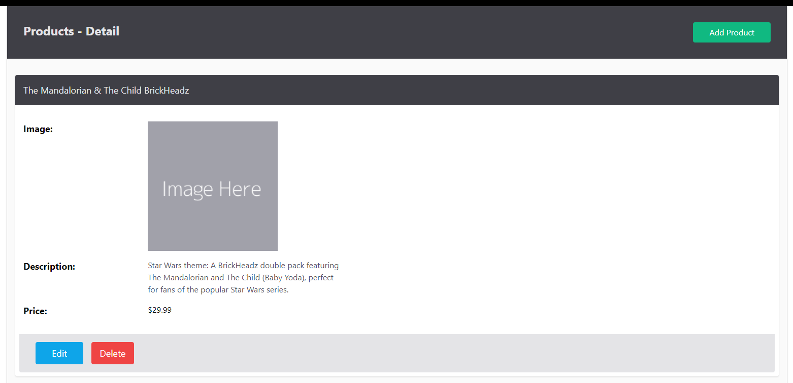

# Building the Application Part 2

We are now into the Products feature... and almost to the point of a working application.

---

## Product Feature

The product feature has a number of basic facilities... these correspond to the *<span style="color:#1f497d">CRUD</span>*/**<span style="color:#8064a2">BREAD</span>** actions:

| BREAD Operation | CRUD Operation | Method |
| --------------- | -------------- | ------ |
| Browse          | Read (many)    | Index  |
| Retrieve        | Read (one)     | Show   |
| Edit            | Update         | Update |
| Add             | Create         | Create |
| Delete          | Delete         | Delete |

### Add Product Routes

Open the `routes.php` file again, and add:

```php
$router->get('/products', 'ProductController@index');  
$router->get('/products/create', 'ProductController@create', ['auth']);  
$router->get('/products/edit/{id}', 'ProductController@edit', ['auth']);  
$router->get('/products/search', 'ProductController@search');  
$router->get('/products/{id}', 'ProductController@show');  
  
$router->post('/products', 'ProductController@store', ['auth']);  
$router->put('/products/{id}', 'ProductController@update', ['auth']);  

$router->delete('/products/{id}', 'ProductController@destroy', ['auth']);
```

TODO: Add details for above


### Create the Product Controller Class

To start, we need to create the class for the Prodcut Controller.

We create the class `ProductController` in the `App/Controllers/` folder, as we did for the `UsersController`.

To this we add the required uses lines, and stubs:

```php
namespace App\Controllers;

use Framework\Authorisation;
use Framework\Database;
use Framework\Session;
use Framework\Validation;

class ProductController
{

    public function __construct()
    {
    }


    public function index()
    {
    }


    public function create()
    {
    }

    public function show()
    {
    }

    public function store()
    {
    }

    public function destroy()
    {
    }

    public function edit()
    {
    }

    public function update()
    {
    }

    public function search()
    {
    }

}
```

### Properties and the Constructor

Just like the Users feature we need to create a protected Database variable and a constructor that provides access to the database methods required.

Before the constructor add:

```php
protected $db;
```

In the constructor add:

```php
$config = require basePath('config/db.php');  
$this->db = new Database($config);
```

Add comments to the the property and the constructor method.

---

### Browse Part 1 (Index method)

Let's start with the method to show the index page.

This method needs to query the database and retrieve the products. 

We start by defining the query that retrieves all the products in reverse created at order.

Then we execute the query and finally send the results to the view for display.

```php
$sql = "SELECT * FROM products ORDER BY created_at DESC";  
  
$products = $this->db->query($sql)->fetchAll(); 
  
  
loadView('products/index', [  
    'products' => $products  
]);
```

### Browse Part 2 (Index view)

The index view takes the data from the controller and displays it in the format required.

We have the base formatting in our template so that makes it easier, and even more, we already have a home page that performs a similar action but only shows six products.

We can cheat and duplicate the home view and rename it to `index.view.php` and move it into the `App/views/products` folder.

Or we can create the page from scratch, and make the following additions/changes:

- Remove the summary data at the top of the page
- Add a "add product" button
- Add a summary of products found
	- This is useful for search results
	- We will add this when we look at a search function
- Show the products

At the top of the page is the same partials being loaded:

```php
<?php  
/* Load HTML header and navigation areas */  
loadPartial("header");  
loadPartial('navigation');  
  
?>
```

Let's add the start of the page content - that is the main and the article plus a header...

```php
<main class="container mx-auto bg-zinc-50 py-8 px-4 shadow shadow-black/25 rounded-b-lg flex flex-col flex-grow">  
    <article>        <header class="bg-zinc-700 text-zinc-200 -mx-4 -mt-8 p-8 mb-8 flex">  
            <h1 class="grow text-2xl font-bold ">Products</h1>  
            <p class="text-md flex-0 px-8 py-2 bg-emerald-500 hover:bg-emerald-600 text-white rounded transition ease-in-out duration-500">  
                <a href="/products/create">Add Product</a>  
            </p>        </header>
```

Now we add a section containing a grid of products:

```php
<section class="grid grid-cols-3 gap-8 ">  
    <?php  
    foreach ($products ?? [] as $product):  
        ?>  
 
        <article class="max-w-96 min-w-64 bg-white shadow rounded flex flex-col">  
            <header class="bg-zinc-700 text-zinc-200 text-lg p-4 -mt-2 mb-4 rounded-t flex-0">  
                <h4>                    <?= $product->name ?>  
                </h4>  
            </header>
            
			<section class="flex-grow grid grid-cols-5 px-4 py-0 gap-4">  
                <p class="col-span-2 p-0 pt-2">  
                      
                </p>                <p class="col-span-3 text-zinc-600 p-0">
                <?= $product->description ?>
                </p>  
            </section>
            
            <a href="/products/<?= $product->id ?>"  
               class="w-full text-center text-sm text-zinc-900 font-medium
                     bg-zinc-200 hover:bg-zinc-300 block
                      py-2 mt-4 -mb-2 rounded-b
                      transition ease-in-out duration-500">  
                Details...  
            </a>  
            
    </article>    
<?php  
    endforeach    
?>
</section>
```

We will not go over how this works as we did this for the home page already.

---

### Retrieve Part 1 (Show view)

Ok, so that was the index page, now onto the show page.



We will start by duplicating the index page, and then removing the lines from `<?php foreach ($products ?? [] as $product):  ` through to `<?php endforeach ?>`.

This leaves:

```php
/* Load HTML header and navigation areas */  
loadPartial("header");  
loadPartial('navigation');  
  
?>  
  
<main class="container mx-auto bg-zinc-50 py-8 px-4 shadow shadow-black/25 rounded-b-lg flex flex-col flex-grow">  
    <article>        
	    <header class="bg-zinc-700 text-zinc-200 -mx-4 -mt-8 p-8 mb-8 flex">  
            <h1 class="grow text-2xl font-bold ">Products</h1>  
            <p class="text-md flex-0 px-8 py-2 bg-emerald-500 hover:bg-emerald-600 text-white rounded transition ease-in-out duration-500">  
                <a href="/products/create">Add Product</a>  
            </p>        
            </header>  
          
        <section class="grid grid-cols-3 gap-8 ">  
        </section>  
  
    </article></main>  
  
  
<?php  
loadPartial("footer");
```

Update the `h`  element to read:

```php
            <h1 class="grow text-2xl font-bold ">Products - Details</h1> 
```

Modify the `<section class="grid...` to read:

```php
<section class="w-full bg-white shadow rounded p-4 flex flex-col gap-4">
```

Inside this we add a new `h4` element:

```php
<h4 class="-mx-4 bg-zinc-700 text-zinc-200 text-2xl p-4 -mt-4 mb-4 rounded-t flex-0 flex justify-between">  
        <?= $product->name ?>  
</h4>
```

After the `h4`, but still in the main section we are creating we add a new sections, one for each part of the product's details...

```php
<section class="flex-grow flex flex-row">  
    <!-- Image section -->
    </section>  
  
<section class="flex-grow flex flex-row">  
    <!-- Description section -->
</section>  
  
<section class="flex-grow flex flex-row">  
    <!-- Price section -->
</section>

<!-- Edit and Delete if product 'owned' by user -->

```

We will add the 'edit and delete'  in a few steps...

Now we add the content for each section. They are basically the same with just the content changing in most cases.

Replace each of the HTML comments with the required section's code below.

#### Image section

```php
<h5 class="text-lg font-bold w-1/6 min-w-1/6">  
    Image:  
</h5>  
<p class="grow">  
      
</p>
```

#### Description section

```php
<h5 class="text-lg font-bold w-1/6 min-w-1/6">  
    Description:  
</h5>  
<p class="grow max-w-96 text-zinc-600 text-lg">  
    <?= $product->description ?>  
</p>
```
#### Price section

```php
<h5 class="text-lg font-bold w-1/6 min-w-1/6">  
    Price:  
</h5>  
<p class="grow text-lg text-zinc-600">  
    $<?= $product->price / 100 ?>  
</p>
```


Ok so we have the majority of the page completed. Two important additions - the action buttons at the bottom of the page.

#### Action Buttons

Start by adding PHP tags and a check to see if the logged in user matches the product's user (owner) to the code, replacing the comment:

```php
<?php 
if (Framework\Authorisation::isOwner($product->user_id)) : 
?>  
    Do something here...
<?php 
endif; 
?>
```

Now we replace the "Do something here" with a form:

```php
<form method="POST" class="px-4 py-4 mt-4 -mx-4 border-0 border-t-1 border-zinc-300 text-lg flex flex-row">  

	<span class="w-1/6 min-w-1/6"></span>  
	
<!-- Link to Edit -->
<!-- Form submit button to delete -->

</form>
```

Now we add the link to edit, but formatted as a button:

```php

    <a href="/products/edit/<?= $product->id ?>"  
       class="px-16 py-2 bg-sky-500 hover:bg-sky-600 text-white rounded transition ease-in-out duration-500">  
        Edit  
    </a>  
  
    
```


Once we have that link, the button to delete requires two parts:
- a hidden field to indicate a `DELETE` HTTP Verb, and
- a Submit button

```php
<input type="hidden" name="_method" value="DELETE">  
    <button type="submit"  
            class="ml-8 px-4 py-2 bg-red-500 hover:bg-red-600 text-white rounded transition ease-in-out duration-500">  
        Delete  
    </button> 
```

With that we are done!

Now to implement the controller method.

### Retrieve Part 2 (Show method)

Open the `ProductsController` file and locate the `show` method's stub.

First update the method's signature to include a parameter `$params`.

```php
public function show($params)  
{
}
```

Now we can work with the parameters sent to perform the filtering of the data to retrieve the required product...

First we check to see if the parameters list contains an 'id' entry. If it does we use null-coalesce to retrieve the data, otherwise we set the `$id` variable to nothing.

We then replace the `$params` variable with a new key-value pair of `id` and the value of `$id`.

```php
{  
    $id = $params['id'] ?? '';  
  
    $params = [  
        'id' => $id  
    ];  
```

Now we have the parameters configured, we are able to perform a search query, and bind the id to the correct field in the SQL:

```php
	$sql = 'SELECT * FROM products WHERE id = :id';
    $product = $this->db->query($sql, $params)->fetch();  
```

After performing the query, we now check to see if we retrieved a product. If not we call the Error Controller to display a "Product not found" error page.

```php

    // Check if product exists  
    if (!$product) {  
        ErrorController::notFound('Product not found');  
        return;  
    }  
```

If there was a product we simply load the newly created `show` view passing it the product to display.
```php
    loadView('products/show', [  
        'product' => $product  
    ]);  
```

And that is the Show done!


There is still a bit more to do so onto part 9... [S07 Vanilla PHP MVC Pt 9](session-08/S08-Vanilla-PHP-MVC-Pt-09.md)
