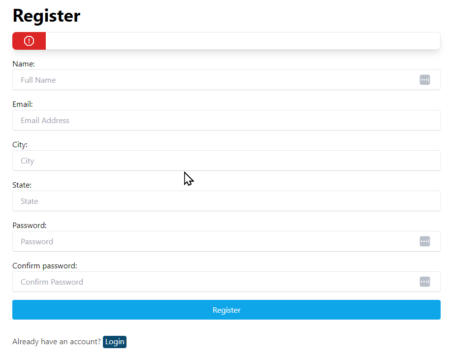
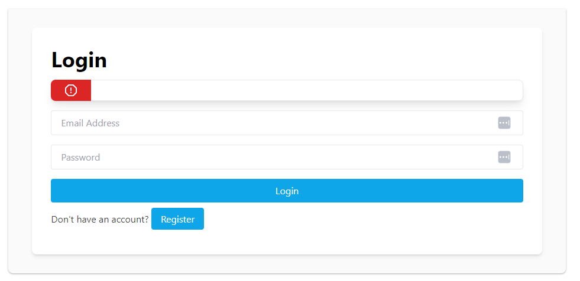

# Building the Application Part 1

So far we have created the helpers, the routes and the database configuration.

We are now ready to build the logic that runs the application, the controllers.

# Application Features

We have two main features for this application.

- Users
- Products

We start with the Users feature and then finish off by adding the products.


## User Feature

The User feature contains three main components:

- Register
- Login
- Logout

We are **not** implementing a user management feature in this tutorial, but you may do so for an exercise **after** the product feature is completed.

### User Controller

Begin by creating a new class named `UserController` in the `App/Controllers` folder.

Make sure you now have the header comments completed:

```php
/**
 * User Controller
 *
 * Provides the Register, Login and Logout capabilities
 * of the application
 *
 * Filename:        UserController.php
 * Location:        App/Controllers
 * Project:         SaaS-Vanilla-MVC
 * Date Created:    20/08/2024
 *
 * Author:          Adrian Gould <Adrian.Gould@nmtafe.wa.edu.au>
 *
 */
```

Update the class to use the Database, Session and Validation classes from the framework.

```php
namespace App\Controllers;  
  
use Framework\Database;  
use Framework\Session;  
use Framework\Validation;
```

Now in the class we add a protected property that will hold the database object when instantiated.

```
protected $db;
```

You should add a suitable comment before the property.

### Constructor

Now we are ready to add the class' constructor.

```php
public function __construct()  
{  
    $config = require basePath('config/db.php');  
    $this->db = new Database($config);  
}
```


### Stubs!

Before we go any further, we will create some method stubs to make life easier as we go though our feature creation.

After the above constructor, add:

```php
public function login()  
{  
    exit('User login not implemented');
}  
  
public function create()  
{  
    exit('User registration not implemented');
}  
  
public function store()  
{  
    exit('User creation not implemented');
}  
  
public function logout()  
{  
    exit('User logout not implemented');
}  
  
public function authenticate()  
{  
    exit('User authentication not implemented');
}
```

Once we have these stubs we can work on each sub-feature. 

We begin by creating the register view and method.

### Register Part 1 (Create View)

We are going to create a registration form that looks like this:




Create a new PHP file called `create.view.php` in the `App/views/users` folder.

In this file we will be doing the following:
- loading the header and navigation partials
- displaying a form for the user to complete
- loading the footer partial

So, let's start the process by loading the partials:

```php
loadPartial('header');  
loadPartial('navigation'); 
?>  
  
<!-- Form will go here -->

<?php  
loadPartial('footer');
```

Now we are able to create the form.

Replace the comment with the following code:

```php
<main class="flex justify-center items-center mt-20">  
    <section class="bg-white p-8 rounded-lg shadow-md w-1/2 md:w-500 mx-6">  
        <h2 class="text-4xl text-left font-bold mb-4">Register</h2>  

        <?= loadPartial('errors', [  
            'errors' => $errors ?? []  
        ]) ?>  
  
        <form method="POST" action="/auth/register">

		<!-- Form fields go in here --> 
		
		</form>
	</section>
</main>
```

Inside the form (where the "form fields go here" comment is shown) we need to create components that contain the form fields for each part of the user's information.

Each field will have:
- a section of its own
- a label to facilitate easier access to each field, inlcuding:
	- `for` attribute that will link to the field
	- `class` to style the label
- the input (or equivalent) entity to allow data entry, including:
	- `name` and`type` attributes,
	- `id` with the same name as the label's `for` attribute
	- `class` for input formatting, and
	- `value` attribute that will default to null, or will have the previous data if the form has errors.

So the name field is structured thus:

```php
<section class="mb-4">  
    <label for="Name" class="mt-4 pb-1">Name:</label>  
    <input type="text" id="Name"  
           name="name" placeholder="Full Name"  
           class="w-full px-4 py-2 border border-b-zinc-300 rounded focus:outline-none"  
           value="<?= $user['name'] ?? '' ?>"/>  
</section>
```

Ok, so let's repeat this for the other fields...

**Email**

```php
<section class="mb-4">  
    <label for="Email" class="mt-4 pb-1">Email:</label>  
    <input type="email" id="Email"  
           name="email" placeholder="Email Address"  
           class="w-full px-4 py-2 border border-b-zinc-300 rounded focus:outline-none"  
           value="<?= $user['email'] ?? '' ?>"/>  
</section>
```

**City**

```php
<section class="mb-4">  
    <label for="City" class="mt-4 pb-1">City:</label>  
    <input type="text" id="City"  
           name="city" placeholder="City"  
           class="w-full px-4 py-2 border border-b-zinc-300 rounded focus:outline-none"  
           value="<?= $user['city'] ?? '' ?>"/>  
</section>
```

**State**

```php
<section class="mb-4">  
    <label for="State" class="mt-4 pb-1">State:</label>  
    <input type="text" id="State"  
           name="state" placeholder="State"  
           class="w-full px-4 py-2 border border-b-zinc-300 rounded focus:outline-none"  
           value="<?= $user['state'] ?? '' ?>"/>  
</section>
```

**Password**

The password and password confirmation use the 'password' input type. This means the password is not shown as it is typed.

```php
<section class="mb-4">  
    <label for="Password" class="mt-4 pb-1">Password:</label>  
    <input type="password" id="Password"  
           name="password" placeholder="Password"  
           class="w-full px-4 py-2 border border-b-zinc-300 rounded focus:outline-none"/>  
</section>
```

**Password Confirmation**

```php
<section class="mb-4">  
    <label for="PasswordConfirmation" class="mt-4 pb-1">Confirm password:</label>  
    <input type="password" id="PasswordConfirmation"  
           name="password_confirmation" placeholder="Confirm Password"  
           class="w-full px-4 py-2 border border-b-zinc-300 rounded focus:outline-none"/>  
</section>
```

Now onto the submit buttons and a link to login for previously registered users:

**Submit the form**

```php
<section class="mb-4">  
    <button type="submit"  
            class="w-full bg-sky-500 hover:bg-sky-600 text-white px-4 py-2 rounded focus:outline-none  
               transition ease-in-out duration-500">  
        Register  
    </button>  
</section>  
```

And finally the message for already registered users and login link...

```php
<section class="mb-4">  
    <p class="mt-8 text-zinc-700">  
        Already have an account?  
        <a class="bg-sky-900 hover:bg-sky-600 text-white px-1 pb-1 rounded  
              transition ease-in-out duration-500" href="/auth/login">Login</a>  
    </p></section>
```

Ok, so that is the register view... but you will not be able to view it until the Create Method is completed...

### Register Part 2 (Create Method)

This method opens the users' create view:

```php
public function create()  
{  
    loadView('users/create');  
}
```


Try accessing the registration page via the link in the navigation bar.


Ok, so this is great, but pretty pointless if we cannot actually register... so...

### Register Part 3 (Store method)

The second part of the registration process is what happens when the user submits the registration form.

In the step the method does the following:
- gets all the details from the form, including name, email, city, state, password and password confirmation.
- validates each item submitted by the user and creates an error entry if there is a problem
- if there are any errors, it returns to the register (create) view with the list of errors and the name, email, city and state data from the original submission.
- if there are no errors then the email is checked to see if it already exists in the database, and again returns to the registration page with an error
- At this point, we are pretty certain all details were entered as required so the method then creates the user in the database, creates a session to signify the user is logged in and then redirecting to the home page.

**Get the details from the form submission..**

```php
public function store()  
{  
    $name = $_POST['name'];  
    $email = $_POST['email'];  
    $city = $_POST['city'];  
    $state = $_POST['state'];  
    $password = $_POST['password'];  
    $passwordConfirmation = $_POST['password_confirmation'];  
```

**Validate the data...**

```php

    $errors = [];  
  
    // Validation  
    if (!Validation::email($email)) {  
        $errors['email'] = 'Please enter a valid email address';  
    }  
  
    if (!Validation::string($name, 2, 50)) {  
        $errors['name'] = 'Name must be between 2 and 50 characters';  
    }  
  
    if (!Validation::string($password, 6, 50)) {  
        $errors['password'] = 'Password must be at least 6 characters';  
    }  
  
    if (!Validation::match($password, $passwordConfirmation)) {  
        $errors['password_confirmation'] = 'Passwords do not match';  
    }  
```

**If there are errors, redirect to the registration page...**

```  php
    if (!empty($errors)) {  
        loadView('users/create', [  
            'errors' => $errors,  
            'user' => [  
                'name' => $name,  
                'email' => $email,  
                'city' => $city,  
                'state' => $state,  
            ]  
        ]);  
        exit;  
    }  
```

**Check to see if the user exists, and redirect to the registration page with an additional error if they do...**

```php
    // Check if email exists  
    $params = [  
        'email' => $email  
    ];  
  
    $user = $this->db->query('SELECT * FROM users WHERE email = :email', $params)->fetch();  
  
    if ($user) {  
        $errors['email'] = 'That email already exists';  
        loadView('users/create', [  
            'errors' => $errors  
        ]);  
        exit;  
    }  
```

**Validation has been passed, so create the user**

```php
    // Create user account  
    $params = [  
        'name' => $name,  
        'email' => $email,  
        'city' => $city,  
        'state' => $state,  
        'password' => password_hash($password, PASSWORD_DEFAULT)  
    ];  
  
    $this->db->query('INSERT INTO users (name, email, city, state, password) VALUES (:name, :email, :city, :state, :password)', $params);  
  
    // Get new user ID  
    $userId = $this->db->conn->lastInsertId();  
```

**Create a session to log the newly registered user into the application...**

```php
    // Set user session  
    Session::set('user', [  
        'id' => $userId,  
        'name' => $name,  
        'email' => $email,  
        'city' => $city,  
        'state' => $state  
    ]);  
```

**Redirect the browser to the home page...**

```php
    redirect('/');  
}
```


### Login Part 1 (Login method)

Very similar to the register (create), the login method opens the users' login view

```php
public function login()  
{  
    loadView('users/login');  
}
```

### Login Part 2 (Login view)

So we have the method that shows the login form, let's now create the login view which will look similar to the image shown below.



> **Note:** There are a few tweaks made to the layout/design in the code provided. 
> 
> See if you are able to work out what they are.


The view starts as per the register page, except the form action directs to the `/auth/login` route...

```php
loadPartial('header');  
loadPartial('navigation'); ?>  
  
    <main class="container mx-auto bg-zinc-50 py-8 px-4 shadow shadow-black/25 rounded-b-lg  
                 flex justify-center items-center mt-8 w-1/2 ">  
  
        <section class="bg-white p-8 rounded-lg shadow-md md:w-500 mx-6 w-full">  
  
            <h2 class="text-4xl text-left font-bold mb-4">  
                Login  
            </h2>  
  
            <?= loadPartial('errors', [  
                'errors' => $errors ?? []  
            ]) ?>  
  
            <form method="POST" action="/auth/login">  

<!-- form fields here -->
  
            </form>  
            
        </section>    
    </main>  
<?php  
loadPartial('footer');
```


The fields and submit button are also similar to the register page:

```php
<section class="mb-4">  
    <label for="Email" class="mt-4 pb-1">Email:</label>  
    <input type="email" id="Email"  
           name="email" placeholder="Email Address"  
           class="w-full px-4 py-2 border border-b-zinc-300 rounded focus:outline-none"  
           value="<?= $user['email'] ?? '' ?>"/>  
</section>  
  
<section class="mb-4">  
    <label for="Password" class="mt-4 pb-1">Password:</label>  
    <input type="password" id="Password"  
           name="password" placeholder="Password"  
           class="w-full px-4 py-2 border border-b-zinc-300 rounded focus:outline-none"/>  
</section>  
  
<section class="mb-4">  
  
    <button type="submit"  
            class="w-full bg-sky-500 hover:bg-sky-600 text-white px-4 py-2 rounded  
                   focus:outline-none transition ease-in-out duration-500">  
        Login  
    </button>  
</section>
```

The final item, the link, is now to the registration page rather than the login page...

```php
<section class="mb-4">  
    <p class="mt-4 text-zinc-700">  
        So you are not a member...   
        <a class="bg-sky-500 hover:bg-sky-600 text-white px-4 py-2 rounded  
                   focus:outline-none transition ease-in-out duration-500"
                             href="/auth/register">Register</a> now!
    </p>
</section>
```


### Login Part 3 (Authenticate method)

The authenticate method is very similar to the register except we are validating the user's email and password match.

**Get the email and password from the POST-ed form...**
```php
public function authenticate()  
{  
    $email = $_POST['email'];  
    $password = $_POST['password'];  
```

**Validate the data entered of the correct structure...**

```php
    $errors = [];  
  
    // Validation  
    if (!Validation::email($email)) {  
        $errors['email'] = 'Please enter a valid email';  
    }  
  
    if (!Validation::string($password, 6, 50)) {  
        $errors['password'] = 'Password must be at least 6 characters';  
    }  
```

**If there are errors redirect to the login page, with suitable error messages...**

```php
    // Check for errors  
    if (!empty($errors)) {  
        loadView('users/login', [  
            'errors' => $errors  
        ]);  
        exit;  
    }  
```

**Now verify the email and password match the details from the database...**

```php

    // Check for email  
    $params = [  
        'email' => $email  
    ];  
  
    $user = $this->db->query('SELECT * FROM users WHERE email = :email', $params)->fetch();  
```

**If the database query returned no user, then the email is not in the database, so redirect with an error...**

```php

    if (!$user) {  
        $errors['email'] = 'Incorrect credentials';  
        loadView('users/login', [  
            'errors' => $errors  
        ]);  
        exit;  
    }  
```

**If the passwords do not match then again, we need to redirect with an error...**

We use PHP's built in Password Verification function for this.

```php
    // Check if password is correct  
    if (!password_verify($password, $user->password)) {  
        $errors['email'] = 'Incorrect credentials';  
        loadView('users/login', [  
            'errors' => $errors  
        ]);  
        exit;  
    }  
```

We got his far, so we now have a registed user, and they uysedf the correct password so...

**Start the user's authenticated session, and redirect to the home page**

```php
    // Set user session  
    Session::set('user', [  
        'id' => $user->id,  
        'name' => $user->name,  
        'email' => $user->email,  
        'city' => $user->city,  
        'state' => $user->state  
    ]);  
  
    redirect('/');  
}
```

And now for the last bit... logging out!


### Logout

The logout method does the following:
- Clears the currently logged in user's session
- gets any session cookie parameters
- Sets a cookie for the session to be in the past
- redirects to the 'home' page

```php
public function logout()  
{  
    Session::clearAll();  
  
    $params = session_get_cookie_params();  
    setcookie('PHPSESSID', '', time() - 86400, $params['path'], $params['domain']);  
  
    redirect('/');  
}
```


So that is the User Feature completed.

The final step is the Products Feature which is covered in [S07 Vanilla PHP MVC Pt 8](../session-08/S08-Vanilla-PHP-MVC-Pt-8.md)

