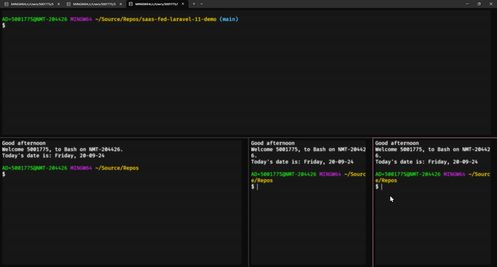
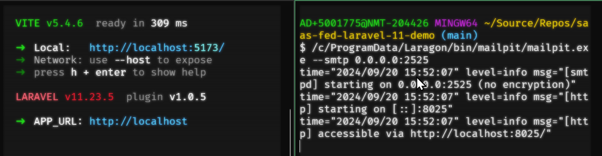
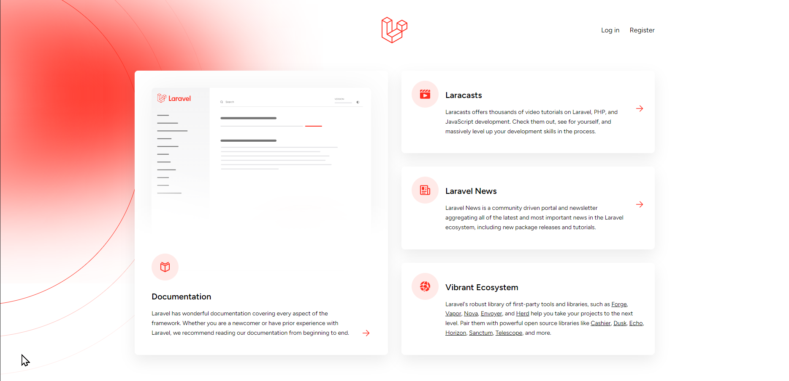

# S10 Introducing Laravel v12

## Software as a Service - Back-End Development

Developed by Adrian Gould

---

```table-of-contents
title: # Contents
style: nestedList
minLevel: 0
maxLevel: 3
includeLinks: true
```

---

# Introducing Laravel

https://laravel.com/docs/11.x#meet-laravel

For those who missed the in class tutorial, follow the Laravel Bootcamp:
- Build Chirper with Blade https://bootcamp.laravel.com


## How to Use Laravel

We can develop and run Laravel applications in a number of ways:
- Local PHP & Composer installation (eg via Laragon, Xampp, Mamp, Herd, etc)
- Docker based installer
- Valet
- ...

## Before you Begin

Make sure you have the following installed:

- Laragon 6 with updates to:
	- Apache 2.4.62 or later (very important)
	- PHP 8.2 or later (8.3 preferred)
	- NodeJS 18 or later (Node 20 LTS, or Node 22 or later preferred)
	- Composer 2.4 or later
	- NPM 8.18 or later
- MailPit  (for mail debugging)
- Windows Terminal (for CLI) with the BASH CLI

Information on updating Laragon to these versions is available at the:

- [ScreenCraft Help Desk](https://help.screencraft.net.au/hc/2680392001) 

Any FAQs that refer to Laragon may be found using this HelpDesk link to

- [Search for Laragon Articles](https://help.screencraft.net.au/hc/2680392001/search?q=laragon)

Some useful Direct Links:

- [Add a new version of PHP to Laragon?](https://help.screencraft.net.au/hc/2680392001/67/add-a-new-version-of-php-to-laragon) 
- [Update the Apache web server in Laragon](https://help.screencraft.net.au/hc/2680392001/68/update-the-apache-web-server-in-laragon)
- [Install and Run MailPit?](https://help.screencraft.net.au/hc/2680392001/69/install-and-run-mailpit)
- [Update NodeJS (and NPM) in Laragon](https://help.screencraft.net.au/hc/2680392001/84/update-nodejs-and-npm-in-laragon)
- Adding xDebug to PHP

### Use Bash CLI

We also **strongly** recommend using the Git **Bash Shell** with the MS Terminal as this provides a CLI experience that is transferrable to Linux and MacOS.

For details on configuring this, and adding some CLI shortcut aliases see:

- [Add Git Bash to Microsoft Terminal](https://help.screencraft.net.au/hc/2680392001/65/add-git-bash-to-microsoft-terminal)
- [Add or Update Bash Command Line Aliases for Git, Laravel, and more](https://help.screencraft.net.au/hc/2680392001/66/add-bash-command-line-aliases-for-git)


### Point Laragon "Root Path" to Source Repos

You will also be working in a Source Repos folder, so we recommend pointing Laragon's web services to this folder.

- [Change the Laragon Web Root Folder](https://help.screencraft.net.au/hc/2680392001/61/change-the-laragon-web-root-folder)

We will be using SQLite for the majority of the time when developing and testing. This is because it will interact with the system faster, and we do not need to have all the power of a full DBMS like MySQL, MariaDB or PostgreSQL.


### Making PHP, Composer and NPM available from the CLI

One thing that is important to dop whenever you update or change a version of the above tools is to remove and add the Laragon components from the system path. For details see here:

- [Adding Laragon to the System Path](https://help.screencraft.net.au/hc/2680392001/36/adding-laragon-to-the-system-path)


### PHP extensions

Make sure that you have the following PHP extensions installed and enabled:
- bz2
- curl
- fileinfo
- gd
- intl
- mbstring
- exif  
- mysqli
- openssl
- pdo_mysql
- pdo_pgsql
- pdo_sqlite
- xsl
- zip

You can easily do this by first making sure the PHP is at least the minimum shown above, then:

- right click on Laragon UI
- hover over PHP
- click on the `php.ini` entry

This will open up the `PHP.INI` file and let you uncomment the lines as shown below:

```ini
extension=bz2
extension=curl
extension=fileinfo
extension=gd
extension=intl
extension=mbstring
extension=exif  
extension=mysqli
extension=openssl
extension=pdo_mysql
extension=pdo_pgsql
extension=pdo_sqlite
extension=xsl
extension=zip
```

After removing the `;` semi-colons from these lines (if they have them), make sure you save the file and close.

Next stop and start Apache, as a precaution.

# Installing the Laravel Installer

Open a terminal and execute the following:

```shell
composer global require laravel/installer
```

This makes it available anytime you wish to start a new project.


# Creating your First App

To create a Laravel application, make sure the MS Terminal application is open, and you have a BASH shell with your source repos folder. See below:

```text
Good afternoon
Welcome 5001775, to Bash on NMT-204426.
Today's date is: Friday, 20-09-24

AD+5001775@NMT-204426 MINGW64 ~/Source/Repos
$
```


### Starting the process

Execute the following:

```shell
laravel new --git --pest
```

> Note:
> -  `--git` initialises a git repository, 
> - `--pest` installs the pest testing framework.

You will get a nice welcome and it asking for a project name. As per any 'file name' we do not allow spaces and other special characters, but you may use the letters `a` to `z`, the numbers `0` to `9` and the minus sign `-`.

```text
$ laravel new

   _                               _
  | |                             | |
  | |     __ _ _ __ __ ___   _____| |
  | |    / _` | '__/ _` \ \ / / _ \ |
  | |___| (_| | | | (_| |\ V /  __/ |
  |______\__,_|_|  \__,_| \_/ \___|_|


 What is the name of your project?:
```

### Give the project a name

Enter the name `saas-fed-laravel-12-demo`

### Starter Kits

The installer then asks you for a start kit:

```text
  Would you like to install a starter kit? [No starter kit]:
  [none    ] None
  [react   ] React
  [vue     ] Vue
  [livewire] Livewire
 > none
```

We will use `none` for this demo.

Type in `none` and press <kbd>ENTER</kbd>.

### Selecting the "Development" database

The next step asks you to decide on the development database:

```text
 Which database will your application use? [SQLite]:
  [sqlite ] SQLite
  [mysql  ] MySQL
  [mariadb] MariaDB
  [pgsql  ] PostgreSQL
  [sqlsrv ] SQL Server (Missing PDO extension)
 >
```

Four our example and for general development we will use SQLite.

Type `sqlite` and press <kbd>ENTER</kbd>.

Once the database is selected it created a new `database.sqlite` file in a folder called `database`.

It also runs something called 'migrations' which we will cover later.

### Running `npm install` & `npm run build`

We next answer `yes` to the question on running the `npm install` and the `npm run build` commands.

The installation will complete.

### Quick Test of the application

To test the application we need to be in the folder with the project. This will be the folder `saas-fed-laravel-12-demo`.

Back in the Terminal, use the command:
```shell
cd saas-fed-laravel-12-demo
```

This places you in the correct folder.

Now execute:
```shell
composer run dev
```

This will do three things:
1. execute a development web server (`php artisan serve`)
2. execute the queue listener (`php artisan queue:listen`)
3. execute the development server for npm (`npm run dev`)

Open a browser and go to: http://localhost:8000 to view the default Laravel installation homepage.


We are ready to add a few more features ready for work.

## Split your Terminal Console 

Before we go any further we will split the terminal into two parts:
1. Top part will have the currently running composer command
2. Bottom part will be for us to execute commands

### To Split Across Horizontally 

Use <kbd>ALT</kbd>+<kbd>SHIFT</kbd>+<kbd>-</kbd>

### To Split Across Vertically

Use <kbd>ALT</kbd>+<kbd>SHIFT</kbd>+<kbd>=</kbd>

We want a HORIZONTAL SPLIT.


Once this is done, change into the project folder.

```shell
cd saas-fed-laravel-12-demo
```


## Extending the base application

You may want to add Laravel's Sanctum or Passport authentication systems or some other packages when creating you application.

Below we show how to add the Sanctum package.

### Installing Laravel Sanctum

Add the package:
```shell
composer require laravel/sanctum
```

"Activate" package:

```shell
php artisan vendor:publish --provider='Laravel\Sanctum\SanctumServiceProvider'
```

Run migrations:
```shell
php artisan migrate
```


### We're Ready!

At this point we are ready to start our investigation and learning about Laravel.

### Automatically Run MailPit?

MailPit is a testing application for email.

If you have not added it to your Laragon instlalation then you need to do so following the steps

It acts as an SMTP server, and also mail client to allow you to view emails that are sent.

Open the `composer.json` file

Locate the Scripts lines, then find the "dev" script entry:

```json
"dev": [  
    "Composer\\Config::disableProcessTimeout",  
    "npx concurrently -c \"#93c5fd,#c4b5fd,#fdba74\" \"php artisan serve\" \"php artisan queue:listen --tries=1\" \"npm run dev\" --names='server,queue,vite'"]
```

You will edit the "npx" line to read:

```json
"npx concurrently -c \"#93c5fd,#c4b5fd,#fdba74, #9999ff\" \"php artisan serve\" \"php artisan queue:listen --tries=1\" \"npm run dev\" \"mailpit --smtp=0.0.0.0:2525\" --names='server,queue,vite,mailpit'"
```

Save the changes.

Go to the top section of your terminal and use <kbd>CTRL</kbd>+<kbd>C</kbd> to stop the composer run dev command.

Now rerun:

```shell
composer run dev
```


Updating composer.packages 


But... before we do, we need to run a few commands at the CLI and leave them running as we develop.

## The Essentials when Developing

When you are working with Laravel for a web application you will need a number of essential applications to be executing.

- TailwindCSS builder
- MailPit
- A spare Bash shell 

There are a couple more items that will be introduced later. They include:

- The Artisan Queue Worker

Go back to your CLI and do the following:

Click on the Bash CLI you have open.

Press:

- <kbd>ALT</kbd>+<kbd>SHIFT</kbd>+<kbd>-</kbd>

This splits the screen in half vertically

Click in the bottom half and press:

- <kbd>ALT</kbd>+<kbd>SHIFT</kbd>+<kbd>+</kbd>

This will split the lower half of the screen vertically.

Repeat this in the bottom right hand of the CLI.

You should end up with a screen similar to this:



### Resizing the sections

To resize the sections you use the <kbd>ALT</kbd>+<kbd>SHIFT</kbd>+<kbd>&larr;</kbd> (left arrow) and <kbd>ALT</kbd>+<kbd>SHIFT</kbd>+<kbd>&rarr;</kbd> (right arrow) key combinations.

#### Moving between sections

To move between sections use the <kbd>ALT</kbd>+<kbd>&larr;</kbd>, <kbd>ALT</kbd>+<kbd>&rlarr;</kbd>, <kbd>ALT</kbd>+<kbd>&darr;</kbd>, and <kbd>ALT</kbd>+<kbd>&uarr;</kbd> (ALT key and the arrow keys).

### Change to the App Folder

In each window you will need to change into your application's folder:

```shell
cd saas-fed-laravel-11-demo
```


### Tailwind Watch and Build

In one of the shells, start the TailwindCSS watch and build action:

```bash
 npm run dev
```

This tells NPM to execute the vite command with the "dev" action.

The command is contained in the `package.json` file.

### Mail Pit Watcher

In a second window start your Mail Pit application:

```bash
/c/Laragon/bin/mailpit/mailpit.exe --smtp 0.0.0.0:2525
```

At TAFE this will be:

```bash
/c/ProgramData/Laragon/bin/mailpit/mailpit.exe --smtp 0.0.0.0:2525
```
If you have created the aliases defined in the FAQs then the last command may be shortened to:

```
mp2525
```

The command tells Mail Pit to listen to port 2525 on all network interfaces for SMTP commands.

### Example of Mail Pit and Tailwind running

Here are the two sections of the terminal with these running:




## A Quick Check on our Application

Now, go back to Laragon and stop and start Apache. Always look out for the Windows Security prompt, as it will not let you do the next step without acknowledging it...

Open a web browser and enter: `http://saas-fed-laravel-11-demo.test` and press <kbd>ENTER</kbd>.

In the browser you will now see:



We are now ready to find out a bit more...

### Open PhpStorm and Open the Project

Before we start coding, open PhpStorm (or your preferred editor), and the use the usual method to open the `saas-fed-laravel-11-demo` folder.

Click on the Hamburger Icon, Click File, Click Open, Select the `Source/Repos` folder, then select the `saas-fed-laravel-11-demo` folder, and click Open.


# Folder Structure

Program with Gio does a good job at explaining the Folder Structure...

<iframe width="560" height="315" src="https://www.youtube.com/embed/KzyMmRVRInM?si=ExHjcgQS6IOE-t4q" title="YouTube video player" frameborder="0" allow="accelerometer; autoplay; clipboard-write; encrypted-media; gyroscope; picture-in-picture; web-share" referrerpolicy="strict-origin-when-cross-origin" allowfullscreen></iframe>


# END

Next up - [S10 Laravel BootCamp Part 1](session-10/S10-Laravel-BootCamp-Part-1.md) and [Part 2](session-10/S10-Laravel-BootCamp-Part-2.md)
