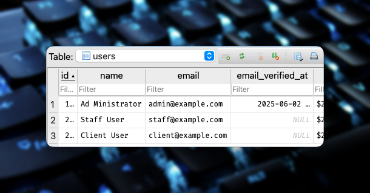
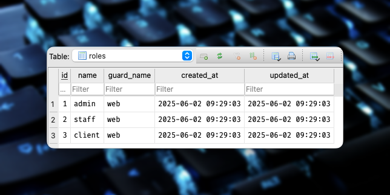
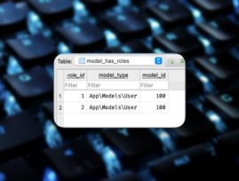
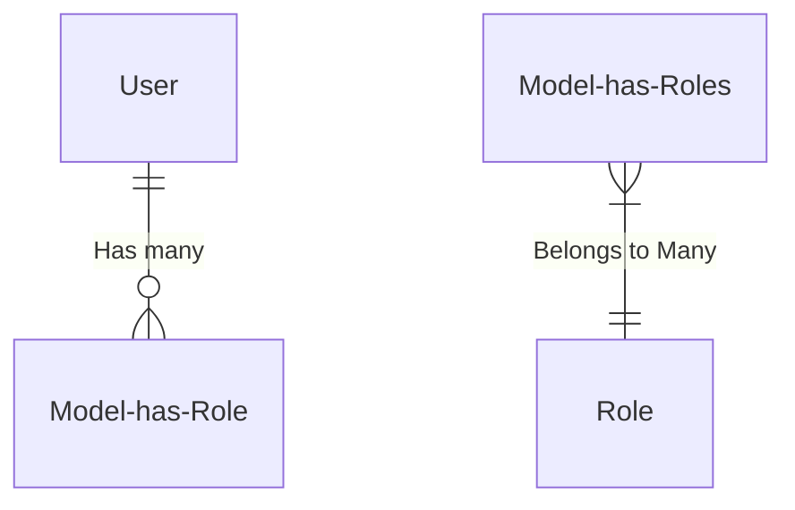
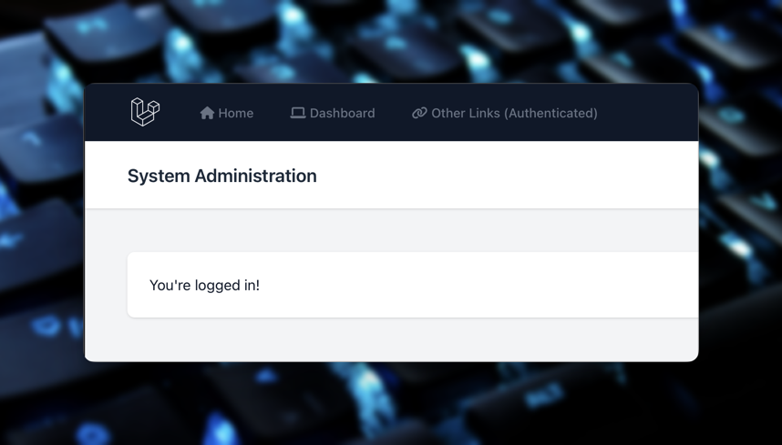
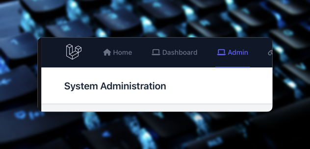
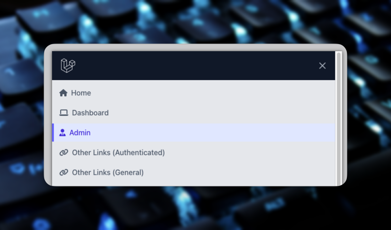
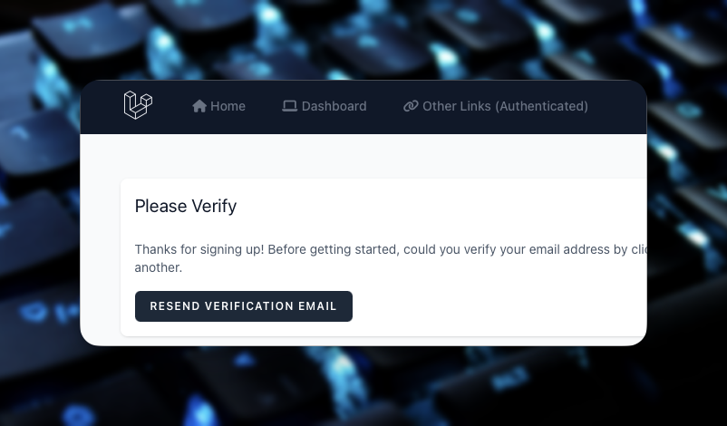
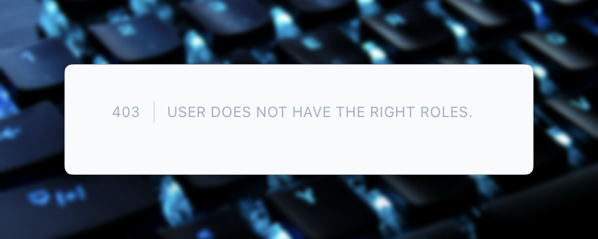

# S10 Laravel Bootcamp: Part 8

## Software as a Service - Front-End Development

Developed by Adrian Gould

---

```table-of-contents
title: # Contents
style: nestedList
minLevel: 0
maxLevel: 3
includeLinks: true
```

---

# Laravel Bootcamp: Part 10

# TODO: IN PROGRESS

## Roles and Permissions

In this section, we will start to add an administration/management front-end that allows 
users with particular rights to perform management actions on data in the Chirp system.

We will:
- Build User Management Interface
- Determine Roles to use in Application
- Determine Permissions each Role will have
- Apply Roles & Permissions to Application (User Management)


## Before you start…

Have you completed (not just read):

- [Laravel v12 Bootcamp - Introducing Laravel](../session-11/S11-Introducing-Laravel-v12.md),
- [Laravel v12 Bootcamp - Part 1](../session-11/S10-Laravel-v12-BootCamp-Part-1.md),
- [Laravel v12 Bootcamp - Part 2](../session-11/S10-Laravel-v12-BootCamp-Part-2.md)
- [Laravel v12 Bootcamp - Part 3](../session-11/S10-Laravel-v12-BootCamp-Part-3.md)
- [Laravel v12 Bootcamp - Part 4](../session-11/S10-Laravel-v12-BootCamp-Part-4.md)
- [Laravel v12 Bootcamp - Part 5](../session-11/S10-Laravel-v12-BootCamp-Part-5.md)
- [Laravel v12 Bootcamp - Part 6](../session-11/S10-Laravel-v12-BootCamp-Part-6.md)
- [Laravel v12 Bootcamp - Part 7](../session-11/S10-Laravel-v12-BootCamp-Part-7.md)
- [Laravel v12 Bootcamp - Part 8](../session-11/S10-Laravel-v12-BootCamp-Part-8.md)
- [Laravel v12 Bootcamp - Part 9](../session-11/S10-Laravel-v12-BootCamp-Part-9.md)


No? Well… go do it…

You will need these to be able to continue…

> **Important:** You should understand that whilst you are completing this tutorial, you will
> only see parts of the application working when a stage is complete.
>
> So if you get an error in the browser, it may be because there is something missing.


# Roles & Permissions

Permission
- The ability to perform an action
  - Add User
  - Edit User

Role
- Collection of permissions
  - User Admin
  - Product Admin

## Gates and Policies

Gates are…
- Permissions
- Laravel uses the term “gate”

Policies are…
- Permissions applied to (Eloquent) Models

### How do we use Gates?

Identify the typical actions needing permission:

- Define the permission: E.g. "`manage users`"
- Check the permission on the front-end:
  E.g. show/hide the button
- Check the permission on the back-end: 
  E.g. can/can't update the data

### Laravel Example

Looking at the file `App/Providers/AppServiceProvider.php`:

```php
use App\Models\User;
use Illuminate\Support\Facades\Gate;
 
class AppServiceProvider extends ServiceProvider
{
  public function boot()
  {
    // Should return TRUE or FALSE
    Gate::define('manage users', function(User $user) {
      return $user->is_admin == 1;
    });
  }
}

```

And the `Resources/views/navigation.blade.php` file:

```php
<ul>

	<li>
		<a href="{{ route('projects.index') }}">Projects</a>
	</li>
	
	@can('manage users’)
	<li>
		<a href="{{ route('users.index') }}">Users</a>
	</li>
	@endcan
	
</ul>

```

## Ways to Check Permissions

- Routes Middleware
- Controller Can / Cannot
- Gate Allows / Denies
- Controller Authorise
- Form Request class

### Routes Middleware

```php
Route::post('users', [UserController::class, 'store’])
    ->middleware('can:create_users');
```

```php
Route::middleware(‘can:create-users')->group(function () {
    Route::post(‘users’, [UserController::class, ‘store',]
});
```

### Controller Can / Cannot

```php
public function store(Request $request)
{
  if (!$request->user()->can('create_users'))
    abort(403);
  }
}
```

```php
public function store(Request $request)
{
  if ($request->user()->cannot('create_users'))
    abort(403);
  }
}
```

```php
public function create()
{
  if (!auth()->user()->can('create_users'))
    abort(403);
  }
}
```

### Gate Allows / Denies

```php
public function store(Request $request)
{
    if (!Gate::allows('create_users')) {
        abort(403);
    }
}
```

```php
public function store(Request $request)
{
    abort_if(Gate::denies('create_users'), 403);
}
```

```php
public function store(Request $request)
{
    abort_if(Gate::denies('create_users'), 403);
}
```

### Controller Authorise

```php
public function store(Request $request)
{
    $this->authorize('create_users');
}
```

### Form Request class

```php
public function store(StoreUserRequest $request)
{
    // No check is needed in the Controller method
}
```

```php
class StoreProjectRequest extends FormRequest
{
    public function authorize()
    {
        return Gate::allows('create_users');
    }
 
    public function rules()
    {
        return [
            // …
        ];
    }
}
```

## Policies

Model-based set of permissions

When used:

Able to attach permission to model?

Create a Policy using:

```shell
php artisan make:policy MODELNAMEPolicy --model=MODELNAME
```

Example:

```shell
php artisan make:policy ProductPolicy --model=Product
```

The Policy file will contain stubs.

You define the condition for true/false result, e.g.:

```php
class ProductPolicy
{
    public function create(User $user)
    {
        return $user->is_admin == 1;
    }

/* … snipped out code … */

}
```

### Check the Policy

Use these in a similar way to gates:

```php
public function store(Request $request)
{
    $this->authorize('create', Product::class);
}
```

## Roles

Universal set of Permissions

Not part of the framework
- ‘Human readable’ term
- Group Permissions

Examples include:
- Product Manager
- User Administrator
- Editor
- Author

# Spatie Permissions

Package to help with Roles and Permissions

- Assist by abstracting permission management
- Make it more human friendly

```php
$user->givePermissionTo('edit articles’);

$user->assignRole('writer’);

$role->givePermissionTo('edit articles’);

$user->can('edit articles');

```

# Creating a Demo App

Using Roles and Permissions in a small demo application

Code is available on GitHub: https://github.com/AdyGCode/roles-permissions-2025-s1

We STRONGLY suggest you complete this tutorial from scratch

This will assist your understanding and ability to apply to other projects

## Create Base Code using Laravel installer

We presume you are using the bash terminal.

For details on setting this up, check the https://help.screencraft.net.au FAQs

Change into your Source/Repos folder:

```shell
cd /c/Users/USERID
cd Source/Repos
```
Update the Laravel Installer

It is always a good idea to see if the Laravel installer and its required packages have been 
updated so… run the composer update in the global context to do this.

```shell
composer global update
```

### Create a new Demo Application

> This section is based on the video series Spatie Laravel Permission by Tony Xhepa. The sries 
> was created three or so years ago, and as a result, some of the information is outdated. 
> These notes aim to update to Laravel 12, and provide code that works with this version fo 
> the framework.
> 
> - Xhepa, T. (2022, March 1). Spatie Laravel Permission. 
>   YouTube. http://www.youtube.com/playlist?list=PL6tf8fRbavl3xuFIe4_i3TB4PZbtbx3Js


Now we are ready to create a new Laravel Application for the purpose of demonstrating how to 
add roles and permissions to an application.

```shell
laravel new roles-permissions-2025-s1 --using-adygcode/retro-blade-kit
```

Change into your new project:

```shell
cd roles-permissions-2025-s1
```

### Install Spatie Permissions

Now we can add the Spatie Permissions package:

```shell
composer require spatie/laravel-permission
```

Install the migrations and settings for the Roles/Permissions package:

```shell
php artisan vendor:publish --provider="Spatie\Permission\PermissionServiceProvider" 
```

### Running our Dev Server

Split the terminal into two panels:

- <kbd>ALT</kbd>+<kbd>SHIFT</kbd>+<kbd>-</kbd>

Remember that resizing panels is easy:

Click in the panel and use: <kbd>ALT</kbd>+<kbd>SHIFT</kbd>+ ⬅️➡️⬆️⬇️ (arrow keys)

In the bottom panel, execute:

```shell
cd roles-permissions-2025-s1
```

Now in this bottom panel execute

```shell
composer run dev
```

> Remember: you may want to modify the composer dev script (in `composer.json`) to also 
> execute MailPit. See [Introducing Laravel v12](./S11-Introducing-Laravel-v12.md) for 
> details on adding "MailPit" to the `composer run dev` command.


## Adding "Roles" Trait to the User Model

Adding the Roles and Permissions to the User model is a matter of adding a couple of lines 
to the `User` model.

This trait is then available when we need by checking if a user `can` or 
`cannot` do an operation via checking the permission.

Open the `User` model and add the `HasRoles` after `Notifiable`:

```php
    use HasFactory, Notifiable, HasRoles;
```

Remember that you will need to `use` the class just after the namespace to import it:

```php
use Spatie\Permission\Traits\HasRoles;
```

### Applying Role Middleware

To make it easier to use aliases like 'role', 'permission' and 'role_or_permission' we will 
update the `bootstrap/app.php` file.

Now locate the line `->withMiddleware(function (Middleware $middleware) {` and add:

```php
$middleware->alias([
    'role' => \Spatie\Permission\Middleware\RoleMiddleware::class,
    'permission' => \Spatie\Permission\Middleware\PermissionMiddleware::class,
    'role_or_permission' => \Spatie\Permission\Middleware\RoleOrPermissionMiddleware::class,
]);
```

> ### Aside:
> 
> One advantage of this is that we can then, if we wish, apply `role`, `permission` or 
> the `role_or_permission` to check at the route stage. For example:
> 
> ```php
> Route::group(['middleware' => ['role:manager']], function () { … });
> Route::group(['middleware' => ['permission:publish articles']], function () { … });
> Route::group(['middleware' => ['role_or_permission:publish articles']], function () { … });
> ```
> [For more information, always read the
> documentation for the package.](https://spatie.be/docs/laravel-permission/v6/basic-usage/middleware)


OK, let's continue…


## Creating an Admin Role and Assigning it

We are now ready to begin the next stage of our development. In this step we will be:

- Creating an `admin` role
- Assigning the role to an `admin` user

We will use a seeder to do this as it is reproducible and allows us to vary depending on the 
requirements of the project.

### Role seeder

Let us start by first visiting th Role Seeder… ok, so we need to create one first… so:

```shell
php artisan RoleSeeder
```

Open the Role Seeder file (in `database/seeders`).

After the namespace, add:

```php
use Spatie\Permission\Models\Role;

```

In the `run` method we will now add:

```php
$roleAdmin = Role::create(['name' => 'admin']);
```

This will create the `admin` role.

You could easily add the `staff` and `client` roles at this point if you wish.


### Admin User Seeder

As part of the "Retro Blade Kit" we have a seeder already created for users.

The seeder creates the users:
- admin
- staff
- client

So that is a chunk of what is needed already done for us.

But, we are going to make some changes.

- Duplicate the user Seeder and rename this to `AdminSeeder`
- Remove the client and staff from this new seeder
- Update to add the `admin` role to the Admin User.

Start by removing most of the current code, and remove the list of users, and make it a 
single `seedUser`:

```php
$seedUser = [
    'id' => 100,
    'name' => 'Ad Ministrator',
    'email' => 'admin@example.com',
    'password' => 'Password1',
    'email_verified_at' => now(),
];
```

Remove the foreach loop and reduce the code to:

```php
$adminUser = User::updateOrCreate(
    ['id' => $seedUser['id']],
    $seedUser
);
```

Now we are able to assign the role to the Admin user:

```php
$adminUser->assignRole('admin');  
```

Let's take this a step further by adding the Admin and Staff roles:

```php
$adminUser->assignRole([
    'admin',
    'staff',
]);
```


That makes our AdminSeeder's run method much shorter.

Now we need to update the Database Seeder and add the RoleSeeder **BEFORE** the UserSeeder and 
AdminSeeder…

```php

        $this->call([
            RoleSeeder::class,
            
            AdminUserSeeder::class,
            UserSeeder::class,

        ]);

```

As we are working in development, we can apply these changes from fresh:

```shell
php artisan migrate:fresh --seed
```

If you have [DBBrowser](https://sqlitebrowser.org/) then you can check what has been created by the migrations and seeds 
in the SQLite database:


#### Users Table


#### Roles Table


#### Model Has Roles Table

This is the Spatie Permission table that links the Role to the required model, in our case 
the User model. It indicates that the User model (Users table) with an ID of 100 is linked 
to a role number of 1.



Yes, it's the Many-to-Many relationship in a normalised form!



### Staff Role and User

Exercise: Repeat the above but for the Staff user and role. Assign only the staff role to 
the staff member.


### User Seeder Update

Finally, we will assign the client role to the client user.

In doing this we will add two users, only one of which will have the role assigned.

Update the `UserSeeder` file so the `$seedUsers` is as shown below:

```php
$seedUsers = [
    [
        'id' => 201,
        'name' => 'Client User',
        'email' => 'client@example.com',
        'password' => 'Password1',
        'email_verified_at' => null,
        'role' => 'client',
    ],

    [
        'id' => 202,
        'name' => 'Another User',
        'email' => 'another@example.com',
        'password' => 'Password1',
        'email_verified_at' => null,
    ],
];
```

Now the `foreach` will become:

```php
foreach ($seedUsers as $user) {
    $role = $user['role']??null;
    unset($user['role']);

    $clientUser = User::updateOrCreate(
        ['id' => $user['id']],
        $user
    );

    if ($role === 'client') {
        $clientUser->assignRole('client');
    }
}
```

The code grabs the role from the data (if one exists) and then creates the user.

After the user is created, if the role is `client` then the role is assigned to the user.


## Creating the Admin Interface

We will, in this step:

- update the web routes
- create folders for the admin of Roles & Pages
- create index pages for Roles & Permissions
- create the index methods 
- repeat for:
	- create
	- update
	- delete
	- read 1 (show)

### Routes

Open the `web.php` file in the `routes` folder and, immediately after the dashboard entry, add:

```php
Route::middleware(['auth', 'verified', 'role:admin'])
    ->group(function () {
        Route::get('/admin', function () {
            return view('admin.index');
    })->name('admin.index');
});
```

This will verify that the user is:
- logged in
- verified, and
- a member of the admin group (role))

This provides the first level of protection from a "bad" user trying to access a section 
of the system when they do not have permission to do so.

Obviously, at the moment, when the page refreshes, this will cause an error.

### Create Admin View(s)

Create a new folder, `admin` in the `resources/views` folder.

Copy the `dashboard.blade.php` file into this new folder and rename it to `index.blade.php`.

Update the new `admin/index.blade.php` file to read:

```php
<x-app-layout>
    <x-slot name="header">
        <h2 class="font-semibold text-xl text-gray-800 leading-tight">
            {{ __('System Administration') }}
        </h2>
    </x-slot>

    <div class="py-12">
        <div class="max-w-7xl mx-auto sm:px-6 lg:px-8">
            <div class="bg-white overflow-hidden shadow-sm sm:rounded-lg">
                <div class="p-6 text-gray-900">
                    {{ __("You're logged in!") }}
                </div>
            </div>
        </div>
    </div>
</x-app-layout>
```

Try accessing https://localhost:8000/admin … you should be challenged to log into the site 
(`admin@example.com` and `Password1`).

Once logged in, you should now be presented with a page like this:



We will look at creating a Layout specific for Admin later.


### Update Navigation to Show Admin

One problem you now have, is that you cannot get to the Admin area if you log in via the 
main page. So we need to update the navigation.

We are going to see our first use of the `can` blade directive to check if the current user 
is an `admin` user or not.

> #### Important:
> 
> We would usually check at the _permission_ level to make sure that the user is allowed to do 
 
Open the `navigation.blade.php` file from the `resources/views/layouts` folder.

We will have to make two sets of changes as the navigation is responsive, so let's start with…

#### Desktop Navigation

Locate the code:

```php
<x-nav-link :href="route('dashboard')" :active="request()->routeIs('dashboard')">
    <i class="fa-solid fa-laptop mr-1"></i>
    {{ __('Dashboard') }}
</x-nav-link>
```

We are going to add a new entry after the `</x-nav-link>`:

```php
@role('admin')
    <x-nav-link :href="route('admin.index')" 
                :active="request()->routeIs('admin.*')">
        <i class="fa-solid fa-user-tie mr-1"></i>
        {{ __('Admin') }}
    </x-nav-link>
@endrole
```

On refreshing the page you will now see the `Admin` option if you are the admin user.



> _We have updated the icon to a user with a tie in the code._

#### Mobile Navigation

The mobile navigation is going to be very similar to the desktop version.

Locate the lines:

```php
<x-responsive-nav-link :href="route('dashboard')" 
                       :active="request()->routeIs('dashboard')">
    <i class="fa-solid fa-laptop mr-1"></i>
    {{ __('Dashboard') }}
</x-responsive-nav-link>
```

Duplicate these lines, and modify to read:

```php
@role('admin')
<x-responsive-nav-link :href="route('admin.index')"
            :active="request()->routeIs('admin.*')">
    <i class="fa-solid fa-user-tie mr-1"></i>
    {{ __('Admin') }}
</x-responsive-nav-link>
@endrole
```

And yes, there is only one real change - adding `responsive` to the tags.



When a user without the required rights logs in - the option is missing:



Plus, if they try going to the route directly…



### Further Development

At some point in the future, the layout we are using would benefit from being updated to a 
sidebar rather than a header, and also remove the footer, or at least make it minimal.

Administration needs to focus on the maintenance of the site's data.

## Role and Permission Management

We are now ready to add the management of the Roles and Permissions. This is basically CRUD 
for these two parts of the application.

Start by creating a Role Controller and a Permission Controller.

```shell
php artisan make:controller PermissionController
php artisan make:contreoller RoleController
```

Next add the required Routes to the `web.php` routes file.

Locate the middleware for the admin section:

```php
Route::middleware(['auth', 'verified', 'role:admin'])->group(function () {
    Route::get('/admin', function () {
        return view('admin.index');
    })->name('admin.index');    
});
```

We will modify this as we are going to be adding more administration routes:

```php
Route::name('admin.')
    ->prefix('admin')
    ->middleware(['auth', 'verified', 'role:admin'])
    ->group(function () {

        Route::get('/', [StaticPageController::class, 'admin'])
            ->name('index');

        Route::resource('/roles', RoleController::class);
        Route::resource('/permissions', PermissionController::class);
    });
```

> Remember to import the Role and Permission Controller classes (use lines)

The modifications mean we are able to still visit the `http://localhost:8000/admin` route, 
as the following is performed for us…

- `name('admin.')` - named routes within the closure will seen as `admin.xxxx`, where`xxxx` is the name associated with the inner route (e.g. index).
- `prefix('admin')` will add the `admin/` part of the URI automatically. 

So, in the case of the `get('/')…->name('index')` the route will be known as `admin.index` 
and the URI will be `/admin`, that is `http://localhost:8000/admin`
and even better is that we will be able to refer to the roles route by name as well… `admin.roles.index` … cool eh?

We will also use a static page controller to show the admin page… so…

### Add static folder to views

Use the IDE or use the command line to add a new static folder to the `resources/views` folder.

```shell
mkdir -p resources/views/static
```

We need to move the welcome and dashboard views into that nice and new static page folder.

The admin index page will stay where it is in the `admin` folder.

```shell
mv resources/views/welcome.blade.php resources/views/static/
mv resources/views/dashboard.blade.php resources/views/static/
```

Also you will now need to update the routes in the `navigation.blade.php` and also the `footer.blade.php` as needed.

| Original Name        | New Route Name              | New RouteIs Name              |
|----------------------|-----------------------------|-------------------------------|
| `route('home')`      | `route('static.home')`      | `routeIs('static.home')`      |
| `route('dashboard')` | `route('static.dashboard')` | `routeIs('static.dashboard')` |

Also, these controllers will need to be updated to point at the correct route names:

- `AuthenticatedSessionController.php`
- `ConfirmablePasswordController.php`
- `EmailVerificationNotificationController.php`
- `EmailVerificationPromptController.php`
- `RegisteredUserController.php`
- `VerifyEmailController.php`

These are all within the `app/Http/Controllers/Auth` folder.

You can always check the [Roles and permissions 2025 S1 Repository](https://github.com/AdyGCode/roles-permissions-2025-s1) and check your code.


### Add a Static Page Controller

Create the `StaticPageController`:

```shell
php artisan make:controller StaticPageController
```

Once created, open the file and add methods for:

- home
- dashboard
- admin index


#### Home Method

```php
    function index(){
        return view('static.welcome');
    }
```


#### Dashboard method


```php
    function dashboard(){
        return view('static.dashboard');
    }
```

#### Admin Index Method

```php
    function admin(){
            return view('admin.index');
    }
```


#### Update the static page routes

Modify the welcome and dashboard routes to become:

```php

Route::name('static.')->group(function () {

    Route::get('/', [StaticPageController::class, 'index'])
        ->name('home');

    Route::get('/dashboard', [StaticPageController::class, 'dashboard'])
        ->middleware(['auth', 'verified'])
        ->name('dashboard');
        
});

```

We are again making use of the ability to name groups of routes.

### Add Links to the Admin Page

For the time being, we will be using the admin page as a switchboard. To do so we will add 
cards' that link to other parts of the Admin.

Eventually, these could become a sidebar menu.

Open the `admin/index.blade.php` file and update the code that is nestled inside 
`<div class="bg-white overflow-hidden shadow-sm sm:rounded-lg … gap-8 p-8">` and `</div>`:

```php
<div class="bg-white overflow-hidden shadow-sm sm:rounded-lg grid grid-cols-3 gap-8 p-8">

    <a href="{{ route('admin.roles.index') }}"
       class="border p-6 hover:bg-blue-500 hover:text-white grow">
        <h3 class="text-xl">Roles</h3>
        <p>This could be a card with statistics about Roles</p>
    </a>
    
    <a href="{{ route('admin.permissions.index') }}"
       class="border p-6 hover:bg-blue-500 hover:text-white grow">
        <h3 class="text-xl">Permissions</h3>
        <p>This could be a card with statistics about Permissions</p>
    </a>
    
    <a href="{{ route('admin.index') }}"
       class="border p-6 hover:bg-blue-500 hover:text-white grow">
        <h3 class="text-xl">Another Admin Link</h3>
        <p>This could be a card with statistics about Permissions</p>
    </a>
    
    <a href="{{ route('admin.index') }}"
       class="border p-6 hover:bg-blue-500 hover:text-white grow">
        <h3 class="text-xl">Another Admin Link</h3>
        <p>This could be a card with statistics about Permissions</p>
    </a>

</div>
```


### Verify Working

Make sure that the pages are now displaying as expected… 

Well, all except the roles and permissions pages.


## Role & Permission (R&P) Management Pages

We need to create the CRUD pages for the Roles and Permissions.

### Create View Folders

Start by creating folders for the roles and permissions admin pages:

```shell
mkdir -p resources/views/admin/{roles,permissions}
```

We will place the CRUD pages into these folders. It keeps admin-related views together and 
less likly to confuse with views that may have the same name for ordinary client type users.

### Index methods

Let's now start getting our teeth into the R&P admin.

Open the `RoleController` you created earlier.

Add a new `index` method:

```php
    public function index()
    {
        return view('admin.roles.index');
    }
```

Likewise for the `PermissionController`:

```php
    public function index()
    {
        return view('admin.permissions.index');
    }
```


### Add index pages

Copy the `admin/index.blade.php page` into the `roles` folder and update the code to be:

```php
<x-app-layout>
    <x-slot name="header">
        <h2 class="font-semibold text-xl text-gray-800 leading-tight">
            {{ __('System Administration') }}
        </h2>
    </x-slot>

    <div class="py-12">
        <div class="max-w-7xl mx-auto sm:px-6 lg:px-8">
            <div class="bg-white overflow-hidden shadow-sm sm:rounded-lg p-8">

                Roles Administration

            </div>
        </div>
    </div>
</x-app-layout>
```

### Permissions Index Page

Exercise:

Repeat the above for the permissions, changing 'Roles' to 'Permissions'.

### Display the Roles

We can use tables or grids or even flex boxes to display our list of roles, but for now we 
will utilise a good old table.

Open the `roles/index.blade.php` file and:

- Replace `__('System Administration')` with `__('Roles Administration')`

Let us concentrate on the Roles index page.

> The table layout is from https://www.hyperui.dev/components/application/tables

Replace the text `Roles Administration` that is not in the header, with the following:

```php
<div class="overflow-x-auto rounded border border-gray-300 shadow-sm">
    <table class="min-w-full divide-y-2 divide-gray-200">
        
        <thead class="ltr:text-left rtl:text-right">
        <tr class="*:font-medium *:text-gray-900">
            <th class="px-3 py-2 whitespace-nowrap">Role Name</th>
            <th class="px-3 py-2 whitespace-nowrap">Actions</th>

        </tr>
        </thead>

        <tbody class="divide-y divide-gray-200">
        @foreach($roles as $role)
            <tr class="*:text-gray-900 *:first:font-medium">
                <td class="px-3 py-2 whitespace-nowrap">{{ $role->name }}</td>
                <td class="px-3 py-2 whitespace-nowrap">
                    Details
                    Edit
                    Remove
                </td>

            </tr>
        @endforeach
        </tbody>

        <tfoot>
        <tr>
            <td colspan="2" class="p-3">
                @if( $roles->hasPages())
                    {{ $roles->links() }}
                @else
                    <p class="text-sm text-gray-500">
                        All Roles shown
                    </p>
                @endif
            </td>
        </tr>
        </tfoot>

    </table>
</div>
```

If you refresh, then there will be a problem with the view as we have not got the roles from 
the database.

Open the `RolesController` and update the index method:

```php
        $roles = Role::paginate(15);

        return view('admin.roles.index')
            ->with('roles', $roles);
```

That's the basic layout.

### Display the Permissions as a table

We already have the dashboard as the basis, so we will use this as a start.

Exercise: Do the same process for the permissions to be displayed in a table.

### Create the Add Role page

The easiest way to do this is to duplicate the index, and remove anything we do not want, to leave us with:

```php
<x-app-layout>  
    <x-slot name="header">  
        <h2 class="font-semibold text-xl text-gray-800 leading-tight">  
            {{ __('Roles Administration') }}  
        </h2>  
    </x-slot>  
    <div class="py-12">  
        <div class="max-w-7xl mx-auto sm:px-6 lg:px-8">  
            <div class="bg-white overflow-hidden shadow-sm sm:rounded-lg p-8">  
  
                <div class="overflow-x-auto rounded border border-gray-300 shadow-sm">  
  
                    <div class="flex flex-1 justify-between p-2 items-end bg-gray-200">  
                        <h2 class="text-2xl ">
                        Create New Role
                        </h2>  

                        <a href="{{ route('admin.roles.index') }}"  
                           class="rounded bg-green-500 text-white hover:bg-white hover:text-green-500 border-green-500 px-4 py-2">  
                            All Roles  
                        </a> 
                        
						<a href="{{ route('admin.roles.create') }}"  
                           class="rounded bg-green-500 text-white hover:bg-white hover:text-green-500 border-green-500 px-4 py-2">  
                            New Role  
                        </a>  
                    </div>  
                    
					<!-- Rest of page here -->
					  
                </div>  
            </div>
                    
        </div>    
    </div>
</x-app-layout>
```

Before we continue, we need to add a way to easily go back to the list of Roles, so let's add a button.

Locate the: `<h2>` for the `Create new Role`, and modify the code after that, and up to the first `</div>`:

```php
<h2 class="text-2xl ">Create New Role</h2>  
  
<div class="space-x-4 py-2">  
    <a href="{{ route('admin.roles.index') }}"  
       class="rounded bg-blue-500 text-white hover:bg-white hover:text-blue-500 border-blue-500 px-4 py-2">  
        All Roles  
    </a>  
  
    <a href="{{ route('admin.roles.create') }}"  
       class="rounded bg-green-500 text-white hover:bg-white hover:text-green-500 border-green-500 px-4 py-2">  
        New Role  
    </a>  
</div>
```

In the space represented by `<!-- Rest of page here -->` we will now add:

```php
<form action="{{ route('admin.roles.index') }}"  
      method="POST"  
      class="p-6 flex flex-col space-y-4">  

	@csrf

	<div>  
    <x-input-label 
	    for="name" 
	    :value="__('Role Name')"/>  
  
    <x-text-input 
	    id="name" 
	    class="block mt-1 w-full" 
	    type="name" 
	    name="name"  
        :value="old('name')" 
        required/>  
  
    <x-input-error 
	    :messages="$errors->get('name')" 
	    class="mt-2"/>  
</div>
      
    <div class="flex flex-row space-x-4">  
        <x-primary-button>
	        Save
        </x-primary-button>  
        <x-link-button href="{{route('admin.roles.index')}}">  
            Cancel  
        </x-link-button>  
    </div>
    
</form>
```

We do not have a `x-link-button` so we create a file `limnk-button.blade.php` in the `resources/views/components` folder  and add the content:

```php
<a {{ $attributes->merge([  
    'class' => 'inline-flex items-center px-4 py-2 bg-gray-300 border border-transparent  
                rounded-md font-semibold text-xs text-gray-800 uppercase tracking-widest                hover:bg-gray-400 hover:text-white focus:bg-gray-400 active:bg-gray-400 focus:outline-none                focus:ring-2 focus:ring-indigo-500 focus:ring-offset-2                transition ease-in-out duration-150']) }}>  
    {{ $slot }}  
</a>
```

The page should look similar to this:


### Add the Store action

Now we have a form we need to store the new role in the system.

Go back to the `RoleController` and add a new method `store`:

```php
public function store(Request $request)  
{  
  
    $validated = $request->validate([  
       'name'=>[  
           'required',  
           'min:5',  
           'max:64',  
           'unique:roles'  
       ]  
    ]);  
```

The validation should be familiar by now. The name is required, between 5 and 64 characters in length (inclusive), and unique.

```php
    $validated['name']=Str::lower($validated['name']);  
```

We force the role to all lower case.

```php
    Role::create($validated);  
```

Then create the role in the database, before returning to the roles index page.

```php  
    return to_route('admin.roles.index');  

}
```

### Repeat for the Permissions!

Exercise:

Do the permissions create page, as we have done for the Roles. The permission's name, though, needs to be up to 128 characters.


## Edit Roles & Permissions

The Index and Create are done.

Now onto Edit.

### Create the Edit Role page

Easiest way is to duplicate the `create.blade.php` file and rename it `edit.blade.php`.

Then edit the page, making the following changes:

- update the `<h2 class="text-2xl ">Create New Role</h2>` text to be `Edit Role`.

- change the form route to be `route('admin.roles.update', $role)`
 
- Add a `@method('patch')` immediately after the CSRF.
  
- Update the `x-test-input` control to have the `:value` be  `old('name')??$role->name` to allow the role to be filled in from the database, or if edited the value it was changed to.


### Add Update Method to RoleController

Now edit the role controller.

We need to add an update method, immediately after the `edit` method.

```php
public function update(Role $role, Request $request)  
{  
    $validated = $request->validate([  
        'name' => [  
            'required',  
            'min:5',  
            'max:64',  
            'unique:roles'  
        ]  
    ]);  
  
    $validated['name'] = Str::lower($validated['name']);  
  
    $role->update($validated);  
  
    return to_route('admin.roles.index');  
}
```

As you can see, it is dramatically similar to the store method...


### Add "Confirm delete" View

Duplicate the Edit, and then change the content as needed:

- `<h2 class="text-2xl ">Edit Role</h2>` becomes `<h2 class="text-2xl ">Delete Role</h2>`.

- the form's action becomes `{{ route('admin.roles.destroy', $role) }}`.

- the `@method` becomes a `delete` in place of `patch` (or `put`).

- In the input label, the value`:value="__('Role Name')"/>` becomes `:value="__('Confirm Role Name')"/>`.

- change the text input by removing the `:value="old('name')??$role->name"`.

Also, immediately after the `@method` and just before the form field's div, add:

```php
<div>  
    <p>Please confirm you wish to delete the role:  
        <code class="text-red-500 font-semibold">{{$role->name}}</code>  
        by entering it below:</p>  
</div>
```


### Add Destroy Method to the RoleController

The final step, well almost, is to add the destroy method to remove the role that is identified to be deleted.

Create the destroy method immediately after the delete method.

Change the method's parameter list to be: `Role $role, Request $request`.

Now in the method add:
```php
$roleName = $role->name;  
  
$validated = $request->validate([  
    'name' => [  
        'required',  
        'exists:roles,name'  
    ]  
]);  
```

We are using the form's submitted name field to verify that this is the role we wish to delete, just like GitHub's danger zone confirmations.

Now we can go ahead and delete the role.

```php
$role->delete();  
  
return to_route('admin.roles.index');
```


### Exercise: Complete the Permission Delete & Destroy

Ok, (almost) last step, repeat the above but for the Permissions.


## Adding Feedback to Add, Edit an Delete

Finally we want to give the user confirmation about the actions being completed.

To do so we will use the Flasher module.

Install using composer:

```shell
composer require php-flasher/flasher-laravel
```

Finish the installation using artisan:

```shell
php artisan flasher:install
```

and we are ready to go.

### Update store to include flash messages

We are going to refactor the store method to use the flasher module...

To begin we will wrap the validation 


```php
$role = null;  
  
try {  
  
    $validated = $request->validate([  
        'name' => [  
            'required',  
            'min:5',  
            'max:64',  
            'unique:roles'  
        ]  
    ]);  
  
    $validated['name'] = Str::lower($validated['name']);  
  
    $role = Role::create($validated);  
  
} catch (ValidationException $e) {  
  
    flash()->error('Please fix the errors in the form.',  
        [  
            'position' => 'top-center',  
            'timeout' => 5000,  
        ],  
        'Role Creation Failed');  
  
    return back()->withErrors($e->validator)->withInput();  
  
} catch (RoleAlreadyExists $e) {  
  
    flash()->error('The role already exists.',  
        [  
            'position' => 'top-center',  
            'timeout' => 5000,  
        ],  
        'Role Creation Failed');  
  
    return back()->withErrors($e->getMessage())->withInput();  
  
}
```


## Development Only: Starting the Database From Fresh

As we are in **development**, we can re-run the migrations and seed the database

```php
php artisan migrate:fresh --seed
```

> ### Remember:
> - This MUST NOT be used on a production database
> - This command DROPS all existing tables and data

## Testing

Open the site using http://localhost:8000
- Click on Login
- Enter `admin@example.com and` `Password1`
- Navigate around the Roles and Users pages
- Try allocating a new role to the Test User
- Try removing the role from the test user
- Logout
- Log in as the Dee Mouser user

What are you able to view/do?


# References

- Laravel Bootcamp - Learn the PHP Framework for Web Artisans - 07 Notifications & Events. (
  2025).
  Archive.org. https://web.archive.org/web/20240927152838/https://bootcamp.laravel.com/blade/notifications-and-events

# Up Next

- [Laravel v12 Bootcamp - Part 9](../session-11/S10-Laravel-v12-BootCamp-Part-9.md)
- [Session 11 ReadMe](../session-10/ReadMe.md)
- [Session 11 Reflection Exercises & Study](../session-11/S11-Reflection-Exercises-and-Study.md)

# END
