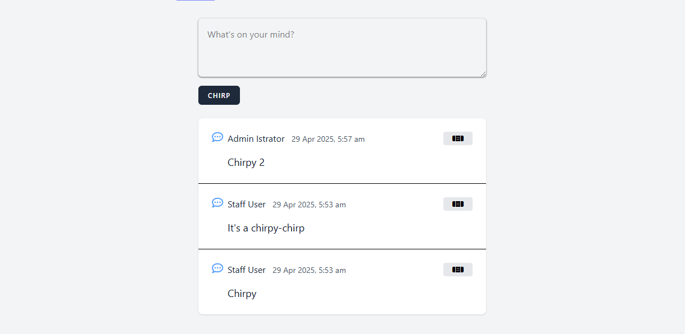

# S10 Laravel Bootcamp: Part 4

## Software as a Service - Front-End Development

Developed by Adrian Gould

---

```table-of-contents
title: # Contents
style: nestedList
minLevel: 0
maxLevel: 3
includeLinks: true
```

---

# Laravel Bootcamp: Part 4

The following notes are based on the official Laravel 11 Boot Camp (Build Chirper with Blade https://bootcamp.laravel.com) with Adrian's shortened explanations.

## Before you start…

Have you completed (not just read):
- [Laravel v12 Bootcamp - Introducing Laravel](../session-11/S11-Introducing-Laravel-v12.md),
- [Laravel v12 Bootcamp - Part 1](../session-11/S10-Laravel-v12-BootCamp-Part-1.md),
- [Laravel v12 Bootcamp - Part 2](../session-11/S10-Laravel-v12-BootCamp-Part-2.md)
- [Laravel v12 Bootcamp - Part 3](../session-11/S10-Laravel-v12-BootCamp-Part-3.md)

No? Well… go do it…

You will need these to be able to continue…

> **Important:** You should understand that whilst you are completing this tutorial, you will only see parts of the application working when a stage is complete. 
> 
> So if you get an error in the browser, it may be because there is something missing.

# Authorisation and Policies

There are ways that our current code will allow hackers circumvent the lack of an action button to let them delete or edit another user's chirp.

e.g. http://domainname/chirps/3/edit


So how may we prevent this?

We use authorisation and policies to dictate who may edit and delete chirps.

Before we look at this we will need a few terms.

| Term           | Meaning                                                                                                                                                                                                                                                                                                                                                    |
| -------------- | ---------------------------------------------------------------------------------------------------------------------------------------------------------------------------------------------------------------------------------------------------------------------------------------------------------------------------------------------------------- |
| Authentication | Is the process of verifying credentials of a user against those stored in the application.<br><br>Authentication DOES NOT require Authorisation.<br>                                                                                                                                                                                                       |
| Authorisation  | Is the process of giving a "user" permission to perform actions.<br><br>We verify that the "user" has access to specific features, data and other aspects of the application.<br><br>The usual form of authorisation in the software industry is the through the use of policies, roles and permissions.<br><br>Authorisation REQUIRES Authentication.<br> |
| Policy         | Determines what actions a "user" may perform with a model.<br>                                                                                                                                                                                                                                                                                             |
| Gate           | Similar to a bouncer on the door of a concert or such, it applies a policy to the active "user" and allows or prevents them performing the action.<br>                                                                                                                                                                                                     |

### Adding Gates

Let's begin by modifying our Chirps controller method by adding Gates to the code.

#### Gate Facade

Our controller needs to import the Gate facade to allow its use.

In the `ChirpController`, add the following `use` line:

```php
use Illuminate\Support\Facades\Gate;
```

#### Gate Structure

When we add gates to the controller methods, the gates have the structure:

```php
Gate::authorize(ACTION_TO_AUTHORISED, MODEL_NAME);  
```

Using this we will add gates IMMEDIATELY after the function definition's opening curly bracket (`{`).

The code below shows our three updates, but without all the function code.

#### The Edit Method
```php
public function edit(Chirp $chirp)  
{  
    Gate::authorize('update', $chirp);  
```

#### Update Method
```php
public function update(Request $request, Chirp $chirp): RedirectResponse  
{  
    Gate::authorize('update', $chirp);  
```

#### Delete Method
```php
public function destroy(Chirp $chirp): RedirectResponse  
{  
    Gate::authorize('delete', $chirp);  
```

We are able to use the application still, and there will appear to be no change in functionality.

### Adding an Authorisation Policy

Now we have gates on actions, we should create the Policy that will control the gates.

Execute the following command in the CLI:

```shell
php artisan make:policy ChirpPolicy --model=Chirp
```

Now use the <kbd>SHIFT</kbd>-<kbd>SHIFT</kbd> method to locate the `ChirpPolicy.php` file. (It is in the `app/Policies` folder.)

By default there will be code for policy stubs that reject ability for users to perform actions.

We need to add policies to update and delete to allow the owner of the chirp to perform the actions.

#### Update Policy

Find the `update` method, and edit it to return `true` when the currently logged in user is the user who owns the chirp, rather than the default of `false`:

```php
 return $chirp->user()->is($user); 
```

#### Delete Policy

The delete policy is slightly different, as delete will use the same code as our update policy, so we may as well just call that policy rather than duplicating code.

Locate the `delete` method in the `ChirpsPolicy` class and replace the `return false` with:

```php
return $this->update($user, $chirp);
```


### Testing the Policies

OK, now try to edit and update again.

It should still function as expected.

#### But... I want more proof

If you are not convinced then we can edit the index view to show the actions button and the edit/delete ability by default and retest.

Open the chirps `index.blade.php` view.

Locate the line `@if($chirp->user->is(auth()->user()))` and comment it out.

Also locate the `@endif` immediately after the `</x-drop-down>` line and comment that out.

Now try editing a chirp you do not own.

Here is an animation of the policies and gates in action.



If you commented out the lines in the Chirps index file, then remove the comments so the button is hidden when the user is not the owner.


# References

- _The differences between authentication and authorization in software development_. (2023, September 25). CNCF. https://www.cncf.io/blog/2023/09/25/the-differences-between-authentication-and-authorization-in-software-development/
- Solène Lanchec. (2024, April 12). _Understanding Authorization Levels in Software Development_. Forest Admin Blog. https://www.forestadmin.com/blog/understanding-authorization-levels-in-software-development/
- GeeksforGeeks. (2019, June 6). _Difference Between Authentication and Authorization_. GeeksforGeeks. https://www.geeksforgeeks.org/difference-between-authentication-and-authorization/


# Up Next

In the next part of the bootcamp we will add "Edit" and "Delete" chirp capability.

- [Laravel v12 Bootcamp - Part 5](../session-11/S10-Laravel-v12-BootCamp-Part-5.md)
- [Session 11 ReadMe](../session-10/ReadMe.md)
- [Session 11 Reflection Exercises & Study](../session-11/S11-Reflection-Exercises-and-Study.md)


# END
