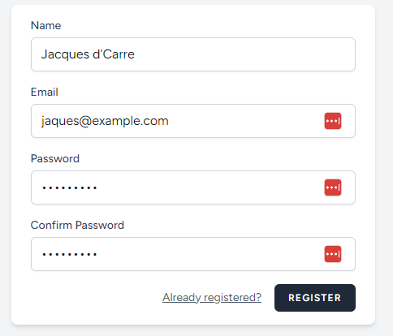
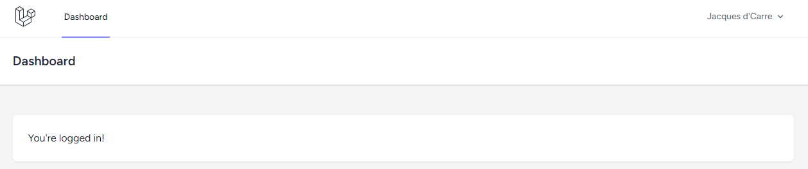
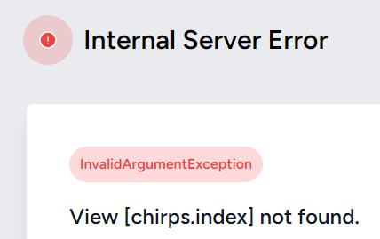
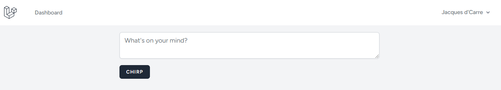
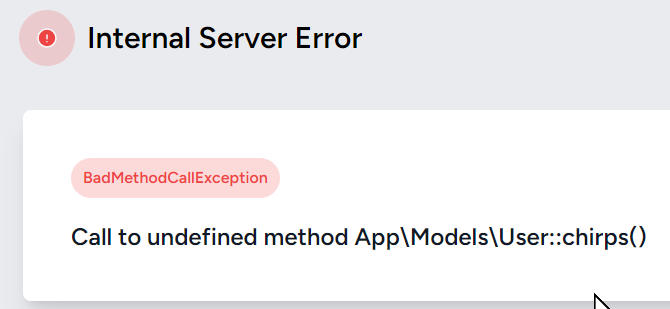

# Laravel Bootcamp: Chirper Part 1

## Software as a Service - Front-End Development

Developed by Adrian Gould

---

```table-of-contents
title: # Contents
style: nestedList
minLevel: 0
maxLevel: 3
includeLinks: true
```

---

# Laravel Bootcamp: Part 1

The following notes are based on the official Laravel 11 Boot Camp (Build Chirper with Blade) with Adrian's shortened explanations.

## Before you start...

Ensure you have completed the [Introducing Laravel v12](S11-Laravel-v12-Bootcamp-Part-00-Introducing-Laravel.md) notes and created the base code for the "Chirper Application" via Adrian's Base Starter Kit.

No? Well... go do it...

We will wait here until you are ready.

Make sure that you have a Windows Terminal screen that looks similar to this, and the each of the shells is in the correct folder!


# Chirper: Move over X, the bird is back!

We will be creating a very basic X (formerly twitter) style micro-blogging application, but keeping it to the basics... text only!

Because we used the Laravel installer, we have already got a basic Laravel application running.

This application has:
- A 'guest' home page
- User registration
- User login
- User logout
- An 'authenticated user' dashboard.

And that was without you writing any code.

OK, let's carry on with the development.

> **Important:** You should understand that whilst you are completing this tutorial, you will only see parts of the application working when a stage is complete. 
> 
> So if you get an error in the browser, it may be because there is something missing.

### Run Sample User Seeder

Before continuing, in the command line execute:

```shell
php artisan db:seed UserSeeder
```

### Register an account

To be able to work with Chirper we need an account so... open your home page:

- http://localhost:8000

Click on Register, and add a new user with the details below. We are doing this so it is easy to go back and repeat later.

| Field            | Entry               |
| ---------------- | ------------------- |
| Name             | Jacques d'Carre     |
| eMail            | jacques@example.com |
| Password         | Password1           |
| Confirm Password | Password1           |

Here is an image of the registration form - with the above entered.



Once you have registered, you will get the dashboard.





#### Add a second user

Open a new Incognito/Anonymous Browser window (most browsers use CTRL+SHIFT+N for this).

Again go to the home page of your application, and register a new user with the details:


| Field            | Entry             |
| ---------------- | ----------------- |
| Name             | Freda Goh         |
| eMail            | freda@example.com |
| Password         | Password1         |
| Confirm Password | Password1         |

Time to start coding.

## Creating the Chirp Models & More

In your Bash CLI, make sure you are in the `/Source/Repos/xxx-chirper-2025-s2 folder, then use:

```shell
php artisan make:model Chirp --all --resource --seed
```

OK, so that is long winded, we can reduce this to:

```shell
php artisan make:model Chirp -acs
```


This will make:

- Model `app/Models/Chirp.php`
- Factory `database/factories/ChirpFactory.php`
- Migration `database/migrations/2025_04_29_044425_create_chirps_table.php`
- Seeder `database/seeders/ChirpSeeder.php`
- Two Requests `app/Http/Requests/StoreChirpRequest.php` and  `app/Http/Requests/UpdateChirpRequest.php`
- Controller `app/Http/Controllers/ChirpController.php`
- Policy `app/Policies/ChirpPolicy.php`

> **Note** that the seeder is an item not in the official BootCamp.


## Adding the Chirp Data to the Migration

Go back to PhpStorm, close the ReadMe.md file and then press <kbd>SHIFT</kbd> twice to start the PhpStorm file search dialog.

Enter:  `chirps_table`

As you do this, PhpStorm will search the files to locate a file, or class, with that text in its name.

You will see a filename that will look similar to this:

```text
2024_09_20_064405_create_chirps_table.php
```

The beginning of the file is the date and time that the make command was executed.

> **Note:** The file is located in the `database/migrations` folder.

Open the file and edit it.

Between the `$table->id()` and `$table->timestamps()` lines we watt to add:

```php
$table->foreignId('user_id')
	->constrained()
	->cascadeOnDelete();
$table->string('message');
```

What we now have is a migration file that will create the `chirps` table, with the fields `id` (an autoincrementing primary key), `user_id` (a foreign key from the `users` table), `message` (the chirp content), and `timestamps` (the `created_at` and `updated_at` fields which are both created in one command).

Now we will execute this migration, so back to the CLI:

```shell
php artisan migrate
```

This will execute any migrations that have not been run before... we will introduce you to another version of this command later when we look at seeding the database.

# Routes, the Signposts to the App's Actions

We know how Routing works from our micro-framework, so let's look at the Laravel route file for a web application.

Use the double <kbd>SHIFT</kbd> technique and enter `web.php`.

> **Note:** the web routes file is found in the `routes` folder.

Open the file and move to the bottom of the file.

Just before the `require __DIR__` line, add:

```php
Route::resource('chirps', ChirpController::class)
  ->only(['index', 'store'])
  ->middleware(['auth', 'verified']);
```

This tells Laravel's router that we are looking for URIs with `/chirps` at the start of the URL after the domain name. 

```php
Route::resource('chirps', ChirpController::class)
```

The `resource` section tells the router that it is to add routes for `index`, `show`, `store`, `create`, `update`, `edit`, and `delete` methods in the `ChirpController` class.

Next we have a modifier that restricts the activity... we are doing this so we can build up each component of the application in turn.

```php
->only(['index', 'store'])
```

It also tells Laravel that we are ONLY going to react to the `index` and `store` methods.

```php
->middleware(['auth', 'verified'])
```

The `middleware` modifier tells the router that the user must be authenticated and verified to be able to use these 'endpoints'.

At the moment we are not verified, so we will modify this line by duplicating it, commenting out the original and changing the second copy...

```php
Route::resource('chirps', ChirpController::class)  
    ->only(['index', 'store'])  
//    ->middleware(['auth','verified', ]);  
    ->middleware(['auth',]);
    ```

These lines have added the following routes:

| Verb | URI       | Action | Route Name   |
| ---- | --------- | ------ | ------------ |
| GET  | `/chirps` | index  | chirps.index |
| POST | `/chirps` | store  | chirps.store |


### Adding the Chirp Controller Use Line

Go to the top of the web routes file and add the following line below the other `use` lines:

```php
use App\Http\Controllers\ChirpController;
```

Save the file and we will head to our Controller...

Try visiting the following URL:

http://localhost:8000/chirps

If you have not registered & logged into the application yet, because of the starter kit, you will be presented with the "login" page displayed:


If you have registered and logged in then you will see a blank page...


### Listing Routes

To list the routes in your application use the artisan command:

```shell
php artisan route:list
```

Here is an extract of the output for the command:

```text
  GET|HEAD  / ...............................................
  GET|HEAD  chirps ..... chirps.index › ChirpController@index
  POST      chirps ..... chirps.store › ChirpController@store

```


# Chirp Controller - Index Method

Ok, locate the `index()` method in the `ChirpController` file...

> **Remember** to use the Double <kbd>SHIFT</kbd> method to search for the file.

> **Note:** The file is located in the `App/Http/Controllers` folder.

Edit the method to read:

```php
public function index(): View
{
	return view('chirps.index');
}
```

This is Laravel's way of telling itself to load the `chirps/index.blade.php` view file.

The problem is, when you refresh your browser it will tell you it is missing... 



This is good, as we have been told that there is a problem, and at least Laravel's error pages look nice...

Back to your CLI for this command:

```shell
mkdir resources/views/chirps
touch resources/views/chirps/index.blade.php
```

Back to the editor and now locate and open the `index.blade.php` file you just created.

It's blank but we are going to change that.

Add the following:
```php
<x-app-layout>
	<div class="max-w-2xl mx-auto p-4 sm:p-6 lg:p-8">
		<form method="POST" action="{{ route('chirps.store') }}">
			@csrf
			<textarea
				name="message"
				placeholder="{{ __('What\'s on your mind?') }}"
				rows="3"
				class="block w-full 
				       border-gray-300 focus:border-indigo-300 
				       focus:ring focus:ring-indigo-200 focus:ring-opacity-50 
				       rounded-md shadow-sm"
            >{{ old('message') }}</textarea>
			<x-input-error :messages="$errors->get('message')" class="mt-2" />

			<x-primary-button class="mt-4">{{ __('Chirp') }}</x-primary-button>

		</form>
	</div>
</x-app-layout>
```


Key notes from this are...

We are using the "app" layout to base the page on.

```php
<x-app-layout>
...
</x-app-layout>
```

The form action is routed by Laravel to the "chirps store".

```php
route('chirps.store')
```

The placeholder text is capable of being translated by Laravel because of the `__()` function call.

```php
__('What\'s on your mind?')
```

If we have an error when chirping, the old message will be displayed in the text area.

```php
old('message')
```

We use an "Input Error" component to display the error 'messages' contained in the `$errors` variable.

```php
<x-input-error :messages="$errors->get('message')" class="mt-2" />
```

This last one will become more obvious when we complete the store method.

### Refresh Browser

We should now see a menu with the user's name (logged in), an area to enter a Chirp and a button to Chirp to the world.



Ok... that's great but the chirps are not going anywhere...

## Save the Chirp!

This almost sounds like a charity, but it's not... we need to store the chirps when the CHIRP button is pressed.

There are several things we need to do with the Save:

1. Test to see if the user is logged in
2. Validate the user's submitted chirp
3. If problem with chirp go back to form
4. Otherwise save the chirp 

Before we write the save code, we need to check the user is logged in.


When we created the Chirp model it added the following files/classes:

- `\app\Models\Chirp.php`
- `\database\factories\ChirpFactory.php`
- `\database\migrations\2025_09_17_063309_create_chirps_table.php`
- `\database\seeders\ChirpSeeder.php`
- `\app\Http\Requests\StoreChirpRequest.php`
- `\app\Http\Requests\UpdateChirpRequest.php`
- `\app\Http\Controllers\ChirpController.php`
- `\app\Policies\ChirpPolicy.php`

We have already worked with the Migration and the ChirpController.

What we now need to do is work with the Requests to verify the user is logged in...

### Checking User is Authenticated

Open the  StoreChirpRequest.php file (`\app\Http\Requests\StoreChirpRequest.php`).

In this file you will find two methods. We are going to be updating the authorize method.

By default the authorize method returns false... which means the user is never going to be able to store their chirp messages.

Let's fix that by updating the `return false` to become:

```php
return auth()->check();
```

This verifies if the users is authenticated, and if so returns a true, otherwise a false is given.

Great, now when we press the Chirp button it will attempt to save the message...

But we know that isn't happening.

It's time to create the Store method!

### Creating the Store Chirp Method


Time to head back to the Chirp Controller...

Open it and locate the `store` method.

Edit the method and add (or edit) the relevant lines

```php
/**  
 * Store a newly created chirp resource. 
 * 
 * @param Request $request  
 * @return RedirectResponse  
 */
public function store(Request $request): RedirectResponse
{
	$validated = $request->validate([
		'message' => 'required|string|max:255',
	]);

	$request->user()->chirps()->create($validated);

	return redirect(route('chirps.index'));
}

```

So what does this do?

- Validates the content sent by the user, whilst only the message is stored in the validated variable...

```php
$validated = $request->validate([
		'message' => 'required|string|max:255',
	]);
```

> **Aside**: You may replace the above with Adrian's preferred "array" based equivalent:
> ```php
> $validated = $request->validate([  
>    'message' => ['required', 'string', 'max:255',],  
> ]);
> ```


- Creates a chirp and associates it with the logged in user

```php
$request->user()->chirps()->create($validated);
```

- Redirects the browser to the chirps page

```php
redirect(route('chirps.index'))
```


Make sure that at the top of the Controller the following use line is added:

```php
use Illuminate\Http\RedirectResponse;
```


You could try making a chirp but we will get the following:




# Relationships are Important

What! Um! Why?

Well, it is telling us that we have not told the (Eloquent) Chirp and User models that they are related...

So it is time to delve into the models, starting with the User model.

> Note: The models are stored in the `/App/Models` folder.

### User Has Many Chirps

Use the double <kbd>SHIFT</kbd> method to search for the `User.php` PHP class file.

We are going to tell Laravel that a User **has zero or many** Chirps...

To do this we go to the bottom of the User model file, and before the **LAST** closing curly bracket (`}`) we add:

```php
    /**
     * A User has zero or more Chirps
     *
     * @return HasMany
     */
    public function chirps():HasMany
    {
        return $this->hasMany(Chirp::class);
    }
```


Great... so that was easy... 

But we are not quite ready to save our Chirps...

### Chirp belongs to A User

Ok, let's add the reverse relationship... 

- a Chirp **belongs to** a User...

Open the `Chirp.php` Model class and add:

```php
/**  
 * A Chirp belongs to a User 
 * 
 * @return BelongsTo  
 */
public function user():BelongsTo  
{  
    return $this->belongsTo(User::class);  
}
```

## Mass Assignments

We still have a problem. When we go to save the Chirps, they are not getting the messages. This is because we need to tell Laravel that it is ok to save the message to the chirps table when a new row is added.

In the `Chirp.php` model, navigate to above the relationship we just added.


We need to add the following... to allow the 'mass assignment':

```php
protected $fillable = [
	'message',
];
```


Ok, try the Chirp out!

> ## Important Notes About Seeding
> 
> Laravel has a wonderful way to create tables in a database and then seed the tables with default data.
> 
> These are the migrations and seeder files that are contained in the database folder.
>
> Adrian Gould's Base Blade Kit provides some seed users to start your development and testing off.
> 
> There are different ways to execute the seeder process, depending on if you are restarting the database definition from scratch, re-running the seeder, or running it for the first time.
> 
> One thing to note is the re-running a seeder may re-add the data to the database, depending on how you have structured the seeder file.
> 
> For the time being you do not need to worry about this, but it will be looked at in other parts of this course (SaaS-FED-Notes).
> 
> ### Clear the data from a Table
> 
> There may be occasions that you will want to clear the data from a table and re-run the seeder.
> 
> If you want to clear the data from a table before executing the seeder then we modify the seeder to truncate the table first.
> 
> An example of this is shown in the `UserSeeder` in the Base-Blade-Kit that we used (look in `Database\Seeders\UserSeeder.php`).
> 
> ### Running an Individual Seeder
> 
> To run a seeder called `DemoSeeder` we use:
> 
> ```shell
> php artisan db:seed DemoSeeder
> ```
> 
> This will execute the seeder, repeating any previous execution of the seeder.
> 
> ### Run Outstanding Migrations and all the Seeders
> 
> To run an migrations that have not been executed so far and then all the seeders we use:
> 
> ```shell
> php artisan migrate --seed
> ```
> 
> ### Starting the Database from Fresh and Run the Seeders
> 
> This is the <span style="background:#FFChirp; padding:0.125 0.5rem">DANGER ZONE</span> and must not be executed on a LIVE/PRODUCTION system:
> 
> ```shell
> php artisan migrate:fresh --seed
> ```
> 
> This **WIPES** the database of tables and data, and rebuilds using the migrations and the seed data.


# Coming up...

In part two of our version of the Laravel Boot Camp, we will do the following:

- Add a "Chirps" menu entry
- Show the chirps on the Chirps index page (newest at the top)
- Add the ability for the chirp's author to edit the chirp
- Add the ability for the chirp's author to delete the chirp

There may even be some other surprises to come as well!

Let's get it done! - [Laravel Bootcamp Part 2](S11-Laravel-v12-BootCamp-Part-02.md)


# END
