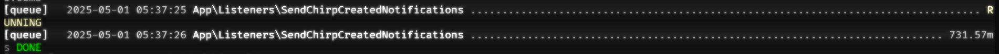
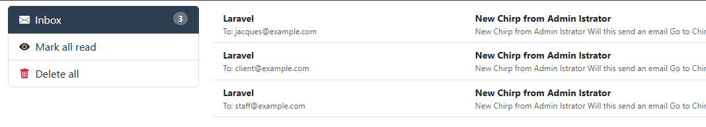

# Laravel Bootcamp: Part 5

## Software as a Service - Front-End Development

Developed by Adrian Gould


---

```table-of-contents
title: # Contents
style: nestedList
minLevel: 0
maxLevel: 3
includeLinks: true
```

---

# Laravel Bootcamp: Part 5

The following notes are based on the official Laravel 11 Boot Camp (Build Chirper with
Blade https://bootcamp.laravel.com) with Adrian's shortened explanations.

## Before you start…

Have you completed (not just read):

- [Laravel v12 Bootcamp - Introducing Laravel](S11-Laravel-v12-Bootcamp-Part-00-Introducing-Laravel.md),
- [Laravel v12 Bootcamp - Part 1](S11-Laravel-v12-BootCamp-Part-01.md),
- [Laravel v12 Bootcamp - Part 2](S11-Laravel-v12-BootCamp-Part-02.md)
- [Laravel v12 Bootcamp - Part 3](S11-Laravel-v12-BootCamp-Part-03.md)
- [Laravel v12 Bootcamp - Part 4](S11-Laravel-v12-BootCamp-Part-04.md)

No? Well… go do it…

You will need these to be able to continue…

> **Important:** You should understand that whilst you are completing this tutorial, you will
> only see parts of the application working when a stage is complete.
>
> So if you get an error in the browser, it may be because there is something missing.

# Notifications & Events

So we have Chirper working in a base form. It is very reminiscent of the original SMS/Twitter,
but without images/media.

This is great but how about notifying other users when you create a new chirp?

We could do this using email notifications!

Laravel provides many different ways to send notifications across a variety channels. When you
include the community created interfaces for notification
channels (https://laravel-notification-channels.com), then the options cover almost every type
of delivery mechanism.

Here are some of the ways we can send notifications:

- Email (Laravel)
- SMS (Laravel)
- Slack (Laravel)
- Apple Push
- OneSignal
- WebPush
- Discord
- Google Chat
- Microsoft Teams
- TouchSMS
- Intercom
- Authy
- Twilio
- InterFAX
- Trello

And many more.

Notifications may also be stored in a database so they may be displayed in
your web interface.

## Creating a Notification

Artisan can, once again, do all the hard work for us with the following command:

```shell
php artisan make:notification NotificationName
```

This will create a new notification at `app/Notifications/NotificationName.php` that is ready
for us to customize.

We will want our own notification, for our Chirp, not a generalised name as given in the example
above.

## Create the New Chirp Notification

```shell
php artisan make:notification NewChirp
```

This will create a new notification at `app/Notifications/NewChirp.php` that is ready for us to
customize.

Let's open the NewChirp class and allow it to accept the Chirp that was just created, and then
customize the message to include the author's name and a snippet from the message:

> Remember the <kbd>SHIFT</kbd>-<kbd>SHIFT</kbd> technique!

### Add `use` lines

Add the following to the `use` lines, so that we can access the Chirps, plus give an extract of
the chirp in the email.

```php
use App\Models\Chirp;
use Illuminate\Support\Str;
```

### Update the constructor method

Now we need to update the constructor definition to access the Chirp

```php
public function __construct(public Chirp $chirp)
```

### Update the To Mail method

Now the heavy lifting part of this notification, the `toMail` method.

```php
return (new MailMessage)
    ->subject("New Chirp from {$this->chirp->user->name}")
    ->greeting("New Chirp from {$this->chirp->user->name}")
    ->line(Str::limit($this->chirp->message, 50))
    ->action('Go to Chirper', url('/'))
    ->line('Thank you for using our application!');
```

What does this do? 

Well to start it tells Laravel to send a Mail Message by creating a new
instance of the `MailMessage` class.

Then we construct the parts of the email by...

- Adding a subject: `->subject("New Chirp from {$this->chirp->user->name}")`
- Adding a greeting: `->greeting("New Chirp from {$this->chirp->user->name}")`
- Add the first line of the message (extract from chirp):
  `->line(Str::limit($this->chirp->message, 50))`
- Add a button to jump to the Chirper App:   `->action('Go to Chirper', url('/'))`
- Add a closing line of the message:   `->line('Thank you for using our application!');`

### Sending the Notification

We could send the notification as part of when we store the new chirp, but that would slow the
action down by a lot.

There has to be a better way.

And Laravel provides one, Events.

#### Create an Event

To do this we need to create an event. 

Again `artisan` rescues us from doing a lot of extra coding.

The general command structure is:

```shell
php artisan make:event EventName
```

Where Event Name will be "ChirpCreated" for our example.

Execute the command:

```php
php artisan make:event ChirpCreated
```

This will be found in the `app/Events` Folder.

Now open this file and update the constructor method:

```php
public function __construct(public Chirp $chirp)
```

Remember that you will need to add the `use App\Models\Chirp;` line to the file.

### Dispatching the Event

So now we have an event that can be activated, but how do we get the event to trigger?

We dispatch it.

What we do is ask Laravel to trigger the event when a Chirp is created. The actual saving
happens in the Chirp Model, so we will listen for this Model event and trigger the dispatch.

Open the `Chirp.php` model class.

Just before the user relationship we now add:

```php
protected $dispatchesEvents = [
        'created' => ChirpCreated::class,
    ];
```

Remember that you will need to add the line `use App\Events\ChirpCreated;` at the top of the file.

### Listening for Events

So we now have an event being triggered and dispatched, but we need Laravel to listen for these
events and react to them.

#### Create the Listener

Let's create a "Send Chirp Created Notifications" listener.

```shell
php artisan make:listener SendChirpCreatedNotifications --event=ChirpCreated
```

You will find this listener in the `app/Listeners` folder. Use our <kbd>SHIFT</kbd>-<kbd>SHIFT</kbd> shortcut to
locate and open it.

#### Edit the Listener

Ok, now we need to update the listener...

Add the required use lines:

```php
use App\Models\User;
use App\Notifications\NewChirp;
```

We need to mark the listener so that Laravel understand that the listener events should be
queued.

By default, this uses the database to queue events asynchronously. 

This queue is processed by the `artisan queue:work` command. 

Whilst we are using the `composer run dev` command, this is
automatically running.

So, update the class declaration to show that the notification should be queued:

```php
class SendChirpCreatedNotifications implements ShouldQueue
```

Next we are going to tell Laravel that we want to send the notification to every user that is on
our Chirper platform... except for the user who wrote the new Chirp.

Locate and update the code that handles the queuing of the notifications (the `handle()` method):

```php
foreach (User::whereNot('id', $event->chirp->user_id)->cursor() as $user) {

    $user->notify(new NewChirp($event->chirp));

}
```

One interesting part of this notification sending is that we are using a "cursor" to progress though the users rather than loading them all into memory at once. 

This is because even if "Chirper" had just 10,000 users, we could experience issues of running out of memory if we loaded all the users at once and processed them.


> #### Aside:
> 
> This sending to all users would be very annoying, especially if you had 1000 users, each
> sending 10 new Chirps a day. This would mean each user would get 9990 emails a day!
>
> Because of this, it may be a good idea to add a "followers" feature to reduce the amount of
> emails.
>
> Another option would be to only send a notification for every 10 new chirps, or even a summary of all the chirps at the end of the day.
>

### Servicing the Notifications

Before we are able to test our new notification system, we need to let Laravel about this new 'service'.

To do so we need to register the listeners.

Open the `AppServiceProvider.php` file (found in the `App\Providers folder`).

After the class is defined, and before the `boot` method we add:

```php
protected $listen = [  
    ChirpCreated::class => [  
        SendChirpCreatedNotifications::class,  
    ],  
    // Other event listeners...  
];
```
When we do this we must remember to add the relevant `use` lines as well, so make sure you add a use line for both of the following:

- `App\Events\ChirpCreated`
- `App\Listeners\SendChirpCreatedNotifications`


Make sure you test the functionality by:

- Opening the MailPit interface (http://127.0.0.1:8025)
- Sending a chirp
- Check the output to see if the queue processed successfully
- Checking the MailPit interface for the new mail

Here is the composer run dev output showing the Queue being processed:



And here is MailPit with the mails sent to the users of the application, except the Admin user:



> #### Aside:
>
> When testing on Adrian's work laptop, they encountered a few issues. The issues were related 
> to the IP Address and SMTP port that was being listened to by MailPit and the IP Address 
> and port that the `.env` was sending via.
>
> They swapped to using 127.0.0.1 for the IP Address and 1025 for the SMTP port.
>
> After that they *stopped* the `composer run dev` using CTRL+C and restarting the command
> again.

> #### Aside II: Executing Fresh Migrations and Notifications
>  
>  One thing to be aware of, if you have a chirp seeder ([Find one here](./sample-code/ChirpSeeder.php)) then if you have the application running and execute:
>  
>```shell
>php artisan db:seed ChirpSeeder
>```
>
>Then each new chirp will trigger a notification. 
>
>With the default 6 users from the user seeder, that means it will generate 140 email notifications!
> 
> Do not say we didn't warn you!


# References

- Laravel Bootcamp - Learn the PHP Framework for Web Artisans - 07 Notifications & Events. (
  2025).
  Archive.org. https://web.archive.org/web/20240927152838/https://bootcamp.laravel.com/blade/notifications-and-events

# Up Next

- [Laravel v12 Bootcamp - Part 6](S11-Laravel-v12-BootCamp-Part-06.md)
- [Session 11 ReadMe](../session-10/ReadMe.md)
- [Session 11 Reflection Exercises & Study](../session-11/S11-Reflection-Exercises-and-Study.md)

# END
