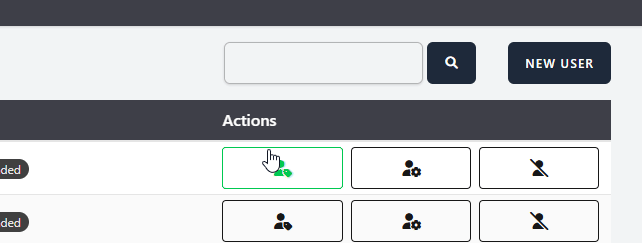
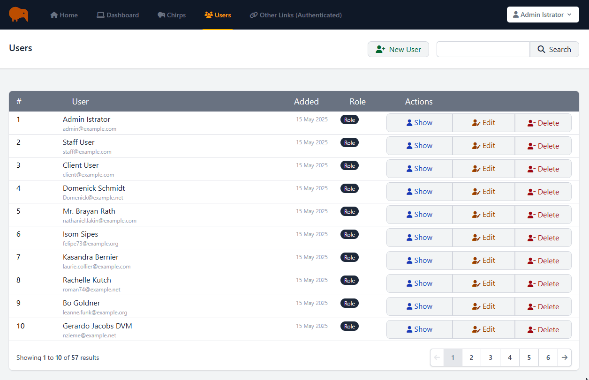

# S11 Laravel Bootcamp: Part 7

## Software as a Service - Front-End Development

Developed by Adrian Gould

---

```table-of-contents
title: # Contents
style: nestedList
minLevel: 0
maxLevel: 3
includeLinks: true
```

---

# Laravel Bootcamp: Part 7

## Administration Front End

In this section we will start to add an administration/management front-end that allows users with particular rights to perform management actions on data in the Chirp system.

We will:
- Build User Management Interface
- Determine Roles to use in Application
- Determine Permissions each Role will have
- Apply Roles & Permissions to Application (User Management)


## Before you start…

Have you completed (not just read):

- [Laravel v12 Bootcamp - Introducing Laravel](S11-Laravel-v12-Bootcamp-Part-00-Introducing-Laravel.md),
- [Laravel v12 Bootcamp - Part 1](S11-Laravel-v12-BootCamp-Part-01.md),
- [Laravel v12 Bootcamp - Part 2](S11-Laravel-v12-BootCamp-Part-02.md)
- [Laravel v12 Bootcamp - Part 3](S11-Laravel-v12-BootCamp-Part-03.md)
- [Laravel v12 Bootcamp - Part 4](S11-Laravel-v12-BootCamp-Part-04.md)
- [Laravel v12 Bootcamp - Part 5](S11-Laravel-v12-BootCamp-Part-05.md)
- [Laravel v12 Bootcamp - Part 6](S11-Laravel-v12-BootCamp-Part-06.md)

No? Well… go do it…

You will need these to be able to continue…

> **Important:** You should understand that whilst you are completing this tutorial, you will
> only see parts of the application working when a stage is complete.
>
> So if you get an error in the browser, it may be because there is something missing.

## Pagination and Search

The first part of the improvements to our Chirper User Admin is to add pagination and a search option to the index page.

### Search

We added the search interface in the previous part of these notes. But as a revision, here is the completed code and a screenshot...

We are even giving you the icon, hover and other effects from the exercises 😁.

```php
<form action="{{ route('admin.users.index') }}" method="GET" class="flex flex-row gap-1">  
  
    <x-text-input id="search"  
                  type="text"  
                  name="search"  
                  class="border border-neutral-500/50"  
                  :value="$search??''"  
    />  
  
    <x-primary-button type="submit"  
            class="px-4 py-1">  
        <i class="fa-solid fa-search text-md"></i>  
        <span class="sr-only">Search</span>  
    </x-primary-button>  
  
</form>
```

Animated Screenshot:



#### Implementing the Controller Changes

Once you have the form we are able to update the controller's index method.

First we need to pass the Request into the method:

```php
public function index(Request $request)
```

Next, it is extremely important (make that a **MUST**) to validate any input that comes from the user...

After the opening `{` curly bracket we will add:

```php
        $validated = $request->validate([
            'search' => ['nullable', 'string',]
        ]);
```

This allows for a search that is empty or a string.

> Question:
> 
> Could we make this more strict and only allow alpha numeric characters? 
> 
> If so, how?

We then check to see if the validated data is empty, and if so we set a search variable to the validated data, ready for use later.

```php
$search = $validated['search'] ?? '';
```

Now it is time to construct the search.

We already know that we may use `Users::all()` to get all the users, but this is not going to work to filter them down, so it is time to update this.

Laravel allows you to create filters, aka SQL Where Clauses, very easily.

```php
User::whereName('Fred')
```

The above will only give all the users with the name of 'Fred'.

If you want to check for a name being like something then we can write:

```php
User::whereLike('name',"%Fred%")
```

This gives all users with "Fred" anywhere in their name (Fred, Ivan Frederickson, Freda, et al).

Even better, Laravel's eloquent query building allows you to apply multiple where sections...

```php
User::whereLike('name', "%$search%")  
      ->orWhereLike('email', "%$search%")  
      ->orWhereLike('position', "%$search%")
```

The above filters the name, email and position with the content of the `$search` variable anywhere in the field content.

Even better is that one of the more recent Laravel updates added the ability to say "where any of the following contain"...

So we will use this.

Update the `$users = User::all();` to become:

```php
$users = User::whereAny(  
    ['name', 'email','position',],
    'LIKE', "%$search%")
    ->get();
```

The final change to the index method is to return the users *and* the search term, so that it can be used by the search form to fill in the field.

```php
return view('admin.users.index')  
    ->with('users', $users)  
    ->with('search', $search);
```

Try it out and see if you get what you expect.

### Exercise

As an exercise, add a button to the form that will clear the search, and show all the users. 

There are at least TWO ways to achieve this.


### Pagination

Pagination needs two main parts to be completed within the index method and the view:

- View: Add the pagination bar
- Index method: add the paginate method call.

#### Index Method

We will start by editing the `whereAny` clause of the Index method:

```php
$users = User::whereAny(  
    ['name', 'email','position',], 'LIKE', "%$search%")  
    ->paginate(10);
```

This tells Laravel to have 10 users on each page.

The default is 15 (no value in the brackets).

Adjust this to suit your purposes.

#### Index View Updates

Next we add ONE line to the index view.

Navigate to the `footer` and replace the "Pagination here..." text with:

```php
{{ $users->onEachSide(2)->links("vendor.pagination.tailwind") }}
```

And you are done.

Try it!

Ok, so it works, but the problem is we cannot tell when something is highlighted, selected or such...

Drat!

We need to customise the navigation component.

#### Publishing the Pagination assets

To be able to customise the component, we need to first publish the pagination assets.

This is done using:

```shell
php artisan vendor:publish --tag=laravel-pagination
```

This will create a new folder, `resources/views/vendor/pagination` with a number of components that may be used in different circumstances.

We are interested in the `tailwind.blade.php` component.

#### Customising the "Tailwind" Pagination asset

Open the `tailwind.blade.php` component from the  `resources/views/vendor/pagination` folder.

The file is pretty long, so we are going to provide you with the complete code for ease.

```php
@if ($paginator->hasPages())
    <nav role="navigation" aria-label="{{ __('Pagination Navigation') }}" class="flex items-center justify-between">
        <div class="flex justify-between flex-1 sm:hidden">
            @if ($paginator->onFirstPage())
                <span
                    class="relative inline-flex items-center px-4 py-2 text-sm font-medium text-gray-500 bg-white border border-gray-300 cursor-default leading-5 rounded-md dark:text-gray-600 dark:bg-gray-800 dark:border-gray-600">
                    {!! __('pagination.previous') !!}
                </span>
            @else
                <a href="{{ $paginator->previousPageUrl() }}"
                   class="relative inline-flex items-center px-4 py-2 text-sm font-medium text-gray-700 bg-white border border-gray-300 leading-5 rounded-md hover:text-gray-500 focus:outline-none focus:ring ring-gray-300 focus:border-blue-300 active:bg-gray-100 active:text-gray-700 transition ease-in-out duration-150 dark:bg-gray-800 dark:border-gray-600 dark:text-gray-300 dark:focus:border-blue-700 dark:active:bg-gray-700 dark:active:text-gray-300">
                    {!! __('pagination.previous') !!}
                </a>
            @endif

            @if ($paginator->hasMorePages())
                <a href="{{ $paginator->nextPageUrl() }}"
                   class="relative inline-flex items-center px-4 py-2 ml-3 text-sm font-medium text-gray-700 bg-white border border-gray-300 leading-5 rounded-md hover:text-gray-500 focus:outline-none focus:ring ring-gray-300 focus:border-blue-300 active:bg-gray-100 active:text-gray-700 transition ease-in-out duration-150 dark:bg-gray-800 dark:border-gray-600 dark:text-gray-300 dark:focus:border-blue-700 dark:active:bg-gray-700 dark:active:text-gray-300">
                    {!! __('pagination.next') !!}
                </a>
            @else
                <span
                    class="relative inline-flex items-center px-4 py-2 ml-3 text-sm font-medium text-gray-500 bg-white border border-gray-300 cursor-default leading-5 rounded-md dark:text-gray-600 dark:bg-gray-800 dark:border-gray-600">
                    {!! __('pagination.next') !!}
                </span>
            @endif
        </div>

        <div class="hidden sm:flex-1 sm:flex sm:items-center sm:justify-between">
            <div>
                <p class="text-sm text-gray-700 leading-5 dark:text-gray-400">
                    {!! __('Showing') !!}
                    @if ($paginator->firstItem())
                        <span class="font-medium">{{ $paginator->firstItem() }}</span>
                        {!! __('to') !!}
                        <span class="font-medium">{{ $paginator->lastItem() }}</span>
                    @else
                        {{ $paginator->count() }}
                    @endif
                    {!! __('of') !!}
                    <span class="font-medium">{{ $paginator->total() }}</span>
                    {!! __('results') !!}
                </p>
            </div>

            <div class="ml-4">
                <span class="relative z-0 inline-flex rtl:flex-row-reverse shadow-sm rounded-md">
                    {{-- Previous Page Link --}}
                    @if ($paginator->onFirstPage())
                        <span aria-disabled="true" aria-label="{{ __('pagination.previous') }}"
                              class="relative inline-flex items-center px-2 py-2 text-sm font-medium text-gray-200 bg-white border border-gray-300 rounded-l-md leading-5 hover:text-gray-400 focus:z-10 focus:outline-none focus:ring ring-gray-300 focus:border-blue-300 active:bg-gray-100 active:text-gray-500 transition ease-in-out duration-150 dark:bg-gray-800 dark:border-gray-600 dark:active:bg-gray-700 dark:focus:border-blue-800  rounded-l"
                        >
                            <span
                                aria-hidden="true">
                                    <i aria-hidden="true" class="fa fa-arrow-left"></i>
                            </span>
                        </span>
                    @else
                        <a href="{{ $paginator->previousPageUrl() }}" rel="prev"
                           class="hover:bg-gray-100 relative inline-flex items-center px-2 py-2 text-sm font-medium text-gray-500 bg-white border border-gray-300 rounded-l-md leading-5 hover:text-gray-400 focus:z-10 focus:outline-none focus:ring ring-gray-300 focus:border-blue-300 active:bg-gray-100 active:text-gray-500 transition ease-in-out duration-150 dark:bg-gray-800 dark:border-gray-600 dark:active:bg-gray-700 dark:focus:border-blue-800 rounded-l"
                           aria-label="{{ __('pagination.previous') }}">
                            <i aria-hidden="true" class="fa fa-arrow-left"></i>
                        </a>
                    @endif

                    {{-- Pagination Elements --}}
                    @foreach ($elements as $element)
                        {{-- "Three Dots" Separator --}}
                        @if (is_string($element))
                            <span aria-disabled="true">
                                <span
                                    class="relative inline-flex items-center px-4 py-2 -ml-px text-sm font-medium text-gray-700 bg-white border border-gray-300 cursor-default leading-5 dark:bg-gray-800 dark:border-gray-600">{{ $element }}</span>
                            </span>
                        @endif

                        {{-- Array Of Links --}}
                        @if (is_array($element))
                            @foreach ($element as $page => $url)
                                @if ($page == $paginator->currentPage())
                                    <span aria-current="page">
                                        <span
                                            class="relative inline-flex items-center px-4 py-2 -ml-px text-sm font-medium text-gray-500 bg-gray-200 border border-gray-300 cursor-default leading-5 dark:bg-gray-800 dark:border-gray-600">{{ $page }}</span>
                                    </span>
                                @else
                                    <a href="{{ $url }}"
                                       class="hover:bg-gray-100 relative inline-flex items-center px-4 py-2 -ml-px text-sm font-medium text-gray-700 bg-white border border-gray-300 leading-5 hover:text-gray-500 focus:z-10 focus:outline-none focus:ring ring-gray-300 focus:border-blue-300 active:bg-gray-100 active:text-gray-700 transition ease-in-out duration-150 dark:bg-gray-800 dark:border-gray-600 dark:text-gray-400 dark:hover:text-gray-300 dark:active:bg-gray-700 dark:focus:border-blue-800"
                                       aria-label="{{ __('Go to page :page', ['page' => $page]) }}">
                                        {{ $page }}
                                    </a>
                                @endif
                            @endforeach
                        @endif
                    @endforeach

                    {{-- Next Page Link --}}
                    @if ($paginator->hasMorePages())
                        <a href="{{ $paginator->nextPageUrl() }}" rel="next"
                           class="hover:bg-gray-100  relative inline-flex items-center px-2 py-2 -ml-px text-sm font-medium text-gray-500 bg-white border border-gray-300 rounded-r-md leading-5 hover:text-gray-400 focus:z-10 focus:outline-none focus:ring ring-gray-300 focus:border-blue-300 active:bg-gray-100 active:text-gray-500 transition ease-in-out duration-150 dark:bg-gray-800 dark:border-gray-600 dark:active:bg-gray-700 dark:focus:border-blue-800   rounded-r"
                           aria-label="{{ __('pagination.next') }}">
<i aria-hidden="true" class="fa fa-arrow-right"></i>

                        </a>
                    @else
                        <span aria-disabled="true" aria-label="{{ __('pagination.next') }}"
                              class="relative inline-flex items-center px-2 py-2 -ml-px text-sm font-medium text-gray-200 bg-white border border-gray-300 cursor-default rounded-r-md leading-5 dark:bg-gray-800 dark:border-gray-600   rounded-r"
                        >
                            <span
                                aria-hidden="true">
<i aria-hidden="true" class="fa fa-arrow-right"></i>

                            </span>
                        </span>
                    @endif
                </span>
            </div>
        </div>
    </nav>
@endif

```


## Adding "Flash Messages"

Flash messages are a way of notifying the user that an operation has completed, or there are issues.

There are different ways to achieve this, but for our example we will use a package that gives some rather elegant notifications.

Head to your command line and run the following composer command, and then install the package...

```shell
composer require php-flasher/flasher-laravel

php artisan flasher:install
```

This adds the PHP Flasher package to the application.

Head to the documentation on the package before going any further and make sure you understand the concepts of how it is used.

Main page: https://php-flasher.io

Laravel Docs: https://php-flasher.io/laravel/


### Adding Flash Message to Add User

Ok, let's start by adding a flash message to the Add User.

Open the User Management Controller, and find the store method.

Just before the `return redirect` line, add:

```php
$userName = $user->name;

flash()->success('User created successfully!');
```

There are options we can add to the flash message.

The following produces the animated demo that is shown after the code:

```php
flash()  
    ->option('position', 'top-center')  
    ->option('timeout', 5000)  
    ->success("User $userName created successfully!");
```




To change the title of the message, keeping the same options as before we write the following:

```php
flash()  
    ->option('position', 'top-center')  
    ->option('timeout', 5000)  
    ->success("User $userName created successfully!",[],"User Added");
```

This may also be written as:

```php
flash()->success("User $userName created successfully!",  
    [  
        'position' => 'top-center',  
        'timeout' => 5000,  
    ],  
    "User Added");
```

Pick your favourite.

### Advanced Use: Flash Messages for Forms

When you validate, it would be good to get a flash message as well as the errors.

This is also possible.

Locate the `store` method for the User Management Controller.

In here we are going to have to do a bit of extra work.

We will need to:
- Wrap the current code in a `try`...`catch`
- Catch the Validation Exception
- Add the flash error
- Direct the method to send the the user back to the page they came from


Wrap the code...

Add the `try {` just before the `$validated`. We show the position for you to make is easier.

```php
public function store(Request $request)  
{  
  
    try {  

        $validated = $request->validate([

```

Add the following after the `User::create(...)`.

We again show you the context of the required code...

```php
    $user = User::create([  
        'name' => $validated['name'],  
        'email' => Str::lower($validated['email']),  
        'password' => Hash::make($validated['password']),  
    ]);  
  
  
} catch (\Illuminate\Validation\ValidationException $e) {  
  
    flash()->error('Please fix the errors in the form.',  
        [  
            'position' => 'top-center',  
            'timeout' => 5000,  
        ],  
        'User Creation Failed');  
  
    return back()->withErrors($e->validator)->withInput();  
  
}
```

#### Test

Try adding two users with the same email address... or even getting any other error. You should get the flash message appear as well as the form errors.

#### Possible Gotcha

During testing of the flash messages, we encountered a glitch...

The validation seemed to pass but then the create gave an error...

We will continue to investigate, but, just in case, try updating the validation rule to be more specific with which field is being checked for in the email:

```php
$validated = $request->validate([  
    'name' => ['required', 'min:2', 'max:192',],  
    'email' => ['required', 'string', 'email', 'max:255', 'unique:' . User::class . ',email',],  
    'password' => ['required', 'confirmed', Password::defaults()],  
    'role' => ['nullable',],  
]);
```


## Exercises

1. Add flash messages to Edit (update) and Delete (destroy).
2. When you have an error in the create user page, do the previous values from the form re-appear? If not, fix this using ` :value="old('field_name')"` where `field_name` is the name of the item being entered, e.g. `name`.

# References

- Laravel Bootcamp - Learn the PHP Framework for Web Artisans - 07 Notifications & Events. (
  2025).
  Archive.org. https://web.archive.org/web/20240927152838/https://bootcamp.laravel.com/blade/notifications-and-events

# Up Next

- [Laravel v12 Bootcamp - Part 8](S11-Laravel-v12-BootCamp-Part-08.md)
- [Session 11 ReadMe](../session-10/ReadMe.md)
- [Session 11 Reflection Exercises & Study](../session-11/S11-Reflection-Exercises-and-Study.md)

# END
