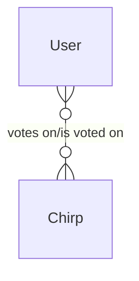
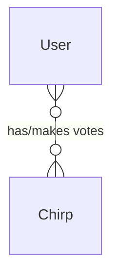
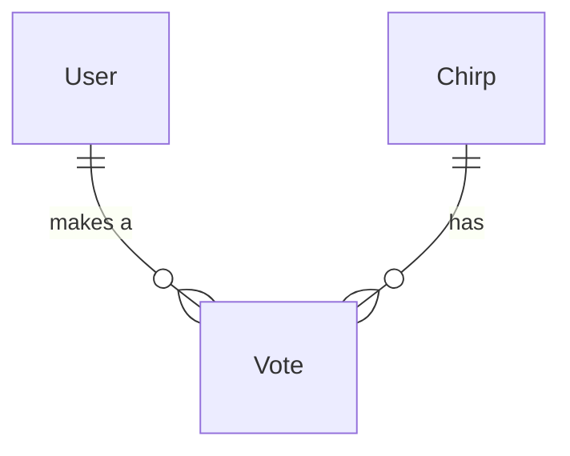
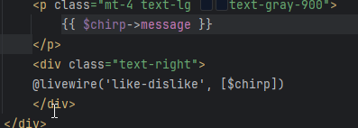
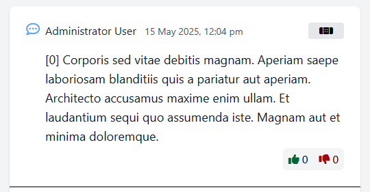
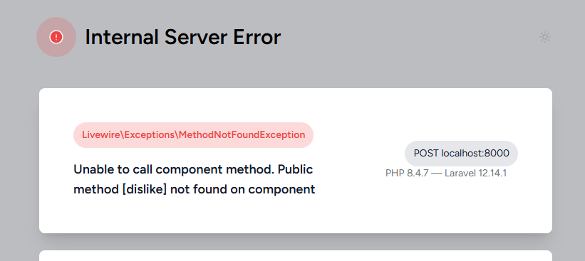

# S11 Laravel Bootcamp: Part 9

## Software as a Service - Front-End Development

Developed by Adrian Gould

---

```table-of-contents
title: # Contents
style: nestedList
minLevel: 0
maxLevel: 3
includeLinks: true
```

---

# Laravel Bootcamp: Part 9

## Like / Dislike Feature

In this section, we add a Like/Dislike feature to the application.

To make it "dynamic" in nature, we use Laravel's LiveWire package so we are able to write
over 99.99% of the code in PHP, and only a touch of "pseudo-JavaScript" in the shape of the "
wire" attribute.

## Before you start…

Have you completed (not just read):

- [Laravel v12 Bootcamp - Introducing Laravel](S11-Laravel-v12-Bootcamp-Part-00-Introducing-Laravel.md),
- [Laravel v12 Bootcamp - Part 1](S11-Laravel-v12-BootCamp-Part-01.md),
- [Laravel v12 Bootcamp - Part 2](S11-Laravel-v12-BootCamp-Part-02.md)
- [Laravel v12 Bootcamp - Part 3](S11-Laravel-v12-BootCamp-Part-03.md)
- [Laravel v12 Bootcamp - Part 4](S11-Laravel-v12-BootCamp-Part-04.md)
- [Laravel v12 Bootcamp - Part 5](S11-Laravel-v12-BootCamp-Part-05.md)
- [Laravel v12 Bootcamp - Part 6](S11-Laravel-v12-BootCamp-Part-06.md)
- [Laravel v12 Bootcamp - Part 7](S11-Laravel-v12-BootCamp-Part-07.md)

No? Well… go do it…

You will need these to be able to continue…

> **Important:** You should understand that whilst you are completing this tutorial, you will
> only see parts of the application working when a stage is complete.
>
> So if you get an error in the browser, it may be because there is something missing.

# Like & Dislike

Common on may social media systems, but also on other sites is the ability to like or dislike a
chirp, item or such.

We delve into creating the Like/Dislike whilst also looking at other parts of the Laravel
ecosystem.

We already have a good layout for the Chirps, so let's start on adding our new feature.

## The Voting Problem

Before we go any further, we need to look at the problem of Chirps, Votes and Users.

In the crudest form:

- a `User` votes on many `Chirps` and
- a `Chirp` is voted on by many `Users`

This is a Many-to-Many relationship.

As an Entity-Relationship (E-R) diagram:



The only way we could then use this would be to:

- In the Chirp table, have a field that gives an array of votes and who voted for the chirp
- In the User table, have a field that gives an array of the votes and which Chirps they voted
  for

That is just unmanageable (from storage and responsiveness) when you get thousands, or even
millions of users.

So we remove this problem by using normalisation and transform the relationship from:

- `User -m---m- Chirp`



into

- `User -0---m- Vote -m---0- Chirp`.

This is expressed as an E-R Diagram, thus:



With this in mind, we can now proceed.

### Create Model and Migration

Begin by creating the `Vote` model with a migration.

```shell
php artisan make:model Vote -m
```

Edit the migration (`database/migrations/YYYY_MM_DD_HHMMSS_create_votes_table.php`) and add
between the ID and Timestamps:

```php
$table->foreignId('chirp_id')->constrained()->cascadeOnDelete();
$table->foreignId('user_id')->constrained()->cascadeOnDelete();
$table->smallInteger('vote');
```

> #### Note:
>
> The constrained ensures that the two foreign IDs exist before they may be used, and cascade on
> delete means that if the user is deleted, then all votes are deleted that they make, and
> likewise if the chirp is deleted, then the votes for it are also deleted.

Edit the model (`app/Models/Vote.php`) and add the fillable fields:

```php
        'chirp_id',
        'user_id',
        'vote',
```

### Migrate!

Run the migration...

```shell
php artisan migrate
```

## Create the Relationships

Ok, so we have the Vote table created, now let us tell Laravel how the models are related.

### Chirp Model

In the chirp model, we need to add the following relationships:

- has many votes
- has one vote

The first is the obvious part of the E-R Diagram:

```php
public function votes(): HasMany 
{
    return $this->hasMany(Vote::class);
}
```

The second relationship allows us to check if the user has voted (liked or disliked) a chirp.

Doing this in the model makes the controller code simpler to understand and use.

```php
public function userVotes(): HasOne 
{
    return $this->votes()
			    ->one()
			    ->where('user_id', auth()->id());
} 
```

The return says:

"For this **Chirp**, look at its **votes**, and retrieve **one vote** where the **User** has the **same ID** as the currently **logged-in User**".

Very nice!

## LiveWire Component

To make this voting dynamic, we are going to introduce a LiveWire component.

We need to add LiveWire to the code, and we do this using Composer:

```shell
 composer require livewire/livewire
 ```

We also need to add the required "LiveWire activation" to the layouts:

In each of the guest, app and amin layouts ensure the following are added in the required places:

- Before the `</head>` add `@livewireStyles`
- Before the `</body>` add `@livewireScripts`

### Create Like-Dislike Component

Run the command:

```shell
php artisan make:LiveWire LikeDislike
```

This creates the `resources/views/LiveWire/like-dislike.blade.php` file.

Before we add it to the chirp card, we will edit the component and provide its layout.

### Edit the Component

Open the `like-dislike.blade.php` file and add:

```php
<div class="mt-1">
    <div class="inline-flex rounded-md bg-gray-100 px-2 py-1 space-x-2">
        <div class="flex">
            <a wire:click="like()" class="cursor-pointer">
                <i class="fa-solid fa-thumbs-up"></i>
            </a>
            0
        </div>
        <div class="flex">
            <a wire:click="dislike()" class="cursor-pointer">
                <i class="fa-solid fa-thumbs-down"></i>
            </a>
            0
        </div>
    </div>
</div>
```

### Add component to the Chirp Card

Open the Chirps Index page, and locate the lines:

```php
    <p class="mt-4 text-lg text-gray-900">
        {{ $chirp->message }}
    </p>
</div>
```

Between the closing `p` and `div` tags insert :

```php
    <div class="text-right">
    @livewire('like-dislike', [$chirp])
    </div>
```



When you go back to the browser and view the Chirps you should now see (without colour) something like this:



### Create the Like-Dislike LiveWire Code

Ok, so we have a layout, and it looks pretty good, but we now need to make it do something.

This is where the LiveWire component comes into its own. No JavaScript, just PHP.

The Like-Dislike component's code that makes it perform the action of voting, is found in the
`App/LiveWire` folder.

Open the `LikeDislike.php` file ready to edit.

Built into the file is the `render` method. This does exactly what it says, renders the
component on the page.

We need to add a new method, one which activates when the component is added to the page... the
`mount` method:

```php
public Chirp $chirp; 
 
public function mount(Chirp $chirp): void 
{
    $this->chirp = $chirp;
} 
```

> Remember that you will need to use the Chirp model, and later the Vote model... so make sure you add the required lines to the `LikeDislike.php` file.

		 
### Saving Like/Dislike

So, at the moment we can click the like/dislike, but nothing will happen. In fact, we will get
an error:



This is not good. How to fix this?

Start by adding some properties to the component:

```php
    public ?Vote $userVote = null; 
    public int $lastUserVote = 0;
```

The `?Vote $userVote` indicates that the property `$userVote` is nullable. That is it will hold
the current user's vote from the model's `userVoates` relationship when it exists, and null when
there is no vote.

The `lastuserVote` is the value taken from the `userVotes` relationship we have in the model.

Now we need to update the mount method to request the user vote for the chirp, and default the
last user vote to zero if the user has not voted on the chirp.

```php
$this->userVote = $chirp->userVotes; 
$this->lastUserVote = $this->userVote->vote ?? 0; 
```

Ok, so we have default values... there is a problem though... which we will look at later.

Let's head back into the component code and add the two methods as stubs.

```php
public function like(){ }

public function dislike(){ }
```

This will remove the error, but not add the required functionality.

#### Like Code

Let's start by adding the "Like" capability.

```php
// TODO: Validate Access

if ($this->hasVoted(1)) {
    // TODO: update vote
}
 
// TODO: update vote
```

But what is this `hasVoted` method?

#### Has Voted

The "has voted" method determines if the user has voted, and if note makes the vote equal to the
value that is passed as an argument.

The method's code to do this is:

```php
private function hasVoted(int $val): bool 
{
    return $this->userVote && 
	    $this->userVote->vote === $val;
} 
```


#### Update Vote

Ok, so we have a new method to write, so we do not reproduce the code every time we need to
update a vote.

Before the `has voted` mthod we will add the following:

```php
private function updateVote(int $value): void
{
    if ($this->userVote) {
        $this->chirp
	         ->votes()
	         ->update([
		        'user_id' => auth()->id(), 
		        'vote' => $value
	         ]);
    } else {
        $this->userVote = $this->chirp
	         ->votes()
	         ->create([
		         'user_id' => auth()->id(), 
		         'vote' => $value
		       ]);
    }
}
```

The method checks to see if there is a vote by this user for this chirp. If there is then the
vote is updated, otherwise the vote is created.

This is called to set the value to -1, 0 or 1, depending on if the chirp is disliked (-1) or
liked (1). If the user clicks 'like' or 'dislike' twice then the vote is set to 0.

To enable the like and dislike methods to do this we need to modify their code a little.

Here we show the like code:

```php
if ($this->hasVoted(1)) {
    $this->updateVote(0);
    return;
}

$this->updateVote(1);
```

#### Total Likes and Dislikes

Ok, now onto the total likes and dislikes.

One of the problems with this form of feature is that we run into a problem with the number of
queries being made.

We could ask the component to count the number of likes and dislikes for each chirp. This would
mean that we would have two more queried per chirp retrieved. That's going to add up very
quickly.

So what we need to do is retrieve the data once, and combine this with the number of likes and
dislikes in the Chirps.

To start, in the properties area of the `LikeDislike` component, add the following properties:

```php
    public int $likes = 0; 
    public int $dislikes = 0; 
```

In the `mount` method also add:

```php
        $this->likes = $chirp->likesCount;
        $this->dislikes = $chirp->dislikesCount;
```

This is so the counts are available to be displayed in the component's blade file.

---


Now we need to turn our attention back to the Chirp Controller.

In the Chirp Controller we need to update the index method.

```php
    public function index(): View
    {
        $chirps = Chirp::with('userVotes')
            ->withCount([
	            'votes as likesCount' 
		            => fn (Builder $query) 
			            => $query->where('vote', '>', 0)], 'vote') 
            ->withCount([
	            'votes as dislikesCount' 
		            => fn (Builder $query) 
			            => $query->where('vote', '<', 0)], 'vote') 
            ->latest()
            ->paginate();
 
        return view('chirps', compact('chirps'));
    }

```

### Add the Likes to the Component

Open the `like-dislike.blade.php` livewire component file, as we need to now update it to show the likes.

```php
<div class="flex">  
    <a wire:click="like()" class="cursor-pointer">  
        <i class="fa-solid fa-thumbs-up"></i>  
    </a>    
    0  
</div>
```

In place of the 0 we now put `{{ $likes }}` ...

```php
<div class="flex">  
    <a wire:click="like()" class="cursor-pointer">  
        <i class="fa-solid fa-thumbs-up"></i>  
    </a>    
    {{ $likes }}  
</div>
```

To be ready for the the exercise below you could update the component to show the dislike count...

## Dislike Code

> Exercise 🫨
>
> You can add the dislike code, but make the value `-1` in place of `1`.

# References

- LiveWire Like/Dislike Component for Social Networks: Step-by-Step. (2023). Laravel
  Daily. https://laraveldaily.com/post/livewire-like-dislike-component

# Up Next

- [Laravel v12 Bootcamp - Part 10](S11-Laravel-v12-BootCamp-Part-10.md)
- [Session 11 ReadMe](../session-10/ReadMe.md)
- [Session 11 Reflection Exercises & Study](../session-11/S11-Reflection-Exercises-and-Study.md)

# END
