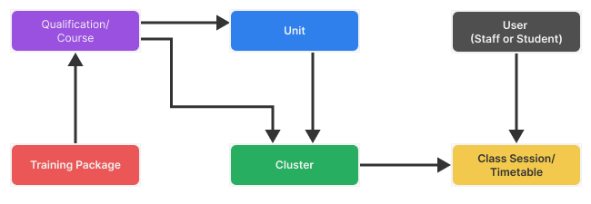
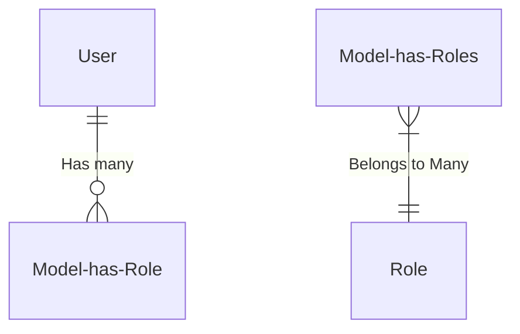
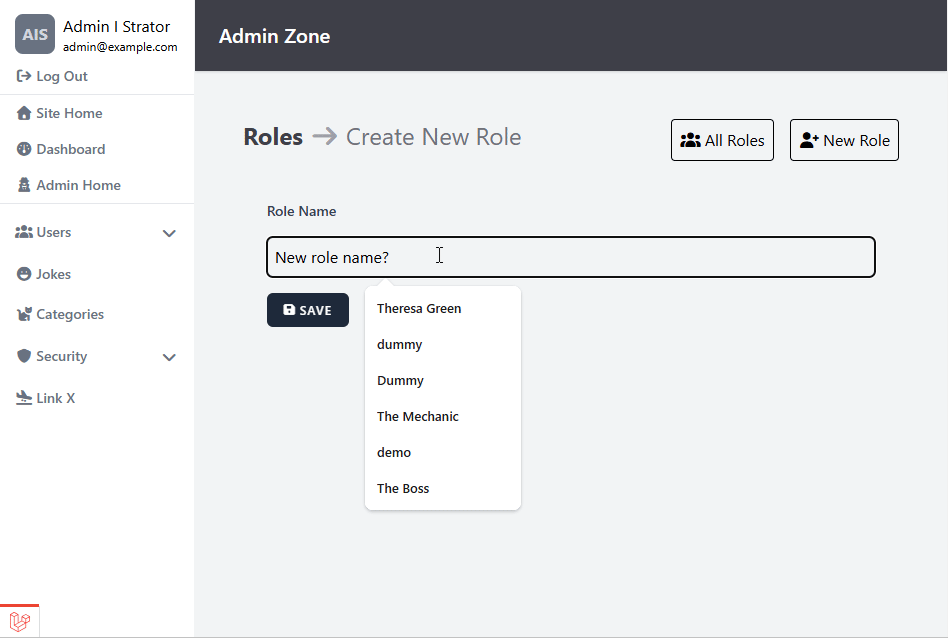

# Laravel Bootcamp: Part 11

## Software as a Service - Front-End Development

Developed by Adrian Gould

---

```table-of-contents
title: # Contents
style: nestedList
minLevel: 0
maxLevel: 3
includeLinks: true
```

---

# Laravel Bootcamp: Part 11

> We take a short break from the Chirper application whilst we look at Roles and Permissions.
> 
> These notes look at a package (Spatie Permissions) that assists us in implementing Roles and Permissions, and use this in a separate demo application.

## Roles and Permissions - Part 1

In this section, we will start to add an administration/management front-end that allows 
users with particular rights to perform management actions on data in the Chirp system.

We will:
- Build User Management Interface
- Determine Roles to use in Application
- Determine Permissions each Role will have
- Apply Roles & Permissions to Application (User Management)


## Before you start…

Have you completed (not just read):

- [Laravel v12 Bootcamp - Introducing Laravel](S11-Laravel-v12-Bootcamp-Part-00-Introducing-Laravel.md),
- [Laravel v12 Bootcamp - Part 1](S11-Laravel-v12-BootCamp-Part-01.md),
- [Laravel v12 Bootcamp - Part 2](S11-Laravel-v12-BootCamp-Part-02.md)
- [Laravel v12 Bootcamp - Part 3](S11-Laravel-v12-BootCamp-Part-03.md)
- [Laravel v12 Bootcamp - Part 4](S11-Laravel-v12-BootCamp-Part-04.md)
- [Laravel v12 Bootcamp - Part 5](S11-Laravel-v12-BootCamp-Part-05.md)
- [Laravel v12 Bootcamp - Part 6](S11-Laravel-v12-BootCamp-Part-06.md)
- [Laravel v12 Bootcamp - Part 7](S11-Laravel-v12-BootCamp-Part-07.md)
- [Laravel v12 Bootcamp - Part 8](S11-Laravel-v12-BootCamp-Part-08.md)
- [Laravel v12 Bootcamp - Part 9](S11-Laravel-v12-BootCamp-Part-09.md)
- [Laravel v12 Bootcamp - Part 10](S11-Laravel-v12-BootCamp-Part-10.md)


No? Well… go do it…

You will need these to be able to continue…

> **Important:** You should understand that whilst you are completing this tutorial, you will
> only see parts of the application working when a stage is complete.
>
> So if you get an error in the browser, it may be because there is something missing.


## Development Only: ⚠️ Starting the Database From Fresh

Remember that the `local` value for `APP_ENV` in the `.ennv` file tells Laravel that this application is in  **development**.

When this is the case, we are working with a database that is able to be destroyed and rebuilt as it is **NOT** live data.

To destroy the database tables, we re-run the migrations and seed the database using:

```php
php artisan migrate:fresh --seed
```

> ### Remember:
> 
> - This **MUST NOT** be used on a production database
> - This command **DROPS all existing tables and data**


# Spatie Permissions

Package to help with Roles and Permissions

- Assist by abstracting permission management
- Make it more human friendly

```php
$user->givePermissionTo('edit articles’);

$user->assignRole('writer’);

$role->givePermissionTo('edit articles’);

$user->can('edit articles');

```

# Creating a Demo App

Using Roles and Permissions in a small demo application

Code is available on GitHub:
- https://github.com/AdyGCode/xxx-roles-permissions-2025-s2

We **STRONGLY** suggest you complete this tutorial from scratch.

This will assist your understanding and ability to apply to other projects

## Create Base Code using Laravel installer

We presume you are using the bash terminal.

For details on setting this up, check the https://help.screencraft.net.au FAQs.

Change into your Source/Repos folder:

```shell
cd /c/Users/USERID
cd Source/Repos
```

### Update the Laravel Installer

It is always a good idea to see if the Laravel installer and its required packages have been updated so… run the composer update in the global context to do this.

If you haven't got the installer already on your computer then use:

```shell
composer global require laravel/installer
```

After this, anytime you want to update the installer and any other globally installed packages use:

```shell
composer global update
```

### Create a new Demo Application

> This section is based on the video series Spatie Laravel Permission by Tony Xhepa. The series was created three or so years ago, and as a result, some of the information is outdated. 
> 
> These notes aim to update to Laravel 12, and provide code that works with this version of the framework.
> 
> - Xhepa, T. (2022, March 1). Spatie Laravel Permission. 
>   YouTube. http://www.youtube.com/playlist?list=PL6tf8fRbavl3xuFIe4_i3TB4PZbtbx3Js
> 
> We have also used "Laravel for Beginners: Roles & Permissions with a Spatie package" by Arlind Musliu.
>  
>  - _Lucky Media_. (2025, February 12). Lucky Media. https://www.luckymedia.dev/blog/laravel-11-for-beginners-roles-and-permissions-with-a-spatie-package


Let's begin by creating a new Laravel Application for the purpose of demonstrating how to add roles and permissions to an application. (*Remember to replace `xxx` with your initials.*)

```shell
laravel new xxx-roles-permissions-2025-s2 --using=adygcode/base-blade-kit
```

When prompted, respond with:
- Testing suite: Pest (0)
- Run NPM [Y]

Change into your new project:

```shell
cd xxx-roles-permissions-2025-s2
```

> #### Errors when creating the new app?
> 
> We have noted that errors occur from time to time with the starter kit. If they occur then it may be prudent to run the following commands:
> 
> ```shell
> cp .env.dev .env
> touch database/database.sqlite
> composer install
> php artisan migrate:fresh
> npm install
> npm run build
> ```
	

### Install Spatie Permissions

Now we can add the Spatie Permissions package:

```shell
composer require spatie/laravel-permission
```

Install the migrations and settings for the Roles/Permissions package (one line):

```shell
php artisan vendor:publish --provider="Spatie\Permission\PermissionServiceProvider" 
```

Once you have done this, execute the following:

```shell
php artisan migrate
```

### Running our Dev Server

Split the terminal into two panels:

- <kbd>ALT</kbd>+<kbd>SHIFT</kbd>+<kbd>-</kbd>

Remember that resizing panels is easy:

Click in the panel and use: <kbd>ALT</kbd>+<kbd>SHIFT</kbd>+ ⬅️➡️⬆️⬇️ (arrow keys)

In the bottom panel, execute:

```shell
cd roles-permissions-2025-s2
```


> #### MailPit, `run-win` and `run-linux`
> 
> As we have different development operating systems, we may want to ensure that we can run/build the code on each of the different platforms.
> 
> To achieve this we may want to modify the composer dev script (in `composer.json`) to also execute MailPit, but also execute commands specific to Linux/MacOS or Windows. 
> 
> See [Introducing Laravel v12](S11-Laravel-v12-Bootcamp-Part-00-Introducing-Laravel.md) for information on updating the `composer.json` file to add the new command options, and then use them.
> 
> Alternatively, the updated version of the base-blade-kit has the updated "run" commands. You may want to simply download the latest `composer.json` file from the original base-blade-kit repository and replace yours as needed.


Now in this bottom panel execute the appropriate command:

Base command:
```shell
composer run dev

```

Windows Specific command:
```shell
composer run dev-win

```

Linux/MacOS Specific command:
```shell
composer run dev-linux

```


> **Note:** If you use `composer run` it will prompt you with the possible options for the commands!

## Adding "Roles" Trait to the User Model

Adding the Roles and Permissions to the User model is a matter of adding a couple of lines to the `User` model.

This trait is then available when we need by checking if a user `can` or `cannot` do an operation via checking the permission.

Open the `User` model and add the `HasRoles` after `Notifiable`:

```php
    use HasFactory, Notifiable, HasRoles;
```

Remember that you will need to `use` the class just after the namespace to import it:

```php
use Spatie\Permission\Traits\HasRoles;
```

If your application is going to allow for a user to have individual permissions beyond those given to a specific role then the changes will be:


```php
    use HasFactory, Notifiable, HasRoles, HasPermissions;
```

and...

```php
use Spatie\Permission\Traits\HasRoles;
use Spatie\Permission\Traits\HasPermissions;
```


### Applying Role Middleware

To make it easier to use aliases for the middleware. These aliases will be: `role`, `permission` and `role_or_permission`. To do so, we will update the `bootstrap/app.php` file.

Open the `bootstrap/app.php` file and locate the line:
```php
->withMiddleware(function (Middleware $middleware) {

```
and add the lines below immediately after the `{` and before its matching `}`:

```php
$middleware->alias([
    'role' => \Spatie\Permission\Middleware\RoleMiddleware::class,
    'permission' => \Spatie\Permission\Middleware\PermissionMiddleware::class,
    'role_or_permission' => \Spatie\Permission\Middleware\RoleOrPermissionMiddleware::class,
]);
```

> ### Aside:
> 
> One advantage of this is that we can then, if we wish, apply `role`, `permission` or 
> the `role_or_permission` to check at the route stage. For example:
> 
> ```php
> Route::group(['middleware' => ['role:manager']], function () { … });
> Route::group(['middleware' => ['permission:publish articles']], function () { … });
> Route::group(['middleware' => ['role_or_permission:publish articles']], function () { … });
> ```
> [For more information, always read the
> documentation for the package.](https://spatie.be/docs/laravel-permission/v6/basic-usage/middleware)


OK, let's continue…


## Creating an Admin Role and Assigning it

We are now ready to begin the next stage of our development. In this step we will be:

- Creating an `admin` role
- Assigning the role to an `admin` user

We will use a seeder to do this as it is reproducible and allows us to vary what we want to do depending on the 
requirements of the project.

> Note:
> 
> It is possible to also create an "installer" that runs the migrations etc, and asks for the admin user's email and a password, but this is beyond the needs of this tutorial.

### Role seeder

Let us start by first visiting the Role Seeder… ok, so we need to create one first… so:

```shell
php artisan make:seeder RoleSeeder
```

Open the Role Seeder file (in `database/seeders`).

After the namespace, add:

```php
use Spatie\Permission\Models\Role;
```

In the `run` method we will now add:

```php
$roleAdmin = Role::create(['name' => 'admin']);
```

This will create the `admin` role.

### Exercise: Staff and Client Roles

You could easily add the `staff` and `client` roles at this point if you wish. 

In fact go ahead and do so as you will need them as you progress through this tutorial.

### Update the `DatabaseSeeder` file

Now we need to update the Database Seeder and add the `RoleSeeder` **BEFORE** the `UserSeeder` …

Why do we do this?

Because if you do not add the roles (and permissions) before creating the user, then you will get migration and seeder errors.

```php

        $this->call([
            RoleSeeder::class,
            
            UserSeeder::class,

        ]);

```

As we are working in development, we can apply these changes from fresh:

```shell
php artisan migrate:fresh --seed
```

If you have [DB Browser for SQLite](https://sqlitebrowser.org/) then you can check what has been created by the migrations and seeds in the SQLite database.

### Rule of Thumb: Migrations (and seeders)

Always Migrate and Seed the tables with the least number of relationships first.

For example, the following database structure has 6 tables. But what order would we migrate and seed?



| Table            | Foreign Keys | Parent Table(s)     |
| ---------------- | ------------ | ------------------- |
| User             | 0            |                     |
| Unit             | 1            | Qualification       |
| Class Session    | 2            | User, Cluster       |
| Cluster          | 2            | Unit, Qualification |
| Training Package | 0            |                     |
| Qualification    | 1            | Training Package    |

So given this analysis, we would perform the migrations and seeding in the following order:
1. User
2. Training Package
3. Unit
4. Qualification
5. Cluster
6. Class Session

We order the unit before the qualification as on further analysis we found out that a unit could be part of multiple qualifications (a many-to-many relationship), and as a result we need the units to be defined before we can associate them with a qualification.

This will also hold true with units and clusters, where a unit could be part of multiple clusters.

Given this information, we would seed the Permissions and then the Roles, before finally seeding the Users.

### Refactor the Role Seeder

We got you to create individual role seeder lines for the roles, but we could have used an associative array and a foreach loop to do this.

Here is an example:

```php
public function run(): void  
{  
    $seedRoles = [  
        ['name' => 'super-user'],  
        ['name' => 'admin'],  
        ['name' => 'staff'],  
        ['name' => 'client'],  
    ];  
    
    foreach ($seedRoles as $seedRole) {  
        Role::create($seedRole);  
    }
}
```

Another way to do this would be to list the roles in an array and then use a slightly different create statement:

```php
public function run(): void  
{  
    $seedRoles = [  
        'super-user',  
        'admin',
        'staff',
        'client',
    ];  
    
    foreach ($seedRoles as $seedRole) {  
        Role::create(['name' => $seedRole]);  
    }
}
```

This would provide a way to create more roles as  default if needed.

The problem is that the roles do not contain the permissions associated with them

More on that later.

### User Seeder

As part of the "Base Blade Kit" we have a seeder already created for users.

The seeder creates users with the roles:
- super-user
- admin
- staff
- client

So that is a chunk of what is needed already done for us.

Let's look at this code so we understand what has been provided. We are going to highlight parts of the code, but you should look over the whole of the user seeder.

#### How the `UserSeeder` code works

`$seedUsers` is a variable containing all the default users for the application. 

```php
$seedUsers = [  [ ... ], ...];
```

In a production environment it is probably better to have a method to set up the application and during this process ask for a super-admin / admin user instead of creating a set of "dummy" base users.

The seed user that is shown in the extract of the actual code is for a "super-admin".

> Note: the seed data adds roles as part of the user details. By default the roles and permissions will be ignored until we use them.

```php
$seedUsers = [  
    [        
        'id' => 99,  
        'name' => 'Super Admin',  
        'email' => 'supervisor@example.com',  
        'password' => 'Password1',  
        'email_verified_at' => now(),  
        'roles' => ['super-user', 'admin'],  
        'permissions' => [],  
    ],
    ...
];
```

After the seed users are defined, we are now able to process them. The user details contain the role, or roles the user has, plus any potential specific permissions that are needed but not contained in the roles they are allocated.

Let's start by looking at how we create the users, but ignore the roles and permissions until after the user is added to the system.

```php
foreach ($seedUsers as $newUser) {  
  
    $roles = $newUser['roles'];  
    unset($newUser['roles']);  
  
    $permissions = $newUser['permissions'];  
    unset($newUser['permissions']);  
```


The first part of the code loops through each user.

It then saves the specified user's roles & additional permissions for later, before removing these key/value pairs from the new user's details.


``` php
    $user = User::updateOrCreate(  
    ['id' => $newUser['id']], $newUser);    
  
  /*... more to come ...*/
}
```

Next the code uses teh "update or create" eloquent method to either:

- update the user if they already exist
- create the user if they do not exist

> Laravel again making a developer's life sweet.

So, what about adding the roles and permissions for the user?

Below we see the previous bit of code, but with the additional lines for the roles and permissions.

```php
$user = User::updateOrCreate(
    ['id' => $newUser['id']], $newUser);  
  
$user->assignRole($roles);  
$user->givePermissionTo($permissions);
```

This uses the Spatie permissions package's methods to add the roles and permissions to the new user.

A simple case of `$user` is given the `$roles` by passing an array of roles to the `assignRoles` method.

Likewise for the permissions by using the `givePermissionTo` method.

#### Users Table


## Spatie Roles & Permissions

When we installed the Spatie Permissions package, it created a set of migrations to add the required tables for its use.

The tables include: `roles`, 'permissions', `model_has_permissions`, `model_has_roles` and `role_has_permissions`.

You do not need to know how this works, but it is important to understand the base structure of the database for roles and permissions using this package.

#### Roles Table


#### Model Has Roles Table

This is the Spatie Permission table that links the Role to the required model, in our case 
the User model. It indicates that the User model (Users table) with an ID of 100 is linked 
to a role number of 1.


Yes, it's the Many-to-Many relationship in a normalised form!




## Creating the Admin Interface

We will, in this step:

- update the web routes
- create folders for the admin of Roles & Permissions
- create index pages for Roles & Permissions
- create the index methods to show the Roles and Permissions
- create the show methods for the Roles and Permissions
- Repeat by adding the ability to Create, Update and Delete Roles.
- 

> **NOTE:** 
> 
> We are **NOT** going to be creating the *Edit/Update*, *Add/Create* and *Delete* parts for the Permissions in this demo. This adds a level of complexity to the permissions system that would not be used in most cases.

### Routes

Open the `web.php` file in the `routes` folder.

Locate the following block of code:

```php
Route::middleware(['auth', 'verified'])  
    ->prefix('admin')  
    ->name('admin.')  
    ->group(function () {  
        Route::get('/', [AdminController::class, 'index'])  
            ->name('index');  
  
        Route::get('users', [AdminController::class, 'users'])->name('users');  
  

    });
```

Add to it this code, after the `users` route and immediately before the `});`:

```php
  
        Route::middleware(['auth', 'verified', 'role:admin'])  
            ->group(function () {  
            
                Route::resource('roles', RoleManagementController::class);  
                
                Route::resource('permissions', PermissionManagementController::class);
            });  
```

The `['auth', 'verified', 'role:admin']` part of the middleware statement verifies that the user is:
- logged in
- verified, and
- a member of the admin group (`role:admin`)

This provides the first level of protection from a "bad" user trying to access a section of the system when they do not have permission to do so.

It also is based on the role, so is less precise than using a specific set of permissions.

Obviously, at the moment, when the page refreshes, this will cause an error.

### Create the Role & Permission Management Controllers

Execute the commands:

```shell
php artisan make:controller Admin/RoleManagementController --resource

php artisan make:controller Admin/PermissionManagementController --resource
```


Even though we have asked for resourceful controllers, the Permission controller, we will remove the methods we do not require.

### Admin View(s)

The base blade kit already has an admin page layout for us to use. This means we will use this as a base for the next steps.

First, we will need to create folders in the  `resources/views/admin` folder for the administration of Roles and Permissions.

Use the command:

```shell
mkdir -p resources/views/admin/{roles,permissions}
touch resources/views/admin/{roles,permissions}/.gitignore
```

Copy the `resources/views/admin/index.blade.php` file into both of these folders.

```shell
cp resources/views/admin/index.blade.php resources/views/admin/roles

cp resources/views/admin/index.blade.php resources/views/admin/permissions
```

#### Update the Admin Navigation Layout

Open and edit the Admin Navigation layout (`resources/views/layouts/admin-navigation.blade.php`):

Scroll down until you locate the section that contains the `{{ __('Roles') }}` and its equivalent for Permissions (approximately line 116).

Edit the Roles' `<x-side-nav-link ...` component:

- Change `:href` to be: `:href="route('admin.roles.index')"`
- Change `:active` to be `:active="request()->routeIs('admin.roles.*')"`

Repeat for the Permissions' `<x-side-nav-link ...` component:

- Change `:href` to be: `:href="route('admin.permissions.index')"`
- Change `:active` to be `:active="request()->routeIs('admin.permissions.*')"`

This will use the routes we added to the `web.php` and allow access to the pages we will create next.

#### Test the Links and Routes


Try accessing https://localhost:8000/admin … you should be challenged to log into the site 
(`admin@example.com` and `Password1`).

Once logged in, you should now be presented with a page like this:


Click on the Security drop down to reveal:


Click on the Roles item... it should show a blank page!

Do the same for the Permissions to check if that works as expected.


## Role and Permission Management

We are now ready to add the management of the Roles and Permissions. This is basically CRUD or BREAD
for these two parts of the application.

We have already created the Roles and Permissions Management Controllers, so we can launch into creating each set of pages.

We need to create the required pages. The table below show which pages we are creating for the two sections of this part of the admin area.

| Bread Action | CRUD Action | Page   | Roles | Permissions |
| ------------ | ----------- | ------ | ----- | ----------- |
| Browse       | Read (all)  | index  | Y     | Y           |
| Read         | Read (one)  | show   | Y     | Y           |
| Add          | Create      | create | Y     | N           |
| Edit         | Update      | edit   | Y     | N           |
| Delete       | Delete      | delete | Y     | N           |

### Index Methods

Let's now start getting our teeth into the Roles and Permissions admin.

Open the `RoleManagementController` you created earlier.

Add a new `index` method:

```php
    public function index()
    {
        return view('admin.roles.index');
    }
```

Likewise for the `PermissionManagementController`:

```php
    public function index()
    {
        return view('admin.permissions.index');
    }
```


### Add index pages

We copied the `admin/index.blade.php` page into the `roles` and `permisisons` folders. We are now ready to edit them.

##### `admin/roles/index.blade.php`

The first part of the page will only have the `Statistics` header changed to be Roles:

```php
<x-admin-layout>  
    <x-slot name="header">  
        <h2 class="font-semibold text-xl text-white leading-tight">  
            {{ __('Admin Zone') }}  
        </h2>  
    </x-slot>  
  
    <section class="py-12 mx-12 space-y-4">  
  
		<header class="flex justify-between">  
		    <h3 class="text-2xl font-bold text-zinc-700">  
		        <a href="{{ route('admin.roles.index') }}" 
		           class="hover:text-zinc-500">  
		            {{__('Roles')}}  
		        </a>  
		    </h3>  
		    
		    <a href="{{ route('admin.roles.create') }}"  
		       class="hover:bg-blue-500 hover:text-white transition border p-2 text-center rounded">  
		        <i class="fa-solid fa-user-plus"></i>  
		        New Role  
		    </a>  
		    
		</header>
```

We have made the word "Roles" in the header a link to get back to the Roles index page... this will be useful on the other pages we create.

Also we have added the "New Role" button on the right of the title.

Next we will update the `<div>` ... `</div>` that comes after this header.

First remove all the content within these tags.

Next, add a table with the required headers:

```php
<table class="min-w-full divide-y-2 divide-gray-200 bg-gray-50">  
    <thead class="sticky top-0 bg-zinc-700 ltr:text-left rtl:text-right">  
    <tr class="*:font-medium *:text-white">  
        <th class="px-3 py-2 whitespace-nowrap">Role</th>  
        <th class="px-3 py-2 whitespace-nowrap">Protecting</th>  
        <th class="px-3 py-2 whitespace-nowrap">Actions</th>  
    </tr>  
    </thead>
```

We are now ready to create the table body, and a loop to process each role we have been given:

```php
<tbody class="divide-y divide-gray-200">  
@foreach($roles as $role)  
  ```

For each role, we will display its:
- name
- guard (what it is protecting)
- actions

We do this by adding a table row with table data for each section:

```php
<tr class="*:text-gray-900 *:first:font-medium hover:bg-white">  
```

Now the name:

```php
<td class="px-3 py-1 whitespace-nowrap min-w-1/3">  
    <span class="">{{ $role->name }}</span>  
</td>  
```

Then what the role is applied to:

```php
<td class="px-3 py-1 whitespace-nowrap w-auto">  
    <span class="text-xs rounded-full bg-gray-700 p-0.5 px-2 text-gray-200">  
        <span class="">{{ $role->guard_name }}</span>
    </span>
</td>  
```

Finally the actions:
```php

<td class="px-3 py-1 whitespace-nowrap flex gap-2 w-full">  
  
        <a href="{{ route('admin.roles.show', $role) }}"  
           class="hover:text-green-500 transition border p-2 text-center rounded">  
            <i class="fa-solid fa-user-tag"></i>  
        </a>  
  
        <a href="{{ route('admin.roles.edit', $role) }}"  
           class="hover:text-blue-500 transition border p-2 text-center rounded">  
            <i class="fa-solid fa-user-cog"></i>  
        </a>  
		
        <a href="{{ route('admin.roles.show', $role) }}"  
                class="hover:text-red-500 transition border p-2 text-center rounded">  
            <i class="fa-solid fa-user-slash"></i>  
        </a>  
  
</td>
```

> We will update this action section to take into account the permissions for the role. For example, we may have a staff member who can edit a role, so we would need to be able to show that button in that situation.


Close the row, end the `foreach` loop and close the table body.
```php
  
    </tr>  
@endforeach  
  
</tbody>
```

Now we can wrap up the table by adding its footer:

```php
<tfoot>  
    <tr>  
        <td colspan="4" class="p-3">  
        PAGE NAVIGATION HERE
        </td>  
    </tr>  
    </tfoot>  
</table>
```
After this you can remove the section that contains the system information as it is not needed on these pages.

### Exercise: Permissions Index Page

To help you practice and learn the skills, repeat the above for the permissions, changing 'Roles' to 'Permissions'.

### Paginating the Roles (and Permissions)


Open the `RoleManagementController` and update the index method:

```php
        $roles = Role::paginate(10);

        return view('admin.roles.index')
            ->with('roles', $roles);
```

Now, open the `roles/index.blade.php` file and update the footer of the table to be:

```php
<tfoot>  
<tr>  
    <td colspan="4" class="p-3">  
        {{ 
        $roles->onEachSide(2)
	        ->links("vendor.pagination.tailwind")
	    }}  
    </td>  
</tr>  
</tfoot>
```


#### Exercise: Display the Permissions as a Table

We already have the dashboard as the basis, so we will use this as a start.

For practice, you now will do the same as above so the permissions to be displayed in a table.

Here is a sample of how the roles looks, and the permissions should look similar to this.


### Create the Add Role action

In this step we are going to:
- update the create method in the role management class
- add the create view for the roles

#### Add the Create Method

Go back to the `RoleManagementController` and locate the `create` method:

```php
public function create()  
{  
	$roles = Permissions::all();
	return view('admin.roles.create')
	       ->with('permissions', $permissions);
}  
```

#### Add the Create View

The easiest way to do this is to duplicate the index, and remove anything we do not want, to leave us with:

```php
<section class="py-12 mx-12 space-y-4">  
  
    <header class="flex justify-between gap-4">  
  
        <h3 class="text-2xl font-bold text-zinc-700 grow">  
            <a href="{{ route('admin.roles.index') }}"  
               class="hover:text-zinc-500">  
                {{__('Roles')}}  
            </a>  
            <span class="text-zinc-500 font-normal">  
               <i class="fa-solid fa-arrow-right"></i> {{ __("Create New Role") }}  
            </span>  
        </h3>  
        
        <a href="{{ route('admin.roles.create') }}"  
           class="hover:bg-blue-500 hover:text-white transition border p-2 text-center rounded">  
            <i class="fa-solid fa-user-plus"></i>  
            New Role  
        </a>  
    </header>  
  
    <div class="flex flex-1 w-full max-h-min overflow-x-auto">  
  
  
    </div>  
</section>
```

Before we continue, we need to add a second way to easily go back to the list of Roles using a new "all roles" button.

Make sure that the first `header` class has the following

```php
<header class="flex justify-between gap-4">
```

Also ensure the `h3` contains the `grow` class:

```php
<h3 class="text-2xl font-bold text-zinc-700 grow">
```

Duplicate the `<a href...>` that is used for the add new role button in front of the existing copy.

Now edit this to read:

```php
<a href="{{ route('admin.roles.index') }}"
	class="hover:bg-zinc-500 hover:text-white transition border p-2 text-center rounded">  
	<i class="fa-solid fa-users"></i>  
	All Roles  
</a>  
```
##### Adding the New Role Form

In the space we left empty:

```php
<div class="flex flex-1 w-full max-h-min overflow-x-auto">  
  
  
</div>
```
we will now add the new role form.

Begin by adding the required from tag, plus the attributes. Also add the `csrf` blade macro to add Cross-Site Request Forgery protection:

```php
<form action="{{ route('admin.roles.store') }}"  
      method="POST"  
      class="p-6 flex flex-col space-y-4">  
  
    @csrf  
  
    <x-input-label  
        for="name"  
        :value="__('Role Name')"/>  
  
    <x-text-input name="name" id="Name"  
                  placeholder="{{ __('New role name') }}?"  
                  :message="old('name')"/>  
  
    <x-input-error :messages="$errors->get('name')" class="mt-2" rows="10"/>  
  
    <div class="flex flex-row space-x-4">  
  
        <x-primary-button>  
            <i class="fa-solid fa-save pr-4"></i>  
            Save  
        </x-primary-button>  
  
        <x-link-button href="{{route('admin.roles.index')}}">  
            <i class="fa-solid fa-cancel pr-4"></i>  
            Cancel  
        </x-link-button>  
  
    </div>  
  
</form>
```

We do not have a `x-link-button` so we create a file `link-button.blade.php` in the `resources/views/components` folder  and add the content:

```php
<a {{ $attributes->merge([  
    'class' => 'inline-flex items-center px-4 py-2 bg-gray-300 border border-transparent  
                rounded-md font-semibold text-xs text-gray-800 uppercase tracking-widest
                hover:bg-gray-400 hover:text-white focus:bg-gray-400 active:bg-gray-400 focus:outline-none
				focus:ring-2 focus:ring-indigo-500 focus:ring-offset-2
				transition ease-in-out duration-150']) }}>  
    {{ $slot }}  
</a>
```

The page should look similar to this:


### Add the Store action

Now we have a form we need to store the new role in the system.

Go back to the `RoleManagementController` and add a new method `store`:

```php
public function store(Request $request)  
{  
  
    $validated = $request->validate([  
       'name'=>[  
           'required',  
           'min:5',  
           'max:64',  
           'unique:roles'  
       ]  
    ]);  
```

The validation should be familiar by now. The name is required, between 5 and 64 characters in length (inclusive), and unique.

```php
$validated['name'] = Str::of($validated['name'])
						->kebab(); 
```

We force the role to all lower case, and kebab case it (dashes between words).

```php
Role::create($validated);  
```

Then create the role in the database, before returning to the roles index page.

```php  
    return to_route('admin.roles.index');  

}
```

## Edit Role

The Index and Create are done.

Now onto Edit.

### Create the Edit Role page

Easiest way is to duplicate the `create.blade.php` file and rename it `edit.blade.php`.

Then edit the page, making the following changes:

- update the `<h3>Create New Role</h3>` text to be `Edit Role`.

- change the form route to be `route('admin.roles.update', $role)`
 
- Add a `@method('patch')` immediately after the CSRF.
  
- Update the `x-text-input` control to have the `:value` be  `old('name')??$role->name` to allow the role to be filled in from the database, or if edited the value it was changed to.

### Add Update Method to Role Management Controller

Now edit the role management controller.

First, because we will be using a specific rule that will ignore the current role, we need to include the Rule class from the illuminate - validation namespace:

```php
use Illuminate\Validation\Rule;
```

Now, we are able to add the required code for the update method.

```php
$request['name'] = Str::of($request['name'])
						->kebab()??null;

$validated = $request->validate([  
    'name' => [  
        'required',  
        'min:5',  
        'max:64',  
        Rule::unique(Role::class)->ignore($role),  
    ]  
]);  
  
$validated['name'] = Str::of($validated['name'])
						->kebab();  
  
$role->update($validated);  
  
return to_route('admin.roles.index');
```

As you can see, it is dramatically similar to the store method...

The difference is in the validation and then in using the update method on the role.

The validation will make sure the new name does not exist in the database before updating it.

### Add Delete Route to `routes/web.php`

By default there is no `delete` route with a GET HTTP action, so we need to create one.

When we do this we need to take into account that there are a number of routes that are similar to this.

Run the following command in the CLI:

```shell
php artisan route:list
```

When you get the results, find the `role` routes. You will see something that is similar to this:


```text
 GET|HEAD        admin/roles ............................... admin.roles.index › Admin\RoleManagementController@index
  POST            admin/roles ............................... admin.roles.store › Admin\RoleManagementController@store
  GET|HEAD        admin/roles/create ...................... admin.roles.create › Admin\RoleManagementController@create
  GET|HEAD        admin/roles/{role} .......................... admin.roles.show › Admin\RoleManagementController@show
  PUT|PATCH       admin/roles/{role} ...................... admin.roles.update › Admin\RoleManagementController@update
  DELETE          admin/roles/{role} .................... admin.roles.destroy › Admin\RoleManagementController@destroy
  GET|HEAD        admin/roles/{role}/edit ..................... admin.roles.edit › Admin\RoleManagementController@edit
  POST            admin/roles/{role}/permissions admin.roles.permissions › Admin\RoleManagementController@givePermiss…

```

To add the delete route, open the `routes/web.php` file and add a new route. We show it here, plus the Roles resourceful route that we use to create the other routes for the Role Management.

```php
Route::get('roles/{role}/delete', [RoleManagementController::class, 'delete'])  
    ->name('roles.delete');  
Route::resource('roles', RoleManagementController::class);
```


### Add "Confirm delete" View

Duplicate the Edit, and then change the content as needed:

Within the section header:

```php
<h3 class="text-2xl font-bold text-zinc-700 grow">  
    <a href="{{ route('admin.roles.index') }}"  
       class="hover:text-zinc-500">  
        {{__('Roles')}}  
    </a>  
    <span class="text-zinc-500 font-normal">  
       <i class="fa-solid fa-arrow-right text-zinc-400"></i> {{ __("Role Deletion Confirmation") }}  
    </span>  
</h3>
```

After the header we will add a form:

```php
  
<form action="{{ route('admin.roles.destroy', $role) }}"  
      method="POST"  
      class="p-6 flex flex-col gap-4">  
  
    @csrf  
    @method('DELETE')
```

We then show the role that is to be deleted:

```php
<table class="table w-full mt-4 space-y-1 text-neutral-700">  
    <tr>  
        <th class="w-1/6 border-b text-left border-b-neutral-200 p-1">Name</th>  
        <td class="w-5/6 border-b border-b-neutral-200 p-1">{{ $role->name }}</td>  
    </tr>  
  
    <tr>  
        <th class="w-1/6 text-left border-b border-b-neutral-200 p-1">Created</th>  
        <td class="w-5/6 border-b border-b-neutral-200 p-1">{{ $role->created_at }}</td>  
    </tr>  
  
    <tr>  
        <th class="w-1/6 text-left! border-b border-b-neutral-200 p-1">Last Updated</th>  
        <td class="w-5/6 border-b border-b-neutral-200 p-1">{{ $role->updated_at }}</td>  
    </tr>  
  
    <tr>  
        <th class="w-1/6 text-left! border-b border-b-neutral-200 p-1">Permissions</th>  
        <td class="w-5/6 border-b border-b-neutral-200 p-1 flex flex-wrap gap-1 min-h-8">  
  
            @forelse($role->permissions as $permission)  
                <span class="inline-block rounded-full bg-neutral-500 text-black">  
            {{ $permission->name }}  
            </span>  
            @empty  
                No permissions defined  
            @endforelse  
        </td>  
    </tr>  
</table>
```

Before adding a block that contains a GitHub style confirmation of deletion:

```php
<div class="p-4 border border-red-300 rounded bg-red-500/5">  
  
    <label  
        for="name"  
        class=" block mb-2" >  
        {{ __('Please confirm you wish to delete the role') }}  
        <code class="text-red-500 font-semibold text-lg ">{{$role->name}}</code>  
        {{ __('by entering it below') }}:  
    </label>  
  
    <x-text-input  
        name="name"  
        id="Name"  
        class="w-full bg-gray-100 placeholder:text-neutral-400"  
        placeholder="{{ __('Role name') }}"  
    />  
  
    <x-input-error :messages="$errors->get('name')" class="mt-2" rows="10"/>  
  
</div>
```

The footer for the section then shows the buttons to delete or cancel and go back to the roles admin index page:

```php
 <footer class="flex flex-row space-x-4">  
  
        <x-primary-button>  
            <i class="fa-solid fa-user-slash"></i>
            &nbsp; Delete  
        </x-primary-button>  
  
        <x-link-button 
	        href="{{route('admin.roles.index')}}">  
            <i class="fa-solid fa-users"></i> 
            &nbsp; All Roles  
        </x-link-button>  
  
    </footer>  
</form>
```

### Add Destroy Method to the Role Management Controller

The final step, well almost, is to add the destroy method to remove the role that is identified to be deleted.

Create the destroy method immediately after the delete method.

Change the method's parameter list to be: `Role $role, Request $request`, and update it to validate that the role name was entered and it is the same as the role that we want to delete. If this is true then we go ahead and delete the role.

```php
public function destroy(Role $role, Request $request)  
{  
  
    $roleName = $role->name;  
  
    $validated = $request->validate([  
        'name' => [  
            'required',
            Rule::exists('roles', 'name')
	            ->where('name', $roleName),
        ]  
    ]);  
  
    $role->delete();  
    return to_route('admin.roles.index');  
}
```

We are using the form's submitted name field to verify that this is the role we wish to delete, just like GitHub's danger zone confirmations.


## Adding Feedback to Add, Edit an Delete

Finally we want to give the user confirmation about the actions being completed.

To do so we will use the Flasher package.

Install this using composer:

```shell
composer require php-flasher/flasher-laravel
```

Finish the installation using artisan:

```shell
php artisan flasher:install
```

and we are ready to go.

### Update store method to include flash messages

We are going to refactor the store method to use the flasher module...

What we are going to do is wrap the validation in a `try`...`catch` and the role creation in a separate `try`...`catch` so we can deal with the different errors that are generated.

#### Wrap the validation in a Try ... Catch

Let's first wrap the validation in a try...catch:

```php

try {  
    $validated = $request->validate([  
        'name' => [  
            'required',  
            'min:5',  
            'max:64',  
            'unique:roles'  
        ]    
    ]);  
} catch (ValidationException $e) {  

// Flash message here 

}
```

Here we are now going to add in the Flash Message:

```php
    flash()->error('Please fix the errors in the form.',  
        [  
            'position' => 'top-center',  
            'timeout' => 5000,  
        ],  
        'Role Creation Failed');  
  
    return back()
	    ->withErrors($e->validator)
	    ->withInput(); 
```

#### Wrap the role creation in a Try ... Catch

Now we can do the same to the role create call. 

This is because sometimes the validation rules may miss a check (is this a Laravel bug?), and we end up getting a `Role Already Exists` error being raised.

So, after the `}` that ends the previous try catch, add:

```php
try {  

    $role = Role::create($validated);  
    
} catch (RoleAlreadyExists $e) {  

    flash()->error('The role already exists.',  
        [  
            'position' => 'top-center',  
            'timeout' => 5000,  
        ],  
        'Role Creation Failed');  
  
    return back()
	    ->withErrors($e->getMessage())
	    ->withInput();  
    
}
```

Excellent - we now have 'toast'' error messages when validation fails.



### Update edit method to include flash messages

Next, we are going to refactor the edit method to use the flasher module...

It looks almost identical to the store method, with only small changes.

First the field validation:
```php
try {  
    $validated = $request->validate([  
        'name' => [  
            'required',  
            'min:5',  
            'max:64',  
            'unique:roles'  
        ]    
    ]);  
  
    $validated['name'] = Str::lower($validated['name']);  
} catch (ValidationException $e) {  
    flash()->error('Please fix the errors in the form.',  
        [  
            'position' => 'top-center',  
            'timeout' => 5000,  
        ],  
        'Role Update Failed');  
  
    return back()->withErrors($e->validator)->withInput();  
}  
```

Now the update call:

```php
try {  
 
    $role->update($validated);  
} catch (RoleAlreadyExists $e) {  
    flash()->error('The role already exists.',  
        [  
            'position' => 'top-center',  
            'timeout' => 5000,  
        ],  
        'Role Creation Failed');  
  
    return back()->withErrors($e->getMessage())->withInput();  
}  
  
$roleName = $role->name;  
  
flash()->success("Role $roleName updated successfully!",  
    [  
        'position' => 'top-center',  
        'timeout' => 5000,  
    ],  
    "Role Added");  
  
return to_route('admin.roles.index');
```
#### Exercise

Finish off by adding flash messages to the delete confirmation and the destroy methods.


## Testing

Make sure you try out the various methods to ensure your code is correct.

> **IMPORTANT ⚠️**
> 
> When testing make sure you DO NOT change the base roles of `super admin`, `admin`, `staff` or `client`. Doing so will break the application.

### Exercise

Are you able to work out how to protect the predefined roles so they cannot have their names changed?

How do you think you could achieve this?


## Wrapping Up

OK, so that turned into a long tutorial, but we have now got CRUD for the Roles and Permissions, so we are able to dynamically update them when needed.

Next we will continue onto the ability to modify a role's permissions, as well as other tasks.

# References

- Xhepa, T. (2022, March 1). Spatie Laravel Permission.   YouTube. http://www.youtube.com/playlist?list=PL6tf8fRbavl3xuFIe4_i3TB4PZbtbx3Js
- Shariful Ehasan. (2025, September 16). _Laravel Policies: Do You Really Use Them in Real Projects?_ DEV Community. https://dev.to/thecodeliner/laravel-policies-do-you-really-use-them-in-real-projects-2pa1
- Zulfikar Ditya. (2025, March 14). _Mastering Laravel Policies: A Complete Guide to Authorization in Laravel_. Medium. https://medium.com/@zulfikarditya/mastering-laravel-policies-a-complete-guide-to-authorization-in-laravel-991bbdcc6756
- _Lucky Media_. (2025, February 10). Lucky Media. https://www.luckymedia.dev/blog/laravel-11-for-beginners-using-policies-for-authorization

‌


# Up Next

- [Laravel v12 Bootcamp - Part 12](S11-Laravel-v12-BootCamp-Part-12.md)
- [Session 11 ReadMe](../session-10/ReadMe.md)
- [Session 11 Reflection Exercises & Study](../session-11/S11-Reflection-Exercises-and-Study.md)

# END
