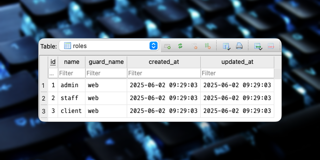
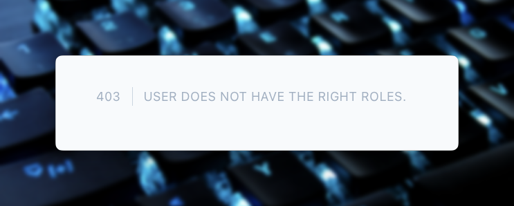

# Laravel Bootcamp: Part 11

## Software as a Service - Front-End Development

Developed by Adrian Gould

---

```table-of-contents
title: # Contents
style: nestedList
minLevel: 0
maxLevel: 3
includeLinks: true
```

---

# Laravel Bootcamp: Part 11

> We take a short break from the Chirper application whilst we look at Roles and Permissions.
> 
> These notes look at what Roles & Permissions are, and indicate possible ways to use and implement them.
> 
> We then look at a package (Spatie Permissions) that assists us in implementing Roles and Permissions, and use this in a separate demo application.

## Roles and Permissions - Part 1

In this section, we will start to add an administration/management front-end that allows 
users with particular rights to perform management actions on data in the Chirp system.

We will:
- Build User Management Interface
- Determine Roles to use in Application
- Determine Permissions each Role will have
- Apply Roles & Permissions to Application (User Management)


## Before you start…

Have you completed (not just read):

- [Laravel v12 Bootcamp - Introducing Laravel](S11-Laravel-v12-Bootcamp-Part-00-Introducing-Laravel.md),
- [Laravel v12 Bootcamp - Part 1](S11-Laravel-v12-BootCamp-Part-01.md),
- [Laravel v12 Bootcamp - Part 2](S11-Laravel-v12-BootCamp-Part-02.md)
- [Laravel v12 Bootcamp - Part 3](S11-Laravel-v12-BootCamp-Part-03.md)
- [Laravel v12 Bootcamp - Part 4](S11-Laravel-v12-BootCamp-Part-04.md)
- [Laravel v12 Bootcamp - Part 5](S11-Laravel-v12-BootCamp-Part-05.md)
- [Laravel v12 Bootcamp - Part 6](S11-Laravel-v12-BootCamp-Part-06.md)
- [Laravel v12 Bootcamp - Part 7](S11-Laravel-v12-BootCamp-Part-07.md)
- [Laravel v12 Bootcamp - Part 8](S11-Laravel-v12-BootCamp-Part-08.md)
- [Laravel v12 Bootcamp - Part 9](S11-Laravel-v12-BootCamp-Part-09.md)
- [Laravel v12 Bootcamp - Part 10](S11-Laravel-v12-BootCamp-Part-10.md)


No? Well… go do it…

You will need these to be able to continue…

> **Important:** You should understand that whilst you are completing this tutorial, you will
> only see parts of the application working when a stage is complete.
>
> So if you get an error in the browser, it may be because there is something missing.


## Development Only: ⚠️ Starting the Database From Fresh

Remember that the `local` value for `APP_ENV` in the `.ennv` file tells Laravel that this application is in  **development**.

When this is the case, we are working with a database that is able to be destroyed and rebuilt as it is **NOT** live data.

To destroy the database tables, we re-run the migrations and seed the database using:

```php
php artisan migrate:fresh --seed
```

> ### Remember:
> 
> - This MUST NOT be used on a production database
> 
> - This command DROPS all existing tables and data


# Spatie Permissions

Package to help with Roles and Permissions

- Assist by abstracting permission management
- Make it more human friendly

```php
$user->givePermissionTo('edit articles’);

$user->assignRole('writer’);

$role->givePermissionTo('edit articles’);

$user->can('edit articles');

```

# Creating a Demo App

Using Roles and Permissions in a small demo application

Code is available on GitHub:
- https://github.com/AdyGCode/roles-permissions-2025-s1

We **STRONGLY** suggest you complete this tutorial from scratch.

This will assist your understanding and ability to apply to other projects

## Create Base Code using Laravel installer

We presume you are using the bash terminal.

For details on setting this up, check the https://help.screencraft.net.au FAQs.

Change into your Source/Repos folder:

```shell
cd /c/Users/USERID
cd Source/Repos
```

### Update the Laravel Installer

It is always a good idea to see if the Laravel installer and its required packages have been updated so… run the composer update in the global context to do this.

```shell
composer global update
```

### Create a new Demo Application

> This section is based on the video series Spatie Laravel Permission by Tony Xhepa. The series > was created three or so years ago, and as a result, some of the information is outdated. 
> 
> These notes aim to update to Laravel 12, and provide code that works with this version fo 
> the framework.
> 
> - Xhepa, T. (2022, March 1). Spatie Laravel Permission. 
>   YouTube. http://www.youtube.com/playlist?list=PL6tf8fRbavl3xuFIe4_i3TB4PZbtbx3Js


Now we are ready to create a new Laravel Application for the purpose of demonstrating how to 
add roles and permissions to an application.

```shell
laravel new roles-permissions-2025-s1 --using=adygcode/base-blade-kit
```

When prompted, respond with:
- Testing suite: Pest (0)
- Run NPM [Y]

Change into your new project:

```shell
cd roles-permissions-2025-s2
```

> #### Errors when creating the new app?
> 
> We have noted that errors occur from time to time with the starter kit. If they occur then it may be prudent to run the following commands:
> 
> ```shell
> composer install
> npm install
> npm run build
> touch database/database.sqlite
> php artisan migrate:fresh --seed
> ```
	

### Install Spatie Permissions

Now we can add the Spatie Permissions package:

```shell
composer require spatie/laravel-permission
```

Install the migrations and settings for the Roles/Permissions package (one line):

```shell
php artisan vendor:publish --provider="Spatie\Permission\PermissionServiceProvider" 
```

### Running our Dev Server

Split the terminal into two panels:

- <kbd>ALT</kbd>+<kbd>SHIFT</kbd>+<kbd>-</kbd>

Remember that resizing panels is easy:

Click in the panel and use: <kbd>ALT</kbd>+<kbd>SHIFT</kbd>+ ⬅️➡️⬆️⬇️ (arrow keys)

In the bottom panel, execute:

```shell
cd roles-permissions-2025-s2
```

Now in this bottom panel execute:

```shell
composer run dev-win
```

If you use `composer run` it will prompt you with the possible options for the commands!


> Remember: you may want to modify the composer dev script (in `composer.json`) to also execute MailPit. 
> 
> See [Introducing Laravel v12](S11-Laravel-v12-Bootcamp-Part-00-Introducing-Laravel.md) for 
> details on adding "MailPit" to the `composer run dev` command.
>
> Also, the updated version of the base-blade-kit has two new commands - `dev-linux` and `dev-win` that have slightly different running specs for the development server.
> 
> You may always download the latest `composer.json` file from the original base-blade-kit repository and replace yours as needed.


## Adding "Roles" Trait to the User Model

Adding the Roles and Permissions to the User model is a matter of adding a couple of lines to the `User` model.

This trait is then available when we need by checking if a user `can` or 
`cannot` do an operation via checking the permission.

Open the `User` model and add the `HasRoles` after `Notifiable`:

```php
    use HasFactory, Notifiable, HasRoles;
```

Remember that you will need to `use` the class just after the namespace to import it:

```php
use Spatie\Permission\Traits\HasRoles;
```

### Applying Role Middleware

To make it easier to use aliases like 'role', 'permission' and 'role_or_permission' we will 
update the `bootstrap/app.php` file.

Now locate the line `->withMiddleware(function (Middleware $middleware) {` and add:

```php
$middleware->alias([
    'role' => \Spatie\Permission\Middleware\RoleMiddleware::class,
    'permission' => \Spatie\Permission\Middleware\PermissionMiddleware::class,
    'role_or_permission' => \Spatie\Permission\Middleware\RoleOrPermissionMiddleware::class,
]);
```

> ### Aside:
> 
> One advantage of this is that we can then, if we wish, apply `role`, `permission` or 
> the `role_or_permission` to check at the route stage. For example:
> 
> ```php
> Route::group(['middleware' => ['role:manager']], function () { … });
> Route::group(['middleware' => ['permission:publish articles']], function () { … });
> Route::group(['middleware' => ['role_or_permission:publish articles']], function () { … });
> ```
> [For more information, always read the
> documentation for the package.](https://spatie.be/docs/laravel-permission/v6/basic-usage/middleware)


OK, let's continue…


## Creating an Admin Role and Assigning it

We are now ready to begin the next stage of our development. In this step we will be:

- Creating an `admin` role
- Assigning the role to an `admin` user

We will use a seeder to do this as it is reproducible and allows us to vary what we want to do depending on the 
requirements of the project.

> Note:
> 
> It is possible to also create an "installer" that runs the migrations etc, and asks for the admin user's email and a password, but this is beyond the needs of this tutorial.

### Role seeder

Let us start by first visiting the Role Seeder… ok, so we need to create one first… so:

```shell
php artisan make:seeder RoleSeeder
```

Open the Role Seeder file (in `database/seeders`).

After the namespace, add:

```php
use Spatie\Permission\Models\Role;
```

In the `run` method we will now add:

```php
$roleAdmin = Role::create(['name' => 'admin']);
```

This will create the `admin` role.

### Exercise: Staff and Client Roles

You could easily add the `staff` and `client` roles at this point if you wish. 

In fact go ahead and do so as you will need them as you progress through this tutorial.

### Update the `DatabaseSeeder` file

Now we need to update the Database Seeder and add the `RoleSeeder` **BEFORE** the `UserSeeder` …

Why do we do this?

Because if you do not add the roles (and permissions) before creating the user, then you will get migration and seeder errors.

```php

        $this->call([
            RoleSeeder::class,
            
            UserSeeder::class,

        ]);

```

As we are working in development, we can apply these changes from fresh:

```shell
php artisan migrate:fresh --seed
```

If you have [DB Browser for SQLite](https://sqlitebrowser.org/) then you can check what has been created by the migrations and seeds in the SQLite database.

### Rule of Thumb: Migrations (and seeders)

Always Migrate and Seed the tables with the least number of relationships first.

For example, the following database structure has 6 tables. But what order would we migrate and seed?


| Table            | Foreign Keys | Parent Table(s)     |
| ---------------- | ------------ | ------------------- |
| User             | 0            |                     |
| Unit             | 1            | Qualification       |
| Class Session    | 2            | User, Cluster       |
| Cluster          | 2            | Unit, Qualification |
| Training Package | 0            |                     |
| Qualification    | 1            | Training Package    |

So given this analysis, we would perform the migrations and seeding in the following order:
1. User
2. Training Package
3. Unit
4. Qualification
5. Cluster
6. Class Session

We order the unit before the qualification as on further analysis we found out that a unit could be part of multiple qualifications (a many-to-many relationship), and as a result we need the units to be defined before we can associate them with a qualification.

This will also hold true with units and clusters, where a unit could be part of multiple clusters.

Given this information, we would seed the Permissions and then the Roles, before finally seeding the Users.

### Recap the Role Seeder

We got you to create individual role seeder lines for the roles, but we could have used an associative array and a foreach loop to do this.

Here is an example:

```php
public function run(): void  
{  
    $seedRoles = [  
        ['name' => 'super-user'],  
        ['name' => 'admin'],  
        ['name' => 'staff'],  
        ['name' => 'client'],  
    ];  
    foreach ($seedRoles as $seedRole) {  
        Role::create($seedRole);  
    }}
```

This would provide a way to create more roles as  default if needed.

The problem is that the roles do not contain the permissions associated with them

More on that later.

### User Seeder

As part of the "Retro Blade Kit" we have a seeder already created for users.

The seeder creates users with the roles:
- super-user
- admin
- staff
- client

So that is a chunk of what is needed already done for us.

Let's look at this code so we understand what has been provided. We are going to highlight parts of the code, but you should look over the whole of the user seeder.

#### How the `UserSeeder` code works

`$seedUsers` is a variable containing all the default users for the application. 

```php
$seedUsers = [  [ ... ], ...];
```

In a production environment it is probably better to have a method to set up the application and during this process ask for a super-admin / admin user instead of creating a set of "dummy" base users.

The seed user that is shown in the extract of the actual code is for a "super-admin".

> Note: the seed data adds roles as part of the user details. By default the roles and permissions will be ignored until we use them.

```php
$seedUsers = [  
    [        
        'id' => 99,  
        'name' => 'Super Admin',  
        'email' => 'supervisor@example.com',  
        'password' => 'Password1',  
        'email_verified_at' => now(),  
        'roles' => ['super-user', 'admin'],  
        'permissions' => [],  
    ],
    ...
];
```

After the seed users are defined, we are now able to process them.

Let's start by looking at how we create the users without any roles and permissions.

The first part of the code loops through each user.

It then saves the specified user's roles & additional permissions for later.

The roles and permissions key/value pairs are then removed from the new user as they are not part of the user table structure.

```php
foreach ($seedUsers as $newUser) {  
  
    $roles = $newUser['roles'];  
    unset($newUser['roles']);  
  
    $permissions = $newUser['permissions'];  
    unset($newUser['permissions']);  
```

Next the code checks to see if the user is in the user table, or not.

If the user is in the table then their details are updated, otherwise a new user is created. Don't you just love Laravel's beauty at making things simpler for the developer?

``` php
    $user = User::updateOrCreate(  
        ['id' => $newUser['id']],  
        $newUser  
    );  
  
}
```


So that is the base of how we create the user.

But what about adding the roles and permissions for the user?

Below we see the previous bit of code, but with the additional lines for the roles and permissions.

```php
$user = User::updateOrCreate(  
    ['id' => $newUser['id']],  
    $newUser  
);  
  
$user->assignRoles($roles);  
$user->assignPermissions($permissions);
```

We use the Spatie permissions package's methods to add the roles and permissions to the new user.

A simple case of `$user` is given the `$roles` by passing an array of roles to the `assignRoles` method.

Likewise for the permissions.

#### Users Table


## Spatie Roles & Permissions

When we installed the Spatie Permissions package, it created a set of migrations to add the required tables for its use.

The tables include: `roles`, 'permissions', `model_has_permissions`, `model_has_roles` and `role_has_permissions`.

You do not need to know how this works, but it is important to understand the base structure of the database for roles and permissions using this package.

#### Roles Table


#### Model Has Roles Table

This is the Spatie Permission table that links the Role to the required model, in our case 
the User model. It indicates that the User model (Users table) with an ID of 100 is linked 
to a role number of 1.


Yes, it's the Many-to-Many relationship in a normalised form!


## Creating the Admin Interface

We will, in this step:

- update the web routes
- create folders for the admin of Roles & Pages
- create index pages for Roles & Permissions
- create the index methods 
- repeat for:
	- create
	- update
	- delete

### Routes

Open the `web.php` file in the `routes` folder and, immediately after the dashboard entry, add:

```php
Route::middleware(['auth', 'verified', 'role:admin'])
    ->group(function () {
        Route::get('/admin', function () {
            return view('admin.index');
    })->name('admin.index');
});
```

This will verify that the user is:
- logged in
- verified, and
- a member of the admin group (role))

This provides the first level of protection from a "bad" user trying to access a section of the system when they do not have permission to do so.

It also is based on the Role, so is less precise than specific Permissions.

Obviously, at the moment, when the page refreshes, this will cause an error.

### Create Admin View(s)

Create a new folder, `admin` in the `resources/views` folder.

Copy the `dashboard.blade.php` file into this new folder and rename it to `index.blade.php`.

Update the new `admin/index.blade.php` file to read:

```php
<x-app-layout>
    <x-slot name="header">
        <h2 class="font-semibold text-xl text-gray-800 leading-tight">
            {{ __('System Administration') }}
        </h2>
    </x-slot>

    <div class="py-12">
        <div class="max-w-7xl mx-auto sm:px-6 lg:px-8">
            <div class="bg-white overflow-hidden shadow-sm sm:rounded-lg">
                <div class="p-6 text-gray-900">
                    {{ __("You're logged in!") }}
                </div>
            </div>
        </div>
    </div>
</x-app-layout>
```

Try accessing https://localhost:8000/admin … you should be challenged to log into the site 
(`admin@example.com` and `Password1`).

Once logged in, you should now be presented with a page like this:


We will look at creating a Layout specific for Admin later.

### Update Navigation to Show Admin

One problem you now have, is that you cannot get to the Admin area if you log in via the 
main page. So we need to update the navigation.

We are going to see our first use of the `can` blade directive to check if the current user 
is an `admin` user or not.

> #### Important:
> 
> We would usually check at the _permission_ level to make sure that the user is allowed to do 
 
Open the `navigation.blade.php` file from the `resources/views/layouts` folder.

We will have to make two sets of changes as the navigation is responsive, so let's start with…

#### Desktop Navigation

Locate the code:

```php
<x-nav-link :href="route('dashboard')" :active="request()->routeIs('dashboard')">
    <i class="fa-solid fa-laptop mr-1"></i>
    {{ __('Dashboard') }}
</x-nav-link>
```

We are going to add a new entry after the `</x-nav-link>`:

```php
@role('admin')
    <x-nav-link :href="route('admin.index')" 
                :active="request()->routeIs('admin.*')">
        <i class="fa-solid fa-user-tie mr-1"></i>
        {{ __('Admin') }}
    </x-nav-link>
@endrole
```

On refreshing the page you will now see the `Admin` option if you are the admin user.


> _We have updated the icon to a user with a tie in the code._

#### Mobile Navigation

The mobile navigation is going to be very similar to the desktop version.

Locate the lines:

```php
<x-responsive-nav-link :href="route('dashboard')" 
                       :active="request()->routeIs('dashboard')">
    <i class="fa-solid fa-laptop mr-1"></i>
    {{ __('Dashboard') }}
</x-responsive-nav-link>
```

Duplicate these lines, and modify to read:

```php
@role('admin')
<x-responsive-nav-link :href="route('admin.index')"
            :active="request()->routeIs('admin.*')">
    <i class="fa-solid fa-user-tie mr-1"></i>
    {{ __('Admin') }}
</x-responsive-nav-link>
@endrole
```

And yes, there is only one real change - adding `responsive` to the tags.


When a user without the required rights logs in - the option is missing:


Plus, if they try going to the route directly…



### Further Development

At some point in the future, the layout we are using would benefit from being updated to a 
sidebar rather than a header, and also remove the footer, or at least make it minimal.

Administration needs to focus on the maintenance of the site's data.

## Role and Permission Management

We are now ready to add the management of the Roles and Permissions. This is basically CRUD 
for these two parts of the application.

Start by creating a Role Controller and a Permission Controller.

```shell
php artisan make:controller PermissionController
php artisan make:contreoller RoleController
```

Next add the required Routes to the `web.php` routes file.

Locate the middleware for the admin section:

```php
Route::middleware(['auth', 'verified', 'role:admin'])->group(function () {
    Route::get('/admin', function () {
        return view('admin.index');
    })->name('admin.index');    
});
```

We will modify this as we are going to be adding more administration routes:

```php
Route::name('admin.')
    ->prefix('admin')
    ->middleware(['auth', 'verified', 'role:admin'])
    ->group(function () {

        Route::get('/', [StaticPageController::class, 'admin'])
            ->name('index');

        Route::resource('/roles', RoleController::class);
        
        Route::resource('/permissions', PermissionController::class);
        
    });
```

> Remember to import the Role and Permission Controller classes (use lines)

The modifications mean we are able to still visit the `http://localhost:8000/admin` route, 
as the following is performed for us…

- `name('admin.')` - named routes within the closure will seen as `admin.xxxx`, where`xxxx` is the name associated with the inner route (e.g. index).
- `prefix('admin')` will add the `admin/` part of the URI automatically. 

So, in the case of the `get('/')…->name('index')` the route will be known as `admin.index` 
and the URI will be `/admin`, that is `http://localhost:8000/admin`
and even better is that we will be able to refer to the roles route by name as well… `admin.roles.index` … cool eh?

We will also use a static page controller to show the admin page… so…

### Add static folder to views

Use the IDE or use the command line to add a new static folder to the `resources/views` folder.

```shell
mkdir -p resources/views/static
```

We need to move the welcome and dashboard views into that nice and new static page folder.

The admin index page will stay where it is in the `admin` folder.

```shell
mv resources/views/welcome.blade.php resources/views/static/
mv resources/views/dashboard.blade.php resources/views/static/
```

Also, you will now need to update the routes in the `navigation.blade.php` and also the `footer.blade.php` as needed.

| Original Name        | New Route Name              | New RouteIs Name              |
|----------------------|-----------------------------|-------------------------------|
| `route('home')`      | `route('static.home')`      | `routeIs('static.home')`      |
| `route('dashboard')` | `route('static.dashboard')` | `routeIs('static.dashboard')` |

Also, these controllers will need to be updated to point at the correct route names:

- `AuthenticatedSessionController.php`
- `ConfirmablePasswordController.php`
- `EmailVerificationNotificationController.php`
- `EmailVerificationPromptController.php`
- `RegisteredUserController.php`
- `VerifyEmailController.php`

These are all within the `app/Http/Controllers/Auth` folder.

You may always check the [Roles and permissions 2025 S1 Repository](https://github.com/AdyGCode/roles-permissions-2025-s1) and check your code.

### Add a Static Page Controller

Create the `StaticPageController`:

```shell
php artisan make:controller StaticPageController
```

Once created, open the file and add methods for:

- home
- dashboard
- admin index

#### Home Method

```php
    function index(){
        return view('static.welcome');
    }
```

#### Dashboard method


```php
    function dashboard(){
        return view('static.dashboard');
    }
```

#### Admin Index Method

```php
    function admin(){
            return view('admin.index');
    }
```

#### Update the static page routes

Modify the welcome and dashboard routes to become:

```php

Route::name('static.')->group(function () {

    Route::get('/', [StaticPageController::class, 'index'])
        ->name('home');

    Route::get('/dashboard', [StaticPageController::class, 'dashboard'])
        ->middleware(['auth', 'verified'])
        ->name('dashboard');
        
});

```

We are again making use of the ability to name groups of routes.

### Add Links to the Admin Page

For the time being, we will be using the admin page as a switchboard. To do so we will add cards that link to other parts of the admin area.

Eventually, these could become a sidebar menu.

Open the `admin/index.blade.php` file and update the code that is nestled inside 
`<div class="bg-white overflow-hidden shadow-sm sm:rounded-lg … gap-8 p-8">` and `</div>`:

```php
<div class="bg-white overflow-hidden shadow-sm sm:rounded-lg grid grid-cols-3 gap-8 p-8">

    <a href="{{ route('admin.roles.index') }}"
       class="border p-6 hover:bg-blue-500 hover:text-white grow">
        <h3 class="text-xl">Roles</h3>
        <p>This could be a card with statistics about Roles</p>
    </a>
    
    <a href="{{ route('admin.permissions.index') }}"
       class="border p-6 hover:bg-blue-500 hover:text-white grow">
        <h3 class="text-xl">Permissions</h3>
        <p>This could be a card with statistics about Permissions</p>
    </a>
    
    <a href="{{ route('admin.index') }}"
       class="border p-6 hover:bg-blue-500 hover:text-white grow">
        <h3 class="text-xl">Another Admin Link</h3>
        <p>This could be a card with statistics about Permissions</p>
    </a>
    
    <a href="{{ route('admin.index') }}"
       class="border p-6 hover:bg-blue-500 hover:text-white grow">
        <h3 class="text-xl">Another Admin Link</h3>
        <p>This could be a card with statistics about Permissions</p>
    </a>

</div>
```


### Verify Working

Make sure that the pages are now displaying as expected… 

Well, all except the roles and permissions pages.


## Role & Permission (R&P) Management Pages

We need to create the CRUD pages for the Roles and Permissions.

### Create View Folders

Start by creating folders for the roles and permissions admin pages:

```shell
mkdir -p resources/views/admin/{roles,permissions}
```

We will place the CRUD pages into these folders. It keeps admin-related views together and 
less likly to confuse with views that may have the same name for ordinary client type users.

### Index methods

Let's now start getting our teeth into the R&P admin.

Open the `RoleController` you created earlier.

Add a new `index` method:

```php
    public function index()
    {
        return view('admin.roles.index');
    }
```

Likewise for the `PermissionController`:

```php
    public function index()
    {
        return view('admin.permissions.index');
    }
```


### Add index pages

Copy the `admin/index.blade.php page` into the `roles` folder and update the code to be:

```php
<x-app-layout>
    <x-slot name="header">
        <h2 class="font-semibold text-xl text-gray-800 leading-tight">
            {{ __('System Administration') }}
        </h2>
    </x-slot>

    <div class="py-12">
        <div class="max-w-7xl mx-auto sm:px-6 lg:px-8">
            <div class="bg-white overflow-hidden shadow-sm sm:rounded-lg p-8">

                Roles Administration

            </div>
        </div>
    </div>
</x-app-layout>
```

### Exercise: Permissions Index Page

To help you practice and learn the skills, repeat the above for the permissions, changing 'Roles' to 'Permissions'.

### Display the Roles

We can use tables or grids or even flex boxes to display our list of roles, but for now we 
will utilise a good old table.

Open the `roles/index.blade.php` file and:

- Replace `__('System Administration')` with `__('Roles Administration')`

Let us concentrate on the Roles index page.

> The table layout is based on one from https://www.hyperui.dev/components/application/tables

Replace the text `Roles Administration` that is not in the header, with the following:

```php
<div class="overflow-x-auto rounded border border-gray-300 shadow-sm">
    <table class="min-w-full divide-y-2 divide-gray-200">
        
        <thead class="ltr:text-left rtl:text-right">
        <tr class="*:font-medium *:text-gray-900">
            <th class="px-3 py-2 whitespace-nowrap">
	            Role Name
	        </th>
            <th class="px-3 py-2 whitespace-nowrap">
	            Actions
	        </th>
        </tr>
        </thead>

        <tbody class="divide-y divide-gray-200">
        
        @foreach($roles as $role)
            <tr class="*:text-gray-900 *:first:font-medium">
                <td class="px-3 py-2 whitespace-nowrap">
	                {{ $role->name }}
                </td>
                <td class="px-3 py-2 whitespace-nowrap">
                    Details
                    Edit
                    Remove
                </td>

            </tr>
        @endforeach
        
        </tbody>

        <tfoot>
        <tr>
            <td colspan="2" class="p-3">
                @if( $roles->hasPages())
                    {{ $roles->links() }}
                @else
                    <p class="text-sm text-gray-500">
                        All Roles shown
                    </p>
                @endif
            </td>
        </tr>
        </tfoot>

    </table>
</div>
```

If you refresh, then there will be a problem with the view as we have not got the roles from the database.

Open the `RolesController` and update the index method:

```php
        $roles = Role::paginate(15);

        return view('admin.roles.index')
            ->with('roles', $roles);
```

That's the basic layout.

### Exercise: Display the Permissions as a Table

We already have the dashboard as the basis, so we will use this as a start.

For practice, you now will do the same as above so the permissions to be displayed in a table.

### Create the Add Role page

The easiest way to do this is to duplicate the index, and remove anything we do not want, to leave us with:

```php
<x-app-layout>  
    <x-slot name="header">  
        <h2 class="font-semibold text-xl text-gray-800 leading-tight">  
            {{ __('Roles Administration') }}  
        </h2>  
    </x-slot>  
    <div class="py-12">  
        <div class="max-w-7xl mx-auto sm:px-6 lg:px-8">  
            <div class="bg-white overflow-hidden shadow-sm sm:rounded-lg p-8">  
  
                <div class="overflow-x-auto rounded border border-gray-300 shadow-sm">  
  
                    <div class="flex flex-1 justify-between p-2 items-end bg-gray-200">  
                        <h2 class="text-2xl ">
                        Create New Role
                        </h2>  

                        <a href="{{ route('admin.roles.index') }}"  
                           class="rounded bg-green-500 text-white hover:bg-white hover:text-green-500 border-green-500 px-4 py-2">  
                            All Roles  
                        </a> 
                        
						<a href="{{ route('admin.roles.create') }}"  
                           class="rounded bg-green-500 text-white hover:bg-white hover:text-green-500 border-green-500 px-4 py-2">  
                            New Role  
                        </a>  
                    </div>  
                    
					<!-- Rest of page here -->
					  
                </div>  
            </div>
                    
        </div>    
    </div>
</x-app-layout>
```

Before we continue, we need to add a way to easily go back to the list of Roles, so let's add a button.

Locate the: `<h2>` for the `Create new Role`, and modify the code after that, and up to the first `</div>`:

```php
<h2 class="text-2xl ">Create New Role</h2>  
  
<div class="space-x-4 py-2">  
    <a href="{{ route('admin.roles.index') }}"  
       class="rounded bg-blue-500 text-white hover:bg-white hover:text-blue-500 border-blue-500 px-4 py-2">  
        All Roles  
    </a>  
  
    <a href="{{ route('admin.roles.create') }}"  
       class="rounded bg-green-500 text-white hover:bg-white hover:text-green-500 border-green-500 px-4 py-2">  
        New Role  
    </a>  
</div>
```

In the space represented by `<!-- Rest of page here -->` we will now add:

```php
<form action="{{ route('admin.roles.index') }}"  
      method="POST"  
      class="p-6 flex flex-col space-y-4">  

	@csrf

	<div>  
	    <x-input-label 
		    for="name" 
		    :value="__('Role Name')"/>  
	  
	    <x-text-input 
		    id="name" 
		    class="block mt-1 w-full" 
		    type="name" 
		    name="name"  
	        :value="old('name')" 
	        required/>  
	  
	    <x-input-error 
		    :messages="$errors->get('name')" 
		    class="mt-2"/>  
	</div>
      
    <div class="flex flex-row space-x-4">  
        <x-primary-button>
	        Save
        </x-primary-button>  
        <x-link-button href="{{route('admin.roles.index')}}">  
            Cancel  
        </x-link-button>  
    </div>
    
</form>
```

We do not have a `x-link-button` so we create a file `link-button.blade.php` in the `resources/views/components` folder  and add the content:

```php
<a {{ $attributes->merge([  
    'class' => 'inline-flex items-center px-4 py-2 bg-gray-300 border border-transparent  
                rounded-md font-semibold text-xs text-gray-800 uppercase tracking-widest
                hover:bg-gray-400 hover:text-white focus:bg-gray-400 active:bg-gray-400 focus:outline-none
				focus:ring-2 focus:ring-indigo-500 focus:ring-offset-2
				transition ease-in-out duration-150']) }}>  
    {{ $slot }}  
</a>
```

The page should look similar to this:


### Add the Store action

Now we have a form we need to store the new role in the system.

Go back to the `RoleController` and add a new method `store`:

```php
public function store(Request $request)  
{  
  
    $validated = $request->validate([  
       'name'=>[  
           'required',  
           'min:5',  
           'max:64',  
           'unique:roles'  
       ]  
    ]);  
```

The validation should be familiar by now. The name is required, between 5 and 64 characters in length (inclusive), and unique.

```php
    $validated['name']=Str::lower($validated['name']);  
```

We force the role to all lower case.

```php
    Role::create($validated);  
```

Then create the role in the database, before returning to the roles index page.

```php  
    return to_route('admin.roles.index');  

}
```

### Exercise: Build the Create actions for Permissions!

It is time for you to practice by making the pages and methods for the permissions create page, as we have done for the Roles. The permission's name, when validating the data, needs to be between 4 and to 128 characters, inclusive.

## Edit Roles & Permissions

The Index and Create are done.

Now onto Edit.

### Create the Edit Role page

Easiest way is to duplicate the `create.blade.php` file and rename it `edit.blade.php`.

Then edit the page, making the following changes:

- update the `<h2 class="text-2xl ">Create New Role</h2>` text to be `Edit Role`.

- change the form route to be `route('admin.roles.update', $role)`
 
- Add a `@method('patch')` immediately after the CSRF.
  
- Update the `x-test-input` control to have the `:value` be  `old('name')??$role->name` to allow the role to be filled in from the database, or if edited the value it was changed to.

### Add Update Method to RoleController

Now edit the role controller.

We need to add an update method, immediately after the `edit` method.

```php
public function update(Role $role, Request $request)  
{  
    $validated = $request->validate([  
        'name' => [  
            'required',  
            'min:5',  
            'max:64',  
            'unique:roles'  
        ]  
    ]);  
  
    $validated['name'] = Str::lower($validated['name']);  
  
    $role->update($validated);  
  
    return to_route('admin.roles.index');  
}
```

As you can see, it is dramatically similar to the store method...


### Exercise: Build the Edit and Update Pages and Actions for Permissions

It is time for you to practice by making the pages and methods for the permissions edit page, as we have done for the Roles. Also create the required edit and update methods for the permissions.

When editing the permission's name, needs to be between 4 and to 128 characters, inclusive.

### Add "Confirm delete" View

Duplicate the Edit, and then change the content as needed:

- `<h2 class="text-2xl ">Edit Role</h2>` becomes `<h2 class="text-2xl ">Delete Role</h2>`.

- the form's action becomes `{{ route('admin.roles.destroy', $role) }}`.

- the `@method` becomes a `delete` in place of `patch` (or `put`).

- In the input label, the value`:value="__('Role Name')"/>` becomes `:value="__('Confirm Role Name')"/>`.

- change the text input by removing the `:value="old('name')??$role->name"`.

Also, immediately after the `@method` and just before the form field's div, add:

```php
<div>  
    <p>Please confirm you wish to delete the role:  
        <code class="text-red-500 font-semibold">{{$role->name}}</code>  
        by entering it below:</p>  
</div>
```


### Add Destroy Method to the RoleController

The final step, well almost, is to add the destroy method to remove the role that is identified to be deleted.

Create the destroy method immediately after the delete method.

Change the method's parameter list to be: `Role $role, Request $request`.

Now in the method add:
```php
$roleName = $role->name;  
  
$validated = $request->validate([  
    'name' => [  
        'required',  
        'exists:roles,name'  
    ]  
]);  
```

We are using the form's submitted name field to verify that this is the role we wish to delete, just like GitHub's danger zone confirmations.

Now we can go ahead and delete the role.

```php
$role->delete();  
  
return to_route('admin.roles.index');
```


### Exercise: Complete the Permission Delete & Destroy

Ok, (almost) last step, repeat the above but for the Permissions.


## Adding Feedback to Add, Edit an Delete

Finally we want to give the user confirmation about the actions being completed.

To do so we will use the Flasher module.

Install using composer:

```shell
composer require php-flasher/flasher-laravel
```

Finish the installation using artisan:

```shell
php artisan flasher:install
```

and we are ready to go.

### Update store method to include flash messages

We are going to refactor the store method to use the flasher module...

What we are going to do is wrap the validation in a `try`...`catch` and the role creation in a separate `try`...`catch` so we can deal with the different errors that are generated.

#### Wrap the validation in a Try ... Catch

Let's first wrap the validation in a try...catch:

```php
$role = null;  
  
  
try {  
    $validated = $request->validate([  
        'name' => [  
            'required',  
            'min:5',  
            'max:64',  
            'unique:roles'  
        ]    
    ]);  
} catch (ValidationException $e) {  
// Flash message here 
}
```

Here we are now going to add in the Flash Message:

```php
    flash()->error('Please fix the errors in the form.',  
        [  
            'position' => 'top-center',  
            'timeout' => 5000,  
        ],  
        'Role Creation Failed');  
  
    return back()->withErrors($e->validator)->withInput(); 
```

#### Wrap the role creation in a Try ... Catch

Now we can do the same to the role create call. This is because sometimes the validation rules may miss a check (is this a Laravel bug?), and we end up getting a `Role Alreadyt Exists` error being raised.

So, after the `}` that ends the previous try catch, add:

```php
try {  
    $role = Role::create($validated);  
} catch (RoleAlreadyExists $e) {  
    flash()->error('The role already exists.',  
        [  
            'position' => 'top-center',  
            'timeout' => 5000,  
        ],  
        'Role Creation Failed');  
  
    return back()->withErrors($e->getMessage())->withInput();  
}
```

Excellent - we now have 'toast'' error messages when validation fails.


And the errors...


### Update edit method to include flash messages

Next, we are going to refactor the edit method to use the flasher module...

It looks almost identical to the store method, with only small changes.

First the field validation:
```php
try {  
    $validated = $request->validate([  
        'name' => [  
            'required',  
            'min:5',  
            'max:64',  
            'unique:roles'  
        ]    
    ]);  
  
    $validated['name'] = Str::lower($validated['name']);  
} catch (ValidationException $e) {  
    flash()->error('Please fix the errors in the form.',  
        [  
            'position' => 'top-center',  
            'timeout' => 5000,  
        ],  
        'Role Update Failed');  
  
    return back()->withErrors($e->validator)->withInput();  
}  
```

Now the update call:

```php
try {  
 
    $role->update($validated);  
} catch (RoleAlreadyExists $e) {  
    flash()->error('The role already exists.',  
        [  
            'position' => 'top-center',  
            'timeout' => 5000,  
        ],  
        'Role Creation Failed');  
  
    return back()->withErrors($e->getMessage())->withInput();  
}  
  
$roleName = $role->name;  
  
flash()->success("Role $roleName updated successfully!",  
    [  
        'position' => 'top-center',  
        'timeout' => 5000,  
    ],  
    "Role Added");  
  
return to_route('admin.roles.index');
```
#### Debugging Time

Ok, so what happens if you make no changes to a role name and click save?

Yes, you guessed it correctly... we get an error "The name already exists". This is not what we expected, so we need to fix the issue.

The problem is that when we validate we do not ignore the current role's details. So `save` will try saving the updates, but the name already exists so it throws the error.

Let us fix the `unique` section of the validation in the edit.

```php
    $validated = $request->validate([  
        'name' => [  
            'required',  
            'min:5',  
            'max:64',  
			Rule::unique(Role::class)->ignore($role->id),
        ]    
    ]);  
```

The `Rule::unique(Role::class)->ignore($role->id)` literally says "search in the roles making sure the new name is unique, but ignore the current role we are editing's data."

### Delete Confirmation

The final in the roles is the delete confirmation.

This is again just like the others. The change comes in when confirming that the role exists AND if it does, the id for the role matches the one we are trying to delete.

Here is the updated code (we are being generous by not splitting it up):

```php
  
$roleName = $role->name;  
$roleId = $role->id;  
  
try {  
  
    $validated = $request->validate([  
        'name' => [  
            'required',  
            'exists:roles,name,id,' . $roleId,  
        ],  
    ]);  
} catch (ValidationException $e) {  
    flash()->error(__("To delete, please enter the role's name."),  
        [  
            'position' => 'top-center',  
            'timeout' => 5000,  
        ],  
        __('Role Delete Failed'));  
  
    return back()->withErrors($e->validator)->withInput();  
}  
  
try {  
    $role->delete();  
} catch (RoleDoesNotExist $e) {  
    flash()->error('Could not delete the role.',  
        [  
            'position' => 'top-center',  
            'timeout' => 5000,  
        ],  
        'Role Delete Failed');  
  
    return back()->withErrors($e->getMessage())->withInput();  
}  
  
  
flash()->success("Role $roleName successfully deleted!",  
    [  
        'position' => 'top-center',  
        'timeout' => 5000,  
    ],  
    "Role Added");  
  
return to_route('admin.roles.index');

```


### Exercise: Complete the Flash Messages for Permisisons

Ok, so to make sure you are able to understand and apply the principles we have so far, add the flash messages to the Permission create, update and delete.


## Testing

Make sure you try out the various methods to ensure your code is correct.

## Wrapping Up

OK, so that turned into a long tutorial, but we have now got CRUD for the Roles and Permissions, so we are able to dynamically update them when needed.

Next we will continue onto the ability to modify a role's permissions, as well as other tasks.

# References

- Xhepa, T. (2022, March 1). Spatie Laravel Permission.   YouTube. http://www.youtube.com/playlist?list=PL6tf8fRbavl3xuFIe4_i3TB4PZbtbx3Js
- Shariful Ehasan. (2025, September 16). _Laravel Policies: Do You Really Use Them in Real Projects?_ DEV Community. https://dev.to/thecodeliner/laravel-policies-do-you-really-use-them-in-real-projects-2pa1
- Zulfikar Ditya. (2025, March 14). _Mastering Laravel Policies: A Complete Guide to Authorization in Laravel_. Medium. https://medium.com/@zulfikarditya/mastering-laravel-policies-a-complete-guide-to-authorization-in-laravel-991bbdcc6756
- _Lucky Media_. (2025, February 10). Lucky Media. https://www.luckymedia.dev/blog/laravel-11-for-beginners-using-policies-for-authorization

‌


# Up Next

- [Laravel v12 Bootcamp - Part 11](S11-Laravel-v12-BootCamp-Part-12.md)
- [Session 11 ReadMe](../session-10/ReadMe.md)
- [Session 11 Reflection Exercises & Study](../session-11/S11-Reflection-Exercises-and-Study.md)

# END
