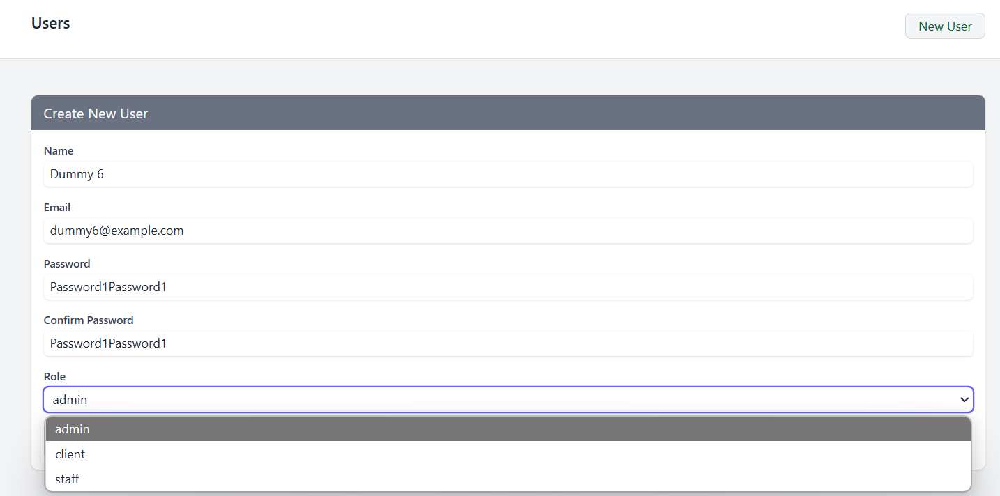
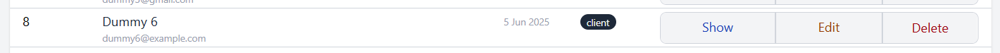

# Laravel Bootcamp: Part 13

## Software as a Service - Front-End Development

Developed by Adrian Gould

---

```table-of-contents
title: # Contents
style: nestedList
minLevel: 0
maxLevel: 3
includeLinks: true
```

---

# Laravel Bootcamp: Part 13

## Roles and Permissions Part 3

In this section, we continue with the administration/management front-end that allows
users with particular rights to perform management actions on data in the Chirp system.

We will:

- Build User Management Interface
- Determine Roles to use in Application
- Determine Permissions each Role will have
- Apply Roles & Permissions to Application (User Management)

## Before you start…

Have you completed (not just read):

- [Laravel v12 Bootcamp - Introducing Laravel](S11-Laravel-v12-Bootcamp-Part-00-Introducing-Laravel.md),
- [Laravel v12 Bootcamp - Part 1](S11-Laravel-v12-BootCamp-Part-01.md),
- [Laravel v12 Bootcamp - Part 2](S11-Laravel-v12-BootCamp-Part-02.md)
- [Laravel v12 Bootcamp - Part 3](S11-Laravel-v12-BootCamp-Part-03.md)
- [Laravel v12 Bootcamp - Part 4](S11-Laravel-v12-BootCamp-Part-04.md)
- [Laravel v12 Bootcamp - Part 5](S11-Laravel-v12-BootCamp-Part-05.md)
- [Laravel v12 Bootcamp - Part 6](S11-Laravel-v12-BootCamp-Part-06.md)
- [Laravel v12 Bootcamp - Part 7](S11-Laravel-v12-BootCamp-Part-07.md)
- [Laravel v12 Bootcamp - Part 8](S11-Laravel-v12-BootCamp-Part-08.md)
- [Laravel v12 Bootcamp - Part 9](S11-Laravel-v12-BootCamp-Part-09.md)
- [Laravel v12 Bootcamp - Part 10](S11-Laravel-v12-BootCamp-Part-10.md)
- [Laravel v12 Bootcamp - Part 11](S11-Laravel-v12-BootCamp-Part-11.md)
- [Laravel v12 Bootcamp - Part 12](S11-Laravel-v12-BootCamp-Part-12.md)

No? Well… go do it…

You will need these to be able to continue…

> **Important:** You should understand that whilst you are completing this tutorial, you may only see parts of the
> application working.
>
> So if you get an error in the browser, it may be because there is something missing.
>
> Remember that code is available from the GitHub repository.

# Manage User Roles (and Permissions)

Remember the most up-to-date code is available on GitHub:

- https://github.com/AdyGCode/xxx-roles-permissions-2025-s2

Even though we give you this code, we **STRONGLY** suggest you complete this tutorial from scratch.

This will assist your understanding and ability to apply to other projects

## Organising our Code

Just to refresh, we have been careful to organise our code.

We use namespaces to separate components into silos to be able to refer to and use them as needed.

We have the following folders in the `app/Http/Controller` folder:
- Admin
- Auth
- Web

We are working in the Admin folder, which gives a namespace of:

`App\Http\Controllers\Admin`


## Adding Roles to Users

We will now create an admin section for users. This will allow us to add, remove and edit users as required.

This has been done many times before, as we often use this as a way to teach CRUD/BREAD.

### Add the User Admin Routes

Edit the `web.php` file and add the admin route for users

```php
        Route::post('users/{user}/delete', [UserController::class, "delete"])
            ->name('users.delete');
        
        Route::resource('users',
            UserController::class);
```

We put these in the `admin` block after the permissions routes.

### Create the User Admin Controller

As with the roles and permissions, we will put the admin controller for the users in the Controllers/Admin folder.

```shell
php artisan make:controller Admin/UserController -r
```

To make things easier, we will give you the starting code for the User admin controller... it is in fact the code from
the Chirper tutorial, so you will be able tos ee how to modify and update Chirper to have these new features.

```php
    /**
     * Display a listing of the resource.
     */
    public function index(Request $request)
    {
        // TODO: Only allow authorised users (Admin/Staff Roles)

        $validated = $request->validate([
            'search' => ['nullable', 'string',]
        ]);


        $search = $validated['search'] ?? '';


        $users = User::whereAny(
            ['name', 'email', 'position',], 'LIKE', "%$search%")
            ->paginate(2)
            ->appends(['search' => $search]);


        return view('users.index')
            ->with('users', $users)
            ->with('search', $search);

    }

    /**
     * Store a newly created resource in storage.
     */
    public function store(Request $request)
    {
        try {

            $validated = $request->validate([
                'name' => ['required', 'min:2', 'max:192',],
                'email' => ['required', 'string', 'email', 'max:255', 'unique:' . User::class . ',email',],
                'password' => ['required', 'confirmed', Rules\Password::defaults()],
                'role' => ['nullable',],
            ]);

            $user = User::create([
                'name' => $validated['name'],
                'email' => Str::lower($validated['email']),
                'password' => Hash::make($validated['password']),
            ]);

        } catch (ValidationException $e) {

            flash()->error('Please fix the errors in the form.',
                [
                    'position' => 'top-center',
                    'timeout' => 5000,
                ],
                'User Creation Failed');

            return back()->withErrors($e->validator)->withInput();

        }

        $userName = $user->name;

        flash()->success("User $userName created successfully!",
            [
                'position' => 'top-center',
                'timeout' => 5000,
            ],
            "User Added");

        return redirect(route('users.index'));


    }

    /**
     * Show the form for creating a new resource.
     */
    public function create()
    {
        // TODO: Update when we add Roles & Permissions
        $roles = Collection::empty();

        return view('users.create', compact(['roles',]));
    }

    /**
     * Display the specified resource.
     */
    public function show(User $user)
    {
        // TODO: Update when we add Roles & Permissions

        return view('users.show', compact(['user']));
    }

    /**
     * Show the form for editing the specified resource.
     */
    public function edit(User $user)
    {
        // TODO: Update when we add Roles & Permissions
        $roles = Collection::empty();

        return view('users.edit', compact(['roles', 'user',]));
    }

    /**
     * Update the specified resource in storage.
     */
    public function update(Request $request, User $user)
    {
        // TODO: Update when we add Roles & Permissions

        try {

            $validated = $request->validate([
                'name' => ['required', 'min:2', 'max:192',],
                'email' => [
                    'required',
                    'string',
                    'email',
                    'max:255',
                    Rule::unique(User::class)->ignore($user),
                ],
                'password' => [
                    'sometimes',
                    'nullable',
                    'confirmed',
                    Rules\Password::defaults()
                ],
                'role' => ['nullable',],
            ]);

            // Remove password if null
            if (isNull($validated['password'])) {
                unset($validated['password']);
            }

            $user->fill($validated);

            if ($user->isDirty('email')) {
                $user->email_verified_at = null;
            }

            $user->save();

        } catch (ValidationException $e) {

            flash()->error('Please fix the errors in the form.',
                [
                    'position' => 'top-center',
                    'timeout' => 5000,
                ],
                'User Update Failed');

            return back()->withErrors($e->validator)->withInput();

        }

        if (isNull($user->email_verified_at)) {
            $user->sendEmailVerificationNotification();
        }

        $userName = $user->name;

        flash()->info("User $userName details updated successfully!",
            [
                'position' => 'top-center',
                'timeout' => 5000,
            ],
            "User Updated");

        return redirect(route('users.index'));
    }

    /**
     * Confirm the removal of the specified user.
     *
     * This is a prequel to the actual destruction of the record.
     * Put in place to provide a "confirm the action".
     *
     * @param User $user
     */
    public function delete(User $user)
    {
        // TODO: Update when we add Roles & Permissions

        return view("users.delete", compact(['user',]));

    }

    /**
     * Remove the specified resource from storage.
     *
     * @param User $user
     * @return \Illuminate\Http\RedirectResponse
     */
    public function destroy(User $user)
    {
        // TODO: Update when we add Roles & Permissions

        $oldUser = $user;

        $user->delete();


        $userName = $oldUser->name;

        flash()->info("User $userName removed successfully!",
            [
                'position' => 'top-center',
                'timeout' => 5000,
            ],
            "User Deleted");

        return redirect(route('users.index'));

    }
```

#### Update the Routes!

In this newly added code, search and replace the `route('users` with `route('admin.users`.

### CRUD views

Create a new folder in the `resources/views/admin` folder, called `users`.

To make it a bit easier on you, we are providing the views to download from our sample code.

- User List - [index.blade.php](sample-code/index.blade.php)
- User Create - [create.blade.php](sample-code/create.blade.php)
- User Edit - [edit.blade.php](sample-code/edit.blade.php)
- User Delete - [delete.blade.php](sample-code/delete.blade.php)
- User Details - [show.blade.php](sample-code/show.blade.php)

Download each file and move into the users admin views folder.

#### Update the Routes!

In these files, you will then need to replace every occurrence of `route('users` with `route('admin.users` as you did
with the controller code.

Going to http://localhost:8000/users should now show the list of users.

> IMPORTANT: Check the other functions work as expected adn fix any errors!


Excellent - we are ready to continue!

> ### redirect route or to_route
>
> You may use `to_route(...)` to replace the `redirect(route(...))` combination.

### Update the User Index (Show Roles)

Edit the admin/users/index.blade.php file and alter the current code:

```php
<p class="col-span-1 space-x-1 ">
    <span class="text-xs bg-gray-800 text-gray-100 rounded-full px-2 py-0.5">
        Role
    </span>
</p>

```

to show the role names using the following code:

```php
<p class="col-span-1 space-x-1 ">
    @foreach($user->roles as $role)
        <span 
            class="text-xs bg-gray-800 text-gray-100 rounded-full px-2 py-0.5"
        >{{ $role->name }}</span>
    @endforeach
</p>                            
```

When the page refreshes you should see the role names in "pills".

## Adding Roles to Add User

Ok, so we are ready to start changing the code for the Add User form and method.

Let's begin with the method:

### Edit the Create User method

Open the create user method and update where we had a placeholder collection:

```php
$roles= Collection::create();
```

Chenge this to:

```php
$roles = Role::orderBy('name')->get();
```

This will give the list of the roles.

Remember that you will need the line `use Spatie\Permission\Models\Role;` after the namespace declaration.

Now we can update the store method.

### Edit the Store User method

Locate the `store` method in the `admin/UserController` file.

First change the role validation from being nullable to:

```php
                'role' => ['required','int','exists:roles,id',],
```

This ensures the role is provided, and it is an integer, and it exists in the roles table from the Spatie package.

Next, after the user is created we need to attach the role to the user...

Just before the catch add:

```php
$user->roles()->attach($validated['role']);
```

### Test the Add User

Try adding a new user to see if we now get the roles shown and when selected the role is automatically allocated to the
new user.

Updated Add User form:



Results of Update Store Method:



## Edit user

Edit user will be a bit more of a challenge as we need to:

- Get the user details
- Get the user's current roles
- Get a list of all available roles
- Remove the current "add role" select box
- Show the current roles on the page
- Show "Add Role" section on page
- Show "Revoke Role" section on page

We will use the same principle as the adding permissions to the role... put the add and remove into separate forms after
the main editing for the user.

### Modify the `User Controller`'s `edit` method

Locate the edit method in the `Admin/UserController.php` file.

Where we currently have the $roles=Collection::create(), replace with the following:

```php
// TODO: Update when we add Roles & Permissions

$roles = Role::all();
$permissions = Permission::all();
$userRoles = $user->roles()->get();

$roles  = $roles->diffUsing($userRoles, function ($a, $b) {
    return $a->id <=> $b->id; // Compare by 'id'
});

return view('admin.users.edit', compact(['roles', 'user','userRoles','permissions',]));
```

> We included the comment and the return view for you.
>
> At the moment, we pass everything including the permissions, but they are not yet implemented.

This code presents a beautiful way of "removing" the role or roles the user already has from the list of roles they can
be given...

```php
$roles  = $roles->diffUsing($userRoles, function ($a, $b) {
    return $a->id <=> $b->id; // Compare by 'id'
});
```

What we have here is a collection operation "difference using" that allows us to provide a collection of models (in this
case the collection of Roles the user currently has)
then using a closure (aka anonymous function) which compares the ID in the full list of Roles with the ID in the
currently allocated roles, it removes the current user roles if it in the Roles list.

It's a beautiful little bit of code!

Ok, so armed with the available roles, the current user's roles (and permissions), we are able to now show the edit form.  

### Modify the Edit Form

First, let's add summary details of what role, or roles, the user current has:

Open the `admin/users/edit.blade.php` file and locate the lines:

```php
            <i class="fa-solid fa-save text-sm"></i>
            {{ __('Save') }}
        </button>
    </div>
</form>
```

After the close form tag (`</form>`) we now add:

```php
<section class="grid grid-cols-2 space-y-2 mt-4 px-6  space-x-8">

    <div class="-mx-6 bg-gray-100 col-span-2 px-6 pb-2">

        <h3 class="-mx-6 px-6 py-2 text-lg font-semibold col-span-2 bg-gray-100">
            Current Role(s)
        </h3>

        <div class="flex flex-row gap-1 flex-wrap pb-2">

            @forelse($userRoles as $role)
                <p class="text-xs bg-gray-700 text-gray-100 p-1 px-2 rounded-full whitespace-nowrap">{{ $role->name }}</p>
            @empty
                <p class="text-gray-600 text-sm">
                    No Roles
                </p>
            @endforelse

        </div>
    </div>
```

This will show the current roles.

Next we are going to add the "add and revoke" roles sections, immediately after the code we have above.

### Add Roles

In a small departure from the create form, and also taking inspiration from the "revoke" part, we are going to present the user with buttons for the roles. 

They then can click a button and see the role added to the list, and be also added to the revokable roles list.

Add the following code for "Add Roles":

```php
<div class="mt-2 mb-6 bg-gray-100 shadow border border-gray-300 rounded p-4 pt-2">  
  
    <h3 class="mb-2 bg-gray-300 text-gray-800 px-4 py-1 -mt-2 -mx-4 text-semibold">Add roles</h3>  
  
    <div class="flex space-x-4 flex-wrap">  
  
    @foreach ($roles as $role)  
  
        <form class="px-0 py-1 text-white rounded-md"  
              method="POST"  
              action="{{ route('admin.users.roles',  
                                [$user]) }}"  
              onsubmit="return confirm('Are you sure?');">  
  
            @csrf  
  
            <input type="hidden" name="role" value="{{$role->id}}"/>  
  
            <x-primary-button type="submit" class="bg-green-600">  
                {{ $role->name }}  
            </x-primary-button>  
  
        </form>  
  
    @endforeach  
  
    </div>  
</div>
```

Ok so this will then present the roles that the user has not been given.


### Add the "admin users roles revoke" route and name

Head back to the `web.php` route file, and locate the code:

```php
  
Route::post('users/{user}/delete', [UserController::class, "delete"])  
    ->name('users.delete');  
  
Route::resource('users',  
    UserController::class);
```

Update this block by adding the required extra lines so it now reads, 

```php
Route::post('users/{user}/roles', [UserController::class, 'giveRole'])  
    ->name('users.roles');  
Route::delete('users/{user}/roles', [UserController::class, 'revokeRole'])  
    ->name('users.roles.revoke');  
  
Route::post('users/{user}/delete', [UserController::class, "delete"])  
    ->name('users.delete');  
  
Route::resource('users',  
    UserController::class);

```

This adds the `admin/users/USERID/roles` URI path, which is actioned by `POST` and `DELETE` HTTP Methods. The two routes have names `users.roles` and `users.roles.revoke`.

### Add `giveRole` to the UserController.

Ok, so we have the form, and we have the routes, we now need the method to give the role to the user.

Open teh `UserController`, and move your cursor to the last `}` curly brace.

Immediately before this last closing brace, add:

```php
public function giveRole(Request $request, User $user)  
{  
    if ($user->hasRole($request->role)) {  
  
        flash()->warning('User already has this role.',  
            [  
                'position' => 'top-center',  
                'timeout' => 5000,  
            ],  
            'Role Exists');  
  
        return back();  
    }  
    
    $user->roles()->attach($request->role);  
  
    flash()->success('User has been granted the role.',  
        [  
            'position' => 'top-center',  
            'timeout' => 5000,  
        ],  
        'Role Added');  
  
	return back();  
}
```
This will attach the role to the user. Even id the role is there already it will ensure the user has that role.

BUT... we have not validated the data... which we MUST.

Before the `if( $user->hasRole...` line, we need to validate the role id.

Because we are doing this, it would also be a good idea to provide a warning flash message... so let's update the code.

We are using the same base code as the store and edit methods:

```php
try {  
  
    $validated = $request->validate([  
        'role' => ['required','exists:roles,id'],  
    ]);  
  
  
} catch (ValidationException $e) {  
  
    flash()->error('The role you attempted to add does not exist.',  
        [  
            'position' => 'top-center',  
            'timeout' => 5000,  
        ],  
        'Add Role Failed');  
  
    return back()->withErrors($e->validator)->withInput();  
  
}  

if ($user->hasRole($validated['role'])) {  
  
    flash()->warning('User already has this role.',  
        [  
           'position' => 'top-center',  
           'timeout' => 5000,  
        ],  
        'Role Exists');  
  
        return back();  
    }  
  
    $user->roles()->attach($validated['role']);  
  
flash()->success('User has been granted the role.',  
    [  
        'position' => 'top-center',  
        'timeout' => 5000,  
    ],  
    'Role Added');  
  
return back();
```

#### Test!

OK, try the add role to see if it works.


### Revoke Role from User

Ok, next we will do the revoke method in the controller.

We are keeping the "positive test" rather than using a not, so if the user has the role then it is removed from the list of roles the user has.

```php
public function revokeRole(Request $request, User $user)  
{  
    $roleId = Role::whereId($request->role)->get();  
  
    if ($user->hasRole($roleId)) {  
  
        $user->roles()->detach($roleId);  
  
        flash()->success('Role has been removed from the user.',  
            [  
                'position' => 'top-center',  
                'timeout' => 5000,  
            ],  
            'Role Revoked');  
  
        return back();  
    }  
    flash()->warning('User did not have this role.',  
        [  
            'position' => 'top-center',  
            'timeout' => 5000,  
        ],  
        'Role Did Not Exist');  
  
    return back();  
}
```


### Revoke Role section of the View

Now for the revoke role section of the edit view.

It is remarkably similar to the "add role" section... and it sits immediately before the `</article>` tag.

We check to see if the user has any roles, and display them for revoking.

```php
    @if ($userRoles)  
  
        <div class="mt-2 mb-6 bg-gray-100 shadow border border-gray-300 rounded px-4 pt-2">  
            <h3 class="mb-2 bg-gray-300 text-gray-800 px-4 py-1 -mt-2 -mx-4  font-semibold">  
                {{__("Revoke Role(s)")}}  
            </h3>  
            <div class="flex space-x-6 flex-wrap">  
  
                @foreach ($userRoles as $currentRole)  
  
                    <form class="px-0 py-1 text-white rounded-md"  
                          method="POST"  
                          action="{{ route('admin.users.roles.revoke',$user) }}"  
                          onsubmit="return confirm('Are you sure?');">  
  
                        @csrf  
                        @method('DELETE')  
  
                        <input type="hidden" name="role" value="{{  $currentRole->id }}"/>  
  
                        <x-danger-button type="submit" class="px-2! py-1!">  
                            {{ $currentRole->name }}  
                        </x-danger-button>  
  
                    </form>  
  
                @endforeach  
  
            </div>  
        </div>  
  
    @endif  
  
```

### Exercise: No user roles and no roles to add?

Now add some extra code to the view that:

- if there are no roles to be added then a "No Roles available" is shown
- if there are no roles allocated to the user, then "No roles available" is shown

Here is an example of the possible output:


Excellent work.

We are now ready to look at using these roles and permissions to restrict access to actions.


# References

- Xhepa, T. (2022, March 1). Spatie Laravel Permission.

> YouTube. http://www.youtube.com/playlist?list=PL6tf8fRbavl3xuFIe4_i3TB4PZbtbx3Js

# Up Next

- [Laravel v12 Bootcamp - Part 13](S11-Laravel-v12-BootCamp-Part-14.md)
- [Session 11 ReadMe](../session-10/ReadMe.md)
- [Session 11 Reflection Exercises & Study](../session-11/S11-Reflection-Exercises-and-Study.md)

# END
