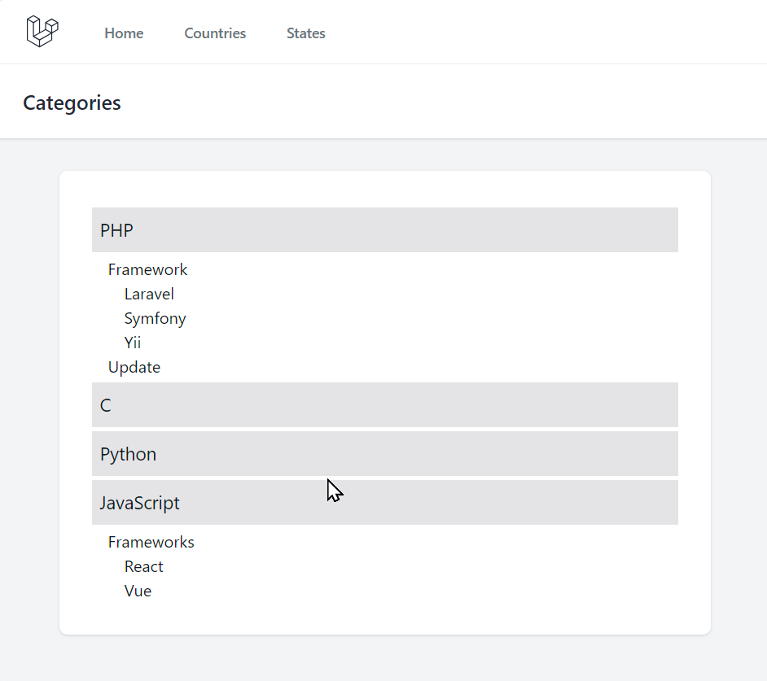

# Laravel: 02 Category Feature

## Software as a Service - Front-End Development

### Session 11

Developed by Adrian Gould

---

```table-of-contents
title: # Contents
style: nestedList
minLevel: 0
maxLevel: 3
includeLinks: true
```

---

# Category Feature

We will add a category feature to the application.

This section is based on [Laravel Category Treeview Hierarchical Structure Example](https://www.itsolutionstuff.com/post/laravel-5-category-treeview-hierarchical-structure-example-with-demoexample.html), 
without the jQuery enhancement.

The category feature may be used in many situations. For example, for a market place where it 
is the product category; or a blog where the category is the general subject of the blog post.

For the time being our category feature will ONLY display the categories, we will not be adding 
create, edit, delete, and show parts of the complete feature until later.


We will store the following in our category model:

- category name
- description (optional)
- parent category id (defaults to 0)

This structure allows us to do the following:

```text
+---PHP
|   |
|   +---Framework
|   |   |
|   |   +- Laravel
|   |   +- Symfony
|   |   +- Yii
|   | 
|   +---Update   
|
+---C
+---Python

```

We will go into modelling "hierarchical data" in a little more depth another time.

## Model, Migration, Seeder, Controller in one

Let's start by creating the Category model, but also create the migration, seeder, controller
and other stubs at the same time.

```shell
php artisan make:model Category --all
```

One this is run we will have the following stub files:

- `app\Models\Category.php`
- `database\factories\CategoryFactory.php`
- `database\migrations\2024_10_08_155638_create_categories_table.php`
- `database\seeders\CategorySeeder.php`
- `app\Http\Requests\StoreCategoryRequest.php`
- `app\Http\Requests\UpdateCategoryRequest.php`
- `app\Http\Controllers\CategoryController.php`
- `app\Policies\CategoryPolicy.php`

We will start with the migration.

## Add Migration Details

Locate the migration file and add the following:

```php
$table->string('name');  
$table->string('description');  
$table->foreignId('category_id')->default(0);
```

Um... what is this? The category is referring to itself! 

Yes we can do this with databases.

Another situation that this could be used is with employees, where the manager id of the 
employee would be stored in a field in the same table.

### Add Fillable fields to Model

Open the Category model and update the fillable property to include:

- title
- description
- category id

```php
public $fillable = [  
    'name',
    'description',
    'category_id'
];
```

### Create relationship in Model

Now in the model we add the following that tells the category that it has one or more 
sub-categories.

```php
public function subCategories() {  
    return $this->hasMany(Category::class, 'category_id','id');  
}
```

### Create Seed Data

We will use some seed data that could be similar to a supermarket's product categories.

The following is part of the `run` method in the `CategorySeeder.php` file.

```php
$records = [  
    [  
        'id' => 100,  
        'name' => 'Food',  
        'description' => null,  
        'category_id' => 0,  
    ],  
    [  
        'id' => 101,  
        'name' => 'Vegetables',  
        'description' => null,  
        'category_id' => 100,  
    ],  
    [  
        'id' => 102,  
        'name' => 'Meat & Poultry',  
        'description' => null,  
        'category_id' => 100,  
    ],  
    [  
        'name' => 'Carrots',  
        'description' => null,  
        'category_id' => 101,  
    ],  
    [  
        'name' => 'Potatoes',  
        'description' => null,  
        'category_id' => 101,  
    ],  
    [  
        'name' => 'Sweetcorn',  
        'description' => null,  
        'category_id' => 101,  
    ],  
    [  
        'id' => 200,  
        'name' => 'Hardware',  
        'description' => null,  
        'category_id' => 0,  
    ],    
    [  
        'id' => 300,  
        'name' => 'Clothes',  
        'description' => null,  
        'category_id' => 0,  
    ],   
    [  
        'id' => 400,  
        'name' => 'Cleaning',  
        'description' => null,  
        'category_id' => 0,  
    ],  
    [  
        'id' => 401,  
        'name' => 'Bleach',  
        'description' => null,  
        'category_id' => 400,  
    ],  
    [  
        'id' => 402,  
        'name' => 'Washing up liquid',  
        'description' => null,  
        'category_id' => 401,  
    ],  
    [  
        'id' => 403,  
        'name' => 'Laundry detergent',  
        'description' => null,  
        'category_id' => 401,  
    ],  
];  
  
$numRecords = count($records);  
$this->command->getOutput()->progressStart($numRecords);  
  
foreach ($records as $seedCategory) {  
    Category::create($seedCategory);  
    $this->command->getOutput()->progressAdvance();  
}  
$this->command->getOutput()->progressFinish();  

```


In the seeder we have added a little "progress bar" to show you the progress of the seeding 
operation. This can be useful for large seed data sets, such as the countries of the world, the 
states/countries in countries, and so on.

### Add Routes

Open the `web.php` routes file.

Add the following:

```php
Route::resource('/categories', CategoryContrller::class)  
    ->only(['index',]);
```

### Add Index method to Controller

Open the `CategoryController.php` file and in the `index` method, add the following:

```php
$categories = Category::where('category_id','=',0)->get();  
  
$allCategories = Category::pluck('name','id')->all();  
return view('categories.index', compact(['categories','allCategories']));
```

This gets the "root categories" (eg Vegetables, Hardware, Cleaning), plus all the other
categories.

It then sends the data to the index view.

### Add Index View

Create a folder in the `resources\views` folder, and create new index and sub-categories 
blade files:

```shell
mkdir -P resources/views/categories
touch resources/views/categories/index.blade.php
touch resources/views/categories/sub-categories.blade.php
```

In the new index blade file we add:

```html
<x-guest-layout>  
    <x-slot name="header">  
        <h2 class="font-semibold text-xl text-gray-800 leading-tight">  
            {{ __('Categories') }}  
        </h2>  
    </x-slot>  
  
    <div class=" text-gray-900">  
        <ul id="tree1">  
            @foreach($categories as $category)  
  
                <li>  
                    <p class="text-lg w-full bg-zinc-200 my-1 p-2">{{ $category->name }}</p>  
                    @if($category->subCategories)  
                        @include('categories.sub-categories',['subCategories' => $category->subCategories])  
                    @endif  
                </li>  
            @endforeach  
        </ul>  
  
    </div>  
</x-guest-layout>
```

In the sub-categories blade file we now add:

```html
<ul class="ml-4">  
    @foreach($subCategories as $subCategory)  
        <li>  
            {{ $subCategory->name }}  
            @if($subCategory->subCategories)  
                @include('categories.sub-categories',['subCategories' => $subCategory->subCategories])  
            @endif  
        </li>  
    @endforeach  
</ul>
```


## Check the view

Now try accessing the categories page:

- http://xxx-SaaS-FED-Laravel-11-Learning.test

You should see something like this:




# END

Next up - [LINK TEXT](#)
