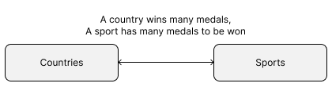
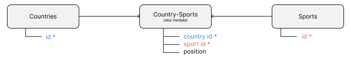

# S11 Laravel v12: Many-to-Many


This is based on:

- Laravel Daily. (2025). _Laravel Challenge: Many-to-Many Relations - Olympic Medals_. Youtube.com. https://www.youtube.com/watch?v=-WrFxyZXzdE


Additional information from:
- _How to Install Laravel Breeze on Laravel 12_. (2025). Codecourse.com. https://codecourse.com/articles/how-to-install-laravel-breeze-on-laravel-12
- _barryvdh/laravel-debugbar: Debugbar for Laravel (Integrates PHP Debug Bar)_. (2025, February 25). GitHub. https://github.com/barryvdh/laravel-debugbar


- ...


## Before You Begin

If you have not done so:
- Install the Laragon server system (we supply a copy of V6 with new versions of PHP, Node, MailPit, MariaDB, and others ready to use)
- Add Laragon to the Path
- Create a `Source\Repos` folder in the `C:\Users\USERNAME\` folder
- Install the Windows Terminal
- Set up a BASH shell
- Set up the `.bashrc` and `.aliases` files


## Update Laravel installer

```shell
composer global require laravel/installer
```


## Create the Demo Application

Create a new Laravel project:

```shell
laravel new
```

Use following settings:

| Item        | Value                        | Notes                            |
| ----------- | ---------------------------- | -------------------------------- |
| Name        | `SaaS-FED-L12-Basic-2025-S1` | Replace `xxx` with your initials |
| Starter Kit | None                         |                                  |
| Database    | sqlite                       |                                  |
| Run NPM...  | Yes                          |                                  |

Change into new project directory:

```shell
cd SaaS-FED-L12-Basic-2025-S1
```

### Install the Laravel Breeze Starter Kit

Laravel 12 has changed its default UI Starter Kits. To use a base Blade with Sanctum authentication user kit (aka Breeze) we do the following...

Use the following to install the Laravel Breeze (and Blade) starter kit:

```shell
composer require laravel/breeze --dev
php artisan breeze:install
```

When prompted select the `blade` option, `no`  to dark mode support, and `pest` for the testing.

Once the installation of the new requirements is complete, then use:

```shell
php artisan migrate
```

to perform the initial migrations.

### Add the Laravel DebugBar (Dev Mode only)

Use the following to add the Laravel Debug Bar - a great tool to check what is happening with your application:

```shell
composer require barryvdh/laravel-debugbar --dev
```

More details at:
- _barryvdh/laravel-debugbar: Debugbar for Laravel (Integrates PHP Debug Bar)_. (2025, February 25). GitHub. https://github.com/barryvdh/laravel-debugbar


### Terminal Inception..

Split terminal into 4 sections:

Split horizontally:
`ALT`+`SHIFT`+`-`
Split vertically the new lower section (repeat twice):
`ALT`+`SHIFT`+`=`


You may resize using the `ALT`+`SHIFT`+ arrow keys

Result:


In the three new sections, use the previous cd command:

```shell
cd SaaS-FED-L12-Basic-2025-S1
```

### Executing NPM

In the first of the bottom sections we will run `npm` to update the Vite, TailwindCSS and other `npm` installations, plus run the development server to watch for changes to the source files and to update the `css`/`js` files used by the application.

```shell
npm install && npm run dev
```

### Executing MailPit for Mail Testing

In the middle section execute MailPit by using the alias we created as part of the `.aliases` file:

```
mp2525
```

In the last of the three sections run the Laravel queue listener:

```shell
php artisan queue:listen
```

## Problem: Store medals won by each country for each sport

The following shows a typical problem where we have a many to many relationship.

##### MEDALS TABLE

| Sport                           | Gold | Silver | Bronze   |
| ------------------------------- | ---- | ------ | -------- |
| Hockey (m)                      | IND  | NED    | GER      |
| Diving - Springboard 3m (w)     | CHN  | JPN    | CHL      |
| Athletics - 100m (m)            | USA  | JAM    | CAN      |
| Swimming - 200m Freestyle (w)   | AUS  | SWE    | CAN      |
| Basketball (w)                  | USA  | FRA    | AUS      |
| Gymnastics - Floor Exercise (m) | JPN  | ROU    | GBR      |
| Cycling - Road Race (w)         | NED  | ITA    | GER      |
| Tennis - Singles (m)            | ESP  | SRB    | USA      |
| Volleyball (w)                  | BRA  | CHN    | USA      |
| Archery - Individual (m)        | KOR  | ITA    | TUR      |
| Weightlifting - 73kg (w)        | CHN  | KAZ    | COL      |
| Rowing - Double Sculls (m)      | NZL  | FRA    | CHN      |
| Judo - Heavyweight (m)          | GEO  | ROC    | BRA      |
| Boxing - Lightweight (w)        | BRA  | THA    | ITA      |
| Fencing - Épée Individual (m)   | FRA  | UKR    | ITA      |
| Sailing - 470 (w)               | GBR  | NZL    | USA      |
| Shooting - 10m Air Rifle (m)    | CHN  | IRI    | USA      |
| Taekwondo - 57kg (w)            | KOR  | ROC    | TUR      |
| Triathlon (m)                   | NOR  | NZL    | BEL      |
| Badminton - Singles (w)         | CHN  | IND    | TPE      |
| Canoeing - Slalom K1 (m)        | SVK  | SLO    | GER      |
| Equestrian - Individual Jumping | SWE  | ROC    | USA      |
| Wrestling - Freestyle 65kg (m)  | JPN  | IRI    | KAZ      |
| Table Tennis - Singles (w)      | CHN  | USA    | JPN      |
| Surfing (m)                     | BRA  | JPN    | AUS      |
| Skateboarding - Park (w)        | JPN  | BRA    | GBR      |
| Sport Climbing - Combined (m)   | ESP  | JPN    | AUT      |
| Karate - Kata (w)               | ESP  | JPN    | USA      |
| Baseball (m)                    | JPN  | USA    | DOM      |
| Softball (w)                    | USA  | JPN    | CAN      |
| Rugby Sevens (m)                | FIJ  | NZL    | ARG      |
| Beach Volleyball (w)            | USA  | AUS    | BRA, GBR |

The relationships between Sport and Country and the Medals they win are:

- A country may win many medals in a sport
- A sport has many medals awarded within it (it is possible to have two countries win the same medal).

It is possible that a sport awards two of the same medal for a 'draw' or similar. 

This is known as a Many to Many relationship:



### Quick Normalisation

To alleviate this we need to Normalise the data.

The actual normalisation process can be long winded, but we will simplify it here.

#### 0NF (Zero Normal Form)

This is the raw data, with no changes.

##### MEDALS TABLE

| Sport                         | Gold | Silver | Bronze |
| ----------------------------- | ---- | ------ | ------ |
| Hockey (m)                    | IND  | NED    | GER    |
| Diving - Springboard 3m (w)   | CHN  | JPN    | CHL    |
| Athletics - 100m (m)          | USA  | JAM    | CAN    |
| Swimming - 200m Freestyle (w) | AUS  | SWE    | CAN    |

#### 1NF (First Normal Form) to 3NF

> This is not true normalisation. We show a way to attempt to make the overall process a little easier to follow. A better set of notes will be created to assist you to perform Normalisation using each of the 0NF to 3NF rules.

Firstly we remove repeated fields. 

For this we see that the medals are repeated - be it for gold, silver or bronze.

We can alleviate this repetition by duplicating the rows and expanding the data a little...

We also add a row ID to each record of the data:

##### MEDALS TABLE

| ID  | Sport                       | Country | Medal  |
| --- | --------------------------- | ------- | ------ |
| 1   | Hockey (m)                  | IND     | Gold   |
| 2   | Hockey (m)                  | NED     | Silver |
| 3   | Hockey (m)                  | GER     | Bronze |
| 4   | Diving - Springboard 3m (w) | CHN     | Gold   |
| 5   | Diving - Springboard 3m (w) | JPN     | Silver |
| 6   | Diving - Springboard 3m (w) | CHL     | Bronze |
| ... | ...                         | ...     | ...    |

We still have repetition, but it is now not within each record.

So what to do about this duplicated data?

What we do is first move the Sports into their own table, and we can also give the rows their own ID:

##### SPORTS TABLE

| ID  | Sport                       |
| --- | --------------------------- |
| 1   | Hockey (m)                  |
| 2   | Diving - Springboard 3m (w) |
| ... | ...                         |

Now where the Sport appeared in the Medals Table, we replace it with the Sport ID, which reduces the redundancy of the data entry...

##### MEDALS TABLE

| ID  | Sport ID | Country | Medal  |
| --- | -------- | ------- | ------ |
| 1   | 1        | IND     | Gold   |
| 2   | 1        | NED     | Silver |
| 3   | 1        | GER     | Bronze |
| 4   | 2        | CHN     | Gold   |
| 5   | 2        | JPN     | Silver |
| 6   | 2        | CHL     | Bronze |
| ... | ...      | ...     | ...    |

We still have the Country duplicated, even if only using 3 characters. 

Imagine if we saved the data for the country as its full name... well that means every CHN would become "Peoples Republic of China".

So we move the country into a new table.

##### COUNTRY TABLE

| ID  | ISO 3LC | Name                      |
| --- | ------- | ------------------------- |
| 1   | IND     | India                     |
| 2   | NED     | Netherlands               |
| 3   | GER     | Germany                   |
| 4   | CHN     | Peoples Republic of China |
| 5   | JPN     | Japan                     |
| 6   | CHL     | Chile                     |
| 7   | AUS     | Australia                 |
| 8   | USA     | United States of America  |
| 9   | CAN     | Canada                    |
| ... | ...     | ...                       |

We are only showing a few of the actual 200+ countries.

We now are able to use the Medals table, and replace the Three Letter Code with a number:

##### MEDALS TABLE

| ID  | Sport ID | Country ID | Medal  |
| --- | -------- | ---------- | ------ |
| 1   | 1        | 1          | Gold   |
| 2   | 1        | 2          | Silver |
| 3   | 1        | 3          | Bronze |
| 4   | 2        | 4          | Gold   |
| 5   | 2        | 5          | Silver |
| 6   | 2        | 6          | Bronze |
| ... | ...      | ...        | ...    |

We still have the Medal Colour  in a column, but the data here could be allowed as it is much shorter than all the data we had previously.

Doing this has created a Intermediary table, or in Laravel terms, a pivot table.

### Laravel and Intermediary (Pivot) Tables

Laravel uses a convention that makes it easy for the framework to pick up the pivot tables by naming them using the names of the tables that use the pivot in alphabetical order.

So our Medals, Countries and Sports would become:

- Countries,
- Sports, and
- Country-Sports

It is possible to name a pivot table with a custom name, with the cost of having to define relationships more explicitly.

### Making data storage even cheaper

We have already got a very good table structure.

The only issue with the structure is that we store between 4 or more characters (currently a maximum of 6). What happens if suddenly the Olympic committee decides the medals are going to be *Platinum, Diamond, Gold, Silver and Wood*?

Now we need to update the table to allow for longer names.

What would be a better idea is that we use a placing or position in place of the colour. This would need a "tiny integer" (1 byte). We can then add the colour to a new table for lookup and use in the user interface.

To do this let's use the Medals table as the colours of the medals.

##### MEDALS TABLE

| ID  | Medal  |
| --- | ------ |
| 1   | Gold   |
| 2   | Silver |
| 3   | Bronze |

And create the pivot table:
##### COUNTRY-SPORT TABLE

| ID  | Sport ID | Country ID | Position | Year |
| --- | -------- | ---------- | -------- | ---- |
| 1   | 1        | 1          | 1        | 1708 |
| 2   | 1        | 2          | 2        | 1708 |
| 3   | 1        | 3          | 3        | 1708 |
| 4   | 2        | 4          | 1        | 1709 |
| 5   | 2        | 5          | 2        | 1709 |
| 6   | 2        | 6          | 3        | 1709 |
| ... | ...      | ...        | ...      |      |

For demonstration purposes we added a new field, Year, which would hold the year of the particular Olympics, to make it easier to filer and use this table.

> Yes, we know that the modern Olympic Games did not start until  1896 (https://en.wikipedia.org/wiki/Summer_Olympic_Games).
#### Sports

| ID  | Name                            |
| --- | ------------------------------- |
| 1   | Hockey (m)                      |
| 2   | Diving - Springboard 3m (w)     |
| 3   | Athletics - 100m (m)            |
| 4   | Swimming - 200m Freestyle (w)   |
| 5   | Basketball (w)                  |
| 6   | Gymnastics - Floor Exercise (m) |
| 7   | Cycling - Road Race (w)         |
| 8   | Tennis - Singles (m)            |
| 9   | Volleyball (w)                  |
| ... | ...                             |

#### Countries

| ID  | ISO 3LC | Name                      |
| --- | ------- | ------------------------- |
| 1   | IND     | India                     |
| 2   | CHN     | Peoples Republic of China |
| 3   | USA     | United States of America  |
| 4   | AUS     | Australia                 |
| 5   | FRA     | France                    |
| 6   | JPN     | Japan                     |
| ... | ...     | ...                       |

### Entity-Relationship Diagram (modified)

Now we have done this remodelling, we can draw a diagram to assist visualisation. This is the diagram below, a modified form of E-R diagram. Note we also have omitted the Medals table.




---

## Setting Up Models, Migrations and More

Create the model, migrations, factories, and associated classes for Country and Sport:

```shell
php artisan make:model -a Country
php artisan make:model -a Sport
php artisan make:model -a MedalColour
```

Create the pivot table migration, and a model so we are able to indicate mass assignment as needed. This also allows us to keep a created/updated timestamp if needed:

```shell
php artisan make:migration create_country_sport_table
php artisan make:model CountrySport
```

### Edit the migrations

The migration files will be named in the following form:

`YYYY_MM_DD_HHMMSS_create_MODELNAME_table.php`

They are found in the /database/migrations folder.

#### Sport Migration

Example filename: `2025_02_27_052413_create_sports_table.php`

The up method will read:

```php
Schema::create('sports', function (Blueprint $table) {
    $table->id();
    $table->string('name')->default('Unknown');
    $table->string('code',6)->default('------');
    $table->timestamps();
});
```

#### Country Migration

Example filename: `2025_02_27_052408_create_countries_table.php`

The up method will read:

```php
Schema::create('countries', function (Blueprint $table) {
	$table->id();
	$table->string('name', 192)->default('Unknown');
	$table->string('short_code', 3)->default('---');
	$table->timestamps();
});
```

#### Pivot Table: Country Sport Migration

Example filename: `2025_02_27_052523_create_country_sport_table.php`

The up method now reads:

```php
Schema::create('country_sport', function (Blueprint $table) {
	$table->foreignId('country_id')
	      ->constrained();
	$table->foreignId('sport_id')
	      ->constrained();
	$table->unsignedSmallInteger('position')
	      ->default(0);
	$table->timestamps();
});
```


### Medal Colour Migration

Example filename: `2025_02_27_052523_create_medal_colour_table.php`

```php
Schema::create('medal_colours', function (Blueprint $table) {
	$table->id();
	$table->string('name', 32)->default('Unknown');
	$table->timestamps();
});
```


### Execute the migrations

To run the new migrations use:

```shell
php artisan migrate
```

> _**IMPORTANT:**_
>
> When you use `php artisan migrate` it does **NOT** run any migrations that have been previously completed. 
>
> If you want to alter a table in any way, **ALWAYS** create a new 'update' migration, e.g. `update_users_changing_name_to_nickname` or similar.
>
> Likewise, if you want to drop a table, then create a new migration with a name similar to `drop_TABLENAME`, but you will then need to recreate the table in the down method. 
> 
> This is cumbersome, and perhaps better to leave the table and rename it with a prefix to signify it is now deleted.

## Update the Models

We now need to update the models to allow for mass assignment. Mass assignment is performed in Create and Update methods.

The models are found in app/Models.
### User Model

We show the full User Model for reference.

```php
<?php  
  
namespace App\Models;  
  
// use Illuminate\Contracts\Auth\MustVerifyEmail;  
use Illuminate\Database\Eloquent\Factories\HasFactory;  
use Illuminate\Foundation\Auth\User as Authenticatable;  
use Illuminate\Notifications\Notifiable;  
  
class User extends Authenticatable  
{  
    /** @use HasFactory<\Database\Factories\UserFactory> */  
    use HasFactory, Notifiable;  
  
    /**  
     * The attributes that are mass assignable.
     *     
     * @var list<string>  
     */    
    protected $fillable = [  
        'name',  
        'email',  
        'password',  
    ];  
  
    /**  
     * The attributes that should be hidden for serialization.     
     *     
     * @var list<string>  
     */    
    protected $hidden = [  
        'password',  
        'remember_token',  
    ];  
  
    /**  
     * Get the attributes that should be cast.     
     *     
     * @return array<string, string>  
     */    
    protected function casts(): array  
    {  
        return [  
            'email_verified_at' => 'datetime',  
            'password' => 'hashed',  
        ];  
    }  
}
```

### Country Model

For this we show the `use` and the main code in the class:

```php
use Illuminate\Database\Eloquent\Factories\HasFactory;  
use Illuminate\Database\Eloquent\Model;  
use Illuminate\Notifications\Notifiable;  
```

Now the fillable, hidden and casts...
```php  
    /** @use HasFactory<\Database\Factories\CountryFactory> */  
    use HasFactory, Notifiable;  
  
    /**  
     * The attributes that are mass assignable.     
     *     
     * @var list<string>  
     */
    protected $fillable = [  
        'name',  
        'short_code'  
    ];  
  
    /**  
     * The attributes that should be hidden for serialization.
     *
	 * @var list<string>  
     */
    protected $hidden = [      ];  
  
    /**  
     * Get the attributes that should be cast.     
     *     
     * @return array<string, string>  
     */
    protected function casts(): array  
    {  
        return [          ];  
    }  

```

### Sport Model


```php

```


### Country-Sport Model


### Medal Model


```php

```


## Create and Update Seeder Classes

### Create User Seeder

The Country seeder and Sport seeder were created when we used the `-a` CLI flag. So we will just create the User Seeder.

```shell
php artisan make:seeder UserSeeder
```

### Update the Seeders

#### User Seeder

Add/update the required use clauses:

```php
use Illuminate\Database\Console\Seeds\WithoutModelEvents;  
use Illuminate\Database\Seeder;  
use Illuminate\Support\Facades\Hash;  
use Illuminate\Support\Str;  
use App\Models\User;  

```

Now update the run method:

```php
$users = [  
    [  
        'name' => 'Ad Ministrator',  
        'email' => 'admin@example.com',  
        'email_verified_at' => now(),  
        'password' => Hash::make('Password1'),  
        'remember_token' => Str::random(10),  
        'email_verified_at' => now(),  
    ],  
    
    [  
        'name' => 'Staff Member',  
        'email' => 'staff@example.com',  
        'email_verified_at' => now(),  
        'password' => Hash::make('Password1'),  
        'remember_token' => Str::random(10),  
        'email_verified_at' => now(),  
    ],  
    
    [  
        'name' => 'Robyn Banks',  
        'email' => 'robyn@example.com',  
        'email_verified_at' => now(),  
        'password' => Hash::make('Password1'),  
        'remember_token' => Str::random(10),  
        'email_verified_at' => now(),  
    ],  
    
    [  
        'name' => "Jacques d'Carre",  
        'email' => 'jacques@example.com',  
        'email_verified_at' => now(),  
        'password' => Hash::make('Password1'),  
        'remember_token' => Str::random(10),  
        'email_verified_at' => now(),  
    ],  
];  
  
User::insert($users);  
  
```

#### Sport Seeder

Update the Use lines to include:

```php
use App\Models\Sport;
```

Add these lines to the run method:

```php
$sports = [  
    ['name' => "Hockey (m)",],  
    ['name' => "Diving - Springboard 3m (w)",],  
    ['name' => "Athletics - 100m (m)",],  
    ['name' => "Swimming - 200m Freestyle (w)",],  
    ['name' => "Basketball (w)",],  
    ['name' => "Gymnastics - Floor Exercise (m)",],  
    ['name' => "Cycling - Road Race (w)",],  
    ['name' => "Tennis - Singles (m)",],  
    ['name' => "Volleyball (w)",],  
    ['name' => "Archery - Individual (m)",],  
    ['name' => "Weightlifting - 73kg (w)",],  
    ['name' => "Rowing - Double Sculls (m)",],  
    ['name' => "Judo - Heavyweight (m)",],  
    ['name' => "Boxing - Lightweight (w)",],  
    ['name' => "Fencing - Épée Individual (m)",],  
    ['name' => "Sailing - 470 (w)",],  
    ['name' => "Shooting - 10m Air Rifle (m)",],  
    ['name' => "Taekwondo - 57kg (w)",],  
    ['name' => "Triathlon (m)",],  
    ['name' => "Badminton - Singles (w)",],  
    ['name' => "Canoeing - Slalom K1 (m)",],  
    ['name' => "Equestrian - Individual Jumping",],  
    ['name' => "Wrestling - Freestyle 65kg (m)",],  
    ['name' => "Table Tennis - Singles (w)",],  
    ['name' => "Surfing (m)",],  
    ['name' => "Skateboarding - Park (w)",],  
    ['name' => "Sport Climbing - Combined (m)",],  
    ['name' => "Karate - Kata (w)",],  
    ['name' => "Baseball (m)",],  
    ['name' => "Softball (w)",],  
    ['name' => "Rugby Sevens (m)",],  
    ['name' => "Beach Volleyball (w)",],  
];

Sport::insert($sports);
```


#### Country Seeder

In the country seeder add the new use lines:

```php
use App\Models\Country;
```

Add these lines to the run method:

```php
 $countries = [
    ['id' => 1, 'name' => 'Afghanistan', 'short_code' => 'AFG'],
    ['id' => 2, 'name' => 'Albania', 'short_code' => 'ALB'],
    ['id' => 3, 'name' => 'Algeria', 'short_code' => 'DZA'],
    ['id' => 4, 'name' => 'American Samoa', 'short_code' => 'ASM'],
    ['id' => 5, 'name' => 'Andorra', 'short_code' => 'AND'],
    ['id' => 6, 'name' => 'Angola', 'short_code' => 'AGO'],
    ['id' => 7, 'name' => 'Anguilla', 'short_code' => 'AIA'],
    ['id' => 8, 'name' => 'Antarctica', 'short_code' => 'ATA'],
    ['id' => 9, 'name' => 'Antigua and Barbuda', 'short_code' => 'ATG'],
    ['id' => 10, 'name' => 'Argentina', 'short_code' => 'ARG'],
    ['id' => 11, 'name' => 'Armenia', 'short_code' => 'ARM'],
    ['id' => 12, 'name' => 'Aruba', 'short_code' => 'ABW'],
    ['id' => 13, 'name' => 'Australia', 'short_code' => 'AUS'],
    ['id' => 14, 'name' => 'Austria', 'short_code' => 'AUT'],
    ['id' => 15, 'name' => 'Azerbaijan', 'short_code' => 'AZE'],
    ['id' => 16, 'name' => 'Bahamas', 'short_code' => 'BHS'],
    ['id' => 17, 'name' => 'Bahrain', 'short_code' => 'BHR'],
    ['id' => 18, 'name' => 'Bangladesh', 'short_code' => 'BGD'],
    ['id' => 19, 'name' => 'Barbados', 'short_code' => 'BRB'],
    ['id' => 20, 'name' => 'Belarus', 'short_code' => 'BLR'],
    ['id' => 21, 'name' => 'Belgium', 'short_code' => 'BEL'],
    ['id' => 22, 'name' => 'Belize', 'short_code' => 'BLZ'],
    ['id' => 23, 'name' => 'Benin', 'short_code' => 'BEN'],
    ['id' => 24, 'name' => 'Bermuda', 'short_code' => 'BMU'],
    ['id' => 25, 'name' => 'Bhutan', 'short_code' => 'BTN'],
    ['id' => 26, 'name' => 'Bolivia', 'short_code' => 'BOL'],
    ['id' => 27, 'name' => 'Bosnia and Herzegovina', 'short_code' => 'BIH'],
    ['id' => 28, 'name' => 'Botswana', 'short_code' => 'BWA'],
    ['id' => 29, 'name' => 'Brazil', 'short_code' => 'BRA'],
    ['id' => 30, 'name' => 'British Indian Ocean Territory', 'short_code' => 'IOT'],
    ['id' => 31, 'name' => 'British Virgin Islands', 'short_code' => 'VGB'],
    ['id' => 32, 'name' => 'Brunei', 'short_code' => 'BRN'],
    ['id' => 33, 'name' => 'Bulgaria', 'short_code' => 'BGR'],
    ['id' => 34, 'name' => 'Burkina Faso', 'short_code' => 'BFA'],
    ['id' => 35, 'name' => 'Burundi', 'short_code' => 'BDI'],
    ['id' => 36, 'name' => 'Cambodia', 'short_code' => 'KHM'],
    ['id' => 37, 'name' => 'Cameroon', 'short_code' => 'CMR'],
    ['id' => 38, 'name' => 'Canada', 'short_code' => 'CAN'],
    ['id' => 39, 'name' => 'Cape Verde', 'short_code' => 'CPV'],
    ['id' => 40, 'name' => 'Cayman Islands', 'short_code' => 'CYM'],
    ['id' => 41, 'name' => 'Central African Republic', 'short_code' => 'CAF'],
    ['id' => 42, 'name' => 'Chad', 'short_code' => 'TCD'],
    ['id' => 43, 'name' => 'Chile', 'short_code' => 'CHL'],
    ['id' => 44, 'name' => 'China', 'short_code' => 'CHN'],
    ['id' => 45, 'name' => 'Christmas Island', 'short_code' => 'CXR'],
    ['id' => 46, 'name' => 'Cocos Islands', 'short_code' => 'CCK'],
    ['id' => 47, 'name' => 'Colombia', 'short_code' => 'COL'],
    ['id' => 48, 'name' => 'Comoros', 'short_code' => 'COM'],
    ['id' => 49, 'name' => 'Cook Islands', 'short_code' => 'COK'],
    ['id' => 50, 'name' => 'Costa Rica', 'short_code' => 'CRI'],
    ['id' => 51, 'name' => 'Croatia', 'short_code' => 'HRV'],
    ['id' => 52, 'name' => 'Cuba', 'short_code' => 'CUB'],
    ['id' => 53, 'name' => 'Curacao', 'short_code' => 'CUW'],
    ['id' => 54, 'name' => 'Cyprus', 'short_code' => 'CYP'],
    ['id' => 55, 'name' => 'Czech Republic', 'short_code' => 'CZE'],
    ['id' => 56, 'name' => 'Democratic Republic of the Congo', 'short_code' => 'COD'],
    ['id' => 57, 'name' => 'Denmark', 'short_code' => 'DNK'],
    ['id' => 58, 'name' => 'Djibouti', 'short_code' => 'DJI'],
    ['id' => 59, 'name' => 'Dominica', 'short_code' => 'DMA'],
    ['id' => 60, 'name' => 'Dominican Republic', 'short_code' => 'DOM'],
    ['id' => 61, 'name' => 'East Timor', 'short_code' => 'TLS'],
    ['id' => 62, 'name' => 'Ecuador', 'short_code' => 'ECU'],
    ['id' => 63, 'name' => 'Egypt', 'short_code' => 'EGY'],
    ['id' => 64, 'name' => 'El Salvador', 'short_code' => 'SLV'],
    ['id' => 65, 'name' => 'Equatorial Guinea', 'short_code' => 'GNQ'],
    ['id' => 66, 'name' => 'Eritrea', 'short_code' => 'ERI'],
    ['id' => 67, 'name' => 'Estonia', 'short_code' => 'EST'],
    ['id' => 68, 'name' => 'Ethiopia', 'short_code' => 'ETH'],
    ['id' => 69, 'name' => 'Falkland Islands', 'short_code' => 'FLK'],
    ['id' => 70, 'name' => 'Faroe Islands', 'short_code' => 'FRO'],
    ['id' => 71, 'name' => 'Fiji', 'short_code' => 'FJI'],
    ['id' => 72, 'name' => 'Finland', 'short_code' => 'FIN'],
    ['id' => 73, 'name' => 'France', 'short_code' => 'FRA'],
    ['id' => 74, 'name' => 'French Polynesia', 'short_code' => 'PYF'],
    ['id' => 75, 'name' => 'Gabon', 'short_code' => 'GAB'],
    ['id' => 76, 'name' => 'Gambia', 'short_code' => 'GMB'],
    ['id' => 77, 'name' => 'Georgia', 'short_code' => 'GEO'],
    ['id' => 78, 'name' => 'Germany', 'short_code' => 'DEU'],
    ['id' => 79, 'name' => 'Ghana', 'short_code' => 'GHA'],
    ['id' => 80, 'name' => 'Gibraltar', 'short_code' => 'GIB'],
    ['id' => 81, 'name' => 'Greece', 'short_code' => 'GRC'],
    ['id' => 82, 'name' => 'Greenland', 'short_code' => 'GRL'],
    ['id' => 83, 'name' => 'Grenada', 'short_code' => 'GRD'],
    ['id' => 84, 'name' => 'Guam', 'short_code' => 'GUM'],
    ['id' => 85, 'name' => 'Guatemala', 'short_code' => 'GTM'],
    ['id' => 86, 'name' => 'Guernsey', 'short_code' => 'GGY'],
    ['id' => 87, 'name' => 'Guinea', 'short_code' => 'GIN'],
    ['id' => 88, 'name' => 'Guinea-Bissau', 'short_code' => 'GNB'],
    ['id' => 89, 'name' => 'Guyana', 'short_code' => 'GUY'],
    ['id' => 90, 'name' => 'Haiti', 'short_code' => 'HTI'],
    ['id' => 91, 'name' => 'Honduras', 'short_code' => 'HND'],
    ['id' => 92, 'name' => 'Hong Kong', 'short_code' => 'HKG'],
    ['id' => 93, 'name' => 'Hungary', 'short_code' => 'HUN'],
    ['id' => 94, 'name' => 'Iceland', 'short_code' => 'ISL'],
    ['id' => 95, 'name' => 'India', 'short_code' => 'IND'],
    ['id' => 96, 'name' => 'Indonesia', 'short_code' => 'IDN'],
    ['id' => 97, 'name' => 'Iran', 'short_code' => 'IRN'],
    ['id' => 98, 'name' => 'Iraq', 'short_code' => 'IRQ'],
    ['id' => 99, 'name' => 'Ireland', 'short_code' => 'IRL'],
    ['id' => 100, 'name' => 'Isle of Man', 'short_code' => 'IMN'],
    ['id' => 101, 'name' => 'Israel', 'short_code' => 'ISR'],
    ['id' => 102, 'name' => 'Italy', 'short_code' => 'ITA'],
    ['id' => 103, 'name' => 'Ivory Coast', 'short_code' => 'CIV'],
    ['id' => 104, 'name' => 'Jamaica', 'short_code' => 'JAM'],
    ['id' => 105, 'name' => 'Japan', 'short_code' => 'JPN'],
    ['id' => 106, 'name' => 'Jersey', 'short_code' => 'JEY'],
    ['id' => 107, 'name' => 'Jordan', 'short_code' => 'JOR'],
    ['id' => 108, 'name' => 'Kazakhstan', 'short_code' => 'KAZ'],
    ['id' => 109, 'name' => 'Kenya', 'short_code' => 'KEN'],
    ['id' => 110, 'name' => 'Kiribati', 'short_code' => 'KIR'],
    ['id' => 111, 'name' => 'Kosovo', 'short_code' => 'XKX'],
    ['id' => 112, 'name' => 'Kuwait', 'short_code' => 'KWT'],
    ['id' => 113, 'name' => 'Kyrgyzstan', 'short_code' => 'KGZ'],
    ['id' => 114, 'name' => 'Laos', 'short_code' => 'LAO'],
    ['id' => 115, 'name' => 'Latvia', 'short_code' => 'LVA'],
    ['id' => 116, 'name' => 'Lebanon', 'short_code' => 'LBN'],
    ['id' => 117, 'name' => 'Lesotho', 'short_code' => 'LSO'],
    ['id' => 118, 'name' => 'Liberia', 'short_code' => 'LBR'],
    ['id' => 119, 'name' => 'Libya', 'short_code' => 'LBY'],
    ['id' => 120, 'name' => 'Liechtenstein', 'short_code' => 'LIE'],
    ['id' => 121, 'name' => 'Lithuania', 'short_code' => 'LTU'],
    ['id' => 122, 'name' => 'Luxembourg', 'short_code' => 'LUX'],
    ['id' => 123, 'name' => 'Macau', 'short_code' => 'MAC'],
    ['id' => 124, 'name' => 'North Macedonia', 'short_code' => 'MKD'],
    ['id' => 125, 'name' => 'Madagascar', 'short_code' => 'MDG'],
    ['id' => 126, 'name' => 'Malawi', 'short_code' => 'MWI'],
    ['id' => 127, 'name' => 'Malaysia', 'short_code' => 'MYS'],
    ['id' => 128, 'name' => 'Maldives', 'short_code' => 'MDV'],
    ['id' => 129, 'name' => 'Mali', 'short_code' => 'MLI'],
    ['id' => 130, 'name' => 'Malta', 'short_code' => 'MLT'],
    ['id' => 131, 'name' => 'Marshall Islands', 'short_code' => 'MHL'],
    ['id' => 132, 'name' => 'Mauritania', 'short_code' => 'MRT'],
    ['id' => 133, 'name' => 'Mauritius', 'short_code' => 'MUS'],
    ['id' => 134, 'name' => 'Mayotte', 'short_code' => 'MYT'],
    ['id' => 135, 'name' => 'Mexico', 'short_code' => 'MEX'],
    ['id' => 136, 'name' => 'Micronesia', 'short_code' => 'FSM'],
    ['id' => 137, 'name' => 'Moldova', 'short_code' => 'MDA'],
    ['id' => 138, 'name' => 'Monaco', 'short_code' => 'MCO'],
    ['id' => 139, 'name' => 'Mongolia', 'short_code' => 'MNG'],
    ['id' => 140, 'name' => 'Montenegro', 'short_code' => 'MNE'],
    ['id' => 141, 'name' => 'Montserrat', 'short_code' => 'MSR'],
    ['id' => 142, 'name' => 'Morocco', 'short_code' => 'MAR'],
    ['id' => 143, 'name' => 'Mozambique', 'short_code' => 'MOZ'],
    ['id' => 144, 'name' => 'Myanmar', 'short_code' => 'MMR'],
    ['id' => 145, 'name' => 'Namibia', 'short_code' => 'NAM'],
    ['id' => 146, 'name' => 'Nauru', 'short_code' => 'NRU'],
    ['id' => 147, 'name' => 'Nepal', 'short_code' => 'NPL'],
    ['id' => 148, 'name' => 'Netherlands', 'short_code' => 'NLD'],
    ['id' => 149, 'name' => 'Netherlands Antilles', 'short_code' => 'ANT'],
    ['id' => 150, 'name' => 'New Caledonia', 'short_code' => 'NCL'],
    ['id' => 151, 'name' => 'New Zealand', 'short_code' => 'NZL'],
    ['id' => 152, 'name' => 'Nicaragua', 'short_code' => 'NIC'],
    ['id' => 153, 'name' => 'Niger', 'short_code' => 'NER'],
    ['id' => 154, 'name' => 'Nigeria', 'short_code' => 'NGA'],
    ['id' => 155, 'name' => 'Niue', 'short_code' => 'NIU'],
    ['id' => 156, 'name' => 'North Korea', 'short_code' => 'PRK'],
    ['id' => 157, 'name' => 'Northern Mariana Islands', 'short_code' => 'MNP'],
    ['id' => 158, 'name' => 'Norway', 'short_code' => 'NOR'],
    ['id' => 159, 'name' => 'Oman', 'short_code' => 'OMN'],
    ['id' => 160, 'name' => 'Pakistan', 'short_code' => 'PAK'],
    ['id' => 161, 'name' => 'Palau', 'short_code' => 'PLW'],
    ['id' => 162, 'name' => 'Palestine', 'short_code' => 'PSE'],
    ['id' => 163, 'name' => 'Panama', 'short_code' => 'PAN'],
    ['id' => 164, 'name' => 'Papua New Guinea', 'short_code' => 'PNG'],
    ['id' => 165, 'name' => 'Paraguay', 'short_code' => 'PRY'],
    ['id' => 166, 'name' => 'Peru', 'short_code' => 'PER'],
    ['id' => 167, 'name' => 'Philippines', 'short_code' => 'PHL'],
    ['id' => 168, 'name' => 'Pitcairn', 'short_code' => 'PCN'],
    ['id' => 169, 'name' => 'Poland', 'short_code' => 'POL'],
    ['id' => 170, 'name' => 'Portugal', 'short_code' => 'PRT'],
    ['id' => 171, 'name' => 'Puerto Rico', 'short_code' => 'PRI'],
    ['id' => 172, 'name' => 'Qatar', 'short_code' => 'QAT'],
    ['id' => 173, 'name' => 'Republic of the Congo', 'short_code' => 'COG'],
    ['id' => 174, 'name' => 'Reunion', 'short_code' => 'REU'],
    ['id' => 175, 'name' => 'Romania', 'short_code' => 'ROU'],
    ['id' => 176, 'name' => 'Russia', 'short_code' => 'RUS'],
    ['id' => 177, 'name' => 'Rwanda', 'short_code' => 'RWA'],
    ['id' => 178, 'name' => 'Saint Barthelemy', 'short_code' => 'BLM'],
    ['id' => 179, 'name' => 'Saint Helena', 'short_code' => 'SHN'],
    ['id' => 180, 'name' => 'Saint Kitts and Nevis', 'short_code' => 'KNA'],
    ['id' => 181, 'name' => 'Saint Lucia', 'short_code' => 'LCA'],
    ['id' => 182, 'name' => 'Saint Martin', 'short_code' => 'MAF'],
    ['id' => 183, 'name' => 'Saint Pierre and Miquelon', 'short_code' => 'SPM'],
    ['id' => 184, 'name' => 'Saint Vincent and the Grenadines', 'short_code' => 'VCT'],
    ['id' => 185, 'name' => 'Samoa', 'short_code' => 'WSM'],
    ['id' => 186, 'name' => 'San Marino', 'short_code' => 'SMR'],
    ['id' => 187, 'name' => 'Sao Tome and Principe', 'short_code' => 'STP'],
    ['id' => 188, 'name' => 'Saudi Arabia', 'short_code' => 'SAU'],
    ['id' => 189, 'name' => 'Senegal', 'short_code' => 'SEN'],
    ['id' => 190, 'name' => 'Serbia', 'short_code' => 'SRB'],
    ['id' => 191, 'name' => 'Seychelles', 'short_code' => 'SYC'],
    ['id' => 192, 'name' => 'Sierra Leone', 'short_code' => 'SLE'],
    ['id' => 193, 'name' => 'Singapore', 'short_code' => 'SGP'],
    ['id' => 194, 'name' => 'Sint Maarten', 'short_code' => 'SXM'],
    ['id' => 195, 'name' => 'Slovakia', 'short_code' => 'SVK'],
    ['id' => 196, 'name' => 'Slovenia', 'short_code' => 'SVN'],
    ['id' => 197, 'name' => 'Solomon Islands', 'short_code' => 'SLB'],
    ['id' => 198, 'name' => 'Somalia', 'short_code' => 'SOM'],
    ['id' => 199, 'name' => 'South Africa', 'short_code' => 'ZAF'],
    ['id' => 200, 'name' => 'South Korea', 'short_code' => 'KOR'],
    ['id' => 201, 'name' => 'South Sudan', 'short_code' => 'SSD'],
    ['id' => 202, 'name' => 'Spain', 'short_code' => 'ESP'],
    ['id' => 203, 'name' => 'Sri Lanka', 'short_code' => 'LKA'],
    ['id' => 204, 'name' => 'Sudan', 'short_code' => 'SDN'],
    ['id' => 205, 'name' => 'Suriname', 'short_code' => 'SUR'],
    ['id' => 206, 'name' => 'Svalbard and Jan Mayen', 'short_code' => 'SJM'],
    ['id' => 207, 'name' => 'Swaziland', 'short_code' => 'SWZ'],
    ['id' => 208, 'name' => 'Sweden', 'short_code' => 'SWE'],
    ['id' => 209, 'name' => 'Switzerland', 'short_code' => 'CHE'],
    ['id' => 210, 'name' => 'Syria', 'short_code' => 'SYR'],
    ['id' => 211, 'name' => 'Taiwan', 'short_code' => 'TWN'],
    ['id' => 212, 'name' => 'Tajikistan', 'short_code' => 'TJK'],
    ['id' => 213, 'name' => 'Tanzania', 'short_code' => 'TZA'],
    ['id' => 214, 'name' => 'Thailand', 'short_code' => 'THA'],
    ['id' => 215, 'name' => 'Togo', 'short_code' => 'TGO'],
    ['id' => 216, 'name' => 'Tokelau', 'short_code' => 'TKL'],
    ['id' => 217, 'name' => 'Tonga', 'short_code' => 'TON'],
    ['id' => 218, 'name' => 'Trinidad and Tobago', 'short_code' => 'TTO'],
    ['id' => 219, 'name' => 'Tunisia', 'short_code' => 'TUN'],
    ['id' => 220, 'name' => 'Turkey', 'short_code' => 'TUR'],
    ['id' => 221, 'name' => 'Turkmenistan', 'short_code' => 'TKM'],
    ['id' => 222, 'name' => 'Turks and Caicos Islands', 'short_code' => 'TCA'],
    ['id' => 223, 'name' => 'Tuvalu', 'short_code' => 'TUV'],
    ['id' => 224, 'name' => 'U.S. Virgin Islands', 'short_code' => 'VIR'],
    ['id' => 225, 'name' => 'Uganda', 'short_code' => 'UGA'],
    ['id' => 226, 'name' => 'Ukraine', 'short_code' => 'UKR'],
    ['id' => 227, 'name' => 'United Arab Emirates', 'short_code' => 'ARE'],
    ['id' => 228, 'name' => 'United Kingdom', 'short_code' => 'GBR'],
    ['id' => 229, 'name' => 'United States', 'short_code' => 'USA'],
    ['id' => 230, 'name' => 'Uruguay', 'short_code' => 'URY'],
    ['id' => 231, 'name' => 'Uzbekistan', 'short_code' => 'UZB'],
    ['id' => 232, 'name' => 'Vanuatu', 'short_code' => 'VUT'],
    ['id' => 233, 'name' => 'Vatican', 'short_code' => 'VAT'],
    ['id' => 234, 'name' => 'Venezuela', 'short_code' => 'VEN'],
    ['id' => 235, 'name' => 'Vietnam', 'short_code' => 'VNM'],
    ['id' => 236, 'name' => 'Wallis and Futuna', 'short_code' => 'WLF'],
    ['id' => 237, 'name' => 'Western Sahara', 'short_code' => 'ESH'],
    ['id' => 238, 'name' => 'Yemen', 'short_code' => 'YEM'],
    ['id' => 239, 'name' => 'Zambia', 'short_code' => 'ZMB'],
    ['id' => 240, 'name' => 'Zimbabwe', 'short_code' => 'ZWE'],
];


        $chunks = array_chunk($countries, 50);

        foreach ($chunks as $chunk) {
            Country::insert($chunk);
        }

```

### Add Seeding to the Database Seeder

Modify the Database seeder to read:

```php
// \App\Models\User::factory(10)->create();
$this->call([
	UserSeeder::class,
	CountrySeeder::class,
    SportSeeder::class,
]);
```

It is important to create and seed databases from the outside in. That is, make sure that any tables that rely on other tables, have thee tables that rely on created and seeded first.

### Run the Seeders

```shell
php artisan db:seed
```

Remember that if you run the above command again, it will *add* the same data to the database, and if any conflicts occur (e.g. unique email addresses) it will bomb out.

To execute a particular seeder use:

```shell
php artisan db:seed SEEDER_CLASS_NAME
```

For example: `php artisan db:seed UserSeeder`.

## Store Requests

If we have not used the `-a` flag when creating the model we would need to create a new request. For example a `StoreSportRequest` would be created using:

```shell
php artisan make:request StoreSportRequest
```

We do not need to do this as we created the request as part of the model creation earlier.

So let's open the request file from the `App/Http/Requests` folder.

Update the request code:

```php
    /**
     * Determine if the user is authorized to make this request.
     *
     * @return bool
     */
    public function authorize()
    {
        return true;
    }
```

In the `authorize` method we short-cut to allow everyone to store a new sport.

In the `rules` method we short-cut to say that every field in the sports model is required...

We also give a message that is customised when a field is omitted.

```php
    /**
     * Get the validation rules that apply to the request.
     *
     * @return array
     */
    public function rules()
    {
        return [
            'sports.*.*' => 'required',
        ];
    }

    public function messages()
    {
        return [
            'sports.*.*.required' => 'Please choose the country',
        ];
    }
```

### Create a Static Page Controller

```shell
php artisan make:controller StaticPageController
```

#### Edit the Static Page Controller

This controller is used to show pages that do not require database interaction (in general).

In the controller add the methods `__construct` and `index`:

```php
      /**
     * Show the application dashboard.
     *
     * @return \Illuminate\Contracts\Support\Renderable
     */
    public function index()
    {
        return view('welcome');
    }

	public function dashboard() {
		return view('dashboard');
	}
}
```

The `__construct` method provides a quick way of indicating that the authentication middleware needs to be executed.

The `index` method returns the home page.

## Routing

Edit the web routes file, and before the `require __DIR__ . '/auth.php'`  line, add the following routes:

```php
Route::resource('/sports', SportController::class)  
    ->only(['index', 'show', 'store', 'create',]);
```

The only method tells Laravel to only respond to the routes listed. In our case they will be:

| HTTP | Route          | Route Name    | Controller      | Method Called |
| ---- | -------------- | ------------- | --------------- | ------------- |
| GET  | sports         | sports.index  | SportController | index         |
| POST | sports         | sports.store  | SportController | store         |
| GET  | sports/create  | sports.create | SportController | create        |
| GET  | sports/{sport} | sports.show   | SportController | show          |

Update the `/` route to be:

```php
Route::get('/', [StaticPageController::class, 'index'])
    ->name('home');
```


## Blade Files

When we installed the Breeze starter kit with the Blade option, we are provided with some pages ready to use.

They include:
- App layout - when logged in
- Guest layout - for guest users
- Welcome page - the default 'home' for guests
- Dashboard page - the default page for authenticated users

We will need to update these and quite a few others.

The full list of updated views, and links to source code on GitHub, includes:

| View                            | GitHub Link                                                                                                      |
| ------------------------------- | ---------------------------------------------------------------------------------------------------------------- |
| auth/confirm-password.blade.php | [Confirm Password](https://github.com/AdyGCode/SaaS-FED-L12-Basic-2025-S1/blob/main/resources/views/auth/confirm-password.blade.php) |
| auth/forgot-password.blade.php  | [Forgot Password](https://github.com/AdyGCode/SaaS-FED-L12-Basic-2025-S1/blob/main/resources/views/auth/forgot-password.blade.php)  |
| auth/login.blade.php            | [Login](https://github.com/AdyGCode/SaaS-FED-L12-Basic-2025-S1/blob/main/resources/views/auth/login.blade.php)            |
| auth/register.blade.php         | [Register](https://github.com/AdyGCode/SaaS-FED-L12-Basic-2025-S1/blob/main/resources/views/auth/register.blade.php)         |
| auth/reset-password.blade.php   | [Reset Password](https://github.com/AdyGCode/SaaS-FED-L12-Basic-2025-S1/blob/main/resources/views/auth/reset-password.blade.php)   |
| auth/verify-email.blade.php     | [Verify eMail](https://github.com/AdyGCode/SaaS-FED-L12-Basic-2025-S1/blob/main/resources/views/auth/verify-email.blade.php)     |
| layouts/guest.blade.php         | [Guest](https://github.com/AdyGCode/SaaS-FED-L12-Basic-2025-S1/blob/main/resources/views/layouts/guest.blade.php)         |
| layouts/navigation.blade.php    | [Navigation](https://github.com/AdyGCode/SaaS-FED-L12-Basic-2025-S1/blob/main/resources/views/layouts/navigation.blade.php)    |
| welcome.blade.php               | [Welcome](https://github.com/AdyGCode/SaaS-FED-L12-Basic-2025-S1/blob/main/resources/views/welcome.blade.php)               |
| dashboard.blade.php             | [Dashboard](https://github.com/AdyGCode/SaaS-FED-L12-Basic-2025-S1/blob/main/resources/views/dashboard.blade.php)             |

The changes include making the Navigation available to Guest and App layouts, adding a wrapper to the Auth components so the pages render with the parts in the middle of the screen, and updating the Welcome and Dashboard 'static' pages.


