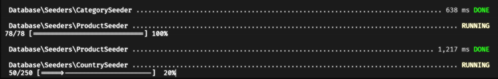

# Laravel: 03 Product Feature

## Software as a Service - Front-End Development

### Session 12

Developed by Adrian Gould

---

```table-of-contents
title: # Contents
style: nestedList
minLevel: 0
maxLevel: 3
includeLinks: true
```

---

# Creating a Product Feature

A typical type of feature is a list of products, books, equipment, and so forth.

In this example we will create a product feature that:

- Allows users to Add, Edit, Delete, Browse and View products
- Stores product name, description, recommended price, and category.

For the time being we will store the category as a number that will refer to a category table.

We will create the category model, migration and seeder so we have data for use in the product.

## Before beginning

Before you begin, check you have
completed [S11 Laravel 02 Category Feature](session-11/S11-Laravel-02-Category-Feature.md).

## Create stubs

We can fast track the creation of stubs for each of the required code components using:

```shell
php artisan make:model Product --all
```

## Create Product Model

Open the product model, and add the mass assignment fields:

```php
protected $fillable = [
	'name',
	'description', 
	'recommended_price', 
	'category_id',
];
```

## Create Product Migration

Open the product migration and add the definitions:

| field             | type       | size | other              |
|-------------------|------------|------|--------------------|
| name              | string     | 128  |                    |
| description       | text       |      | nullable           |
| recommended price | integer    |      | unsigned, nullable |
| category id       | foreign id |      | default 0          |

This equates to:

```php
$table->string('name', 128);  
$table->text('description')->nullable();  
$table->string('recommended_price')->integer()->nullable();  
$table->unsignedInteger('category_id')->default(0);
```

## Create Seed Data

Next we will create some seed data, and then add the seeder to the Database Seeder file.

We are going to do a bit of cheating, and import the seed data using a CSV file.

To do so, we need to add a helper function to the `DatabaseSeeder.php` file.

### Import CSV Function

Open the Database Seeder file, and add the following function ***inside*** the `run()` method:

```php
function import_CSV($filename, $delimiter = ','){  
    // File check - exists / readable
    if(!file_exists($filename) || !is_readable($filename))  
        return false;  
    $header = null;  
    $data = array();  
    // if file opened, process contents row by row
    if (($handle = fopen($filename, 'r')) !== false){  
        while (($row = fgetcsv($handle, 1000, $delimiter)) !== false){  
            if(!$header)  
                // first row is the headers
                $header = $row;  
            else  
                // subsequent rows converted to associative array and added to data
                $data[] = array_combine($header, $row);  
        }  
        fclose($handle);  
    }  
    return $data;  
}
```

This function performs the following actions:

- Verifies the file exists
- Checks to see if the file is readable

If either of these fail, it returns a false result.

The function requires a header line which matches the field names used in the table.

So the first line that is read is presumed to be the field names, indicating the order the CSV 
contains the data.

With this in mind, the function sets a header flag 'false' to indicate the header hasn't been 
read, and creates an empty array.

Next if the file can be opened and an file handle created, it does the following:

- while we have reached the end of the file, read the CSV data in, using the delimiter to 
- indicate the end of each data item
- if we are on the 1st row of data, place these values into the header
- otherwise add the read data to an associative array formed by combining the header and the 
- row of data

Once the end of the file has been reached, we close the file, and finally return the data array.

### The Product Seeder

So the product seeder can use this function to make it easier to get large
volumes of data into the application when it is set up.

We have added a little more code to the seeder. This code provides a progress bar whilst the 
seeding takes place.



```php
    public function run(): void
    {
        $table = 'products';
        $file = public_path("/seeders/$table.csv");


        // store returned data into array of records
        $records = import_CSV($file);

        $numRecords = count($records);
        $this->command->getOutput()->progressStart($numRecords);

        // add each record to the posts table in DB
        foreach ($records as $key => $record) {
            Product::create($record);
            $this->command->getOutput()->progressAdvance();
        }
        $this->command->getOutput()->progressFinish();

    }
```

# END

Next up - ...
